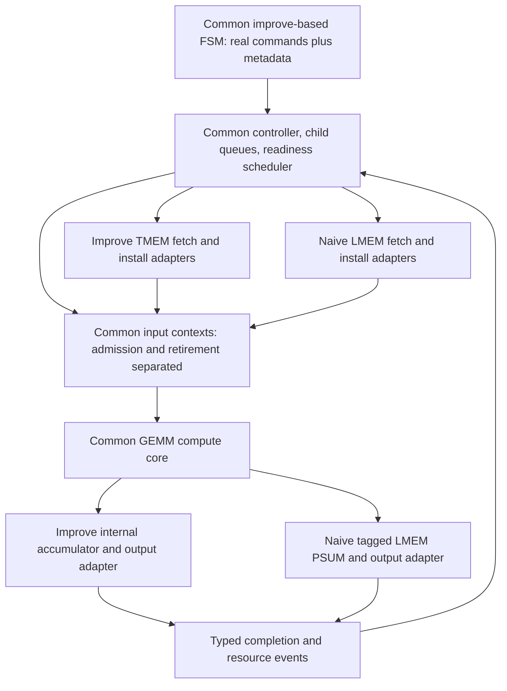

# Plan: align naive GEMM control with improve, retaining the LMEM backend

Status: implementation plan; no RTL changes have been made for this plan.

Prepared: 2026-09-10. Source inspected at HEAD `a1f98615c1994e6ee18c902a77e433b2ffe54055`, with existing worktree changes preserved. Recheck source/config fingerprints before implementation; the earlier latency captures are evidence, not a substitute for a fresh baseline after source changes.

## 1. Objective and design decision

Use the current improve implementation as the architectural baseline for naive. Share command semantics, scheduling, input admission, resource lifetimes, and completion handling wherever possible. Keep naive's LMEM storage and transfer adapters, including external PSUM accumulation, as the backend-specific implementation.

Required outcomes:

1. A subsequent microtile may feed the common GEMM unit while a previous microtile is still computing or writing results. Actual input admission remains a valid/ready handshake, subject to real dependency and capacity constraints. Previous-command output completion must not be a blanket prerequisite.
2. The naive FSM stops emitting standalone WAIT and NOTIFY instructions. Real commands carry dependency, resource-version, writer-fence, and completion metadata, following improve.
3. The deployed naive path uses the same control architecture as improve. Do not build a second independently evolving scheduler or clone the complete improve FSM/controller into naive files.
4. Naive continues using LMEM for operands, PSUM, and final output. No dedicated TMEM or replacement internal accumulator is introduced to obtain the speedup.

This is a control and executor convergence project, not a one-line removal of `!packetizer_active`. The work includes the local source-read overlap needed to make admission overlap useful. HBM bandwidth tuning, LMEM bank-count increases, and broad interconnect timing changes are separate work.

## 2. Baseline findings that constrain the implementation

The [packetizer analysis](../../docs/hw_analysis/improve_vs_naive/fpint_gemm_naive_packetizer_active.md) and [FSDB root-cause report](../../docs/hw_analysis/improve_vs_naive/fpint_gemm_naive_input_gap_root_cause.md) establish:

- `!packetizer_active` holds the input child queue's completion NOTIFY until physical writes drain. Removing it alone allows a premature G_done notification.
- Naive's packetizer uses one `head_ptr` for input metadata selection and completion retirement. Its four context entries do not permit admission to advance past an ingress-complete head until writeback.
- `gemm_done_pending_r` and the aggregate pending-write count are not a per-command completion ledger.
- Naive already has tagged accepted-transaction PSUM RAW protection, physical pending-write guards, and shared-core W/S/Z register lifetime checks. Preserve and exercise them under overlap.
- Naive M4's command-to-first-input latency is 23 cycles: 7 launch, 13 LMEM round trip, 3 response staging. Merely changing completion semantics leaves this startup exposed if the source engine stays single-command.
- Improve uses K-fast microtile traversal within an N slice; naive currently advances N first. Converging traversal changes the frequency of consecutive accesses to the same PSUM address and must be validated.
- A critical semantic mismatch exists today: improve uses `packet_ctrl.last` for the last row of a command, while naive's packetizer sets it for final output on every row of the final K contribution. The common core currently maps it to `acc_if.wr_req_final_output`. A direct copy of improve's packet-control logic would corrupt naive final-output behavior.

Reference latency, from the earlier verified th16/MXU16x16 comparison:

| Shape, K=N=512 | Current naive GEMM cycles | Improve GEMM cycles |
|---|---:|---:|
| M=4 | 61,552 | 6,448 |
| M=256 | 1,372,729 | 272,869 |

These are comparison points, not promised cycle targets for an LMEM backend.

## 3. Target architecture and ownership



| Concern | Baseline to reuse | Naive-specific responsibility |
|---|---|---|
| Command types and metadata | `VX_gpu_pkg::gemm_unified_cmd_t` | Normalize legacy internal flags/opcodes into the common meaning |
| Traversal and command generation | `VX_gemm_fsm` | LMEM address/layout and backend transfer descriptors |
| Dependencies and issue | `VX_gemm_ctrl`, `VX_microtile_readiness_scheduler` | Connect actual LMEM fetch/install/consume feedback |
| Input context lifecycle | Improve node admission/completion pointers | Full-width LMEM PSUM/final addresses and strides |
| Descriptor/response buffering | `VX_gemm_stream_dma_queue`, improve overlap executors | LMEM lane/tag adapter, weight gather and quant layout |
| Arithmetic and operand lifetime | Existing common compute core | No alternate GEMM arithmetic implementation |
| Accumulation | Common accumulator interface | `VX_gemm_acc_lmem`, OOO PSUM join and lane ordering |
| External DMA/output | Common command/completion contract | Existing naive DMA and LMEM output-store execution |

Prefer direct reuse. Extract a small common input-context module from improve when both nodes need the same logic. Keep memory address construction and physical visibility handling in backend adapters. A temporary naive wrapper may remain for host/job compatibility; it must not retain the old WAIT/NOTIFY scheduler as the final implementation.

## 4. Contracts to establish before integration

### 4.1 Command metadata

Use the existing fields, without introducing another incompatible dependency format:

| Field | Meaning and evaluation point |
|---|---|
| `work_seq` | Microtile identity shared by W/S/Z/Input; diagnostic/scheduler identity, not a replacement for architectural dependency counters |
| `waits[]` | Dependencies required before issuing the command's source work |
| `input_admit_waits[]` | ACC/PSUM-region ownership at admission and exact W/S/Z generation targets carried to the true consumers |
| `writer_wait` | Previous resource consumption required before overwriting a destination register bank; source reads may happen earlier |
| `prepare` | Supported source preparation and bounded lookahead; do not advertise preparation that the executor cannot perform |
| `notify` | Completion update attached to the real command and published at its defined completion event |

Use improve's separate weight, scale, and zero-point resources and consume counters. Naive's combined quant child may remain below an adapter only if it preserves independent ownership, metadata, and completion events; a combined SZ notification must not silently replace separate S/Z generations.

### 4.2 Input, output, and completion are different events

Define and document these independently:

- Descriptor accepted: all executor/context/inflight capacity reservations succeed atomically, exactly once.
- Input ingress complete: the final row is accepted by the GEMM input valid/ready handshake.
- Compute writeback accepted: the corresponding result is accepted by the accumulator backend.
- Backend fence satisfied: all writes required by this fence are visible/ordered for the specified downstream reader or reuse operation.
- Output store complete: the required external store has completed under the backend's contract.
- Invocation complete: required stores, fences, contexts, and queues are quiescent.

Ordinary input commands retire on registered ingress completion as in improve. Mark only required output/reuse fence commands for writeback completion. Preserve improve's ordered completion-metadata retirement: later entries cannot update a shared completion counter ahead of an older fenced entry.

Separate packet end, final-output mode, and fence tagging. Prefer explicit internal fields/accessors over reusing `last` for multiple meanings. Audit the common core, accumulator interface, both backends, traces, assertions, and tests together. Do not truncate naive byte addresses using improve's internal-ACC address width.

### 4.3 LMEM fence visibility

Retain PSUM exact-address RAW checks and split-lane pending accounting. Before selecting the completion endpoint, trace each write through the split, arbiters, local-memory crossbar, and bank. An upstream request handshake can precede RAM visibility; either prove downstream ordering makes the endpoint sufficient or carry completion to a sufficient endpoint.

Track fences by command sequence and/or owned PSUM/output region, following the common controller's ordered event contract. A fence for A must not wait for unrelated later work in B, and B must not make A appear complete. Do not use an unqualified global `pending == 0` as ordinary command retirement under overlap.

For multiple K contributions, keep each output tile's PSUM allocation stable until its final contribution and output drain finish. Map improve's logical ACC ownership/free events onto LMEM regions. If the current LMEM layout lacks safe double buffering, reserve disjoint regions within the existing LMEM budget or express the actual reuse dependency; do not claim a free region before it is safe.

### 4.4 Input and operand readiness

Advance input admission metadata after the last accepted row, regardless of prior compute/writeback activity. Hold packet data, addresses, bank indices, and generation targets stable under backpressure. Reserve context and DMA descriptor capacity together so neither can accept an orphan command.

Once source data and its context are available and required admission conditions are met, previous command activity must not suppress input valid. Preserve actual W/S/Z consumer checks and overwrite fences; do not move all resource waits into source issue, which would remove improve's read-ahead behavior.

## 5. Implementation sequence

### P0 — Freeze the comparison and write the event/adapter contract

- Capture source/config hashes and fresh naive/improve M4 and M256 correctness/cycle baselines if current sources differ from the retained capture.
- Inventory active naive/improve opcodes, flag encodings, RID meanings, child routing, counter set/increment semantics, byte-address units, and output conversion behavior.
- Produce the exact normalized command and completion mapping described above. Resolve `last` versus final-output semantics and LMEM region ownership here.
- Preserve current th16/MXU16 support, MXU32 behavior, host job descriptors, and numerical formats. Normalize internal differences at the boundary rather than requiring application-specific controller behavior.

Exit: every command/resource has one documented issue, install/admission, and completion event; every backend difference has an identified adapter.

### P1 — Extract common packet-context and command semantics from improve

- Extract/reuse improve's enqueue, admission-pointer, completion-pointer, and registered ingress-completion logic.
- Make packet end, final-output selection, and writeback-fence tagging unambiguous across both backends.
- Preserve per-command work identity through arithmetic and completion, with independent ownership for input selection and retirement.
- Integrate the common logic into improve first to establish a behavior-preserving reference, then expose the LMEM address/stride hooks needed by naive.

Exit: focused tests demonstrate B input admission before A output completion, correct ordered retirement, and stable packet metadata; improve regression remains numerically and cycle-equivalent unless an explicitly documented required interface change explains a difference.

### P2 — Replace naive's explicit synchronization stream

- Reuse the improve FSM/controller and readiness scheduler with a narrow backend policy/descriptor adapter. Use common child interfaces and the existing metadata format.
- Generate source-read waits, input admission targets, destination writer waits, and notify metadata directly on real commands.
- Remove executable `OP_WAIT`/`OP_NOTIFY` emission, routing, and special child-side notification state from the new naive path. Former FSM state names may be renamed or collapsed; no standalone synchronization command may remain disguised as a no-op.
- Remove the parent-stream dependency stall that prevents independent eligible children from progressing. Dependency readiness and bounded queue backpressure follow the improve controller.
- Adopt improve's K-fast microtile traversal and generation/consume accounting. Keep logical arithmetic work and host ABI unchanged.
- Introduce the same separate W/S/Z completion resources. Supply real source progress, slot occupancy, fetch-complete identity, consumer-block feedback, and input-ahead credit to the scheduler.

Exit: command traces contain only real work commands with metadata; a blocked dependency on one child does not globally stall unrelated eligible work. All completion updates correspond to owned real commands.

### P3 — Enable LMEM source read-ahead and input overlap

- Adapt the improve ordered descriptor/response-slot machinery to LMEM. Reuse `VX_gemm_stream_dma_queue` and the overlap executor pattern instead of retaining a single-active generic DMA as the final input path.
- Keep LMEM physical lane split/join and tagged responses behind the adapter. Preserve response ownership across delayed/out-of-order lanes and command boundaries.
- Allow B's source reads while A is being admitted or computed, with bounded descriptor and response capacity. Backpressure the correct boundary without dropping or reassigning rows.
- Give weight, scale, and zero-point source fetches the same source/install separation and `writer_wait` semantics as improve; preserve required LMEM weight-gather/quant layout behavior.
- Connect common contexts so B's ready data reaches the GEMM before A's writeback when capacity and dependencies allow it. Eliminate both the blanket `!packetizer_active` gate and its functional equivalents.
- Keep unaligned/tail behavior supported by the existing job contract. Provide an explicit slow path where necessary without imposing its startup on aligned microtiles. Do not simply delete the four-cycle precalc wait in the generic DMA as a substitute for overlap.

Exit: waveform evidence shows B admission before A writeback, multiple owned contexts, and source read-ahead under delayed LMEM responses. No early physical-completion notification is used to obtain this overlap.

### P4 — Complete LMEM PSUM/output fence integration

- Keep `VX_gemm_acc_lmem` accepted-transaction RAW tracking, read-slot tagging, OOO join, and per-set physical write ordering active under multiple input commands.
- Validate K-fast consecutive updates to the same PSUM address, including producers whose writes have not yet reached the physical request interface.
- Implement the region/sequence-aware completion accounting selected in P0. Preserve the reserve-on-first-presentation rule for partially forwarded wide writes.
- Make final FP32-to-FP16 output conversion and final LMEM addressing independent of packet-end semantics.
- Publish output-ready and region-free events only at their defined LMEM/store endpoints. Ensure a final fence can complete while independent later input exists, and that invocation completion includes all required stores.

Exit: no stale PSUM read, premature output store, reused live region, lost completion, or pending-write underflow under directed delay/backpressure tests.

### P5 — Regress, measure, and remove the legacy path

- Run the functional and waveform acceptance matrix below on both backends.
- Remove obsolete naive WAIT/NOTIFY helpers, interfaces, state, and tests after references are migrated. Keep thin backend wrappers only where they serve address/ABI adaptation.
- Document remaining TMEM/LMEM implementation differences and actual bottlenecks. Ensure improve and naive local-DMA performance signals have equivalent meanings before comparing them.
- Update [the latency report](../../docs/hw_analysis/improve_vs_naive/fpint_gemm_latency.md) with fresh logs, raw counters, source/config provenance, and before/after results.

Exit: both requested architectural changes are demonstrated, all correctness gates pass, and the performance report distinguishes common-control behavior from memory-backend cost.

## 6. Files and existing verification to reuse

| Area | Primary files/tests |
|---|---|
| Metadata/interfaces | `hw/rtl/VX_gpu_pkg.sv`, `VX_gemm_ctrl_if.sv`, `VX_gemm_fsm_if.sv`, accumulator interface and naive boundary adapters |
| Common control | `VX_gemm_fsm.sv`, `VX_gemm_ctrl.sv`, `VX_microtile_readiness_scheduler.sv`; migrate references from naive FSM/controller/sync |
| Input contexts | `VX_gemm_node.sv`, `VX_gemm_input_packetizer.sv`, `VX_gemm_node_naive.sv`; small shared module if needed |
| Local executors | `VX_lmem_dma_misal.sv` overlap adapters, `VX_gemm_stream_dma_queue.sv`, weight/quant gather adapters |
| LMEM completion | `VX_gemm_acc_lmem.sv`, `VX_gemm_psum_read_ooo_join.sv`, naive lane counters, `VX_mem_unit.sv`/`VX_local_mem.sv` visibility boundary |
| Focused tests | `gemm_input_packetizer`, `gemm_fsm`, `gemm_ctrl`, `microtile_readiness_scheduler`, `gemm_stream_dma_queue`, `lmem_dma_input_overlap`, `lmem_dma_weight_overlap`, `gemm_acc_lmem`, `gemm_psum_read_ooo_join`, `gemm_unit_v2_backpressure` |

Tests that currently hard-code `GEMM_IMPROVE`, child counts, or TMEM assumptions must gain the appropriate backend adapter configuration. Extend tests around observable behavior, not around the old serialized implementation.

## 7. Validation and measurable acceptance

### Directed correctness tests

1. Hold A's output/writeback while B is ready: B's first input must be accepted before A completes. Include three or more contexts and simultaneous enqueue/admit/retire events.
2. Stall source responses, GEMM input ready, destination register writes, and PSUM writes independently; verify data/control stability, ownership, forward progress, and bounded queues.
3. Complete fetches or physical lanes out of order; ensure row ordering, context identity, and architectural completion ordering remain correct.
4. Delay W/S/Z generations independently and attempt same-bank reuse; fetch may run ahead but actual consumers/writers must respect their exact targets.
5. Exercise same-address consecutive K accumulation, alternating PSUM regions, final conversion on every requested output row, and final-store visibility under partial lane completion.
6. Hold one metadata dependency while another child has ready work; verify the ready child issues. Verify no standalone WAIT/NOTIFY commands are emitted.
7. Reset with live contexts and outstanding responses; exercise multiple invocations without reset, sequence/region reuse, empty queues, full queues, and terminal completion.
8. Cover single-row and short commands that can expose completion-bit coalescing, not just M4. Verify completion counts and owners, rather than relying only on a numerical PASS.

### Blackbox matrix

- Required before/after comparison: naive and improve, th16/MXU16x16, M=4 and M=256, K=N=512, `-q 32 -t 0 -d 0 -r 1`, with numerical verification.
- Short/dependency coverage: M=1, 3, 4, 16, and a supported tile-tail M; multiple K/N microtiles and multiple DMA tiles. Derive valid K/N tail/alignment cases from the application's existing accepted-shape contract.
- Resource-path coverage: supported QROW/QCOL and weight-transpose modes, region wrap/reuse, and repeated jobs.
- Compatibility: naive MXU32 M4 regression and improve's relevant existing node/controller tests.

Before simulation, source the correct `configs/` file. Use configured build directories, configure-generated unittest files, `/usr/bin/gcc` and `/usr/bin/g++`, and VCS unit-test targets. RTL blackbox must use `ci/run_black.sh xrt-vcs-sim`; do not use simx or Verilator blackbox as a substitute. Force fresh elaboration when RTL/header dependencies could reuse a stale simulator.

Representative blackbox command, from the configured build directory after sourcing the corresponding configuration:

```bash
ci/run_black.sh xrt-vcs-sim --perf 3 --app fpint_gemm_ffn_hw_naive \
  --args "-m 4 -k 512 -n 512 -q 32 -t 0 -d 0 -r 1"
```

### FSDB and performance acceptance

- Reuse `fsdb_cli` to correlate descriptor acceptance, first/last input, compute writeback, required physical fence, completion metadata, and store completion by work identity.
- Show `first_input(B) < writeback(A)` in a legal workload with independent/available resources. A descriptor-only overlap does not satisfy the requirement.
- With B data/context ready and GEMM ready, there is no bubble caused solely by A being compute/writeback-active.
- Show no standalone WAIT/NOTIFY issue events, correct generation counters, and independent child progress.
- Report command-start intervals, start-to-input latency, input admission percentage, dependency stalls, source-slot occupancy, physical-write waits, and complete GEMM/core cycles.
- Compare M4/M256 against a fresh baseline using the same LMEM capacity, ports, bank counts, clock, model, app arguments, and payload work. M4 must improve measurably; investigate any M256 regression before declaring the redesign complete. Do not promise improve-equivalent absolute latency while LMEM and TMEM paths differ.
- Keep external-DMA and local-DMA metrics separate. Fix/document naive's local perf wiring before interpreting combined DMA overlap; the old logged percentages have different coverage.

## 8. Completion checklist and deferred work

- [ ] Common metadata/flag/packet-end/final-output semantics documented and tested.
- [ ] Improve-based shared controller/scheduler and traversal active for naive.
- [ ] No explicit WAIT/NOTIFY generation or legacy notification execution in the active naive path.
- [ ] Common admission/completion contexts and LMEM read-ahead permit actual overlapping microtile input.
- [ ] LMEM dependency, output visibility, and region reuse fences remain correct under overlap.
- [ ] Both backends and MXU16/MXU32 compatibility checks pass with provenance retained.
- [ ] M4/M256 latency and waveform comparison updated; remaining backend differences documented.

After these checks, separately evaluate whether reducing LMEM interconnect stages or other memory-path tuning is worthwhile. Such tuning must not hide an incomplete control conversion, change the comparison's memory resources, or substitute for the required input overlap.
