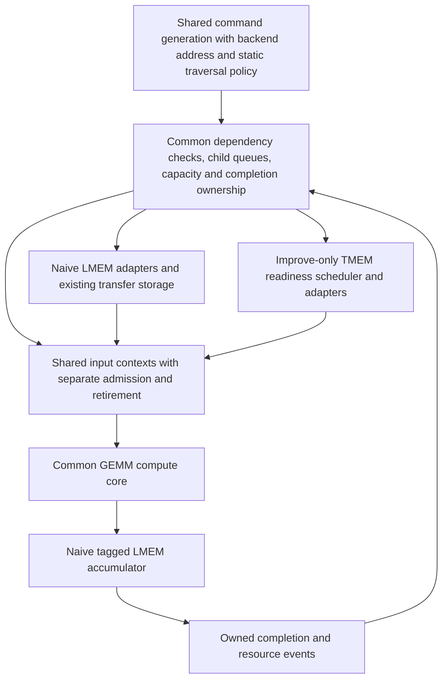
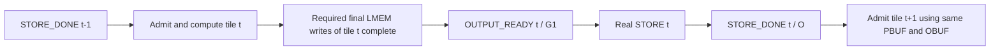

# Naive GEMM convergence plan — revision 2

Date: 2026-09-11. Status: planning complete; RTL redesign has not started. Source reviewed at HEAD `a1f98615c1994e6ee18c902a77e433b2ffe54055`, preserving unrelated worktree changes.

This revision supersedes [PLAN.md](PLAN.md). It evaluates [review.rev1.md](review.rev1.md), incorporates its recorded user constraints, and follows the latest user instruction to fix naive's default vector initialization instead of preserving the old vectors. The original plan and review remain historical records.

## 1. Review disposition

All six findings justify changes. Acceptance of a performance concern does not mean its predicted slowdown or remedy has been measured.

| Finding | Assessment against current source | Resolution in rev2 |
|---|---|---|
| R1: output-ready/reuse graph absent | Valid. Improve's real ACC2LMEM copy publishes ACC_FREE, which its store consumes. Naive writes final results directly into a single LMEM output allocation. Copying that graph can create a self-dependency or an unsafe reuse. | Define a concrete single-region graph using G1 for output-ready and O for external-store completion. No naive ACC2LMEM command or invented second ACC group. |
| R2: numerical vectors hide wrong S/Z payload | Valid. QCOL ignores K group; QROW ignores K row. The existing reference also reconstructs W from its initialization formula, and the launch loop verifies only after all repetitions. | Fix default initialization now; validate the oracle with wrong-payload controls. Add fresh-payload, poisoned-output, per-job verification in P0. Rebaseline all performance with corrected vectors. |
| R3: mandatory K-fast can expose PSUM RAW latency | Valid risk. The two FSMs use different inner orders, and naive's accumulator blocks reads behind earlier same-address accepted writes. The report's 13-cycle input access is not a measured PSUM bound. | Keep naive N-fast initially through a small static traversal policy. Measure actual PSUM timing and sustained throughput. K-fast is optional only if it passes the same gates. |
| R4: TMEM scheduler reuse is inappropriate | Valid source mismatch and an explicit design constraint recorded in the review. Its six-requester TMEM timing assumptions and command-stage probe gate are real. | Keep `VX_microtile_readiness_scheduler` improve-only. Separate common architectural dependency/capacity logic from the optional TMEM performance policy. |
| R5: weak performance acceptance | Valid. An explained regression and one overlapping pair do not establish success. | Freeze numerical latency and sustained-overlap gates before implementation; missing them is a failed candidate. |
| R6: reset contract unspecified | Valid. Improve explicitly rejects reset during an active invocation. | Preserve unsupported full-node active-reset diagnostics; scope occupied-reset tests to components whose whole response domain resets together. |

Two qualifications matter. `scheduler_quiescent` in the current common controller is an OR-free check of the command stage and real child/inflight queues; it must remain even in the configuration without the TMEM scheduler. Also, existing simulation-only PSUM shadow checking under `ifndef SYNTHESIS` is an oracle, not a permitted synthesized result cache.

## 2. Required behavior and boundaries

1. Independent/eligible microtile B may supply input while A is still computing or writing back. Once B's data/context and real dependencies are ready, A's active state alone cannot suppress B's valid/ready handshake.
2. The naive FSM emits real work commands with metadata. Remove standalone WAIT/NOTIFY instructions, their routing, and legacy child notification state. A no-transfer command created solely to publish a fence is also excluded.
3. Share improve's command schema, child dependency handling, resource-version checks, bounded capacity management, and separate admission/completion ownership. Keep backend address/layout adapters narrow; do not copy the complete FSM/controller.
4. Naive retains ordinary LMEM operands, PSUM reads/writes, and final output. Keep its existing LMEM capacity, ports, banks, and single PSUM/output allocations.
5. `VX_microtile_readiness_scheduler`, its urgency/deadline model, and its source-priority policy remain exclusive to improve. Do not port it, reproduce it under another name, or introduce a replacement LMEM priority scheduler.
6. Treat `VX_gemm_node_naive` as the node boundary. Do not forward outbound result data from downstream arbiters, queues, or LMEM interfaces back into an internal consumer. Ordinary ordered architectural PSUM reads remain required. Existing internal arithmetic forwarding is preserved; no new feedback path or retained-result capacity is added.
7. No new PSUM cache, shadow accumulator, reusable result array, or extra accumulation hierarchy. Begin with existing payload storage and transfer slots. New bounded control/ownership metadata is allowed and must be accounted for.

The memory backend can require dependency waits that improve's internal accumulator avoids. Hiding those waits with independent work is a measured candidate, not permission to bypass the dependence or add prohibited storage.

## 3. Target structure



| Shared architectural mechanism | Backend policy |
|---|---|
| `gemm_unified_cmd_t`: waits, admission targets, writer waits, preparation, notify metadata | LMEM/TMEM descriptor addresses and layouts |
| Per-child eligible issue, real inflight records, register generations | Improve-only scheduler enabled at elaboration; absent for naive |
| Input admission pointer separate from retirement pointer | Naive N-fast; improve K-fast; common index-generation code |
| Common compute core and existing W/S/Z lifetime checks | LMEM accumulator versus internal accumulator |
| Completion updates tied to actual owned work | Naive direct final LMEM write/store graph versus improve ACC2LMEM graph |

For naive, command-stage admission uses target-child queue capacity without a scheduler probe. Child execution still requires actual dependency and executor/inflight capacity. Generate away TMEM-specific admission gates, priority/credit feedback, scheduler event bookkeeping, and assertions; do not fake scheduler completion or fetch events to satisfy them. Preserve real command/inflight quiescence, completion ordering, consumer checks, and writer fences. Existing LMEM arbitration and its PSUM priority remain in place.

A full child queue can still backpressure the ordered command-generation stage. Do not claim arbitrary bypass of queue-capacity limits. Already-enqueued eligible work in another child must continue while a dependency blocks one child; no standalone parent WAIT may globally stall it.

## 4. Concrete naive memory and completion contract (R1)

### 4.1 Physical regions

Preserve the current host allocation in `compute_lmem_layout`. For MT=KT=NT=128, QBLK=32, the QCOL/QROW allocation sizes coincide. Offsets below are from `LMEM_BASE_ADDRESS`; ranges are half-open and 64-byte aligned.

| Region | Offset range | Bytes | Lifetime |
|---|---|---:|---|
| Input 0 / 1 | `[0x00000,0x08000)` / `[0x08000,0x10000)` | 32,768 each | Until all source reads of that generation finish |
| Weight 0 / 1 | `[0x10000,0x12000)` / `[0x12000,0x14000)` | 8,192 each | Same generation rule |
| Scale 0 / 1 | `[0x14000,0x14400)` / `[0x14400,0x14800)` | 1,024 each | Same generation rule |
| Zero 0 / 1 | `[0x14800,0x14c00)` / `[0x14c00,0x15000)` | 1,024 each | Same generation rule |
| Final output OBUF | `[0x15000,0x1d000)` | 32,768 | Until its external store completes |
| PSUM PBUF | `[0x1d000,0x2d000)` | 65,536 | All K contributions of one output tile; conservative release after its store |

There is one physical OBUF and one PBUF. The first implementation does not allocate another region from unused LMEM. For other supported quantization/geometry configurations, retain the allocation formulas and prove disjoint bounds in P0.

Preserve actual address construction, not misleading layout comments: for naive MXU16, N slice `nb`, row `r`, PSUM address is `PBUF + nb*16*128*4 + r*16*4`; final address is `OBUF + r*128*2 + nb*16*2`. Input and weight/quant layouts follow the current backend adapters. Tail rows/columns must not escape their allocations.

### 4.2 Completion resources and producers

Let output tiles be numbered `t = 1, 2, ...` in issue order. All K contributions of tile t use the same PBUF/OBUF. Resource counters start at zero for a new, quiescent invocation.

| Resource / RID in naive | Producer and event | Consumer |
|---|---|---|
| T0/T1, existing IDs 0/5 | Real external tile-load commands; publish complete generation only after all required operand writes are visible/ordered | Local source commands reading that operand generation |
| W0/W1, SC0/SC1, ZP0/ZP1 | Actual register installs, with exact generation targets | True W/S/Z consumers of the input packet |
| Existing W/S/Z consume RIDs | Actual last consumers of a bank generation | A later load's `writer_wait`; source fetch may run early |
| G0, existing ID 3 | Ordinary Input completion, increment 1 on registered ingress completion; ordered owned retirement | Progress/accounting only; never interpreted as final-output readiness |
| G1, existing ID 8, naive role `OUTPUT_READY` | The real terminal Input command of output tile t, increment 1 after its tile-scoped final write fence; resulting value t | External `STORE(t)` waits for G1 >= t |
| O, existing ID 4, naive role `STORE_DONE` | Real external `STORE(t)` completion, increment 1; resulting value t | Input admission for tile t+1, PBUF/OBUF reuse, final invocation completion |
| Proposed SRC_FREE0/1, appended IDs 21/22 | Generation-qualified completion of all actual Input/W/S/Z source reads of an operand tile buffer | External refills overwriting that buffer generation |

No `ACC_FREE` update is emitted by naive and no naive store waits for it. IDs 9/10 retain their improve meaning. Add symbolic SRC_FREE IDs without renumbering live RIDs; increase the common counter count from 21 to 23 while retaining 5-bit IDs. These are control counters, not data storage or a scheduling policy. If source lifetime can reuse an existing exact event without changing its meaning, document that simplification before integration; the explicit SRC_FREE mapping is the default contract.

Source-release events are joins of **real transfer completions**, qualified by operand-buffer ID and generation. Associate each local descriptor with those identities using normalized metadata; a monotonically increasing `work_seq` alone does not prove source reuse safety. Release requires all expected reads issued, every matching response captured in owned existing transport storage, and no future source read of that generation. Register-consumer lifetime remains a separate W/S/Z writer-fence concern. These sideband lifetime events do not require a standalone synchronization instruction or an extra notify-only command.

### 4.3 Real command sequence and acyclic graph

```text
LOAD operands for DMA tile d into a free operand generation
  -> publish T-ready(d) from real load completion

For each K block, statically visit independent N slices (N-fast):
  LOAD W/S/Z(u): waits T-ready(d); writer_wait protects register generation
  INPUT(u): source waits T-ready(d)
            admission waits O >= t-1 (physical PBUF/OBUF owner)
            carries exact W/S/Z consumer targets
            ordinary completion -> G0 += 1 at ingress completion

Terminal INPUT of output tile t:
  same real input work, plus tile-final write-fence metadata
  completion -> G1 += 1 only after all required writes of tile t are safe

STORE(t): real OBUF -> external-memory transfer
          waits[0] = {G1, t}; completion notify = {O, increment 1}

Admission of output tile t+1 waits {O, t}.
Its ordinary source reads may prepare early in free operand/transport storage.
```

Every Input of a tile carries the ownership target, so later commands cannot slip around a blocked first one. All K contributions within an N slice remain ordered. A final fence is attached only to a real terminal Input, whose completion record covers every earlier result belonging to that output tile. It must not assume the last tagged result alone proves all lanes are visible.



This graph has no store waiting for its own O event. OBUF reuse waits for external store completion; terminal Input does not depend on its own store. Conservatively sharing the O dependency for PBUF reuse avoids another physical allocation. Later source-only preparation cannot keep the tile-final write fence busy, because it generates no PSUM/output writes.

### 4.4 Controller and visibility changes required

- Normalize naive child routing to common Input/W/S/Z/external-DMA roles. The improve output-copy role is absent for naive; generate away its executable path and hard-coded completion ownership. Do not issue an empty ACC2LMEM.
- G0/G1 increment-by-one Input metadata and O store increments already match common legal-update checks, but branch their semantic consumers by backend. In naive, `input_admit_waits[3]` names O, not ACC_FREE. Update node admission RID validation and accessor logic accordingly.
- The current common DMA dependency switch supports G0/G1/ACC_FREE0/ACC_FREE1 only. STORE's G1 is supported; naive refill's SRC_FREE is not. Extend the backend-aware wait evaluator, command assertions, producer decoder, and generation tests together. Check every valid wait slot; do not silently ignore extra dependencies or unsupported RIDs.
- T-ready covers physical writes into all I/W/S/Z sections, not merely the final load's descriptor acceptance. If external loads can reorder, count/join their actual completion; if a FIFO ordering proof is used, make it explicit and test delayed earlier loads.
- Define the required final-write endpoint by tracing narrow writes through downstream arbitration to bank visibility or a proven ordered read boundary. Preserve reserve-on-first-presentation for partially forwarded wide writes. Use only command/region/generation metadata for acknowledgments; no result data may return across the node boundary.
- Maintain tile-scoped pending ownership and a closed-producer marker. A global zero count must neither complete a tile early nor wait for unrelated source reads/future tiles. Test delayed final lanes, delayed stores, tail tiles, and at least three output-tile reuses.

P0 must instantiate this graph and region table for actual emitted descriptors and model event order before RTL integration. It must close the visibility proof and generation joins; those hardware timing properties have not been demonstrated by this planning pass.

## 5. Input overlap and static traversal (R3/R4)

Extract improve's admission/completion separation while preserving full-width naive addresses and independent packet-end/final-output/fence fields. The current `packet_ctrl.last` meanings differ between backends and must be normalized before shared contexts are connected to the common accumulator interface.

Admission advances on the last accepted row. Ordinary completion retires on registered ingress completion; terminal tile fences retain owned physical completion. Reserve context and descriptor capacity atomically; preserve stable data/control during stalls. Removing `!packetizer_active` is the end of this conversion, not its implementation.

Naive initially retains N-fast order through a narrow compile-time traversal policy in shared command generation. Reuse existing descriptor/response storage to read future independent operands through ordinary LMEM accesses. Do not add deadlines, urgency classes, speculative PSUM repair, or a new dynamic issue-priority scheduler. A real dependency may hold a same-slice consumer when independent work runs out.

Keep accepted-transaction exact-address RAW checks, physical PSUM pending guards, and W/S/Z generation checks. Prefetch PSUM only when these guards permit an architectural read. Measure directly: producer acceptance -> result write issue -> safe read issue -> PSUM response -> accumulation -> retirement. Record address-revisit intervals; do not substitute the measured 13-cycle **input** round trip.

First compare one independent N slice and several slices with N-fast. A K-fast or different bounded static interleave is an optional measured candidate only after the baseline conversion. No traversal change is mandatory, and an unfavorable candidate is discarded without adding prohibited data storage or forwarding.

## 6. Storage budget and node-boundary audit

Before changes, capture an elaborated storage ledger for both compute geometries. These are starting observations for th16/MXU16, not permission to grow buffers:

| Storage | Payload/capacity | Lifetime and allowed use |
|---|---|---|
| Input packetizer contexts | Four command metadata entries | Descriptor/admission/completion ownership; no results |
| Input DMA response RAM | 16 configured source slots; 32 bytes per native input beat | Read response until its ordered input handoff; reuse capacity for multicommand transport |
| LMEM accumulator transactions | 64 tag/address/control entries | Accepted transaction until retirement; metadata only |
| PSUM read slots | Eight rows, 64 bytes each | A normal LMEM read response until its consumer accepts it; no hit/reuse path |
| Existing PSUM join and lane buffers | Existing configured slots and FIFO depths, to be enumerated in P0 | In-progress request/response assembly only |
| Weight/quant/output transfer and final-conversion buffers | Existing configured depths/widths, to be enumerated in P0 | One transfer/ordered install or final write; no completed-result reuse |

For every replacement buffer, list old/new payload width, slot count, maximum bytes, allocation/release events, and purpose. Count live replicated data as well as declared RAM bits. Repartitioning existing transport slots is a candidate; it must preserve the original total payload budget and identify any capacity reduction elsewhere. Add only bounded owner/generation metadata in the initial implementation. Splitting S and Z control must not silently duplicate the existing combined payload store.

If existing capacity prevents the gates from being met, report the capacity limit and failed gate. Extra transport capacity requires a separately specified revision with its measured cost; a result cache or outbound-data forwarding remains excluded. Report register/RAM resource deltas and timing checks for accepted changes. No synthesis/timing success is claimed by the current host-only checks.

## 7. Correctness oracle and vector repair (R2)

The latest user instruction supersedes the review's recommendation to preserve the original benchmark payload. Fix the default initializer and use corrected data for correctness **and** performance baselines. There is no legacy-vector performance track.

Already changed in this revision: [naive main.cpp](../../tests/regression/fpint_gemm_ffn_hw_naive/main.cpp) now varies both S and Z with QCOL K group or QROW K row. Scale uses periods 17 and 7 across its axes; zero-point uses a distinct K-dependent pattern. The bounded dyadic scales keep current integer A times scale exactly representable in FP16 for QROW. This avoids introducing an unrelated reference-rounding mismatch.

Host-only validation compiled the production initializer via [check_test_vectors.cpp](check_test_vectors.cpp). Twelve shape/mode combinations passed comparison against an independently indexed oracle that decodes the actual packed W payload. All 36 wrong-scale, wrong-zero, and combined wrong-K-group/row controls failed the production 1% comparator as intended; expected results were finite. [Log](test-vectors.rev2.log). No device/RTL simulation was run for this fix in this revision.

Remaining P0 work:

1. Make naive and improve consume the same logical corrected A/W/S/Z tensors; keep only packing/layout conversion backend-specific. Reuse or extract the corrected initializer rather than duplicating subtly different formulas. Update the reference to decode actual generated W if its initialization changes.
2. Ensure A/W distinguish tested row/microtile identities; add impulse/tagged cases if periodic data aliases a specific address fault. Verify wrong scale-group and zero-group independently, and stale payload with correct generation metadata.
3. For repeated jobs, change payloads per invocation, upload them, poison/invalidate destination, launch, wait, read back, and verify **each** job before the next. Do not use only `-r` on the existing loop as evidence. Preserve supported power/poll-only modes without claiming numerical coverage for them.
4. Keep oracle expected payload/indices independent from intentionally faulty device-side selection. Negative controls must fail beyond the accepted numerical tolerance; unsupported infinity/NaN behavior cannot stand in for a meaningful distinguishing vector.
5. Run corrected-vector baseline hardware simulations before RTL redesign. A newly exposed existing failure blocks that baseline and must be diagnosed; do not restore weak vectors to hide it.

Original reported cycles 61,552/1,372,729 for naive and 6,448/272,869 for improve are historical observations on old payloads. They are not valid rev2 pass/fail baselines.

## 8. Frozen acceptance gates (R5)

These are engineering targets selected by this revision before implementation, not measured outcomes or thresholds supplied by the review. Freeze them with the corrected-vector baseline manifest. Do not relax them after seeing candidate results.

| Gate | Required result |
|---|---|
| Naive M4/K512/N512 GEMM latency | At least **25% reduction**: candidate cycles <= `floor(0.75 * corrected_baseline_cycles)` |
| Naive M256/K512/N512 GEMM latency | At most **1% regression**: candidate cycles <= `floor(1.01 * corrected_baseline_cycles)` |
| Whole-kernel cycles | No more than 1% regression on either required shape |
| Improve regression | Common-control extraction preserves numerical results and corrected-baseline GEMM/core cycles; required differences need a separate explicit acceptance revision, not a post-hoc explanation |
| Sustained M4 overlap | At least 50% of consecutive independent N-slice command pairs in the middle 50% of the invocation have `first_input(B) < final_compute_writeback(A)` |
| Sustained useful service | Input-handshake density over that fixed middle-command window improves by at least 25% relative to the corrected baseline, with all expected work admitted/retired exactly once |

Define the middle window by command ordinal before looking at timing; for the expected 1,024 commands, use ordinals 256–767 (zero-based). Exclude only pairs crossing output-tile ownership fences or updating the same N slice; do not exclude source stalls, register stalls, or unfavorable pairs after measurement. The window must include at least 256 eligible pairs. Track A's last-row compute writeback by carried work identity even when no completion notification is requested. Also publish per-DMA-tile distributions so the aggregate cannot hide one isolated burst.

For useful-service density, count accepted input handshakes from the first admission to the last admission of the selected command window, using the same event/endpoint convention in both runs. Report sustained accumulator and physical retirement rates too; admission ahead of a stalled accumulator alone is insufficient.

Hold corrected logical data, shape, byte work, LMEM allocation/payload capacity, ports/banks, clock, HBM model, and compute geometry fixed across each before/after pair. Record model and source/config hashes. Logical data must also match between naive and improve after backend conversion. The simulated model is deterministic and uncalibrated; these are cycle gates, not board latency claims.

Use fsdb_cli to record source-wait, PSUM accepted-producer RAW wait, physical write-order wait, W/S/Z generation wait, context/slot-capacity wait, and output-fence wait. Publish intersections and a documented mutually exclusive precedence if summing stall categories. Measure ordinary PSUM latency under overlap directly.

A candidate that misses any required gate is incomplete even if its slowdown is explained. Retain measured N-fast if it meets the gates. If no legal candidate meets them, record the unmet gate and limiting dependency; do not substitute forbidden forwarding/storage or one successful overlapping pair.

## 9. Reset and repeated-invocation contract (R6)

| Boundary/scenario | Contract and test |
|---|---|
| Initial reset or quiescent full-node reset | Supported with transport/memory response domain quiescent or jointly reset; clear contexts, generations, and completion state |
| Full-node reset during active invocation | Unsupported, as in improve; retain the existing fatal diagnostic and check it as an expected-failure test |
| Occupied isolated adapter reset | Test only where DUT plus its modeled request/response domain are reset/flushed together; model must prove no pre-reset response can return |
| Adapter-only reset while downstream responses survive | Not added as a supported contract; do not silently reuse tags or claim stale-response rejection |
| Multiple jobs without reset | Supported after full completion/quiescence; changing payloads, poisoned outputs, generation reuse, and verification after every job |

Do not disable the active-invocation reset assertion to make a test pass. Supporting cancellation with surviving responses would require a separate epoch/tag/drain/cancellation specification and is outside this redesign.

## 10. Phased implementation and exits

### P0 — Repair validation, freeze resources, and prove the dependency contract

Finish the vector/oracle and per-job checks in section 7. Refresh naive/improve baselines with identical corrected logical tensors. Enumerate existing buffer payloads and node-boundary paths. Instantiate the section 4 region/RID graph for multiple tiles and delayed events; prove visibility and source-release endpoints. Record supported reset boundaries and freeze section 8 thresholds.

Exit: corrected baseline numerical PASS; negative controls fail; resource ledger and acyclic command graph complete. No RTL overlap result is claimed yet.

### P1 — Share architectural control with the TMEM scheduler optional

Extract/reuse common metadata, dependency checks, child queues, typed completion updates, and context ownership from improve. Select the performance scheduler at elaboration for improve only; no scheduler or equivalent priority controller exists in naive. Remove its probe/event/assertion coupling from the naive path while retaining real queue quiescence and resource capacity. Normalize packet end versus final-output mode across the core/accumulator boundary.

Exit: improve unchanged; naive elaborates without the TMEM scheduler; independent eligible child progress and all dependency/capacity assertions pass. No fabricated feedback events.

### P2 — Convert naive commands and admission using N-fast

Use common command generation with naive address and N-fast traversal policy. Emit only real Input/W/S/Z/external load/store commands carrying metadata. Implement G0/G1/O and source-generation lifetime mapping; remove explicit WAIT/NOTIFY execution and dummy ACC2LMEM paths. Use separate admission/retirement pointers, stable full-width addresses, exact W/S/Z targets, and metadata-only ownership records. Keep terminal physical fences while ordinary Inputs retire at ingress completion.

Exit: a legal B actually enters GEMM before A output, completion notifications remain correctly owned, and every tested command's numerical output is correct. One pair is an intermediate functional check, not final performance acceptance.

### P3 — Reuse existing transport capacity for read-ahead

Adapt common ordered descriptor/response handling to the existing LMEM slots and lane/tag interfaces. Allow future independent source reads while prior work computes. Preserve source-buffer lifetime, W/S/Z overwrite guards, accepted-transaction PSUM RAW checks, and physical pending-write guards. Keep arithmetic/result payload lifetime unchanged. Enumerate storage deltas; source/install separation must not secretly add another data array.

Exit: measured source read-ahead and sustained N-fast admission with correct PSUM responses under delayed/out-of-order lanes. Measure one-slice and multi-slice dependence limits before considering any other static traversal.

### P4 — Validate final-write/store reuse and meet measured gates

Exercise delayed terminal writes, delayed external stores, source refill during earlier computation, and three or more output-tile reuses using the single OBUF/PBUF. Prove no premature G1/O/SRC_FREE update and no fence waiting on its own consumer. Compare static candidates only within the defined constraints and fixed thresholds. Verify PSUM RAW and final FP16 conversion for short M and M256.

Exit: every section 8 gate passes, sustained service is demonstrated, and resource/timing checks show the accepted control change's cost. A failed candidate remains incomplete.

### P5 — Regression, cleanup, and report

Run the backend-specific matrix below; remove obsolete naive synchronization helpers after references are migrated. Keep improve-only scheduler tests in their own configuration. Fix/document local perf wiring before comparing DMA overlap. Update latency and FSDB reports with corrected-vector baselines, accepted results, actual payload counts, and provenance; preserve historical reports as labeled old-vector evidence.

Exit: architectural requirements, correctness, reset scope, sustained overlap, latency budgets, and the storage/boundary audit all pass.

## 11. Verification matrix and execution

| Scope | Required coverage |
|---|---|
| Shared contexts/controller | Simultaneous enqueue/admit/retire, bounded full/empty queues, owned completion, no standalone synchronization commands, independent child progress without TMEM scheduler |
| Improve-only | Existing readiness-scheduler and TMEM urgency regressions; unchanged corrected-vector latency and functionality |
| Naive LMEM | One/multiple independent slices, same-address K accumulation, accepted producer with no physical write yet, delayed/out-of-order responses, partial lane writes, output-store visibility and source reuse |
| Payload oracle | QCOL/QROW, both weight layouts, distinguishable S/Z/A/W, wrong-group and stale-payload negative controls, verification after every changed-payload invocation |
| Required blackbox | th16/MXU16x16, M4 and M256 with K=N=512, QBLK32; corrected shared logical tensors |
| Additional shapes | M1/M3/M16 and supported M tails; one versus several N slices; multiple K/output tiles; supported K/N alignments only |
| Compatibility | Naive MXU32, improve common-control regressions, active-reset diagnostic and supported component-reset cases |

Reuse the existing `gemm_input_packetizer`, `gemm_fsm`, `gemm_ctrl`, `gemm_stream_dma_queue`, `lmem_dma_input_overlap`, `lmem_dma_weight_overlap`, `gemm_acc_lmem`, `gemm_psum_read_ooo_join`, and `gemm_unit_v2_backpressure` tests as applicable. `microtile_readiness_scheduler` tests remain improve-only. Audit tests hard-coding `GEMM_IMPROVE`, child indices, or completion RIDs before reusing them for naive.

Source the matching file in `configs/` before simulation. Configure dedicated builds with `../configure --xlen=64 --tooldir=/opt/vortex --prefix="$HOME/tools/vortex"`; use `/usr/bin/gcc` and `/usr/bin/g++`, configured unittest copies, and VCS targets. Force fresh elaboration when RTL/header changes could reuse a stale simulator. Verify required binaries with `which` before use.

From the configured build directory with the proper config sourced:

```bash
ci/run_black.sh xrt-vcs-sim --perf 3 --app fpint_gemm_ffn_hw_naive \
  --args "-m 4 -k 512 -n 512 -q 32 -t 0 -d 0 -r 1"
```

Use xrt-vcs-sim for RTL blackbox, not simx or Verilator. Apply the run-bb-common procedure when execution starts. Capture FSDB and use fsdb_cli for cycle/identity checks; no new simulation is claimed by this plan revision.

## 12. Completion checklist

- [ ] Corrected default vectors shared logically by both benchmarks; fresh baseline and every-job oracle verified.
- [ ] Fixed thresholds, storage ledger, physical region map, and acyclic real-command/RID graph recorded.
- [ ] Common architectural control active; TMEM readiness scheduler and priority policy absent from naive.
- [ ] No standalone WAIT/NOTIFY or dummy copy/fence commands in naive.
- [ ] Actual sustained microtile input overlap using separate admission/completion ownership.
- [ ] Existing N-fast/static interleave evaluated with measured PSUM dependency/response timing.
- [ ] Single OBUF/PBUF reuse and final-store visibility proven with delayed writes/stores.
- [ ] No outbound-data forwarding shortcut, new accumulation hierarchy, or unaccounted payload capacity.
- [ ] Supported reset boundary honored; no false claim of active invocation cancellation.
- [ ] Correctness, negative controls, both latency budgets, sustained-overlap/service gates, and improve/MXU32 regressions pass.
- [ ] Reports record corrected-vector results and distinguish them from historical measurements.
