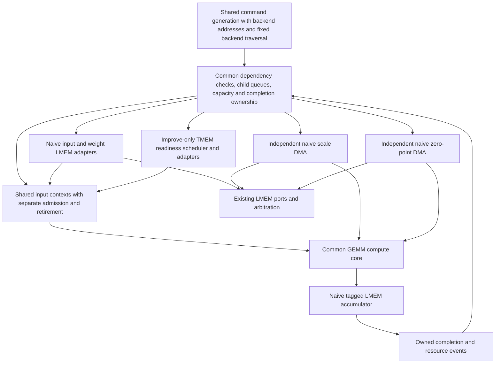
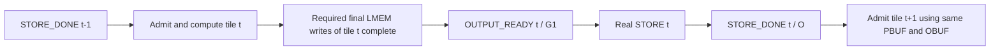

# Naive GEMM convergence plan — revision 3

Date: 2026-09-11. Status: planning complete; RTL redesign has not started. Source reviewed at HEAD `a1f98615c1994e6ee18c902a77e433b2ffe54055`, preserving unrelated worktree changes.

This revision supersedes [plan.rev2.md](plan.rev2.md) and [PLAN.md](PLAN.md). It evaluates [review.rev2.md](review.rev2.md) against the current source and incorporates the user instructions recorded there. Constraints accepted from [review.rev1.md](review.rev1.md), including correcting naive's default vector initialization, remain in force. Earlier plans, reviews, and measurements remain historical records.

Implemented in this planning pass: the production comparator tolerance in both benchmark apps is now `0.001f`, and host oracle checks cover the reported local fault. Independent S/Z DMA, fixed N-fast shared command generation, and normalized RTL measurement are specified below; their RTL implementation and device validation have not started.

## 1. Review disposition and binding user instructions

The first three decisions below are **user instructions** recorded in review.rev2.md on 2026-09-11. The fourth was added by the user after the rev3 summary. These instructions supersede conflicting alternatives in earlier plans or review recommendations:

1. Apply **0.1% relative numerical tolerance**, implemented as `0.001f`. Specify and test the expected-zero absolute-error branch separately.
2. Give naive **independent scale DMA and zero-point DMA**, following improve's separation of queues, progress, ownership, writer fences, and install completion. Preserve the total payload budget by an explicit partition.
3. Fix naive microtile traversal to **N-fast**: visit all N slices of the current K block before advancing K. Do not evaluate K-fast or another order as a naive candidate. Improve's current traversal remains its backend policy.
4. **Naive changes must leave improve latency and hardware cost unchanged.** Share existing code only where improve remains unchanged; otherwise add naive-specific logic under SystemVerilog preprocessor `ifdef` guards. This rule takes precedence over maximizing common code.

| Rev2 finding | Assessment against source and host checks | Resolution in rev3 |
|---|---|---|
| R1: broad wrong-group controls miss local S/Z faults | Valid. The single-scale counterexample reproduces: four changed outputs pass at 1%. The 7,680-case historical scale fault census also reproduces its 1,390 misses. | Apply the user's 0.1% threshold to both apps; all 7,680 cases are detected at that threshold. Add sparse local controls and mandatory physical lane/beat and stale-install checks in P0. Host detection does not prove device correctness. |
| R2: possible shared S/Z writer cycle | Valid conditional design risk, not an observed deadlock in existing naive. Naive currently has one quant DMA; improve actually instantiates separate `u_ldma_scale` and `u_ldma_zero_point`. | The user selected two independent DMA engines. Specify their ownership and payload partition, retain LMEM arbitration, and require progress in either direction while the other writer is blocked. Do not design a merged ordered S/Z FIFO. |
| R3: K-fast candidate conflicts with overlap sample gate | Valid for rev2's optional candidate. Fixed naive N-fast resolves the policy/gate conflict. | Remove traversal alternatives. Define adjacent ordinal pairs and retain the gate; the required N-fast middle window has 510 eligible pairs. |
| R4: GEMM counters use different completion boundaries | Valid. Naive counts until done handshake; common control can stop before notification delivery. No large baseline done backpressure was established. | Move normalization to P0, define common start/end sampling and per-job accounting, and match perf to FSDB with directed done backpressure before freezing baselines. |

Retained rev1 decisions: one physical OBUF/PBUF with separate output-ready G1 and store-done O; no dummy ACC2LMEM; corrected default vectors; improve-only TMEM readiness scheduler; bounded existing payload storage and no new result forwarding/hierarchy; fixed performance gates; unsupported full-node active reset. `scheduler_quiescent` must still check real queues and inflight work in naive. Simulation-only PSUM shadow checking remains an oracle, not synthesized storage.

## 2. Required behavior and boundaries

1. Independent/eligible microtile B may supply input while A is still computing or writing back. Once B's data/context and real dependencies are ready, A's active state alone cannot suppress B's valid/ready handshake.
2. The naive FSM emits real work commands with metadata. Remove standalone WAIT/NOTIFY instructions, their routing, and legacy child notification state. A no-transfer command created solely to publish a fence is also excluded.
3. Reuse improve's command schema, child dependency handling, resource-version checks, bounded capacity management, and separate admission/completion ownership wherever sharing leaves improve unchanged. If reuse would change improve latency, hardware cost, or its existing behavior, implement the required naive-specific portion under `` `ifdef GEMM_NAIVE ``. Keep the separation as narrow as practical; commonization is subordinate to improve preservation.
4. Naive retains ordinary LMEM operands, PSUM reads/writes, and final output. Keep its existing LMEM capacity, ports, banks, and single PSUM/output allocations.
5. `VX_microtile_readiness_scheduler`, its urgency/deadline model, and its source-priority policy remain exclusive to improve. Do not port it, reproduce it under another name, or introduce a replacement LMEM priority scheduler.
6. Treat `VX_gemm_node_naive` as the node boundary. Do not forward outbound result data from downstream arbiters, queues, or LMEM interfaces back into an internal consumer. Ordinary ordered architectural PSUM reads remain required. Existing internal arithmetic forwarding is preserved; no new feedback path or retained-result capacity is added.
7. No new PSUM cache, shadow accumulator, reusable result array, or extra accumulation hierarchy. Begin with existing payload storage and transfer slots. New bounded control/ownership metadata is allowed and must be accounted for.
8. Separate scale and zero-point DMA execution and install ownership. One engine's blocked writer cannot globally block the other engine's otherwise eligible requests, responses, or installs. Physical LMEM arbitration remains shared where it is shared today.
9. Preserve naive N-fast order throughout implementation and measurement. Backend selection in shared code must not expose another traversal choice for naive.
10. Use the user's 0.1% comparator and the normalized per-invocation GEMM metric when validating and freezing new baselines.
11. Preserve improve's cycle behavior and hardware cost exactly under the same configuration, workload, tool settings, and constraints. Naive metadata, counters, adapters, and measurement additions must not enlarge or alter improve hardware.

The memory backend can require dependency waits that improve's internal accumulator avoids. Hiding those waits with independent work is a measured candidate, not permission to bypass the dependence or add prohibited storage.

### 2.1 User rule: preserve improve and isolate naive-specific changes

For every proposed shared edit, first check whether improve's existing elaborated logic, data/control interfaces, pipeline stages, handshake timing, and resource allocation remain unchanged. Reuse the existing implementation where that condition holds. Otherwise place the needed declaration, metadata field, counter, adapter, or implementation in a naive-only preprocessor branch using the existing `GEMM_NAIVE` define. Select a separate naive helper/module with that guard when a local branch is insufficient. Preserve the existing improve implementation in its current configuration branch.

Use SystemVerilog `ifdef` / `elsif` / `else` / `endif` selection, not a runtime backend mux. Naive-specific hardware must be absent from the improve compilation. Do not widen improve structs, queue entries, register arrays, address paths, or completion decoders to accommodate naive. Keep improve's scheduler instantiation, timing cuts, pipeline registers, and ready/valid behavior intact. In particular, normalize naive packet-end/final-output semantics in a naive adapter instead of changing the improve packet contract.

For this rule, cost covers synthesized logic/cell counts (including LUT, FF, DSP and RAM resources as applicable), allocated payload/control bits, and queue/register capacities. P0 records the improve baseline resource report and timing constraints with tool/config/seed provenance. Each accepted shared change must show zero improve GEMM/core-cycle delta and zero cost delta, with the same functional results and timing constraints. Compare preprocessed/elaborated structure and synthesis reports; unchanged numerical output alone is insufficient. Tool-generated names or source-location metadata may be normalized for structural comparison, but hardware differences must not be filtered out.

Any improve latency or cost change disqualifies the shared implementation in this task. Move the differing portion behind the naive-only guard and recheck it; do not offset added resources with savings elsewhere or accept a small regression. This also applies to P0 measurement: use testbench/bind or synthesis-excluded observation so normalized metrics add no improve hardware or handshake changes. The previously authorized host comparator/vector work remains part of validation; freeze identical logical inputs before measuring RTL changes.

## 3. Target structure

The diagram and table describe mechanisms to reuse subject to section 2.1. They do not require modifying improve to create a common abstraction. A mechanism that cannot be shared without changing improve is implemented in the corresponding naive-only `ifdef` branch.



| Shared architectural mechanism | Backend policy |
|---|---|
| `gemm_unified_cmd_t`: waits, admission targets, writer waits, preparation, notify metadata | LMEM/TMEM descriptor addresses and layouts |
| Per-child eligible issue, real inflight records, register generations | Improve-only scheduler enabled at elaboration; absent for naive |
| Input admission pointer separate from retirement pointer | Naive N-fast; improve K-fast; common index-generation code |
| Common compute core and existing W/S/Z lifetime checks | LMEM accumulator versus internal accumulator |
| Independent scale/zero queues, response ownership, writer fences, and install completion | Ordinary LMEM source access in naive; TMEM source access in improve |
| Completion updates tied to actual owned work | Naive direct final LMEM write/store graph versus improve ACC2LMEM graph |

For naive, command-stage admission uses target-child queue capacity without a scheduler probe. Child execution still requires actual dependency and executor/inflight capacity. Generate away TMEM-specific admission gates, priority/credit feedback, scheduler event bookkeeping, and assertions; do not fake scheduler completion or fetch events to satisfy them. Preserve real command/inflight quiescence, completion ordering, consumer checks, and writer fences. Existing LMEM arbitration and its PSUM priority remain in place.

A full child queue can still backpressure the ordered command-generation stage. Do not claim arbitrary bypass of queue-capacity limits. Already-enqueued eligible work in another child must continue while a dependency blocks one child; no standalone parent WAIT may globally stall it.

## 4. Concrete naive memory and completion contract (retained rev1 R1)

### 4.1 Physical regions

Preserve the current host allocation in `compute_lmem_layout`. For MT=KT=NT=128, QBLK=32, the QCOL/QROW allocation sizes coincide. Offsets below are from `LMEM_BASE_ADDRESS`; ranges are half-open and 64-byte aligned.

| Region | Offset range | Bytes | Lifetime |
|---|---|---:|---|
| Input 0 / 1 | `[0x00000,0x08000)` / `[0x08000,0x10000)` | 32,768 each | Until all source reads of that generation finish |
| Weight 0 / 1 | `[0x10000,0x12000)` / `[0x12000,0x14000)` | 8,192 each | Same generation rule |
| Scale 0 / 1 | `[0x14000,0x14400)` / `[0x14400,0x14800)` | 1,024 each | Same generation rule |
| Zero 0 / 1 | `[0x14800,0x14c00)` / `[0x14c00,0x15000)` | 1,024 each | Same generation rule |
| Final output OBUF | `[0x15000,0x1d000)` | 32,768 | Until its external store completes |
| PSUM PBUF | `[0x1d000,0x2d000)` | 65,536 | All K contributions of one output tile; conservative release after its store |

There is one physical OBUF and one PBUF. The first implementation does not allocate another region from unused LMEM. For other supported quantization/geometry configurations, retain the allocation formulas and prove disjoint bounds in P0.

Preserve actual address construction, not misleading layout comments: for naive MXU16, N slice `nb`, row `r`, PSUM address is `PBUF + nb*16*128*4 + r*16*4`; final address is `OBUF + r*128*2 + nb*16*2`. Input and weight/quant layouts follow the current backend adapters. Tail rows/columns must not escape their allocations.

### 4.2 Completion resources and producers

Let output tiles be numbered `t = 1, 2, ...` in issue order. All K contributions of tile t use the same PBUF/OBUF. Resource counters start at zero for a new, quiescent invocation.

| Resource / RID in naive | Producer and event | Consumer |
|---|---|---|
| T0/T1, existing IDs 0/5 | Real external tile-load commands; publish complete generation only after all required operand writes are visible/ordered | Local source commands reading that operand generation |
| W0/W1, SC0/SC1, ZP0/ZP1 | Actual register installs, with exact generation targets | True W/S/Z consumers of the input packet |
| Existing W/S/Z consume RIDs | Actual last consumers of a bank generation | A later load's `writer_wait`; source fetch may run early |
| G0, existing ID 3 | Ordinary Input completion, increment 1 on registered ingress completion; ordered owned retirement | Progress/accounting only; never interpreted as final-output readiness |
| G1, existing ID 8, naive role `OUTPUT_READY` | The real terminal Input command of output tile t, increment 1 after its tile-scoped final write fence; resulting value t | External `STORE(t)` waits for G1 >= t |
| O, existing ID 4, naive role `STORE_DONE` | Real external `STORE(t)` completion, increment 1; resulting value t | Input admission for tile t+1, PBUF/OBUF reuse, final invocation completion |
| Proposed SRC_FREE0/1, appended IDs 21/22 | Generation-qualified completion of all actual Input/W/S/Z source reads of an operand tile buffer | External refills overwriting that buffer generation |

No `ACC_FREE` update is emitted by naive and no naive store waits for it. IDs 9/10 retain their improve meaning. Add symbolic SRC_FREE IDs and increase the resource-counter count from 21 to 23 **only in the naive `` `ifdef GEMM_NAIVE `` branch**, retaining 5-bit IDs. Improve keeps its existing 21 counters, live RID assignments, decoders, and metadata widths unchanged. These are control counters, not data storage or a scheduling policy. If source lifetime can reuse an existing exact event without changing its meaning, document that simplification before integration; the explicit SRC_FREE mapping is the default contract.

Source-release events are joins of **real transfer completions**, qualified by operand-buffer ID and generation. Associate each local descriptor with those identities using normalized metadata; a monotonically increasing `work_seq` alone does not prove source reuse safety. Release requires all expected reads issued, every matching response captured in owned existing transport storage, and no future source read of that generation. Register-consumer lifetime remains a separate W/S/Z writer-fence concern. These sideband lifetime events do not require a standalone synchronization instruction or an extra notify-only command.

### 4.3 Real command sequence and acyclic graph

```text
LOAD operands for DMA tile d into a free operand generation
  -> publish T-ready(d) from real load completion

For each K block, statically visit independent N slices (N-fast):
  LOAD W/S/Z(u): waits T-ready(d); writer_wait protects register generation
  INPUT(u): source waits T-ready(d)
            admission waits O >= t-1 (physical PBUF/OBUF owner)
            carries exact W/S/Z consumer targets
            ordinary completion -> G0 += 1 at ingress completion

Terminal INPUT of output tile t:
  same real input work, plus tile-final write-fence metadata
  completion -> G1 += 1 only after all required writes of tile t are safe

STORE(t): real OBUF -> external-memory transfer
          waits[0] = {G1, t}; completion notify = {O, increment 1}

Admission of output tile t+1 waits {O, t}.
Its ordinary source reads may prepare early in free operand/transport storage.
```

Every Input of a tile carries the ownership target, so later commands cannot slip around a blocked first one. All K contributions within an N slice remain ordered. A final fence is attached only to a real terminal Input, whose completion record covers every earlier result belonging to that output tile. It must not assume the last tagged result alone proves all lanes are visible.



This graph has no store waiting for its own O event. OBUF reuse waits for external store completion; terminal Input does not depend on its own store. Conservatively sharing the O dependency for PBUF reuse avoids another physical allocation. Later source-only preparation cannot keep the tile-final write fence busy, because it generates no PSUM/output writes.

### 4.4 Controller and visibility changes required

- Normalize naive child routing to common Input/W/S/Z/external-DMA roles. The improve output-copy role is absent for naive; generate away its executable path and hard-coded completion ownership. Do not issue an empty ACC2LMEM.
- G0/G1 increment-by-one Input metadata and O store increments already match common legal-update checks, but branch their semantic consumers by backend. In naive, `input_admit_waits[3]` names O, not ACC_FREE. Update node admission RID validation and accessor logic accordingly.
- The current common DMA dependency switch supports G0/G1/ACC_FREE0/ACC_FREE1 only. STORE's G1 is supported; naive refill's SRC_FREE is not. Extend the naive-only wait evaluator, producer decoder, and associated assertions/tests under `` `ifdef GEMM_NAIVE ``; preserve the existing improve decoder and supported RID set. Check every valid wait slot; do not silently ignore extra dependencies or unsupported RIDs.
- T-ready covers physical writes into all I/W/S/Z sections, not merely the final load's descriptor acceptance. If external loads can reorder, count/join their actual completion; if a FIFO ordering proof is used, make it explicit and test delayed earlier loads.
- Define the required final-write endpoint by tracing narrow writes through downstream arbitration to bank visibility or a proven ordered read boundary. Preserve reserve-on-first-presentation for partially forwarded wide writes. Use only command/region/generation metadata for acknowledgments; no result data may return across the node boundary.
- Maintain tile-scoped pending ownership and a closed-producer marker. A global zero count must neither complete a tile early nor wait for unrelated source reads/future tiles. Test delayed final lanes, delayed stores, tail tiles, and at least three output-tile reuses.

P0 must instantiate this graph and region table for actual emitted descriptors and model event order before RTL integration. It must close the visibility proof and generation joins; those hardware timing properties have not been demonstrated by this planning pass.

## 5. Input overlap and fixed N-fast traversal

Reuse improve's admission/completion separation where section 2.1 permits, while preserving full-width naive addresses and independent packet-end/final-output/fence fields in naive-only definitions/adapters. The current `packet_ctrl.last` meanings differ between backends. Normalize the naive interpretation at its adapter boundary before connecting reusable contexts; keep improve's interpretation, interface width, and timing unchanged.

Admission advances on the last accepted row. Ordinary completion retires on registered ingress completion; terminal tile fences retain owned physical completion. Reserve context and descriptor capacity atomically; preserve stable data/control during stalls. Removing `!packetizer_active` is the end of this conversion, not its implementation.

**The user requires naive N-fast without traversal alternatives.** Reuse index-generation code only where improve remains unchanged; select naive-specific N-fast logic with `` `ifdef GEMM_NAIVE `` where needed. For each K block, naive issues all its N slices, then advances K. Preserve each slice's K contribution order. Improve keeps its existing K-fast policy. The naive path must not select K-fast or another interleave by parameter, performance experiment, or dynamic issue policy.

Reuse existing descriptor/response storage to prepare future operands through ordinary LMEM accesses without changing that Input command order. Do not add deadlines, urgency classes, speculative PSUM repair, or a new dynamic issue-priority scheduler. A real dependency may hold a same-slice consumer when independent work runs out.

Keep accepted-transaction exact-address RAW checks, physical PSUM pending guards, and W/S/Z generation checks. Prefetch PSUM only when these guards permit an architectural read. Measure directly: producer acceptance -> result write issue -> safe read issue -> PSUM response -> accumulation -> retirement. Record address-revisit intervals; do not substitute the measured 13-cycle **input** round trip.

Test workloads with one independent N slice and several slices using the same fixed N-fast rule. These expose dependence limits; they are not traversal candidates. If an implementation misses a gate, improve legal admission/read-ahead or report the limiting dependency while retaining the required order.

## 6. Storage budget and node-boundary audit

Before changes, capture an elaborated storage ledger for both compute geometries. The starting th16/MXU16 config is [naive_gemm_th16_tcol16_hwexp_dcache_sxbar_f16.sh](../../configs/naive_gemm_th16_tcol16_hwexp_dcache_sxbar_f16.sh), which overrides the generic outstanding-slot default to 16. These are config-specific observations, not permission to grow buffers:

| Storage | Payload/capacity | Lifetime and allowed use |
|---|---|---|
| Input packetizer contexts | Four command metadata entries | Descriptor/admission/completion ownership; no results |
| Input DMA response RAM | 16 configured source slots; 32 bytes per native input beat | Read response until its ordered input handoff; reuse capacity for multicommand transport |
| LMEM accumulator transactions | 64 tag/address/control entries | Accepted transaction until retirement; metadata only |
| PSUM read slots | Eight rows, 64 bytes each | A normal LMEM read response until its consumer accepts it; no hit/reuse path |
| Existing PSUM join and lane buffers | Existing configured slots and FIFO depths, to be enumerated in P0 | In-progress request/response assembly only |
| Combined quant response slots, before split | `SZ_RD_OUTSTANDING=16`, 32 bytes per th16/MXU16 beat: 512 bytes total | Partition into scale 8 slots and zero-point 8 slots; 256 + 256 bytes, no shared ordered response head |
| Other weight/quant/output transfer and final-conversion buffers | Existing configured depths/widths, to be enumerated in P0 | One transfer/ordered install or final write; include every staging register/FIFO in the split ledger; no completed-result reuse |

For every replacement buffer, list old/new payload width, slot count, maximum bytes, allocation/release events, and purpose. Count live replicated data as well as declared RAM bits. Repartitioning existing transport slots is a candidate; it must preserve the original total payload budget and identify any capacity reduction elsewhere. Add only bounded owner/generation metadata in the initial implementation. Splitting S and Z into independent DMA engines must not duplicate the existing combined payload store. The 8/8 response-slot split is the starting allocation for the required geometry; P0 must check the resolved config and all additional staging capacity before freezing it. A different partition may be proposed within the same total capacity, but merging the engines' ordered queues/writer ownership is excluded.

If existing capacity prevents the gates from being met, report the capacity limit and failed gate. Extra transport capacity requires a separately specified revision with its measured cost; a result cache or outbound-data forwarding remains excluded. Report register/RAM resource deltas and timing checks for accepted changes. No synthesis/timing success is claimed by the current host-only checks.

### 6.1 Independent scale and zero-point DMA contract (rev2 R2)

Instantiate separate scale and zero-point LMEM engines, reusing improve's descriptor/response and writer-fence mechanism through narrow LMEM adapters. Remove the current naive combined quant install owner. Each engine owns:

- Its own bounded descriptor queue and admission/retirement positions; begin with four metadata entries per engine and account for their bits.
- Its own reserved response slots, request tags, descriptor/operand-generation identity, and response assembly. With the proposed 8/8 split, one engine cannot consume the other's reserved slots.
- Its own ordered register-install writer, consume-generation fence, stable stalled payload/control, and actual install-completion event.
- Its own source-read completion accounting, joined into the matching SRC_FREE generation only after all required engines complete their reads.

Keep the current LMEM banks, ports, and fair physical arbitration. Multiplexing independent requests through those ports is allowed; merging descriptor order, response retirement, or register-install ownership across S/Z is not. Tag routing must retain the engine identity through arbitration and return each response to its owning engine. Once another engine's response has arrived, a blocked writer must not hold a shared return resource that prevents its capture or install. Each accepted request needs reserved capacity at its actual destination.

P0 must enumerate old/new payload bits for response RAM, lane assembly, alignment buffers, output holding registers, and every replicated live beat. The 512-byte response partition is one ledger row, not the entire DMA budget. Any additional per-engine holding storage must be funded by reducing/reusing existing transport storage; metadata may grow within a declared bound. Do not instantiate two full-sized copies and claim only their nominal response slots count.

Required integrated progress tests, for both QCOL and QROW:

1. Install S(0), delay Z(0)'s source service, and advance scale until a later same-bank writer waits for S(0)'s consume fence. Release Z(0)'s source delay. Z(0) must request/capture/install through its own engine while the scale writer remains blocked, allowing computation and eventual scale progress.
2. Repeat with the zero-point writer held behind an outstanding consumer and scale service delayed, then release scale. Demonstrate scale progress while zero-point waits; arrange the dependency under each mode so the requested consume event is reachable.
3. Exercise full queues, response reordering, shared-port contention, and stalls at either install interface. Assert per-engine payload stability, bounded ownership, exact completions, and eventual progress under explicitly fair, finite-delay memory and consumer stimuli.

Freeze the stimulus delay/fairness bounds and expected progress bounds in P0. These tests close the selected design's progress contract. The review's shared-writer cycle is a conditional counterexample to a merged design, not a claimed existing naive deadlock.

## 7. Correctness oracle and vector repair (rev1 R2, rev2 R1)

The user instructed us to fix naive's default initializer, without preserving old benchmark vectors. Use the corrected default data for correctness **and** performance. Supplement it with directed fault-sensitive cases; do not replace the performance workload with sparse data.

The rev2 fix in [naive main.cpp](../../tests/regression/fpint_gemm_ffn_hw_naive/main.cpp) varies S/Z with QCOL K group or QROW K row. Scale uses periods 17 and 7 across its axes; zero-point has a distinct K-dependent pattern. Bounded dyadic scales keep current integer A times scale exactly representable in FP16 for QROW.

### 7.1 Required numerical comparison and completed host checks

The user requires `FP16_TOL = 0.001f` in both [naive](../../tests/regression/fpint_gemm_ffn_hw_naive/main.cpp) and [improve](../../tests/regression/fpint_gemm_ffn_hw/main.cpp). This constant is now changed in production code. For finite values decoded from FP16:

- If expected `e != 0`, accept when `abs(actual - e) / abs(e) <= 0.001` (0.1% relative error).
- If expected `e == 0`, accept when `abs(actual) <= 0.001` (absolute error in output units).
- Identical FP16 encodings still pass the existing fast path. Required oracle vectors must be finite; NaN/infinity equality is not evidence of correct numerical execution.

[check_test_vectors.cpp](check_test_vectors.cpp) includes the production naive initializer/comparator and independently indexes the actual packed W and S/Z payload. Host results at 0.1%, recorded in [test-vectors.rev3.log](test-vectors.rev3.log):

| Check | Result and scope |
|---|---|
| Correct production reference | 12 shape/mode combinations agree exactly with the payload-decoding oracle; finite outputs |
| Broad wrong-S, wrong-Z, and combined wrong-group/row | All 36 controls rejected |
| Review's single scale at QCOL group 1, column 0 | Historical 1% rejects 0 outputs; 0.1% rejects all 4 affected outputs |
| Review's single-scale fault census | M4/K512/N512, QCOL, WTRANS=0, previous-group substitution at kg=1..15 and n=0..511: all 7,680 change FP16 outputs; 1,390 pass at historical 1%; **all 7,680 are detected at 0.1%** |
| Sparse local S/Z faults | All 24 controls rejected: QCOL/QROW, both W layouts, each resource independently, and 1/4/16 consecutive payload elements |
| Comparator branches | Expected-zero absolute threshold and nonzero relative threshold checked with representable FP16 values on either side of 0.001 |

The sparse controls model one element, 8 payload bytes, or 32 payload bytes in host arrays. They do not establish the RTL lane/beat mapping or one-command install coverage. The 7,680-case result applies to that exact fault family, not every local S/Z fault. The earlier [test-vectors.rev2.log](test-vectors.rev2.log) used the historical 1% comparator. Improve's edited host source also passes syntax checking. No new device/RTL execution, synthesis, or timing validation was performed here.

Reproduce the host check from the repository root using an existing configured include tree:

```bash
/usr/bin/g++ -std=c++17 -O2 -ffunction-sections -fdata-sections -DXLEN_64 \
  -Iruntime/include -Ibuild_fpint_latency_naive_vcs/hw -Wl,--gc-sections \
  agent-tasks/gemm-naive-improve-baseline/check_test_vectors.cpp \
  -o /tmp/gemm_naive_vector_check_rev3
/tmp/gemm_naive_vector_check_rev3
```

### 7.2 Remaining P0 oracle and device work

1. Make naive and improve consume the same logical corrected A/W/S/Z tensors; keep only packing/layout conversion backend-specific. Reuse or extract the corrected initializer. Decode actual generated W in the reference instead of relying on an initialization formula.
2. For both QCOL/QROW and W layouts, require fault models for a single S or Z element, an actual physical lane, an actual response beat, and one descriptor's stale register install with correct metadata. Freeze expected payload/indices before corrupting the device-side value. Include bank reuse, tails, and changed-payload invocation boundaries. Map host payload offsets to the actual configured transfer and install interface explicitly.
3. Demonstrate detection beyond the 0.1%/zero-absolute threshold for each required output-visible fault model. If a required fault is masked by rounding, cancellation, or tolerance, use a sparse/impulse case or an independent expected install-payload checker. An install checker must compare actual accepted S/Z data against immutable source tensor, descriptor, and generation identity; metadata agreement alone cannot pass it. Record the detection path and unobservable cases instead of claiming exhaustive fault coverage.
4. Ensure A/W distinguish tested row/microtile identities; add tagged cases when periodic data aliases an address fault. Keep default performance vectors corrected and unchanged by injected faults.
5. For repeated jobs, change payloads, upload, poison/invalidate the destination, launch, wait, read back, and verify **each** job before the next. Existing `-r` with only final verification is insufficient. Preserve supported power/poll-only modes without claiming numerical coverage for them.
6. Run normal corrected-vector baseline simulations for both required M4/M256 shapes at 0.1%, plus directed mode/shape cases. A newly exposed device/reference mismatch blocks baseline freeze and must be diagnosed; do not loosen the threshold or restore weak vectors.

Original reported cycles 61,552/1,372,729 for naive and 6,448/272,869 for improve are historical old-payload observations with legacy counter semantics. They are not rev3 pass/fail baselines.

## 8. Frozen acceptance gates and normalized measurement (rev1 R5, rev2 R3/R4)

These are engineering targets selected by this revision before implementation, not measured outcomes or thresholds supplied by the review. Freeze them with the corrected-vector baseline manifest only after the P0 measurement checks below pass. Do not relax them after seeing candidate results.

| Gate | Required result |
|---|---|
| Naive M4/K512/N512 normalized GEMM latency | At least **25% reduction**: candidate cycles <= `floor(0.75 * corrected_baseline_cycles)` |
| Naive M256/K512/N512 normalized GEMM latency | At most **1% regression**: candidate cycles <= `floor(1.01 * corrected_baseline_cycles)` |
| Whole-kernel cycles | No more than 1% regression on either required shape |
| Improve preservation | Identical functional results, **zero normalized GEMM/core-cycle delta and zero hardware-cost delta** against the fixed improve baseline. Sharing that changes either is rejected; isolate the difference under a naive-only `ifdef` branch. |
| Sustained M4 overlap | At least 50% of consecutive independent N-slice command pairs in the middle 50% of the invocation have `first_input(B) < final_compute_writeback(A)` |
| Sustained useful service | Input-handshake density over that fixed middle-command window improves by at least 25% relative to the corrected baseline, with all expected work admitted/retired exactly once |

Define the middle window by Input command ordinal before looking at timing: 256–767 inclusive (zero-based), from the required 1,024-command N-fast invocation. A consecutive pair is exactly `(i, i+1)`, with both ordinals inside that window, different N slices, and the same output-tile owner. Do not skip commands to find another independent partner. There are 511 adjacent pairs; exclude the single output-tile boundary, leaving **510 eligible pairs**. Verify this from emitted descriptors before performance measurement. The existing minimum of 256 eligible pairs and 50% overlap threshold remain; this workload therefore needs at least 255 successful pairs. Do not exclude source stalls, register stalls, or unfavorable pairs after measurement. Track A's last-row compute writeback by carried work identity even when no completion notification is requested. Also publish per-DMA-tile distributions so the aggregate cannot hide one isolated burst.

For useful-service density, count accepted input-row handshakes belonging to selected commands over `[e_first_input, e_last_input + 1)`, where the endpoints are the first and last accepted row of that selected command window. Thus both endpoint handshakes are counted and the denominator includes both cycles. Use carried command identities and the same clock-edge sampling in both runs. Report sustained accumulator and physical retirement rates too; admission ahead of a stalled accumulator alone is insufficient.

Hold corrected logical data, shape, byte work, LMEM allocation/payload capacity, ports/banks, clock, HBM model, and compute geometry fixed across each before/after pair. Record model and source/config hashes. Logical data must also match between naive and improve after backend conversion. The simulated model is deterministic and uncalibrated; these are cycle gates, not board latency claims.

Use fsdb_cli to record source-wait, PSUM accepted-producer RAW wait, physical write-order wait, W/S/Z generation wait, context/slot-capacity wait, and output-fence wait. Publish intersections and a documented mutually exclusive precedence if summing stall categories. Measure ordinary PSUM latency under overlap directly.

An implementation that misses any required gate is incomplete even if its slowdown is explained. Naive remains N-fast throughout. If no legal implementation meets the gates, record the unmet gate and limiting dependency; do not change traversal, introduce forbidden forwarding/storage, or substitute one successful overlapping pair.

### 8.1 Measurement contract to implement and validate in P0

The current `VX_gemm_ctrl_naive` counter increments while `job_active_q` is set and clears activity at done handshake. `VX_gemm_ctrl` counts `invocation_active_q || gemm_unit_computing` and can clear invocation activity before the notification is accepted. Their raw `perf_total_cycles` are not interchangeable. Keep them labeled as legacy diagnostic counters; derive normalized fields for gates using testbench/bind or synthesis-excluded monitoring. Do not change improve's synthesized perf counter hardware to implement this measurement.

Define a GEMM-clock edge index and sample interface values immediately before each rising edge, consistently with the edge accepting a valid/ready handshake. Carry invocation identity through all recorded events. For each job j, record:

| Edge | Exact event |
|---|---|
| `e_cfg(j)` | Start configuration accepted: cfg valid, ready, and start control all true at the edge; exclude unrelated configuration writes |
| `e_store(j)` | Actual completion of the last required external output store of that invocation, using the physical completion/visibility contract, not descriptor acceptance |
| `e_valid(j)` | First edge at which that invocation's done notification is valid, irrespective of ready |
| `e_hs(j)` | Edge accepting that notification: done valid and ready |

The primary **normalized GEMM latency** is `L_gemm = e_valid - e_cfg`, representing the half-open interval `[e_cfg, e_valid)`. Report `L_store = e_store - e_cfg`, `L_finalize = e_valid - e_store`, `L_delivery = e_hs - e_valid`, and `L_to_handshake = e_hs - e_cfg` separately. Require `e_cfg <= e_store <= e_valid <= e_hs` for the supported nonempty jobs. The primary metric includes controller finalization but excludes waiting for notification acceptance.

Implement per-job timestamp latching/subtraction or counters reset and latched at these exact events in the observation layer, with no synthesized improve storage or control changes. If using a cumulative free-running counter, compute the per-job modular difference and prove no ambiguous wrap or intervening reset. Do not take a delta of either legacy gated counter and assume it has these boundaries. Log full source/config hashes, invocation ID, endpoint cycles, all latency fields, and whole-kernel/core cycles. Preserve the existing whole-kernel boundary across baseline/candidate runs and name its source counter explicitly.

P0 must compare each normalized perf field against `fsdb_cli` extraction of the same clock edges, with **zero-cycle disagreement**, for both backends and both required shapes. If an implementation exposes events at a different internal stage, align the observation points first and document the event mapping. Nonfunctional measurement instrumentation must be identical for the baseline and redesigned candidate and must not change ready/valid behavior in normal runs.

Before baseline freeze, run directed controller/node tests with done ready held low, then accepted at `e_valid + D` for `D = 0, 1, 17`. Hold ready low before completion in the delayed cases; release it only at the scheduled acceptance edge. Compare identical compute/memory stimulus and assert that `L_gemm` and `L_store` stay unchanged, `L_delivery = D`, and `L_to_handshake = L_gemm + D`. Check same-edge completion, final store delay, and several jobs without reset to catch off-by-one and stale-counter errors. Deliberate delivery delay may extend whole-kernel cycles in this directed test; performance baselines use the same normal ready policy.

Freeze corrected-vector cycle baselines only after this match and backpressure separation pass. Recheck the same contract after common-controller integration. P5 reports the already-normalized metric; it must not redefine the endpoint after candidate results are known.

## 9. Reset and repeated-invocation contract (R6)

| Boundary/scenario | Contract and test |
|---|---|
| Initial reset or quiescent full-node reset | Supported with transport/memory response domain quiescent or jointly reset; clear contexts, generations, and completion state |
| Full-node reset during active invocation | Unsupported, as in improve; retain the existing fatal diagnostic and check it as an expected-failure test |
| Occupied isolated adapter reset | Test only where DUT plus its modeled request/response domain are reset/flushed together; model must prove no pre-reset response can return |
| Adapter-only reset while downstream responses survive | Not added as a supported contract; do not silently reuse tags or claim stale-response rejection |
| Multiple jobs without reset | Supported after full completion/quiescence; changing payloads, poisoned outputs, generation reuse, and verification after every job |

Do not disable the active-invocation reset assertion to make a test pass. Supporting cancellation with surviving responses would require a separate epoch/tag/drain/cancellation specification and is outside this redesign.

## 10. Phased implementation and exits

### P0 — Validate the oracle, normalize measurement, and freeze the baseline

Complete section 7's shared corrected tensors, physical fault models, and per-job oracle checks at the user's 0.1% tolerance. First implement and validate the common measurement contract in section 8.1, including exact FSDB/perf matching and done-backpressure controls. Then run naive/improve baselines for the required shapes with identical logical tensors and instrumentation; freeze normalized latency, whole-kernel cycles, source/config hashes, payload counts, improve elaborated structure/resource cost and synthesis settings, and the section 8 thresholds.

Enumerate existing buffer payloads and node-boundary paths, including every staging byte affected by the independent S/Z DMA split. Freeze each engine's slot/metadata budget and section 6.1's progress stimuli/bounds. Instantiate section 4's region/RID graph for multiple tiles and delayed events; prove visibility and source-release endpoints. Enumerate the fixed N-fast stream and its 510 eligible pairs. Record supported reset boundaries.

Exit: corrected baseline numerical PASS at 0.1%; required faults detected numerically or by independent payload checks; normalized perf exactly matches FSDB; delivery delay separates as defined; resource ledger and acyclic command graph complete; improve latency/cost baseline frozen and observation adds no improve hardware. No RTL overlap result is claimed yet.

### P1 — Reuse architectural control while preserving improve

For metadata, dependency checks, child queues, typed completion updates, and context ownership, reuse improve's code only after checking section 2.1. Where sharing would alter improve, select a naive-specific declaration, adapter, or implementation under `` `ifdef GEMM_NAIVE ``. Keep the improve scheduler and its existing connections unchanged; compile its probe/event/assertion coupling out of the naive path while retaining real naive queue quiescence and resource capacity. Normalize packet end versus final-output mode in the naive adapter.

Exit: improve structural/resource checks and simulation confirm zero latency/cost change; naive elaborates without the TMEM scheduler; independent eligible child progress and all dependency/capacity assertions pass. No fabricated feedback events.

### P2 — Independent S/Z DMA and metadata commands using fixed N-fast

Instantiate the two engines defined in section 6.1, replacing the combined naive quant executor/install owner before enabling independently progressing S/Z children. Partition existing payload capacity, preserve per-engine descriptor/response ownership through shared LMEM arbitration, and connect separate writer fences and install-completion events. Reuse common metadata handling through LMEM adapters without importing the TMEM scheduler.

Reuse command generation where improve remains unchanged; otherwise select naive-specific addresses and the user-required N-fast implementation with `` `ifdef GEMM_NAIVE ``. Preserve improve's existing order, command widths, and cycle behavior. Emit only real Input/W/S/Z/external load/store commands carrying metadata. Implement G0/G1/O and source-generation lifetime mapping; remove explicit WAIT/NOTIFY execution and dummy ACC2LMEM paths. Use separate admission/retirement pointers, stable full-width addresses, exact W/S/Z targets, and metadata-only ownership records. Keep terminal physical fences while ordinary Inputs retire at ingress completion.

Exit: both S-blocked/Z-progress and Z-blocked/S-progress integrated tests pass in QCOL/QROW; per-engine ownership and local payload checks pass. A legal B actually enters GEMM before A output, completion notifications remain correctly owned, and every tested command's numerical output is correct. One pair is an intermediate functional check, not final performance acceptance.

### P3 — Read-ahead within existing transport capacity

Adapt ordered descriptor/response handling to existing input/weight/PSUM slots and lane/tag interfaces. Allow future source reads while prior work computes, retaining the fixed N-fast Input order. Preserve source-buffer lifetime, W/S/Z overwrite guards, accepted-transaction PSUM RAW checks, and physical pending-write guards. Enumerate all storage deltas; source/install separation must not add unbudgeted payload storage.

Exit: measured source read-ahead and sustained N-fast admission remain correct under delayed/out-of-order lanes, including the independent S/Z progress contract. Record one-slice and multi-slice dependence limits using the same traversal rule.

### P4 — Validate final-write/store reuse and meet measured gates

Exercise delayed terminal writes, delayed external stores, source refill during earlier computation, and three or more output-tile reuses using the single OBUF/PBUF. Prove no premature G1/O/SRC_FREE update and no fence waiting on its own consumer. Evaluate admission/read-ahead implementations within the fixed N-fast order, independent S/Z engines, resource constraints, and frozen thresholds. Verify PSUM RAW and final FP16 conversion for short M and M256.

Exit: every section 8 gate passes, sustained service is demonstrated, and resource/timing checks show the accepted control change's cost. A failed candidate remains incomplete.

### P5 — Regression, cleanup, and report

Run the backend-specific matrix below; remove obsolete naive synchronization helpers after references are migrated. Keep improve-only scheduler tests in their own configuration. Revalidate P0's normalized perf/FSDB event mapping after integration, including local DMA counters used for overlap attribution. Update latency and FSDB reports with corrected-vector normalized baselines, accepted results, actual payload counts, and provenance; preserve historical reports as labeled old-vector evidence.

Exit: architectural requirements, correctness, reset scope, sustained overlap, latency budgets, and the storage/boundary audit all pass.

## 11. Verification matrix and execution

| Scope | Required coverage |
|---|---|
| Shared contexts/controller | Simultaneous enqueue/admit/retire, bounded full/empty queues, owned completion, no standalone synchronization commands, independent child progress without TMEM scheduler |
| Improve-only | Existing readiness-scheduler and TMEM urgency regressions; zero corrected-vector GEMM/core-cycle delta; unchanged elaborated hardware, interfaces, pipelines, and cost reports under identical config/tool settings; naive-only logic absent |
| Naive LMEM | One/multiple independent slices, same-address K accumulation, accepted producer with no physical write yet, delayed/out-of-order responses, partial lane writes, output-store visibility and source reuse |
| Independent S/Z DMA | QCOL/QROW: scale writer blocked while zero progresses and reverse; independent response/install ownership, shared LMEM contention, exact source/install completions, fixed total payload ledger |
| Payload oracle | 0.1% relative / 0.001 zero-reference absolute tolerance; QCOL/QROW, both W layouts; single S/Z element, mapped physical lane/beat, one-command stale install; sparse or direct payload checks where needed; verify every changed-payload job |
| Measurement | Both backends and required shapes: cfg/store/done events, exact normalized perf/FSDB agreement, D=0/1/17 done delays, final store stalls, per-job reset/delta and edge rules |
| N-fast policy | Assert actual naive descriptor order and within-slice K order; exactly 510 eligible adjacent pairs in the required M4 window; no alternate traversal selection |
| Required blackbox | th16/MXU16x16, M4 and M256 with K=N=512, QBLK32; corrected shared logical tensors |
| Additional shapes | M1/M3/M16 and supported M tails; one versus several N slices; multiple K/output tiles; supported K/N alignments only |
| Compatibility | Naive MXU32, improve common-control regressions, active-reset diagnostic and supported component-reset cases |

Reuse the existing `gemm_input_packetizer`, `gemm_fsm`, `gemm_ctrl`, `gemm_stream_dma_queue`, `lmem_dma_input_overlap`, `lmem_dma_weight_overlap`, `gemm_acc_lmem`, `gemm_psum_read_ooo_join`, and `gemm_unit_v2_backpressure` tests as applicable. Reuse qparam-overlap tests for each independent S/Z engine and add the integrated cross-progress cases; isolated executor tests alone do not exercise their dependency interaction. `microtile_readiness_scheduler` tests remain improve-only. Audit tests hard-coding `GEMM_IMPROVE`, child indices, or completion RIDs before reusing them for naive.

Source the matching file in `configs/` before simulation. Configure dedicated builds with `../configure --xlen=64 --tooldir=/opt/vortex --prefix="$HOME/tools/vortex"`; use `/usr/bin/gcc` and `/usr/bin/g++`, configured unittest copies, and VCS targets. Force fresh elaboration when RTL/header changes could reuse a stale simulator. Verify required binaries with `which` before use.

From the configured build directory with the proper config sourced:

```bash
ci/run_black.sh xrt-vcs-sim --perf 3 --app fpint_gemm_ffn_hw_naive \
  --args "-m 4 -k 512 -n 512 -q 32 -t 0 -d 0 -r 1"
```

Use xrt-vcs-sim for RTL blackbox, not simx or Verilator. Apply the run-bb-common procedure when execution starts. Capture FSDB and use fsdb_cli for cycle/identity checks; no new simulation is claimed by this plan revision.

## 12. Completion checklist

- [x] Production comparator constants changed to 0.001f in both apps; host reference, local-fault census, sparse controls, and comparator branches checked.
- [ ] Corrected default vectors shared logically by both benchmarks; device baseline at 0.1% and every-job oracle verified.
- [ ] Required physical lane/beat and one-command stale-install faults detected with fixed expected payloads.
- [ ] Normalized cfg-to-done-valid GEMM metric and per-job accounting match FSDB exactly; done delivery delays separated before baseline freeze.
- [ ] Fixed thresholds, storage ledger, physical region map, and acyclic real-command/RID graph recorded.
- [ ] Independent S/Z DMA with separate queues/response ownership/writer fences/completions; both cross-progress directions pass in QCOL/QROW within the total payload budget.
- [ ] Reuse common control only where improve is unchanged; all differing naive logic selected with `` `ifdef GEMM_NAIVE ``; TMEM readiness scheduler and priority policy absent from naive.
- [ ] Improve has zero latency and hardware-cost delta; existing interfaces, widths, 21 counters, pipeline, scheduler, and synthesis constraints preserved; normalized observation adds no hardware.
- [ ] No standalone WAIT/NOTIFY or dummy copy/fence commands in naive.
- [ ] Actual sustained microtile input overlap using separate admission/completion ownership.
- [ ] User-required fixed naive N-fast order asserted; 510 eligible adjacent pairs checked; PSUM dependency/response timing measured.
- [ ] Single OBUF/PBUF reuse and final-store visibility proven with delayed writes/stores.
- [ ] No outbound-data forwarding shortcut, new accumulation hierarchy, or unaccounted payload capacity.
- [ ] Supported reset boundary honored; no false claim of active invocation cancellation.
- [ ] Correctness, negative controls, both latency budgets, sustained-overlap/service gates, and improve/MXU32 regressions pass.
- [ ] Reports record corrected-vector normalized results and distinguish historical payloads/counter semantics.
