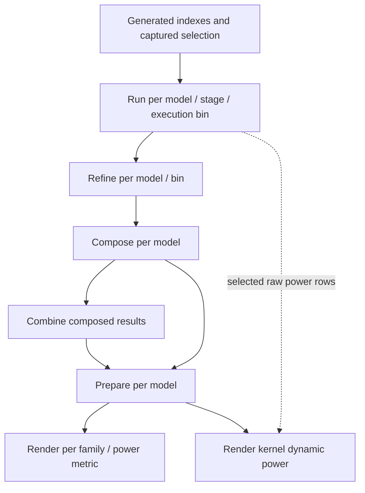
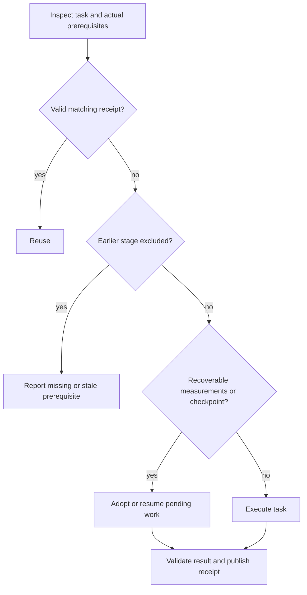
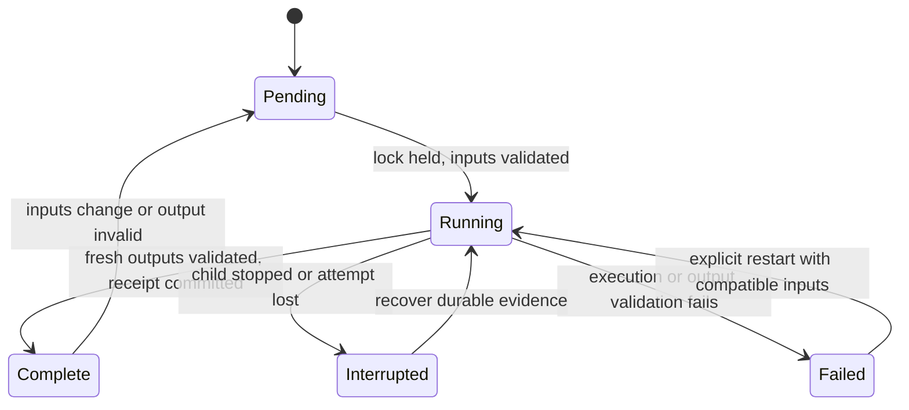
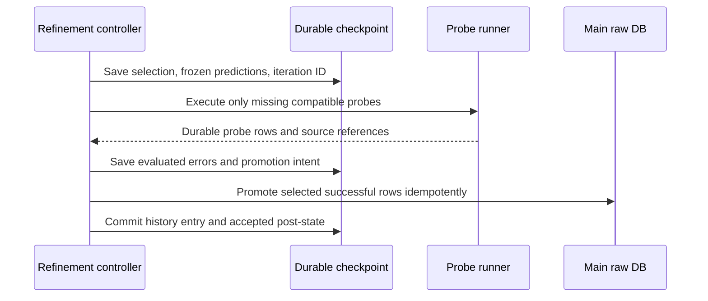

# Resumable Llama Hardware Pipeline - Plan

## Goal Capsule

- **Objective:** An operator can restart an interrupted Llama experiment and obtain current latency, power, and figures without repeating valid FPGA measurements or completed analysis.
- **Means:** Extend `analysis_workspace/latency_on_hw/workflow.py` with the ordered pipeline and verified task reuse defined in KTD1–KTD8.
- **Authority:** Product requirements below govern behavior; technical decisions govern implementation within those requirements. Existing hardware selection and reuse constraints in `agent-tasks/latency_on_hw-refine/plan.md` remain authoritative.
- **Execution profile:** Implement and verify locally with fixture data and controlled subprocess failures before attaching to the existing hardware campaign. This document authorizes no scheduler action by itself.
- **Stop conditions:** Stop before launching dependent work when required measurements, provenance, checkpoints, or outputs cannot be validated. Preserve completed evidence and report a bounded recovery action.
- **Handoff:** The implementer completes U1–U6 and the Verification Contract. Commit, publication, and unrelated RTL changes are outside this plan.

---

## Product Contract

### Summary

Add a single entry point for `run -> refine -> compose -> prepare -> plot`.
Its default behavior resumes completed work using validated inputs and outputs, and explains every execute, reuse, and blocked decision.
Stage-range selection supports finishing an existing experiment without silently starting earlier hardware work.

### Problem Frame

The current shell campaign omits refinement and plotting.
Its individual tools have different notions of completion, and some report process success despite missing measurements or figures.
Restarting everything wastes FPGA time; skipping by file existence can publish results from an earlier experiment.

### Requirements

**Execution and compatibility**

- R1. Execute the five stages in order for selected Llama2/Llama3 models, with generated workload indexes as an explicit prerequisite.
- R2. Preserve `workflow.py run` and `suite`, physical execution deduplication, C2 kernel reuse, candidate snapshots, and trusted PKL payload support.
- R3. Reuse only results that satisfy the requested measurement capabilities and compatible physical acquisition settings; never fabricate missing historical provenance.
- R4. A completed task requires validated outputs, not merely exit code zero or existing files.

**Recovery and freshness**

- R5. Resume interrupted refinement from its durable iteration, preserving completed probes, original error predictions, convergence evidence, and consumed iteration budget.
- R6. Reuse downstream results only while their actual input content and effective settings remain compatible, at the granularity in KTD7.
- R7. An unchanged restart launches no hardware wrappers or analysis/render subprocesses for verified completed tasks.
- R8. Prevent concurrent writes to shared experiment outputs and preserve completed evidence across interruption and publication failure.

**Operator control**

- R9. Stage ranges never execute earlier stages implicitly; stale prerequisites produce an actionable error.
- R10. Dry-run and status inspect existing state without producing artifacts, acquiring hardware, or executing stage commands.
- R11. Report bounded refinement outcomes separately from execution failures, and retain consumed budgets on unchanged restart.
- R12. Existing campaign results can be adopted from sufficient recorded evidence without requiring receipts that did not exist when they were measured.

### Key Decisions

- **Retain C2 reuse.** Governs R2. (session-settled: user-directed — chosen over executing C2 GEMMs on the newly registered C2 image: retain the existing C1/C3/C4 reuse.)
- **Resume by default.** Governs R3–R7. Recovery should conserve completed work while refusing stale or incomplete results.
- **Keep bounded refinement.** Governs R11. Budget exhaustion is a reported accuracy outcome; strict convergence is an optional downstream gate.

### Scope Boundaries

In scope: one local Python pipeline, strict measurement reuse, refinement checkpoints, verified postprocessing reuse, and updating the existing shell entry points to use the same experiment settings.
The existing measurement algorithms, sampling defaults, C1–C4 mapping, and result formulas remain unchanged except where recovery requires recording or validating their inputs.

**Deferred to follow-up work:** power-only repair of a partially completed latency-plus-power execution; build caching; per-suite compose caching; per-figure prepare caching; general workflow-engine features; automatic reuse across arbitrary historical experiments.
Whole-execution rerun is acceptable when one required component is incomplete.

**Outside scope:** RTL changes, changing FPGA aliases globally, generating replacement workloads automatically, replacing CSV with a database, scheduling C2 measurements, or claiming power interpolation accuracy from latency-only refinement.

### Acceptance Examples

- AE1. Covers R4, R7. Given a completed unchanged experiment, restarting the pipeline validates receipts and launches no stages.
- AE2. Covers R3, R4. Given a passing latency-only row, a latency-plus-power run marks the execution pending; a zero-exit runner that leaves it incomplete stops the pipeline.
- AE3. Covers R5. Given completed probes promoted before a crash, restart finalizes the saved iteration with its original predictions, without measuring those probes again.
- AE4. Covers R6. Given changed Llama2 measurements, the affected compose and prepare tasks regenerate; valid Llama3 model tasks remain reusable.
- AE5. Covers R9. Given stale refinement evidence, `--from compose` fails with a repair instruction and does not launch measurements.
- AE6. Covers R11. Given three consumed iterations and an unmet target, an unchanged restart consumes none; increasing the limit to five permits at most two additional completed iterations.
- AE7. Covers R2, R6. Given historical untagged results alongside a current experiment, all requested figures use the current experiment inputs, including the raw-data power plot.
- AE8. Covers R8. Given two invocations that resolve to the same output roots, only one may write even when their tag names differ.

Product Contract preservation: the previous plan's scope is retained; requirements and acceptance examples now give its behavior stable identifiers.

---

## Planning Contract

### Existing Behavior and Evidence

| Component | Current behavior | Planning consequence |
| --- | --- | --- |
| `runner.py` default skip helpers | Match pass, xclbin SHA, app, normalized args; generic skip settings intentionally exclude warmup/iterations | Add a strict policy without silently changing legacy behavior |
| `runner.py` generated run script | Can end with `exit 0` after case failures or retry exhaustion | Validate required rows after every hardware task |
| `runner.py` dry-run and all-skipped paths | Write snapshots/latest artifacts; all-skipped execution may still enter hardware setup | Pure pipeline inspection and empty-pending adoption must bypass the runner |
| `interpolation.py` | Restores promoted measurements but initializes history, selections, and RNG anew | Add recovery state distinct from existing progress reports |
| `run_compose.py` | Recomputes both models; validates completeness and emits manifests | Reuse `compose_model` with model-specific execution and combined aggregation |
| `prepare.py` | Force-rebuild is enabled; parallel mode may substitute model-specific sibling CSVs | Pass exact model receipt inputs and cache completed models externally |
| `plot.py` | Individual families exist; some missing-input paths return success | Validate each attempt's expected outputs before publication |
| `plot.py` raw power graph | `kernel_dynamic_power` reads hardcoded historical raw roots | Add explicit current raw inputs and snapshot filtering |
| `raw_db.py` | Replaces whole matching rows using a shared temporary path | Serialize writers; defer partial-component merge |

The prior investigation's synthetic CSV check found that the default skip accepts both a passing latency-only row and a passing row with empty metrics.
Optional flag/sample columns reject the first but not the second.
This is evidence about the helper's behavior, not a claim that current campaign data is corrupt.
No execution experiment is needed to establish the source-level gaps above.

### Key Technical Decisions

- KTD1. **Keep the existing entry point and use one local orchestration module.** `workflow.py` owns CLI dispatch; proposed `analysis_workspace/latency_on_hw/pipeline.py` owns planning, receipts, and stage adapters. Existing stage implementations retain their algorithms. This avoids turning the small index helper into another implementation of each stage. Governs R1, R2. A general workflow engine was considered unnecessary because the five-stage dependency graph is fixed.
- KTD2. **Use typed, versioned completion records.** An atomic JSON receipt records a stable task key, effective parameters, actual input identities, expected output manifest, validation result, attempt identity, times, exit code, and logs. Store these under `analysis_workspace/latency_on_hw/pipeline_state.<tag>/`; a missing or incompatible receipt cannot certify completion. Reuse existing atomic-write patterns rather than adding a transaction database. Governs R4, R6–R8.
- KTD3. **Separate physical identity, acquisition compatibility, and experiment identity.** Keep `make_exec_key` and the raw writer's key unchanged. Compare expected xclbin SHA, normalized command, captured config/clock, and measurement settings independently of the full candidate-map digest. The digest also includes unused C2 and alias paths, so it must not alone force remeasurement of unchanged hardware. Preserve original row provenance on adoption. Governs R2, R3, R12.
- KTD4. **Use one strict measurement evaluator in planning and execution.** Add an opt-in runner policy/helper used by pipeline preflight, the actual skip path, and post-run validation. Existing generic CLI defaults stay unchanged. Resolve exact required execution coverage and compatible rows once per task, using the same selected evidence downstream. Governs R3, R4, R7.
- KTD5. **Treat refinement as a recoverable protocol.** Persist an active iteration before executing it, then recover probes, promote idempotently, and commit its history once. The protocol and change rules below own all checkpoint behavior. Existing `state.json` remains a readable progress view derived from the recovery state. Governs R5, R11.
- KTD6. **Lock canonical output resources and supervise child processes.** Acquire locks for canonical output roots in a deterministic order, not just a tag-specific state directory. Resolve conflicts involving shared raw roots and configured hardware build directories before writing. Hold ownership until stage children finish or are terminated and reaped; a stale `running` receipt is not proof that its writer is gone. An existing external campaign must finish before adoption. Governs R8–R10.
- KTD7. **Cache stage-owned work and fingerprint consumed content.** Use the task/input matrix below. Capture relevant source/config content and effective options, not the whole Git revision or manifest. Publish postprocessing from isolated attempt directories, validate fresh outputs, then write completion records last. This prevents stale files from satisfying an otherwise empty rerun. Governs R4, R6, R7.
- KTD8. **Give the raw-data power figure an explicit data contract.** Pass index-discovered raw DBs and the captured experiment snapshot to `plot.py`; filter before dropping provenance columns. Include consumed raw power rows in this plot's receipt. `--prepared-root` alone does not constrain this graph. Governs R2, R6.
- KTD9. **Adopt old artifacts only through recorded evidence.** Use the adoption policy below; unknown provenance is neither automatic compatibility nor permission to remeasure. New receipts retain an assurance level and original evidence references. Governs R3, R12.

### Measurement Compatibility and Adoption

A strict reuse decision evaluates available capabilities rather than equality of measurement flags.
A latency-plus-power result can satisfy latency-only refinement; the converse cannot satisfy a base measurement request.
Required numeric fields must be finite and meet the existing measurement validity policy.
Power requires the metrics consumed by compose/prepare and sufficient samples; do not introduce a positive-only constraint on dynamic power.

Compatibility includes warmup/iterations, measurement arguments, selected FPGA/config/clock, effective power acquisition settings, and idle policy where applicable.
Timeouts, retry limits, logging paths, workers, and progress intervals do not invalidate a successful observation.
Sample sufficiency is a threshold comparison, so lowering the minimum does not force a rerun.
New measurements capture relevant application/build-input identity separately from orchestration source fingerprints; changing checkpoint/reporting code alone must not discard hardware observations.

| Evidence state | Decision | Effect |
| --- | --- | --- |
| Valid current receipt and compatible observed fields | Reuse | No stage subprocess |
| No receipt, complete rows and sufficient matching run/suite manifests | Adopt | Write a receipt under the output lock, preserving original evidence |
| Acquisition data is provably incomplete or incompatible | Pending | Rerun only required executions when run is inside the selected range |
| Required acquisition metadata is missing or contradictory | Blocked metadata | Explain missing fields; do not guess or launch hardware automatically |
| Historical application-source identity alone is unavailable | Legacy provenance | Require explicit `--adopt-legacy`; retain the limitation in the receipt |

`--adopt-legacy` does not waive SHA, config, numeric completeness, settings contradictions, or sample requirements.
Never derive a historical source hash from today's files.
Use immutable run manifests, captured experiment snapshots, original probe paths, and raw/log references rather than `latest` or a synthetic `interpolation_refine` run ID.
The exact supported historical manifest fields must be mapped during U2; insufficient evidence stays a reported block.

Changing the candidate map requires fresh generated suites and the existing live-selection checks before any new hardware execution.
For reuse into that new experiment, unchanged physical observations may remain compatible under KTD3.
A downstream-only stage uses its captured snapshot and does not require the live map or configured FPGA build to remain available.

### Task and Dependency Shape

The pipeline keeps stage barriers: complete selected run tasks before refine, then compose, prepare, and plot.
The raw-power edge declares a data dependency; it does not authorize rendering before the plot stage.
For this plan, C2 creates no execution task; future C2 scheduling remains outside scope.

| Task | Required input and reuse identity | Completion evidence |
| --- | --- | --- |
| Run model/stage/bin | Required measured execution set, compatible acquisition contract | Selected passing rows and original run evidence |
| Refine model/bin | Suite/sampling epoch, relevant accepted anchors, saved active iteration | Recovery checkpoint plus terminal kernel outcomes |
| Compose model | Logical suite payloads, effective consumed raw rows, compose options/code | Complete model CSV, summary, manifest |
| Combine | Selected model compose outputs | Valid combined CSV and manifest |
| Prepare model | Exact model composed path from its receipt, preparation settings/code | Declared CSV output set and provenance manifest |
| Plot family/metric | Exact prepared CSV set, rendering settings/code and requested formats | Fresh expected images plus render manifest |
| Kernel dynamic power | Current selected raw power rows and captured snapshot, render settings | Fresh requested images and aggregate-data outputs |

Do not fingerprint the entire mutable raw DB as a run task's output: refinement adds rows to it.
Validate base-run coverage independently and maintain refinement's accepted post-promotion observations separately from its frozen pre-measurement predictions.
For analysis tasks, compute deterministic identities from rows actually selected under the stage's matching policy.
Do not let timestamps, appended unrelated rows, or CSV row order invalidate compatible observations; retain those fields as provenance.

Each prepare task receives its validated model-specific composed path with one model selected and one worker inside that process.
The pipeline may parallelize independent model tasks, but it must not rely on `prepare.py` silently finding a sibling CSV.
Plot family tasks reuse `ALL_PLOTS` and the existing energy-metric list rather than maintaining a second drifting catalogue.
Split rendering into explicit family/metric invocations, and enumerate the selected models and formats required by each.

### Reuse Decision and Publication

For a task inside the selected range, missing required metadata follows KTD9 instead of falling through to execution.
Adoption of excluded run prerequisites is allowed only when the same validation proves their completion; it launches no earlier stage.
Derived artifacts without trustworthy receipts are rebuilt when their producer is in range.

Postprocessing writes to an isolated attempt directory.
Record the expected outputs before invoking the child; a missing CSV or a no-op plot cannot reuse an old image to finish the attempt.
Keep the previous published outputs until the new attempt validates, then publish and commit the new receipt last.
A crash during multi-file publication leaves an incomplete attempt that is recovered or republished before dependent stages run.
This does not promise a transaction to external programs that read files without consulting receipts.

### Refinement Checkpoint Protocol

The checkpoint is restored before unresolved-candidate discovery.
It contains suite/sampling identity, physical kernel, iteration number, selected execution keys, frozen predictions and anchor values, probe DB location, original run references, and the current durable phase.
Persist random selection state or a deterministic remaining order when the existing random strategy is selected.

Recover successful probes even after SIGTERM or abrupt process loss, without relying on the current Python exception handler having run.
Finish the active iteration once, including probes already promoted to main raw DB, and preserve its original errors.
If required probes fail or are missing, mark the attempt interrupted/failed and retain that iteration for retry; it does not consume a second completed iteration.
Existing raw writes remain serialized through KTD6.

Checkpoint compatibility is explicit:

| Change | Recovery decision |
| --- | --- |
| Unchanged inputs and policy | Restore active iteration or terminal outcome |
| Maximum iterations increases | Preserve completed count; permit only the added allowance |
| Maximum iterations decreases below consumed count | Launch no new probes; report existing outcome/budget |
| Error target changes | Reevaluate saved compatible errors; continue only if unmet and budget remains |
| `--require-convergence` changes | Reevaluate the downstream gate only |
| Strategy, seed, validation sample count, or applicable suite changes | Start a new validation epoch; retain reusable physical observations |
| Relevant externally supplied anchor values change | Invalidate convergence for affected kernels; freeze a new epoch baseline |
| New rows from this checkpoint's own promotions | Accept the recorded post-state; do not invalidate its epoch |
| Unrelated raw rows change | Keep checkpoint and convergence |

Terminal kernel outcomes are `converged`, `no_candidates`, `budget_exhausted`, and `unbracketed`.
Execution failures remain `failed` or `interrupted`.
Default bounded behavior may proceed after a nonconverged terminal outcome, with its warning retained in pipeline reports.
`--require-convergence` accepts `converged` or `no_candidates` and blocks on the others without consuming extra budget.
Any successful completion claim also requires all applicable kernels to have a defined terminal outcome.

A pre-checkpoint refinement archive may supply reusable physical probe observations, but its report-only `completed` state cannot certify restored convergence or consumed budget.
Do not overwrite that archive; explicitly report when a new validation epoch is required.

### CLI Contract

The following options are proposed, not yet implemented.
`pipeline --tag TAG` resumes by default; model selection initially supports `llama2` and `llama3` and defaults to both.
Use one settings resolution for suite size, model roots, build directories, candidate selection, and refinement policy across all stages.
Explicit CLI settings take precedence over supported environment defaults; record the effective result.

| Option | Behavior |
| --- | --- |
| `--from STAGE`, `--to STAGE` | Inclusive range; validate excluded prerequisites without executing them |
| `--rerun STAGE` | Re-enter that stage while retaining valid case/probe reuse and refinement budgets |
| `--adopt-legacy` | Allow only the historical source-identity limitation described in KTD9 |
| `--require-convergence` | Apply the strict terminal-outcome gate |
| `--dry-run` | Print resolved tasks, dependencies, reuse/pending/block reasons without mutations |
| `--status` | Inspect recorded and actual state without launching work |

Reject reversed ranges and a rerun stage outside the selected range.
`--from compose` requires valid terminal refinement evidence; it is not a refinement bypass.
There is no generic `--force` that silently disables hardware reuse.
Explicit physical remeasurement is deferred to existing standalone measurement commands, which must run outside an active pipeline writer.

Dry-run/status must not call the existing runner's mutating dry-run implementation.
When every required execution is reusable, adopt/complete the task without entering Slurm or programming the FPGA.
Only tasks with pending hardware work require hardware/build preflight.

### Assumptions and Implementation-Time Checks

This pipeline targets the existing Linux/Slurm workspace and its filesystem.
Verify process-lifetime locking, filesystem atomic replacement, and child cleanup with local fixture processes during implementation; these are deployment checks, not assumed test results.
New lock-aware entry points cannot retroactively protect an already running old shell script.

Strict application/build provenance for historical rows may be unavailable.
U2 must inventory the available manifests and report any unresolved metadata before a current campaign is adopted.
No acceptance rule may fill missing historical fields from the present checkout.

---

## Implementation Units

### U1. Add task planning, receipts, and resource ownership

**Goal:** Represent and inspect resumable work without invoking stage implementations.

**Requirements:** R4, R6–R10; KTD1, KTD2, KTD6, KTD7.

**Dependencies:** None.

**Files:** `analysis_workspace/latency_on_hw/workflow.py`; proposed `analysis_workspace/latency_on_hw/pipeline.py`; proposed `analysis_workspace/latency_on_hw/test_pipeline.py`.

**Approach:**

1. Preserve the existing `run` and `suite` parser contracts while introducing pipeline planning and settings resolution.
2. Add typed task records, content identities, canonical resource locks, and atomic receipt publication.
3. Separate read-only inspection from adoption/execution, with explicit decisions and reasons per task.

**Patterns to follow:** `tools/latency_bench/suite_io.py:indexed_suites` and atomic payload writing; existing `workflow.py` environment and subprocess handling.

**Test scenarios:**

- Covers AE1. Matching inputs and output manifests produce reuse with no child commands.
- Covers AE8. Different tags with overlapping canonical raw roots cannot both acquire write ownership.
- Dry-run/status leave a nonexistent output root nonexistent and do not update `latest`.
- A corrupt/unsupported receipt or missing output becomes pending/blocked rather than complete.
- An interrupted child retains resource ownership until cleanup; stale process metadata does not permit a second writer.
- Existing `run`/`suite` invocations retain argument forwarding and index selection behavior.

**Verification:** The task planner explains decisions without hardware access, and completion cannot be forged by an existing output filename.

### U2. Implement strict measurement reuse and campaign adoption

**Goal:** Reuse complete compatible physical measurements and expose the exact remaining work.

**Requirements:** R2–R4, R7, R12; KTD3, KTD4, KTD9.

**Dependencies:** U1.

**Files:** `tools/latency_bench/runner.py`; `tools/latency_bench/cli.py`; `tools/latency_bench/test_raw_db.py`; `tools/latency_bench/test_candidate_workflow.py`; `analysis_workspace/latency_on_hw/pipeline.py`; `analysis_workspace/latency_on_hw/test_pipeline.py`.

**Approach:**

1. Introduce one additive strict policy for planning, actual runner skip, and post-run checks; preserve legacy defaults and their tests.
2. Record a compatibility allowlist and evidence references, separate from scheduling/reporting options.
3. Adopt existing compatible rows and manifests; classify missing metadata per KTD9 without rewriting source provenance.
4. After each bin task, validate required execution coverage even when the process returned zero.

**Execution note:** Add characterization and failing completeness fixtures before changing skip behavior.

**Patterns to follow:** `build_execution_units`, `make_exec_key`, `find_existing_pass_exec_keys`, `validate_run_selection`, and existing manifest fields.

**Test scenarios:**

- Covers AE2. Latency-only, insufficient-sample, nonfinite, and empty-metric rows cannot satisfy a latency-plus-power request.
- Valid latency-plus-power satisfies latency-only; lowered sample minimum and changed timeout/logging do not force work.
- Changed acquisition settings/config reject reuse while legacy default behavior remains covered.
- A changed unused C2 mapping requires a new snapshot but does not itself invalidate unchanged compatible physical measurements.
- Missing historical source identity is reported honestly; `--adopt-legacy` cannot waive a missing power metric or conflicting SHA.
- A zero-exit stub with failed/missing cases stops before refinement.
- All reusable cases bypass build validation and hardware wrappers; pending cases use the same strict predicate in the runner.

**Verification:** Fixtures prove both false-skip prevention and no remeasurement from irrelevant metadata changes.

### U3. Make refinement iteration recovery durable

**Goal:** Resume probes and convergence evaluation across each interruption boundary.

**Requirements:** R5, R11, R12; KTD5, KTD6, KTD9.

**Dependencies:** U2.

**Files:** `tools/latency_bench/interpolation.py`; `tools/latency_bench/test_interpolation.py`; `analysis_workspace/latency_on_hw/run_interp_refine_example.sh`; `analysis_workspace/latency_on_hw/pipeline.py`; `analysis_workspace/latency_on_hw/test_pipeline.py`.

**Approach:**

1. Add a versioned recovery checkpoint behind the existing refinement entry point, following the protocol in KTD5.
2. Preserve original probe run references and frozen prediction evidence through promotion.
3. Derive report CSVs/state from durable history and expose terminal outcomes to the pipeline.
4. Update the example wrapper to current tag/index/PKL selection and compatible probe reuse, retaining latency-only refinement.

**Patterns to follow:** `write_candidate_suite`, `run_measurement_command`, `promote_probe_rows`, and existing interpolation evaluation helpers.

**Test scenarios:**

- Covers AE3. Inject interruption after selection, partial probes, all probes, promotion, and checkpoint commit; resume measures no already successful probe and commits exactly one iteration.
- Restored prediction errors equal uninterrupted evaluation, including when selected keys already exist in the main raw DB.
- Covers AE6. Budget 3 to 5 permits at most two further completed iterations; unchanged exhaustion launches none.
- Changed target/strictness reevaluates the gate without resetting physical measurements; changed sampling identity creates a documented epoch.
- Self-promotions and unrelated rows do not invalidate convergence; changed relevant external anchors do.
- Missing probes despite exit zero remain failed/incomplete; partial iteration consumes no extra completed-iteration budget.
- Random strategy resumes its sequence; a legacy progress-only archive is never mistaken for a recovery checkpoint.

**Verification:** Every saved boundary resumes to the same evaluation and measurement count as uninterrupted execution under the same inputs.

### U4. Add verified postprocessing adapters and current power-plot inputs

**Goal:** Cache complete model/render tasks without publishing stale results.

**Requirements:** R2, R4, R6, R7; KTD7, KTD8.

**Dependencies:** U1.

**Files:** `analysis_workspace/latency_on_hw/run_compose.py`; `analysis_workspace/latency_on_hw/prepare.py`; `analysis_workspace/latency_on_hw/plot.py`; `analysis_workspace/latency_on_hw/test_composed_pipeline.py`; proposed `analysis_workspace/latency_on_hw/test_pipeline.py`; `analysis_workspace/latency_on_hw/pipeline.py`.

**Approach:**

1. Add minimal model selection/aggregation hooks around existing compose logic and emit explicit artifact manifests.
2. Invoke prepare with the exact validated model input and declared output list, keeping existing rebuild internals.
3. Enumerate current render families/metrics/formats and publish only outputs validated in the new attempt directory.
4. Add explicit raw DB/snapshot inputs for `kernel_dynamic_power`, using existing snapshot filtering before reducing columns.

**Patterns to follow:** `compose_model`, `_validate_complete_composed`, `_validate_prepare_composed`, `ALL_PLOTS`, and current plot family functions.

**Test scenarios:**

- Covers AE4. One changed model regenerates its analysis; the other model's receipts remain valid.
- A stale sibling model CSV cannot replace the exact receipt-selected prepare input.
- Covers AE7. Historical raw directories coexist with current inputs; the power plot reads only the latter and filters wrong images.
- Missing prepared input plus old images cannot satisfy a no-op successful renderer in a fresh attempt.
- A missing requested PDF or CSV prevents completion even when another format exists.
- Publication interruption cannot produce a reusable receipt for a partially replaced artifact set.
- A forced prepare that produces identical CSV content leaves matching plot receipts reusable.

**Verification:** Each output records its actual inputs, and all selected figures are produced for the current experiment without relying on legacy paths.

### U5. Connect the full pipeline and stage-range recovery

**Goal:** Expose the ordered, automatically resumable operator flow.

**Requirements:** R1, R4–R12; KTD1, KTD2, KTD6, KTD7.

**Dependencies:** U2, U3, U4.

**Files:** `analysis_workspace/latency_on_hw/workflow.py`; `analysis_workspace/latency_on_hw/pipeline.py`; `analysis_workspace/latency_on_hw/test_pipeline.py`; `analysis_workspace/latency_on_hw/run_compose_example.sh`; `analysis_workspace/latency_on_hw/run_prepare_example.sh`; `analysis_workspace/latency_on_hw/run_plot_example.sh`.

**Approach:**

1. Execute the stage graph with barriers and per-task completion, preserving successful siblings when another task fails.
2. Apply the CLI range/rerun rules and validate excluded upstream prerequisites.
3. Supervise stage subprocesses and publish per-task logs plus a final summary of reuse, attempts, accuracy outcomes, and failures.
4. Align example wrappers with the same experiment settings without recursive wrapper calls.

**Test scenarios:**

- Covers AE1. A complete fixture flow followed by an unchanged restart launches no measurement or postprocessing commands.
- Failure in the second model or one render task preserves and reuses completed sibling tasks.
- Covers AE5. Stale prerequisites under `--from compose` fail before any hardware action.
- `--rerun refine` preserves terminal budgets; reversed ranges and out-of-range rerun are rejected.
- Toggling `--require-convergence` changes the gate without launching probes.
- Child termination leaves recoverable state and no orphan writer, and an external active writer blocks execution.

**Verification:** Integration fixtures prove the requested operator flow, including interruption and replay, without accessing FPGA hardware.

### U6. Document and adopt the existing campaign safely

**Goal:** Make the new flow usable with existing results and Slurm allocation.

**Requirements:** R2, R8, R9, R12; KTD6, KTD9.

**Dependencies:** U5.

**Files:** `analysis_workspace/latency_on_hw/README.md`; `agent-tasks/latency_on_hw-refine/run_campaign.sh`; `agent-tasks/latency_on_hw-refine/verification.md`; `agent-tasks/latency_on_hw-refine/STATUS.yaml`; `analysis_workspace/latency_on_hw/test_pipeline.py`.

**Approach:**

1. Reduce the shell campaign to repository/allocation setup and the Python entry point; retain the existing Slurm spool-path handling.
2. Document full flow, resume/ranges, metadata blocks, refinement accuracy outcomes, and the difference between re-entering a stage and physical remeasurement.
3. Inspect the old campaign's live writer state and stored measurement evidence before a dependent refine-through-plot run is scheduled.
4. If the old campaign failed only during compose/prepare, use raw completeness to determine recovery rather than treating its scheduler exit alone as proof that measurements are unusable.

**Test scenarios:**

- A spooled batch wrapper resolves the repository independently of its copied script location.
- Adoption fixtures reuse completed base rows while refusing incomplete ones or unresolved metadata.
- An active legacy writer prevents mutation even though it does not use new locks.
- No stage invocation changes C2 routing, global aliases, or source workloads.

**Verification:** The documented path can finish refinement through plotting from existing valid measurements without canceling or repeating the base campaign.

---

## Verification Contract

Implementation starts with small fixture suites, raw rows, manifests, and stub subprocesses; failure injection must exercise filesystem publication and child ownership rather than only mock return values.
Use the repository's Python `unittest` conventions and the test files listed under U1–U6.
No hardware measurement is required to prove orchestration or restart behavior.

| Proof | Required evidence |
| --- | --- |
| Measurement correctness | Strict and legacy skip fixtures pass; missing metrics and mismatched identity never produce false completion |
| Resume savings | AE1 and AE3 count zero repeated successful executions/probes |
| Refinement correctness | Errors and completed iteration counts match uninterrupted fixtures at every saved boundary |
| Freshness | Input-specific invalidation and raw-power plot provenance pass U4/U5 integration fixtures |
| Ownership/durability | Competing local writers, child termination, and interrupted publication are exercised |
| Compatibility | Existing routing/PKL/snapshot/interpolation/composed-pipeline tests relevant to the changed paths pass |
| Operational adoption | Read-only audit identifies pending work and provenance limitations before any dependent hardware job |

`agent-tasks/latency_on_hw-refine/verification.md` records pre-existing broad-suite failures and focused baseline passes.
Do not turn this work into unrelated test repair, and do not excuse a new regression as historical without comparing evidence.
Hardware smoke results already recorded there establish the previous mapped-bin work; they do not prove the new resume implementation.

---

## Definition of Done

- U1–U6 satisfy their Verification fields and all acceptance examples have deterministic coverage.
- A completed unchanged restart launches no stages; a failed task resumes only missing work at the specified granularity.
- Every requested output is tied to the current experiment and actual consumed inputs, including raw-power figures.
- Refinement recovery preserves original predictions, successful probes, iteration budgets, and explicit terminal outcomes.
- Existing generic CLI behavior and C2 reuse remain intact; incomplete results cannot bypass the pipeline's strict validation.
- No unowned child processes, abandoned-attempt implementation code, unrelated cleanup, or silent historical-provenance upgrades remain.
- The README explains the full sequence and recovery controls; hardware execution status is recorded separately from this plan.

---

## Sources and Operational Notes

- `agent-tasks/latency_on_hw-refine/plan.md` and `verification.md`: candidate selection, PKL/provenance work, historical validation and Slurm relocation evidence.
- `tools/latency_bench/runner.py`: skip helpers, seeded raw replacement, generated script exit behavior, manifests, and all-skipped execution path.
- `tools/latency_bench/test_raw_db.py`: intentional legacy skip semantics, including settings not present in the generic match key.
- `tools/latency_bench/raw_db.py`: whole-row replacement and shared temporary CSV publication.
- `tools/latency_bench/candidate_map.py`: experiment-wide digest, live selection validation, and expected-SHA composition filtering.
- `tools/latency_bench/interpolation.py`: selection/evaluation/promotion boundaries and existing report-only state.
- `analysis_workspace/latency_on_hw/prepare.py`: force-rebuild defaults and per-model input substitution.
- `analysis_workspace/latency_on_hw/plot.py`: declared plot families, optional missing-input handling, and historical raw-power roots.

The earlier campaign identifier is job 4935; its activity must be checked at execution time rather than inferred from this document.
Slurm runs a copied batch script, so editing the repository wrapper does not insert refinement into that already submitted job.
A successor runs only after the old writer is quiescent and the measurement/adoption audit passes.
If the old job publishes preliminary compose/prepare artifacts, the new pipeline rebuilds or validates them against refinement-updated inputs before rendering final figures.
