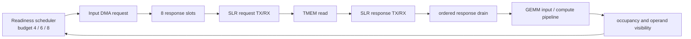

# C4 improve prefill GEMM 성능 저하 원인 분석

작성일: 2026-09-19

## 결론

C4 improve의 저하는 GEMM 연산기 자체의 산술 처리량이 낮아서 생긴 현상이 아니다. `GEMM_SLR_PIPELINE`이 추가한 latency가 Input DMA의 response-slot occupancy와 operand readiness가 돌아오는 제어 경로를 늦추고, 8-slot 기준으로 고정된 readiness scheduler가 input source를 반복해서 멈추는 것이 핵심 원인이다. M256에서 늘어난 33,140 GEMM cycle 중 32,777 cycle, 즉 98.9%가 이 scheduler gate 대기 증가와 직접 일치한다.

즉, FF가 더한 고정 지연 자체는 작지만 그 지연이 아래의 닫힌 feedback loop에 들어간다.

Scheduler는 현재 operand 상태에 따라 Input occupancy budget을 4, 6, 8로 정하고 `occupancy < budget`일 때만 새 request를 허용한다. SLR latency가 operand generation의 visible 시점과 input beat의 drain 시점을 늦추면 occupancy가 이 budget에 더 자주 닿고, 물리 queue가 같은 cycle 또는 다음 cycle에 진행할 수 있어도 scheduler가 source를 끈다. 따라서 추가 latency가 한 번만 더해지는 것이 아니라 긴 GEMM 전체에서 반복적인 bubble이 된다. 이 특성은 실제 prefill 결과에서 projection GEMM의 C4/C3 latency 비율이 sequence length 1k부터 32k까지 약 1.058~1.062로 거의 일정한 것과도 맞는다. 고정된 startup latency가 주원인이면 workload가 커질수록 이 비율은 1에 가까워져야 한다.

## 같은 RTL에서 SLR만 바꾼 비교

비교 설정은 C4와 같은 MXU16/WLOAD4 improve RTL이며, 두 실행의 유일한 기능 설정 차이는 `GEMM_SLR_PIPELINE` 유무이다. 두 경우 모두 numerical check를 통과했다.

| Workload | SLR off GEMM cycles | SLR on GEMM cycles | 증가 |
|---|---:|---:|---:|
| M4, K512, N512 | 6,459 | 8,189 | +1,730 (+26.8%) |
| M256, K512, N512 | 273,807 | 306,947 | +33,140 (+12.1%) |

M4 trace에는 양쪽 모두 4,096개의 input/compute transaction이 있다. 산술 작업량은 변하지 않는다.

| M4 내부 지표 | SLR off | SLR on | 해석 |
|---|---:|---:|---|
| Input DMA source span | 6,056 | 7,704 | compute 이전부터 +1,648 cycle |
| Input DMA destination span | 6,057 | 7,704 | source의 느린 cadence가 그대로 전달됨 |
| Compute-fire span | 6,056 | 7,701 | 입력 공급 cadence를 거의 그대로 추종 |
| 같은 input slot의 대표 재사용 간격 | 11 cycles | 14 cycles | 8-slot ring의 반복 처리율 저하 |

SLR-on에서 compute event 사이에 2~4 cycle 간격이 생길 때도 tree result credit은 3~6개 남아 있었다. 따라서 MXU 결과 FIFO가 가득 차서 연산을 막는 것이 직접 원인은 아니다. 같은 bubble이 `INPUT_DMA_SOURCE`에서 이미 나타나므로 병목은 compute arithmetic 앞쪽의 Input DMA/readiness feedback 경로에서 시작한다.

SLR 설정은 이 경로에 다음 latency를 추가한다.

- TMEM read request와 response 각각에 `VX_slr_mem_bus`의 TX/RX register crossing이 들어간다.
- MXU 입력과 출력에도 각각 2-cycle transport가 들어가고, 이 지연은 GEMM input ready 및 ordered slot release까지의 폐루프 시간을 늘릴 수 있다.
- Input queue는 Weight queue와 달리 early slot release를 사용하지 않는다. Input slot은 `sink_handoff_fire`, 즉 GEMM 쪽이 실제 beat를 받을 때 반환된다.
- Readiness scheduler는 등록된 occupancy와 operand 상태만 보고 4/6/8 budget을 적용한다. `input_ahead_credit`도 budget이 8보다 작을 때 한 slot만 추가할 수 있어 늘어난 왕복 latency를 흡수하지 못한다.

M4에서는 slot reuse의 대표 간격이 3 cycle 늘어난다. 이를 8개 slot 정책에 반복 적용하면 관측된 약 1.6K-cycle source-span 증가와 같은 크기가 된다. M256에서도 이 비용이 많은 input beat에 누적되어 33,140-cycle 차이로 커진다.

## M256 원인별 계측

M256에서 같은 source, 같은 workload에 원인별 counter를 추가해 SLR-off/on을 비교했다. 두 실행 모두 262,144 input transaction과 262,144 compute transaction을 처리했고 numerical check를 통과했다.

| Counter | SLR off | SLR on | 변화 |
|---|---:|---:|---:|
| GEMM cycles | 273,807 | 306,947 | +33,140 |
| Input DMA source queue active cycles | 262,178 | 294,986 | +32,808 |
| Input request blocked while a request was ready | 1 | 32,778 | **+32,777** |
| Input queue `slot_block` | 0 | 0 | 0 |
| Input queue peak physical slots | 5 / 8 | 8 / 8 | +3 |
| Input SLR upstream request block | 1 | 0 | -1 |
| Input SLR downstream request block | 1 | 1 | 0 |
| Compute input block | 1 | 0 | -1 |
| Compute wait | 2 | 3 | +1 |
| Compute tree-credit wait | 0 | 0 | 0 |
| Input-fire span | 270,944 | 304,000 | +33,056 |
| Compute-fire span | 270,942 | 303,997 | +33,055 |

Input queue의 `request_block`은 queue에 발행 가능한 request와 slot이 있지만 `sched_source_enable_i` 또는 downstream ready가 닫혀 있을 때 증가한다. SLR memory bus 쪽 block은 증가하지 않았으므로 +32,777 cycle은 downstream transport backpressure가 아니라 readiness scheduler gate에서 발생했다. 이 한 항목이 전체 GEMM 증가분의 98.9%를 설명한다.

동시에 `slot_block=0`이므로 물리 queue가 free slot을 찾지 못해 직접 멈춘 것은 아니다. SLR-on에서는 occupancy가 8까지 올라갔지만 scheduler가 먼저 source를 제한했다. Compute 쪽도 credit wait가 0이고 총 wait 증가는 1 cycle뿐이다. 따라서 결과 파이프, arithmetic, SLR stream credit은 주병목에서 제외된다.

이번 counter는 scheduler gate와 downstream backpressure를 분리하지만 gate가 멈춘 각 cycle을 4/6/8 budget별로 다시 나누지는 않는다. 따라서 “readiness scheduler gate가 직접 병목”이라는 결론은 확정적이지만, operand-not-ready budget과 full budget 중 어느 항목이 몇 cycle을 차지하는지는 후속 scheduler 전용 counter가 있어야 정확히 분해할 수 있다.

## 왜 이전 16-slot 실험 결과가 같았는가

앞서 `I_LMEM_DMA_RD_OUTSTANDING_SLOTS=16`만 적용한 M256 실행은 PASS했지만 GEMM/core cycle과 perf counter가 8-slot 실행과 완전히 같았다. 이 결과는 16개 slot이 효과가 없다는 증거가 아니다. RTL에서 slot 수가 끝까지 parameter로 전달되지 않기 때문이다.

- 실제 Input DMA queue는 `I_LMEM_DMA_RD_OUTSTANDING_SLOTS`를 받아 16-entry로 커졌다.
- 그러나 `VX_gemm_ctrl.sv`는 readiness scheduler를 `.INPUT_SLOTS(8)`로 고정한다.
- scheduler의 input occupancy port, node 연결, TMEM subsystem 외부 port도 `[3:0]`로 고정되어 있다. 16을 정확히 표현하려면 5 bit가 필요하다.
- scheduler의 small/medium/full budget은 여전히 4/6/8이다. 따라서 물리 queue를 16으로 늘려도 source issue 정책은 8-entry 동작을 유지한다. 이번 M256 counter가 지목한 병목이 바로 이 source gate이므로 cycle이 동일했던 결과도 설명된다.

그러므로 올바른 16-slot 검증은 queue parameter 변경과 함께 scheduler의 `INPUT_SLOTS` 및 occupancy width를 `$clog2(I_RD_OUTSTANDING + 1)`로 연결해야 한다. 이전 실행은 “물리 RAM depth만 늘리고 발행 window는 8로 유지한” 실험이다.

## 수정 후 16-slot 검증

위 parameter 연결을 실제로 수정한 뒤 동일한 M256 workload를 다시 실행했다. GEMM cycle은 306,946에서 274,171로 32,775 cycle(10.68%) 감소했고, core cycle은 312,726에서 279,951로 32,775 cycle(10.48%) 감소했다. 수정 후 결과는 비-SLR 기준 273,807 GEMM cycle보다 364 cycle만 크다. 따라서 8-slot scheduler budget이 SLR 성능 저하의 거의 전부를 만든다는 가설이 실험으로 확인됐다.

M4에서도 GEMM/core cycle이 8,188/13,997에서 8,174/13,922로 감소했으며 numerical check를 통과했다. 16-slot 설정의 source-based 100 MHz PnR도 완료됐고, 최종 timing은 WNS +0.003 ns, WHS +0.005 ns이며 routing error는 0이다. 세부 결과와 xclbin 경로는 `agent-tasks/latency_on_hw-refine/input-slot16-results.md`에 기록했다.

## C3와 C4 비교에 대한 해석

C3 naive와 C4 improve는 backend뿐 아니라 메모리 구조와 queue 크기도 다르다. 현재 C3 config는 naive Input response slots를 16으로 설정하지만 C4 improve config는 8로 설정한다. 따라서 현재 hardware plot은 순수하게 naive와 improve 알고리즘만 비교하지 않는다. C4의 improve 연산 절감 이득에 8-slot SLR feedback 병목이 함께 포함되어 있고, prefill의 큰 GEMM에서는 이 throughput 비용이 improve 이득을 넘어설 수 있다.

현재 증거로 확정할 수 있는 범위는 다음과 같다.

1. C4와 같은 improve RTL은 SLR pipeline을 켜면 동일 workload에서 명확히 느려진다.
2. transaction 수와 numerical result는 같으므로 연산 누락이나 재실행이 원인이 아니다.
3. 반복 bubble은 compute result credit 고갈보다 앞선 Input DMA source 단계에서 시작하며, M256 증가분의 98.9%가 readiness scheduler gate 대기 증가와 일치한다.
4. 물리 slot 부족이나 SLR bus backpressure가 직접 멈춘 것이 아니라, 8-slot 기준의 conservative occupancy budget이 먼저 source를 끈다.
5. slot 재사용 및 operand visible 간격이 늘어나므로 저하는 고정 tail이 아니라 workload 전체에 반복되는 처리율 손실이다.
6. 기존 slot-16 실행은 scheduler가 8로 고정되어 있어 16-slot 가설을 판별하지 못했다.

## 권장 수정 및 검증 순서

1. 완료: Input slot count와 occupancy width를 config에서 scheduler까지 일관되게 parameterize했다.
2. 완료: 수정된 16-slot C4의 M4/M256 xrt-vcs-sim에서 numerical PASS와 cycle 감소를 확인했다.
3. 4/6/8 budget별 gate counter를 추가해 단순 capacity 부족인지 operand-ready 정책의 과도한 throttle인지 구분한다. 후자라면 RAM을 늘리는 것보다 `input_ahead_credit`와 budget 계산을 고치는 편이 작을 수 있다.
4. 완료: 16-slot FPGA PnR가 100 MHz timing과 route를 통과하고 xclbin을 생성했다.
5. 자원 증가가 부담이면 Weight path에서 이미 사용하는 방식처럼 Input response를 local sink stage에 안전하게 capture한 뒤 slot을 일찍 반환하는 방식을 검토한다. 이 경우 stalled sink payload 보존과 same-cycle recycle을 별도로 검증해야 한다.
6. 남는 비용을 분리하려면 TMEM SLR transport와 MXU SLR transport를 독립적으로 켤 수 있는 진단 config를 만들어 각각의 cycle 기여도를 측정한다.

## 재현 자료

- M4 상세 trace: `agent-tasks/latency_on_hw-refine/execution/slr_root_cause_trace/`
- M256 원인별 counter: `agent-tasks/latency_on_hw-refine/execution/slr_root_cause_m256/`
- 기존 16-slot 실행: `agent-tasks/merge-naive-into-gemv/execution/input_slots16_m256/`
- 동일 소스 SLR on/off 기준 결과: `agent-tasks/merge-naive-into-gemv/results.md`
- Llama2/3 plot 입력: `analysis_workspace/latency_on_hw/figure_prepare.th16_20260917/`

모든 원인 분석 실행은 `ci/run_black.sh xrt-vcs-sim`을 사용했고 `DISABLE_FSDB`는 waveform 저장만 끈다. latency observer, numerical check, protocol assertion은 유지했다. 분석용 `DBG_GEMM_ROOT_CAUSE` counter는 결과 수집 후 제품 RTL에서 제거한다.
