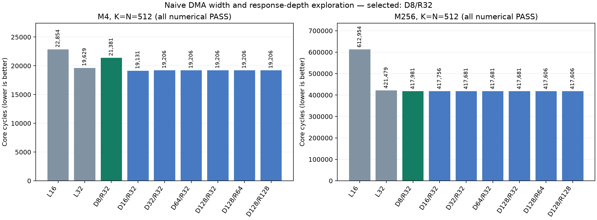
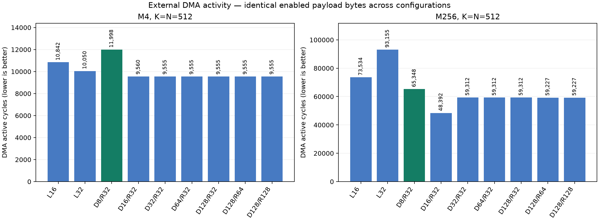

# Naive D256 simulation results

Selected **D8/R32**: response depth 8, DMA outstanding slots 32, response reordering enabled.

M256 core cycles: **417,981**. This is 0.83% lower than L32 (421,479) and 31.81% lower than L16 (612,954).

Selection rule: smallest response depth within 1% of the best valid M256 core cycles, then smallest DMA slot count. M4 is reported separately. All 18 naive application cases below passed numerical verification.

## Cycle results

| Configuration | M4 core | M4 GEMM | M256 core | M256 GEMM |
|---|---:|---:|---:|---:|
| L16 | 22,854 | 16,257 | 612,954 | 606,387 |
| L32 | 19,629 | 13,034 | 421,479 | 414,891 |
| D8/R32 | 21,381 | 14,759 | 417,981 | 411,384 |
| D16/R32 | 19,131 | 12,564 | 417,756 | 411,130 |
| D32/R32 | 19,206 | 12,579 | 417,681 | 411,066 |
| D64/R32 | 19,206 | 12,579 | 417,681 | 411,066 |
| D128/R32 | 19,206 | 12,579 | 417,681 | 411,066 |
| D128/R64 | 19,206 | 12,579 | 417,606 | 411,021 |
| D128/R128 | 19,206 | 12,579 | 417,606 | 411,021 |

L16/L32 retain the original ordered-lane FIFO path. Every D/R entry uses the SRAM reorder path, four fixed DMA-to-cache lanes, and four L1 memory ports. Failed depth-only runs are excluded; their diagnosis is in [README.md](README.md).

## M256 buffering and stalls

| Configuration | DMA active | Cache context max/full cycles | DMA slots max/full cycles | Cache wait | LMEM wait |
|---|---:|---:|---:|---:|---:|
| L16 | 73,534 | No cache splitter | 32 / 27,943 | 14,632 | 33,025 |
| L32 | 93,155 | No cache splitter | 32 / 42,463 | 16,504 | 46,834 |
| D8/R32 | 65,348 | 8 / 33,658 | 32 / 17,193 | 26,269 | 30,898 |
| D16/R32 | 48,392 | 16 / 9,438 | 32 / 13,014 | 16,453 | 20,357 |
| D32/R32 | 59,312 | 22 / 0 | 32 / 18,855 | 15,613 | 31,731 |
| D64/R32 | 59,312 | 22 / 0 | 32 / 18,855 | 15,613 | 31,731 |
| D128/R32 | 59,312 | 22 / 0 | 32 / 18,855 | 15,613 | 31,731 |
| D128/R64 | 59,227 | 22 / 0 | 64 / 14,887 | 16,061 | 33,330 |
| D128/R128 | 59,227 | 22 / 0 | 123 / 0 | 17,765 | 33,330 |

Full-cycle measurements are restricted to DMA-active cycles. Wait counters can overlap and must not be added as disjoint latency components. Requested D128/R32 is tag-limited to 64 effective reorder slots; D128/R64 and D128/R128 have 128. Each splitter has one additional output holding stage.

## Payload and bandwidth

| Configuration / case | DMA active cycles | Enabled read bytes | Aggregate read bytes | Enabled read B / DMA-active cycle | HBM read B / GEMM cycle |
|---|---:|---:|---:|---:|---:|
| L16 / M4 | 10,842 | 180,224 | 180,224 | 16.62 | 10.76 |
| L16 / M256 | 73,534 | 1,376,256 | 1,376,256 | 18.72 | 2.27 |
| L32 / M4 | 10,050 | 180,224 | 180,224 | 17.93 | 13.41 |
| L32 / M256 | 93,155 | 1,376,256 | 1,376,256 | 14.77 | 3.32 |
| D8/R32 / M4 | 11,998 | 180,224 | 573,440 | 15.02 | 11.85 |
| D8/R32 / M256 | 65,348 | 1,376,256 | 2,162,688 | 21.06 | 3.35 |
| D16/R32 / M4 | 9,560 | 180,224 | 573,440 | 18.85 | 13.92 |
| D16/R32 / M256 | 48,392 | 1,376,256 | 2,162,688 | 28.44 | 3.35 |

Enabled read bytes count accepted byte enables, including repeated requested data, and are distinct from unique matrix bytes. Aggregate DMA counters count full wide responses including inactive lanes. HBM figures include all clients and the full GEMM interval, so they are not DMA-only sustained throughput.

The generalized DMA throughput unit test reaches **256 B/cycle for 16 consecutive beats in both directions**. Full-application per-cycle peaks and per-lane traffic are preserved in each `analysis.json`; a peak does not imply sustained 256 B/cycle across the complete workload.

## Interpretation

- The largest end-to-end change is L16 to L32: 31.24% fewer M256 core cycles. External DMA active cycles nevertheless increase from 73,534 to 93,155; DMA counters alone do not predict total GEMM latency when work overlaps and shares LMEM.
- At D8/R32, M256 cache contexts are full for 33,658 DMA-active cycles. At D16/R32 this changes to 9,438. Compare the slot and LMEM wait columns before attributing remaining stalls to HBM.
- D16/R32 reduces M256 DMA-active cycles by 25.95% relative to D8/R32, while total core cycles improve by only 0.054%. This is consistent with most of the external DMA improvement being hidden by overlap with other GEMM work.
- D8/R32 stores at most 5 returned responses per cache lane while its eight contexts saturate. The depth limit primarily restricts outstanding contexts waiting for data, rather than exhausting payload SRAM with already returned data.
- Enabled payload occupies 31.43% of aggregate DMA read bytes in M4 and 63.64% in M256. Widening the DMA does not multiply useful traffic when only some cache lanes are active. All variants transfer the same enabled payload bytes.
- The selected configuration has 65,348 DMA-active cycles versus 411,384 GEMM cycles. Its LMEM wait counter is 30,898; the complete workload is not a continuous external-memory streaming benchmark.
- The fastest M4 D256 case is D16/R32 at 19,131 core cycles. The M256-based selection has 21,381 M4 core cycles. Choose the M4 result explicitly when small-matrix latency is the priority.

## Verification and reproducibility

- Splitter: 29/29 cases passed, including deliberately reordered lane responses, masks, backpressure, tag wraparound, and tag-namespace limits.
- Generalized DMA functional test: 2,126/2,126 passed; 256 B/cycle throughput mode passed both directions.
- Improve: M4 GEMM/core 6,431/12,205; M256 272,856/278,622, exactly matching the pre-edit baseline (zero cycle delta).
- Improve selected RTL: 570/570 comparisons identical. The new helper is excluded from improve preprocessing; no improve synthesis was run.
- Guard/format cleanup preserves selected naive logic tokens (excluding the unused debug label parameter); see `identity/guarded_candidate.json`.

See [README.md](README.md) for implementation, commands, tag-depth limits, and provenance details, including the two baseline simulations launched before the authorized source transition. Raw measurements are in [results.csv](results.csv); the selection is in [selection.json](selection.json). Configuration and RTL hashes, numerical logs, and FSDB evidence are retained under `runs/`.
