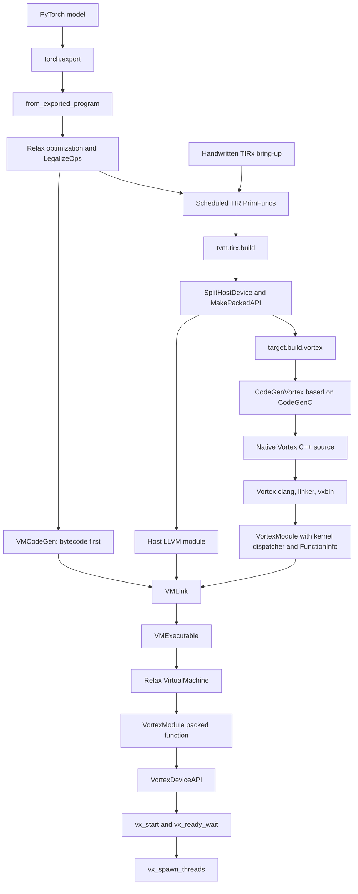

# TVM Relax VM and TIRx Vortex Backend Plan

## Goals

Extend TVM with a Vortex backend that imports a PyTorch model through `torch.export`, lowers Relax operators to scheduled TIRx, generates native Vortex C++ kernels, and executes the complete model with the Relax Virtual Machine.

The direct TIRx path remains the initial backend bring-up path:

```text
handwritten or extracted TIRx
  -> GPU-style thread binding
  -> tvm.tirx.build(target="vortex")
  -> target.build.vortex
  -> CodeGenVortex
  -> Vortex native C++ kernel
  -> Vortex device compiler
  -> kernel binary
  -> VortexModule + VortexDeviceAPI
  -> vx_start
  -> vx_spawn_threads
```

After the TIRx path is proven, the final model execution path is:

```text
PyTorch model
  -> torch.export
  -> relax.frontend.torch.from_exported_program
  -> Relax optimization, LegalizeOps, and TIR scheduling
  -> relax.build / VMExecutable
  -> Relax VirtualMachine
  -> VortexModule packed functions
  -> vx_start
  -> vx_spawn_threads
```

The backend should reuse TVM's CUDA organization and GPU lowering conventions where they fit, while making Vortex hardware limits and its binary-launch model explicit. Relax VM is the final host orchestrator; direct TIRx is a controlled way to validate the backend underneath it.

The first end-to-end milestone is vector addition. A naive matrix multiplication follows after the core path is stable.

## Scope and Non-Goals

### Backend MVP scope

- Register a `vortex` TVM target and an external-device runtime.
- Compile a single scheduled TIRx device kernel into Vortex native C++.
- Support a one-dimensional grid and block for the first executable test.
- Support global-memory buffers, pointer arguments, and basic scalar arguments.
- Support the TIR expressions and statements needed by vector addition.
- Compile generated C++ with the Vortex LLVM/RISC-V toolchain and package the resulting kernel binary.
- Allocate, upload, launch, wait, download, and free through TVM's device/runtime interfaces.
- Enforce thread-block limits from both the target configuration and the opened device.
- Run the resulting `tvm.runtime.Executable` directly to isolate backend failures before VM integration.

### Full-model scope

- Naive matrix multiplication using global memory and serial reduction loops.
- Import a static-shape PyTorch model with `torch.export` and `from_exported_program`.
- Compile the Relax module into a `VMExecutable` and execute `main` with Relax VM.
- Recognize Vortex modules as device modules during Relax VM linking.
- Support multiple named Vortex kernels through a dispatcher or an equivalent explicit binary-selection design.
- Allocate intermediate tensors and model parameters through `VortexDeviceAPI`.
- Validate Relax VM bytecode mode first, then compare `exec_mode="compiled"`.
- DLight or another automatic Vortex scheduling policy.
- Two- and three-dimensional grid/block launch geometry.
- Shared/local memory and barriers as required by model operators.

### Explicit non-goals

- Do not involve Relax VM in the first direct TIRx vector-add milestone; add it only after codegen and runtime launch are independently proven.
- Do not implement or restore Relay Graph Executor, MLF, or a new Relax AOT executor unless measurements later show that Relax VM is unsuitable.
- Do not treat `T.call_kernel` with handwritten external source as the Vortex backend. That flow bypasses TIR-to-Vortex code generation and only validates an external-kernel escape hatch.
- Do not promise arbitrary CUDA source compatibility.
- Do not support dynamic shared memory, streams, asynchronous execution, or multiple Vortex devices initially.
- Do not silently clamp an invalid launch size. Compilation or launch must fail with a diagnostic.

## Verified Current Flow

### TVM

- `tvm.compile` dispatches Relax-containing IRModules to `tvm.relax.build`, but pure TIR modules to `tvm.tirx.build`.
- `tvm.tirx.build` separates host and device functions, calls `target.build.<target-kind>` for device code, imports the device module into the host module, and returns a callable `tvm.runtime.Executable`.
- `Executable.__call__` invokes the compiled `main` function directly. This provides the non-VM execution path needed for the MVP.
- `tvm.relax.build` lowers Relax functions with `VMCodeGen` or `VMTIRCodeGen`, compiles the remaining TIR with `tvm.tirx.build`, and links both into a `VMExecutable`.
- Relax VM bytecode mode interprets model-level instructions. Its compiled mode removes the bytecode dispatch loop but still uses VM runtime state, allocators, builtins, and register-file conventions.
- The current device-module classification in `python/tvm/relax/vm_build.py` does not include `vortex`; VM integration must extend or generalize it.
- The PyTorch `ExportedProgram` importer preserves parameters, buffers, symbolic dimensions, range constraints, and supported control flow in Relax.
- CUDA registers `target.build.cuda`, derives its printer from `CodeGenC`, creates a device module, and supplies a CUDA `DeviceAPI`. These are the primary structural references.
- GPU verification and scheduling utilities use target attributes such as `max_threads_per_block`, `max_shared_memory_per_block`, and `thread_warp_size`.

### Vortex

- Native kernels obtain the launch packet through `VX_CSR_MSCRATCH` and call `vx_spawn_threads`.
- `vx_spawn_threads` supports up to three-dimensional grid and block geometry.
- The launch is rejected when the block's thread count exceeds the hardware execution capacity.
- Host execution uses `vx_dev_open`, memory allocation and transfer APIs, kernel upload, `vx_start`, `vx_ready_wait`, result download, and cleanup.
- Vortex's regression build rules already define the authoritative device compiler, sysroot, feature flags, linker script, `libvortex.a`, and `vxbin.py` packaging sequence.

## Target Architecture



The direct TIRx path enters at the scheduled-TIR node and bypasses `VMCodeGen`/`VMLink`. It is a bring-up and regression path, not the final whole-model executor.

## Key Technical Decisions

### 1. Direct TIRx first, Relax VM for the final execution path

The first tests call `tvm.compile` or `tvm.tirx.build` on a TIR IRModule and invoke the returned executable directly. This isolates target code generation, compiler invocation, argument ABI, memory transfers, and launch behavior.

Once those layers pass, full-model tests must use `tvm.relax.build` and `relax.VirtualMachine`. The VM owns model-level execution order, intermediate values, parameters, shape computations, control flow, and calls to compiled TIR functions. Start with `exec_mode="bytecode"` for debuggability. Test `exec_mode="compiled"` only after bytecode execution is correct; it is an optimization of the VM execution model, not a separate AOT executor.

### 2. Implement real TIR-to-Vortex code generation

`CodeGenVortex` should derive from or reuse `CodeGenC`, following the CUDA backend's organization. It should emit Vortex-compatible C++ for supported TIR nodes and reject unsupported constructs with clear messages.

The generated device translation unit contains:

- the lowered kernel body,
- argument decoding from a stable launch packet,
- a native `main` wrapper,
- a call to `vx_spawn_threads`,
- the required Vortex kernel headers.

The MVP should support only the subset exercised by vector addition: buffer loads/stores, arithmetic, comparisons, casts, conditionals, and thread-bound indices. Matrix multiplication adds serial loops and accumulation after this base is stable.

### 3. Start with one kernel, then add explicit multi-kernel dispatch

TVM commonly models several named functions in a device module, while `vx_start` launches an uploaded binary rather than selecting a symbol. The direct TIRx MVP therefore accepts exactly one externally launchable device kernel and rejects larger modules.

Whole-model Relax execution requires multiple named kernels. Before enabling the Relax VM milestone, implement one explicit design:

- preferred: generate a single Vortex binary containing a `kernel_id` dispatcher in native `main`, and map each `VortexModule::GetFunction(name)` result to a stable ID;
- fallback: create and manage a separate uploaded binary per function, with explicit caching and upload-cost measurement.

Do not hide this selection in process-global state. The launch packet and serialized module metadata must identify the selected kernel deterministically.

### 4. Make hardware limits part of the target contract

Register these attributes on the `vortex` target:

- `num_warps`
- `thread_warp_size`
- `max_threads_per_block`
- `max_shared_memory_per_block`
- `xlen`
- standard target attributes such as `mtriple`, `mcpu`, and `mattr` where applicable

The canonical configuration must satisfy:

```text
max_threads_per_block = num_warps * thread_warp_size
```

This value drives compile-time schedule selection and verification. At runtime, query the actual device capabilities with `vx_dev_caps` and require:

```text
blockDim.x * blockDim.y * blockDim.z
  <= min(target max_threads_per_block, actual device capacity)
```

The target constructor should either derive the maximum from the warp attributes or validate that an explicitly supplied maximum matches them. Vortex must not inherit DLight's generic non-CUDA fallback value by accident.

### 5. Use a versioned, fixed-width launch ABI

Avoid generating a different host C struct layout for every kernel. Define a shared ABI packet using fixed-width integer slots:

```cpp
struct vx_tvm_launch_header_t {
  uint32_t abi_version;
  uint32_t num_args;
  uint32_t kernel_id;
  uint32_t reserved;
  uint32_t grid[3];
  uint32_t block[3];
};

// Followed by num_args uint64_t slots.
// Pointer values and scalar bit patterns are encoded in these slots.
```

Rules:

- Device pointers are encoded as 64-bit addresses.
- Integer and floating-point scalars preserve their bit pattern in a 64-bit slot.
- Kernel metadata records the expected argument type for decoding.
- The runtime validates ABI version, kernel ID, argument count, pointer width, and launch dimensions.
- The packet is allocated in Vortex-visible memory, uploaded before launch, and its address is passed through the mechanism used by `VX_CSR_MSCRATCH`.

Place the shared ABI declaration in the Vortex repository so the generated wrapper and runtime use the same definition.

### 6. Keep ownership boundaries clear

`VortexModule` owns:

- the compiled kernel binary or explicitly indexed per-function binaries,
- the exported-function-name to kernel-ID mapping,
- TVM `FunctionInfo` and argument metadata,
- target metadata required to validate a launch.

`VortexDeviceAPI` owns or coordinates:

- opened Vortex device handles,
- device context selection,
- allocation and address bookkeeping,
- host-to-device and device-to-host transfers,
- synchronization and teardown.

The packed function returned by `VortexModule::GetFunction` validates arguments, constructs the launch packet, uploads the module if needed, and launches through the selected device context.

### 7. Separate the host and device LLVM environments

TVM itself must be built with a supported host LLVM. Generated Vortex kernels must be compiled only with the Vortex LLVM toolchain. Neither toolchain should be selected by ambient `.zshrc` ordering.

### 8. Integrate Vortex as a first-class Relax VM device

Relax VM is the final executor, but it should interact with Vortex only through normal TVM runtime boundaries:

- `tvm.relax.build` lowers model orchestration to VM instructions and TIR;
- `tvm.tirx.build` sends Vortex device PrimFuncs to `target.build.vortex`;
- `VMLink` imports the resulting `VortexModule` into the `VMExecutable`;
- Relax VM allocates intermediate tensors through `VortexDeviceAPI` and resolves named kernels through `VortexModule::GetFunction`;
- CPU remains available for shape and VM builtin computations.

Extend or generalize the current device-module classification so module kind `vortex` is linked as a TIR device module. Do not add Vortex-specific launch logic to the VM instruction interpreter. Backend behavior belongs in `VortexModule` and `VortexDeviceAPI`.

Use VM bytecode mode for the first complete model because its instruction listing is useful for debugging. Once correct, compile and run the same tests with `exec_mode="compiled"` and retain it only if it works reliably and improves measured host overhead.

## Files to Approach

### TVM: existing references

- `python/tvm/driver/build_module.py` — TIR versus Relax build dispatch.
- `python/tvm/tirx/build.py` — host/device split, target build dispatch, and module import.
- `python/tvm/tirx/compilation_pipeline.py` — device lowering and packed API construction.
- `python/tvm/runtime/executable.py` — direct executable invocation.
- `python/tvm/relax/frontend/torch/exported_program_translator.py` — `torch.export` to Relax import, parameters, and symbolic constraints.
- `python/tvm/relax/vm_build.py` — VM codegen, device-module classification, TIR build, and VM linking.
- `src/relax/backend/vm/codegen_vm.cc` — Relax-to-bytecode lowering and allocation/call instructions.
- `src/relax/backend/vm/codegen_vm_tir.cc` — compiled VM execution mode.
- `src/runtime/vm/vm.cc` and `src/runtime/vm/executable.cc` — VM execution and serialization.
- `src/backend/cuda/codegen/codegen_cuda.{h,cc}` — `CodeGenC`-based device printer.
- `src/backend/cuda/codegen/target_kind.cc` — GPU target registration.
- `src/backend/cuda/runtime/cuda_module.cc` — device module and packed function pattern.
- `src/backend/cuda/runtime/cuda_device_api.cc` — runtime device API pattern.
- `cmake/modules/CUDA.cmake` — optional backend build configuration.
- `src/s_tir/meta_schedule/postproc/verify_gpu_code.cc` — GPU resource verification.
- `python/tvm/s_tir/dlight/base/utils.py` — schedule-side thread limit lookup.
- `tests/python/codegen/test_target_codegen_cuda.py` — direct TIR GPU codegen examples.
- `tests/python/codegen/test_target_codegen_device.py` — device target compilation examples.
- `tests/python/target/test_target_target.py` — target parsing and attributes.

### TVM: proposed changes

- `build.sh` — deterministic host build setup; no `.zshrc` mutation.
- `config_cmake.sh` — retain explicit host LLVM validation and improve diagnostics if needed.
- `cmake/modules/Vortex.cmake` — `USE_VORTEX` configuration, sources, include paths, and runtime library linkage.
- `cmake/config.cmake` — document the Vortex build option.
- `src/backend/vortex/codegen/target_kind.cc` — target registration and attributes.
- `src/backend/vortex/codegen/codegen_vortex.{h,cc}` — supported TIR-to-C++ printer.
- `src/backend/vortex/codegen/build_vortex.cc` — `target.build.vortex`, compiler callback, metadata, and module creation.
- `src/backend/vortex/runtime/vortex_module.{h,cc}` — binary module, serialization, function lookup, and launch wrapper.
- `src/backend/vortex/runtime/vortex_device_api.cc` — external-device allocation, transfer, sync, and context handling.
- `python/tvm/support/vortex.py` — device compiler discovery and `tvm_callback_vortex_compile` implementation.
- `python/tvm/support/__init__.py` — expose or register Vortex support helpers.
- `python/tvm/runtime/__init__.py` and related public API files — add a `tvm.vortex()`-style device constructor if required.
- `python/tvm/relax/vm_build.py` — recognize `vortex` as a TIR device module, preferably through a general property rather than another permanent hard-coded exception.
- `tests/python/target/test_target_vortex.py` — target parsing and limit validation.
- `tests/python/codegen/test_target_codegen_vortex.py` — source generation and rejection tests.
- `tests/python/runtime/test_runtime_vortex.py` — module serialization, allocation, transfer, and launch tests.
- `tests/python/integration/test_tirx_vortex.py` — direct vector-add and matrix-multiply integration tests.
- `tests/python/relax/test_relax_vm_vortex.py` — VM linking, multi-kernel execution, allocation, and bytecode/compiled-mode tests.
- `tests/python/relax/test_torch_export_vortex.py` — PyTorch `ExportedProgram` import and whole-model correctness.

The exact public API files should be confirmed against the current external-device registration pattern before editing. The backend source should live under the current `src/backend/<kind>` layout, not a legacy `src/target/source` layout.

### Vortex: existing references

- `kernel/src/vx_spawn.c` — thread-spawn semantics and hardware checks.
- `tests/regression/cta/kernel.cpp` — `main`, `VX_CSR_MSCRATCH`, and `vx_spawn_threads` wrapper pattern.
- `tests/regression/cta/main.cpp` — host allocation, upload, launch, wait, and download sequence.
- `tests/regression/common.mk` — authoritative native kernel compile and packaging recipe.
- `ci/run_black.sh` — canonical Vortex hardware-test entry point and XRT device allocation/detection flow.
- `ci/resolve_fpga_bin_alias.py` and `tools/latency_bench/fpga_bins.py` — `--fpga-bin` path normalization and alias handling.
- `runtime/include/vortex.h` — runtime APIs and capability identifiers.
- `runtime/stub/vortex.cpp` — device, memory, launch, and wait implementation.
- `runtime/stub/utils.cpp` — kernel upload helpers.

### Vortex: proposed changes

- `kernel/include/vx_tvm_abi.h` — versioned launch packet shared with generated kernels.
- `kernel/scripts/compile_tvm_kernel.sh` — stable compiler entry point derived from regression build rules, if no equivalent supported script exists.
- `tests/regression/tvm_codegen/` — generated-wrapper compatibility smoke test, if useful independently of TVM.

## Implementation Plan

### Phase 0: Stabilize the build environment and native baseline

1. Rewrite `build.sh` to derive its own source/build directories and use `cmake -S ... -B ...`.
2. Default `TVM_LLVM_CONFIG` to the verified host LLVM 18 binary while allowing an explicit caller override.
3. Prepend the host LLVM bin directory and remove the Vortex LLVM directory from the TVM host-build `PATH`.
4. Pass explicit `/usr/bin/gcc`, `/usr/bin/g++`, `/usr/bin/cmake`, and Ninja generator settings.
5. Remove the behavior that appends environment changes to `~/.zshrc`. Print the optional runtime exports or generate a repository-local environment helper instead.
6. Configure TVM with LLVM enabled and confirm the cache records host LLVM 18 rather than `USE_LLVM=OFF` or Vortex LLVM.
7. Build the existing standalone Vortex vector-add/CTA sample using the native compiler.
8. Run the existing vector-add application on the U55C hardware with `ci/run_black.sh hw` and the pinned FPGA binary documented in Environment Setting.
9. Record the working compiler command, linker inputs, binary packager, device capability values, XRT device selection, and hardware command.

Exit criteria:

- TVM builds against host LLVM 18.
- No build step modifies `.zshrc`.
- The standalone Vortex kernel still builds and launches on the physical U55C through XRT.

### Phase 1: Register the Vortex target contract

1. Add `TVM_REGISTER_TARGET_KIND("vortex", kDLExtDev)` with `gpu`-appropriate target keys.
2. Register the Vortex-specific and standard GPU resource attributes.
3. Add target canonicalization that derives or validates `max_threads_per_block`.
4. Add Python target tests for valid configurations, missing required attributes, and inconsistent thread limits.
5. Confirm GPU verification reads the Vortex values without special-casing CUDA.

Exit criteria:

- `Target("vortex ...")` parses and round-trips.
- An inconsistent warp/thread configuration fails deterministically.
- A TIR function whose block size exceeds the target maximum is rejected before launch.

### Phase 2: Generate inspectable Vortex C++ from TIRx

1. Add the Vortex codegen class based on `CodeGenC`.
2. Map `threadIdx.x` and `blockIdx.x` to Vortex built-ins used by `vx_spawn_threads`.
3. Emit buffer arguments and the fixed-width ABI decoder.
4. Emit a native `main` wrapper that reads the launch packet and calls `vx_spawn_threads`.
5. Register `target.build.vortex`.
6. Support a compiler callback that can capture generated source in unit tests before an actual device compiler is required.
7. Add golden-pattern assertions for vector-add source and negative tests for unsupported features.

Exit criteria:

- Handwritten scheduled vector-add TIR produces valid-looking Vortex C++.
- Generated source includes the wrapper, correct argument decoding, and correct thread index mapping.
- Unsupported dimensions, node types, or multiple kernels produce actionable errors.

### Phase 3: Compile generated source into a Vortex binary

1. Extract the native compiler sequence from Vortex regression rules into a stable helper or faithfully reproduce it in `python/tvm/support/vortex.py`.
2. Require explicit Vortex toolchain and repository roots; do not infer them from the host `clang` on `PATH`.
3. Invoke Vortex clang with its RISC-V sysroot, Vortex feature flag, kernel headers, linker script, and `kernel/libvortex.a`.
4. Package the linked artifact with `vxbin.py`.
5. Return binary bytes and compilation diagnostics to `target.build.vortex`.
6. Cache only by source, target attributes, ABI version, and compiler identity; caching is optional for the first functional version.

Exit criteria:

- Generated vector-add C++ compiles with the Vortex device toolchain.
- The binary is loadable by the existing Vortex host API.
- A compiler failure includes the preserved command context and stderr without depending on shell startup files.

### Phase 4: Implement `VortexModule` and `VortexDeviceAPI`

1. Add CMake detection and conditional compilation for the Vortex runtime.
2. Implement the external-device API for device open, allocation, free, copies, and synchronization.
3. Keep a validated mapping between TVM device allocations and Vortex-visible device addresses.
4. Implement a module node containing binary bytes, function metadata, target limits, and ABI version.
5. Implement module save/load so a compiled executable can be serialized and restored.
6. Implement `GetFunction` to create the launch packet, validate argument metadata and block size, upload the packet and kernel, call `vx_start`, and wait.
7. Reuse an uploaded binary per device when safe, and define teardown behavior.
8. Add an ergonomic Vortex device constructor in Python only after the underlying `DeviceAPI` registration works.

Exit criteria:

- A TVM NDArray can be allocated on Vortex, populated from the host, copied back, and freed.
- A module survives serialization and preserves its function metadata.
- Invalid argument counts, stale pointers, ABI versions, devices, and launch sizes fail before `vx_start`.

### Phase 5: Run direct TIRx vector addition end to end

1. Define a deterministic one-dimensional vector-add PrimFunc.
2. Bind its outer loop to `blockIdx.x` and inner loop to `threadIdx.x` using a block size below the configured hardware limit.
3. Compile it through the normal `tvm.tirx.build` pipeline, not by calling codegen internals from the test.
4. Allocate inputs and output through the Vortex device API.
5. Invoke the returned `tvm.runtime.Executable` directly.
6. Compare against NumPy for boundary sizes, non-multiples of the block size, and multiple valid block sizes.
7. Add one test that exceeds the limit and checks the diagnostic.

Exit criteria:

- Direct TIRx vector addition is numerically correct on the physical U55C using the pinned xclbin.
- The test passes through `SplitHostDevice`, `target.build.vortex`, module import, packed launch, and `vx_start`.
- No Relax VM code is on the execution path.

### Phase 6: Add naive matrix multiplication

1. Lower a simple float32 matrix multiplication to TIR.
2. Schedule output elements over a one- or two-dimensional launch geometry that respects the target maximum.
3. Keep the reduction serial and use global memory only for the first version.
4. Extend CodeGenVortex only for the TIR constructs proven necessary by this kernel.
5. Compare several small and irregular shapes against NumPy.

Exit criteria:

- Naive matrix multiplication is correct without shared memory or barriers.
- Resource checks reject invalid schedules before device execution.

### Phase 7: Add multi-kernel Vortex dispatch

1. Collect all launchable device PrimFuncs and assign deterministic kernel IDs.
2. Generate one native entry wrapper per kernel, including its argument decoder and launch geometry.
3. Generate a native `main` dispatcher that selects the wrapper using `kernel_id` from the launch packet.
4. Store the function-name, kernel-ID, `FunctionInfo`, and launch metadata mapping in `VortexModule`.
5. Make `VortexModule::GetFunction(name)` construct a launch packet with the correct kernel ID.
6. Serialize and deserialize the dispatch table with the binary.
7. Add a two-kernel direct-runtime test before involving Relax VM.

Exit criteria:

- Two named TIR kernels in one compiled module can be selected independently and produce correct results.
- Unknown or mismatched kernel IDs fail before device execution.
- Kernel selection is preserved across module serialization.

### Phase 8: Execute a small Relax program with Relax VM

1. Create a minimal Relax program containing at least two legalized operations and an intermediate tensor.
2. Run the normal Relax pipeline and inspect the generated TIR PrimFuncs and thread bindings.
3. Extend or generalize `_is_device_module` so `VortexModule` is imported into the VM executable as a device module.
4. Compile with `tvm.relax.build(..., exec_mode="bytecode")`.
5. Construct Relax VM with the Vortex device and invoke `vm["main"]`.
6. Verify model parameters, intermediate allocations, kernel lookup, launch order, and final output.
7. Export and reload the `VMExecutable`, then repeat the test.
8. Run the same program with `exec_mode="compiled"` as a compatibility check; bytecode remains the reference mode initially.

Exit criteria:

- Relax VM bytecode mode executes multiple Vortex kernels on the physical U55C and matches NumPy.
- The executable works after serialization and reload.
- VM allocation and cleanup leave no stale Vortex allocations.
- Compiled VM mode either passes the same correctness test or has a documented, isolated limitation.

### Phase 9: Execute a PyTorch-exported model

1. Start with a small inference-only PyTorch MLP whose operators are already covered by the backend.
2. Capture it with `torch.export.export` and import it with `relax.frontend.torch.from_exported_program`.
3. Decide whether parameters remain inputs or are bound into the Relax module, and test the chosen lifecycle explicitly.
4. Compile through the Vortex-aware Relax pipeline and execute with Relax VM bytecode mode.
5. Compare all outputs with eager PyTorch using fixed random seeds and documented tolerances.
6. Add irregular but valid input shapes within the exported constraints where dynamic dimensions are supported.
7. Add a small CNN only after the necessary convolution, layout, and reduction TIR constructs are supported.
8. Compare bytecode and compiled VM modes for correctness, host launch overhead, total latency, and artifact size.

Exit criteria:

- A `torch.export` MLP runs end to end on the physical U55C through Relax VM and matches PyTorch.
- No handwritten TIR or manual kernel invocation is used in this acceptance test.
- Unsupported PyTorch/Relax operators fail at import, legalization, scheduling, or codegen with a clear stage-specific diagnostic.

### Phase 10: Extend capabilities and optimize

1. Add two- and three-dimensional thread bindings and launch validation.
2. Add shared/local memory lowering based on Vortex's memory model.
3. Add barrier lowering and synchronization tests.
4. Add a Vortex-aware DLight schedule that uses explicit target limits.
5. Expand PyTorch model coverage based on unsupported-operator reports.
6. Measure kernel time, upload time, VM host overhead, and transfer time separately.
7. Prefer VM compiled mode only when measurements justify it.
8. Consider a Relax AOT executor only if both VM modes are proven to be a material bottleneck or cannot satisfy the deployment environment.

## Verification Plan

### Build and configuration

- Inspect `CMakeCache.txt` to confirm the exact host `llvm-config`, compiler paths, and `USE_VORTEX` state.
- Verify the Vortex compiler is absent from the host build `PATH` but explicitly used for device compilation.
- Build with `USE_VORTEX=OFF` to ensure the optional backend does not regress ordinary TVM builds.
- Build with `USE_VORTEX=ON` and confirm runtime headers/libraries are resolved from explicit paths.

### Unit tests

- Target parsing, serialization, defaults, and inconsistent resource attributes.
- ABI packing/unpacking for kernel ID, pointer, integer, and floating-point arguments.
- Code generation for indexing, loads, stores, arithmetic, predicates, and serial loops.
- Negative codegen tests for unsupported constructs and, before Phase 7, more than one kernel.
- Multi-kernel dispatcher lookup, unknown-ID rejection, and metadata serialization after Phase 7.
- Runtime validation for allocation ownership, argument metadata, launch dimensions, and device capability mismatches.
- Module serialization and deserialization.
- Relax VM device-module classification and Vortex packed-function resolution.

### Integration tests

- Handwritten TIRx vector addition with small, irregular, and boundary sizes.
- Vector addition with the largest valid block and one invalid block.
- Naive matrix multiplication with small rectangular shapes.
- A direct two-kernel dispatch test independent of Relax VM.
- A two-operation Relax program executed through VM bytecode mode, including an intermediate allocation.
- VM executable export/reload and repeated execution.
- The same Relax program in VM compiled mode as a compatibility and overhead comparison.
- A PyTorch-exported MLP executed through Relax VM and compared with eager PyTorch.

### Execution environments

1. Run every executable integration and acceptance test on the physical U55C through XRT. Hardware is the source of truth for correctness.
2. Use `ci/run_black.sh hw --fpga-bin <path>` as the reference Vortex hardware invocation. New TVM/Vortex regression applications must be wired into this entry point rather than introducing an unrelated launch script.
3. Use `simx` only when a failing hardware test needs additional debugging visibility or a shorter reproduction loop.
4. Do not accept a `simx` result as a substitute for the corresponding hardware result. Re-run and pass the original case on hardware after debugging.

Host-only target/codegen/ABI unit tests may run without hardware, but any test that launches a Vortex kernel must use hardware for its recorded acceptance result. Each execution layer must compare device outputs against a CPU, NumPy, or eager-PyTorch reference and preserve compiler/runtime logs on failure.

## Environment Setting

### Host TVM build

The current shell prioritizes Vortex LLVM through `.zshrc`, so the TVM build must establish its own environment. The verified host compiler configuration is:

```sh
export TVM_LLVM_CONFIG=/opt/conda-pkgs/llvmdev-18.1.8-default_h99862b1_12/bin/llvm-config
export PATH=/opt/conda-pkgs/llvmdev-18.1.8-default_h99862b1_12/bin:/usr/bin:/bin
```

`build.sh` should preserve an explicitly supplied `TVM_LLVM_CONFIG`, otherwise use the path above. It should resolve its paths from the script location and invoke configuration approximately as follows:

```sh
/usr/bin/cmake -S "${TVM_SOURCE_DIR}" -B "${TVM_BUILD_DIR}" -G Ninja \
  -DCMAKE_C_COMPILER=/usr/bin/gcc \
  -DCMAKE_CXX_COMPILER=/usr/bin/g++
/usr/bin/cmake --build "${TVM_BUILD_DIR}" --parallel 32
```

The script must not append to `~/.zshrc`. Python/library paths needed after the build should be printed or placed in a repository-local helper that the developer may source explicitly.

### FPGA hardware runtime

Use this pinned U55C/FPINT hardware binary for Vortex execution tests:

```text
/opt/vortex_fpga_bins/fpint/xrt_hw_u55c_c_f100_fpint_64300e5119/bin/vortex_afu.xclbin
```

The complete directory and file should be recorded explicitly in the test environment:

```sh
export TVM_VORTEX_FPGA_BIN_DIR=/opt/vortex_fpga_bins/fpint/xrt_hw_u55c_c_f100_fpint_64300e5119/bin
export TVM_VORTEX_XCLBIN="${TVM_VORTEX_FPGA_BIN_DIR}/vortex_afu.xclbin"
test -f "${TVM_VORTEX_XCLBIN}"
```

Use `ci/run_black.sh` as the reference hardware launch flow. A known-good Vortex vector-add example is:

```sh
./ci/run_black.sh hw \
  --fpga-bin "${TVM_VORTEX_XCLBIN}" \
  --app vecadd \
  --args="-n 64"
```

`run_black.sh` accepts either the `bin` directory or the full `vortex_afu.xclbin` path; the full path above is preferred because it identifies the exact artifact. In `hw` mode the script selects `DRIVER=xrt` and `TARGET=hw`, resolves the allocated XRT device index/BDF, and uses `srun` to request a U55C when it is not already inside an allocation. Use `--no-srun` only when a suitable hardware allocation is already managed externally.

When the TVM integration test application is added under the Vortex regression tree, invoke it through the same interface:

```sh
./ci/run_black.sh hw \
  --fpga-bin "${TVM_VORTEX_XCLBIN}" \
  --app tvm_codegen \
  --args="<test-specific arguments>"
```

The `tvm_codegen` application name is proposed and must be replaced if a different regression application name is implemented. The test must retain the exact xclbin path, XRT device information, command line, and output log.

### Vortex device compilation

Device compilation must use explicit Vortex locations, for example:

```sh
export VORTEX_ROOT=/home/jaeyongjang/project.local/vortex_base
export VORTEX_LLVM_PREFIX=/opt/vortex/llvm-vortex
```

The compiler helper should construct absolute paths from these values and verify the following before compiling:

- Vortex clang/clang++ exists and reports the expected target support.
- the RISC-V sysroot exists,
- Vortex kernel headers are present,
- `kernel/libvortex.a` exists,
- the linker script and `vxbin.py` exist,
- `runtime/libvortex.so` is available for the host runtime build or test.

Do not globally export the Vortex compiler ahead of the host LLVM tools. Keep the device compiler environment inside the compiler helper subprocess.

## Risks and Mitigations

- **TVM external-device integration differs from CUDA assumptions:** start with the smallest `kDLExtDev` implementation and test every allocation/copy boundary.
- **`vx_start` has no kernel-symbol selector:** enforce one kernel during bring-up, then add an explicit serialized kernel-ID dispatcher before Relax VM model execution.
- **Host/device ABI drift:** share a versioned fixed-width header and test byte-level round trips.
- **Target and physical device limits disagree:** validate both and use the smaller limit at launch.
- **DLight chooses a generic fallback:** require explicit Vortex target attributes before automatic scheduling.
- **Generated TIR contains unsupported constructs:** fail explicitly and expand coverage kernel by kernel.
- **Ambient Vortex LLVM breaks TVM:** sanitize the host build environment and verify `CMakeCache.txt`.
- **The runtime xclbin does not match the assumed target configuration:** pin the full U55C xclbin path, query `vx_dev_caps`, and fail if the compiled target attributes are incompatible.
- **Simulator behavior hides an XRT/hardware issue:** require physical-hardware acceptance for every executable milestone and use `simx` only to diagnose a failure.
- **Vortex is not linked as a VM device module:** extend or generalize the current device-module classification and verify imported-module lookup after serialization.
- **VM allocators expose DeviceAPI bugs:** stress repeated intermediate allocation, pooled allocation, copies, and teardown before increasing model size.
- **VM compiled mode introduces extra failures:** use bytecode as the reference path and adopt compiled mode only after correctness and measurement.
- **PyTorch operator coverage expands prematurely:** begin with an operator-constrained MLP and add CNN/dynamic-shape coverage incrementally.

## Definition of Done

### Backend MVP

The backend bring-up is complete when all of the following are true:

- TVM builds reproducibly against host LLVM 18 without editing `.zshrc`.
- `Target("vortex ...")` exposes consistent hardware resource attributes.
- A scheduled vector-add TIR PrimFunc is compiled by `target.build.vortex` into native Vortex C++ and then into a Vortex kernel binary.
- The returned TVM executable allocates Vortex buffers, launches through `vx_start`, and produces correct results.
- The device wrapper executes work through `vx_spawn_threads`.
- Invalid thread-block sizes are rejected using target and runtime device limits.
- The direct TIRx acceptance path does not depend on Relax VM or `T.call_kernel`.
- Host-only unit tests pass, and direct TIRx vector addition passes on the physical U55C with the pinned xclbin through `ci/run_black.sh hw`.

### Final project goal

The PyTorch-to-Vortex flow is complete when all of the following are true:

- A supported PyTorch inference model is captured with `torch.export` and imported with `from_exported_program`.
- Relax optimization and legalization produce scheduled Vortex TIR without handwritten kernels in the final acceptance test.
- `tvm.relax.build` produces a serializable `VMExecutable` containing host code, VM instructions, and the Vortex device module.
- Relax VM bytecode mode executes the complete model on Vortex and matches eager PyTorch within documented tolerances.
- The final execution result is produced on the physical U55C using the pinned `vortex_afu.xclbin`; a simulator-only pass is not sufficient.
- Multiple named Vortex kernels are selected deterministically through serialized module metadata.
- Model parameters and intermediate tensors use `VortexDeviceAPI` with correct allocation, transfer, synchronization, and lifetime behavior.
- Unsupported operators and invalid hardware schedules fail with stage-specific diagnostics.
- VM compiled mode has been tested against the same model and its correctness, latency, and artifact-size trade-offs are recorded.

Graph Executor, MLF, and a new Relax AOT executor are not required for this goal. They should be reconsidered only if measured Relax VM limitations justify the additional implementation.
