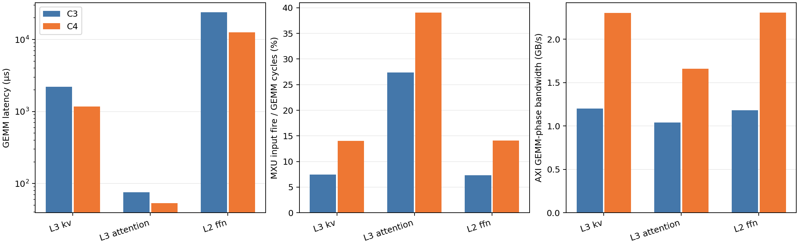
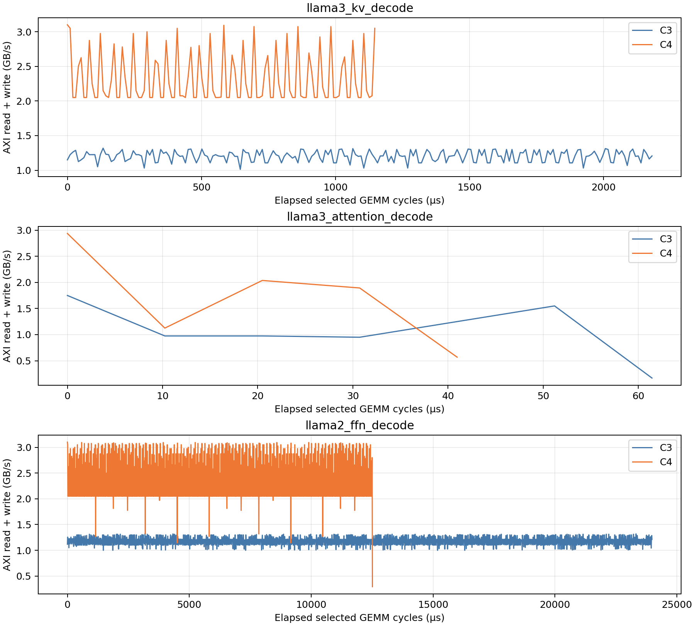

# rev6 C3/C4 GEMM fine-grained 성능 분석

측정일: 2026-10-08, C3 attention 보완 및 M=4 projection 추가 측정: 2026-10-09. `candidate_fpga_bins.rev6.yaml`의 C3/C4에 해당하는 소스 설정으로 `ci/run_black.sh xrt-vcs-sim --perf 3`을 실행했다. FPGA bitstream을 실행한 결과가 아니라 현재 worktree RTL의 VCS 시뮬레이션 결과다.

<!-- SUMMARY -->
공통 projection에서 C4는 C3보다 GEMM 구간 기준 **Llama3 K/V 1.882배, Llama2 FFN 1.916배** 빠르다. GEMM 구간 HBM AXI 평균은 C3 **1.18–1.20 GB/s**, C4 **2.30–2.31 GB/s**, MXU input utilization은 C3 **7.34–7.46%**, C4 **14.04–14.06%**다. K/V·FFN projection의 LMEM/TMEM 물리 read/write byte 수는 같은 shape에서 동일해, 데이터량 감소보다 공급·중첩 경로의 처리 속도 차이가 두드러진다. 작은 검증 case를 포함한 8개 실행은 reference 검증을 통과했다. M4 attention도 C3를 보완 측정해 C4가 GEMM 구간 **1.427배** 빠름을 확인했다. HBM 모델은 uncalibrated이며 GB/s를 실측 hardware bandwidth로 해석하지 않는다.
<!-- /SUMMARY -->

## 측정 조건과 재현 자료

| 구분 | C3 | C4 |
|---|---|---|
| rev6 alias | `naive_th16_tcol16_m16_L16_bigmem_all_bram_acc_base_pnr_v3_axi_fix` | `improve_th16_tcol16_m16_t8_bigmem_all_bram_spread_v4_nodsp_fsm_update` |
| config | `configs/naive_th16_tcol16_m16_L16_bigmem_all_bram_acc_base_pnr_v3.sh` | `configs/improve_th16_tcol16_m16_t8_bigmem_all_bram_spread_v4_nodsp.sh` |
| app | `fpint_gemm_ffn_hw_naive` | `fpint_gemm_ffn_hw` |
| build | `build_latency_perf_c3_rev6` | `build_latency_perf_c4_rev6` |
| MXU | ROW=16, COL=16, COL_TILE=16 | 동일 |
| core / threads | 1 / 16 | 1 / 16 |
| 주요 local memory | LMEM 1,310,720 B, 16 banks, 8 B/word | TMEM 8 × 32,768 B, 32 B/word; LMEM 1 MiB |
| L2 | 1 MiB | 1 MiB |
| HBM DMA channels / kernel AXI ports | 4 / 4 | 4 / 4 |

두 build는 각각 `../configure --xlen=64 --tooldir=/opt/vortex --prefix=$HOME/tools/vortex`로 준비했다. 각 config를 source한 다음 wrapper를 사용했다. 반복 수는 1이고 각 app의 reference comparison을 활성화했다. `-p`와 bench를 사용하지 않았다. 파형 크기와 시뮬레이션 비용을 줄이기 위해 `--configs-extra '-DDISABLE_FSDB'`를 추가했다.

HBM 모델은 logic=100 MHz, HBM AXI=300 MHz, DRAM profile=`HBM2_2Gbps`이며 manifest의 timing provenance는 **uncalibrated**다. 따라서 아래 GB/s는 해당 모델과 clock 가정에서 관측한 값이다. 실제 U55C HBM의 달성 bandwidth를 확정하려면 같은 계측을 hardware에서 검증해야 한다. alias의 bitstream 명칭은 구성 선택의 근거이며, 해당 bitstream과 현재 dirty worktree의 RTL 동일성을 주장하지 않는다.

최초 측정은 당시 기존 FSM/kernel 변경을 그대로 사용했고 분석 계측은 RTL/kernel source를 수정하지 않았다. 2026-10-09 보완 측정에서는 naive의 simulation 전용 QBLK assertion만 16·32·64·128 허용으로 수정했다. 하드웨어 데이터 경로는 변경하지 않았다. 이번 C3 attention은 아래 모든 표·그림·요약 파일에 포함되며, 원래 실패 기록과 작은 QBLK별 검증은 별도로 보존했다. [provenance.json](perf_rev6/provenance.json)에 HEAD·source hash·dirty status, `perf_rev6/source_worktree.patch`에 관련 기존 변경을 로컬로 보존했다. 각 실행의 config/monitor hash와 명령은 `perf_rev6/raw/*.json`, 모델의 실제 parameter/주소 매핑은 `*.model.json`에 있다.

Git에는 이 보고서, 요약 CSV, 본문의 PNG 그림, provenance 및 재현 스크립트를 보존한다. `perf_rev6/raw/`, 전체 window dump인 `measurements.json`, 임시 `source_worktree.patch`와 SVG 출력은 생성 자료이므로 ignore한다. 원시 자료가 없는 checkout에서는 아래 재실행 절차로 다시 생성해야 한다. RTL 및 kernel 변경은 `af4536708`에 커밋되어 있으며, 측정 당시 파일 hash는 provenance로 확인할 수 있다.

## 워크로드 선정

| case | M × N × K | QBLK / WTRANS / QDIR | 선정 이유 |
|---|---|---|---|
| small | 16 × 32 × 32 | 32 / 0 / 0 | 원래 `--perf 3` 출력과 관찰 모듈의 cycle 동일성 및 정답 검증 |
| llama3_kv_decode | 1 × 1024 × 4096 | 32 / 0 / 0 | Llama3-8B generation의 K/V projection; 긴 reduction 및 작은 M |
| llama3_attention_decode | 4 × 1025 × 128 | 128 / 1 / 0 | Llama3-8B generation의 첫 attention QKᵀ; GQA M=4, ragged N, 전치 weight |
| llama2_ffn_decode | 1 × 11008 × 4096 | 32 / 0 / 0 | Llama2-7B generation의 gate/up projection; 큰 weight footprint |
| llama3_kv_decode_m4 | 4 × 1024 × 4096 | 32 / 0 / 0 | 같은 K/V projection의 M=1→4 weight 재사용 비교 |
| llama2_ffn_decode_m4 | 4 × 11008 × 4096 | 32 / 0 / 0 | 같은 FFN projection의 M=1→4 weight 재사용 비교 |

기존 M=1 projection 및 attention의 dimension과 옵션은 `analysis_workspace/latency_on_hw/generated_suites/{llama2_7b,llama3_8b}_main_full.th16_20261004_rev4_pipeline/C3_generation/model_structure.text`에서 확인했다. C4는 같은 shape를 improve app으로 실행한다. 과거 suite는 shape 출처이며 하드웨어 설정은 **rev6**를 따른다. 한 GEMM invocation을 분석하며 layer/token 전체 합계나 latency_on_hw의 warmup/반복 평균과 직접 동일시하지 않는다. M=4 projection은 같은 N/K를 유지한 controlled workload 비교이며 실제 logical/target M=4로 실행한다. 이번 표본을 prefill 전반으로 일반화하지 않는다. 현재 추가 실험에서 RTL/kernel의 기능·성능 변경은 하지 않았다.

## 계측 방법과 해석 기준

### 기존 perf 출력에서 발견한 제한

`runtime/stub/utils.cpp`의 class 3은 MXU, class 4는 HBM/CPU DMA, class 5–8은 각 local DMA, class 2는 LMEM/cache 카운터를 출력한다. `--perf 3` 한 번으로 이 모든 출력이 나오지는 않는다. 종료 후 perf class만 바꾸는 방법도 사용할 수 없다. XRT runtime은 kernel epilogue에서 저장한 CSR snapshot을 `IO_MPM_ADDR`에서 읽기 때문이다.

현재 `VX_gemm_compute_core.sv`는 `perf='0'` 뒤 input/weight fire와 일부 accumulator 카운터만 할당한다. 이에 따라 compute_cycles, stall_cycles, mac_count, input/weight stall 등의 0은 **미구현**이다. `job_count`도 GEMM 호출 수가 아니라 accumulator write 횟수다. C3 output_fire=0 또한 그 경로에서 미구현이므로 출력이 없다는 뜻이 아니다. `gemm_node.lmem_rd_bytes/lmem_wr_bytes`는 backend별 계측 범위가 다르며 공통 bandwidth로 사용하지 않는다.

### 시뮬레이션 관찰 모듈

[fine_monitor.sv](perf_rev6/tools/fine_monitor.sv)는 `bind`로 기존 core의 perf 구조체, local memory의 실제 bank handshake, testbench의 AXI handshake를 읽는다. DUT 신호를 drive하지 않는다. generated build Makefile에만 이 파일을 추가했으며 제품 RTL에는 포함하지 않았다. C3/C4 소스 control/data path를 바꾸지 않았다.

- **HBM AXI read bytes**: `RVALID && RREADY`마다 64 B. write bytes: `WVALID && WREADY`에서 `WSTRB`의 활성 byte 수. kernel-facing AXI boundary의 실제 수락된 beat이며, DRAM 내부의 물리 명령/버스트 byte와는 계측 경계가 다르다.
- **전체 core 구간**: core busy 동안의 외부 AXI. input/output staging, instruction/stack/descriptor traffic 및 perf epilogue를 포함한다. host가 출력한 PERF busy snapshot보다 final 관찰 busy가 약간 길다. 각 bandwidth는 해당 관찰 구간의 cycle로 계산한다.
- **GEMM 구간**: GEMM node total_cycles가 증가하는 cycle만 골라 AXI를 집계한다. negedge에서 gate를 갱신하고 다음 posedge에서 handshake를 샘플링하므로 실제 GEMM 경계 대비 1-cycle 위상 차이가 있다. 전체 cycle 수는 node total_cycles와 일치함을 검증했다. 특히 짧은 GEMM의 bytes에는 이 경계 오차를 고려해야 한다.
- **Window 통계**: 1,024개의 해당 구간 cycle=10.24 µs. 평균은 read+write bytes/time, min/max는 동일 길이 window 사이 통계다. min/max/median/zero 비율에서 마지막 불완전 window는 제외하고, 전체 평균에는 포함한다. GEMM-active cycle이 떨어져 있으면 window가 그 cycle들을 이어 집계한다. 순간 peak나 실행 간 변동 통계가 아니다.
- **MXU input utilization**: input_fire / GEMM total_cycles. pipeline utilization은 `perf.computing = !pipeline_empty`를 직접 샘플링한다. pipeline이 차 있어도 stall일 수 있으므로 둘은 서로 다른 지표다.
- **유효 throughput**: 2MNK / GEMM time. nominal 연산 capacity는 cycle당 2×ROW×COL=512 operations. peak 비율은 유효 연산량 기준이며 padded/폐기된 연산과 quantization 처리 비용을 유효 FLOPs에 넣지 않는다. op/input_fire도 함께 확인한다.
- **LMEM physical bandwidth**: accepted SRAM bank read word=8 B, write는 byte enable의 popcount. workload 전체의 bank 활동이며 core/GEMM denominator를 구별한다. bank_stalls는 기존 collision counter로, wall-clock stall cycle가 아니라 request collision event다.
- **TMEM physical bandwidth**: 각 bank의 accepted read word=32 B, write는 byte enable. HBM↔TMEM 및 TMEM↔MXU 활동이 모두 포함된다. bank collision은 동일 bank의 requester valid가 2개 이상이고 하나 이상 수락된 cycle에서 거절된 requester 수다. `collision_cycles` 합은 **bank-cycle**이며 서로 겹친 bank를 중복 센다. `blocked`에는 collision 외 backpressure도 들어간다.
- **DMA bandwidth**: rd_bytes와 wr_bytes는 DMA 양 끝 interface의 활동량이다. rd+wr를 하나의 memory bandwidth로 합치면 같은 데이터 이동을 두 번 셀 수 있다. 그래서 endpoint별 값과 active/core/GEMM denominator를 구분한다. HBM channel active_max는 채널별 누적 busy의 최댓값으로, DMA union wall-clock 시간과 같지 않다.

측정값 파싱은 [analyze.py](perf_rev6/tools/analyze.py)가 streaming으로 수행한다. 모든 AXI/window byte 합계·cycle 합계, GEMM gate cycle=node total cycle, core gate cycle=final busy cycle의 일치를 검사한다. C3 LMEM read bytes=read count×word size, C4 TMEM read/write bytes=해당 DMA endpoint 합계도 검증한다. 정량 표는 [measurements.csv](perf_rev6/measurements.csv), 전체 raw 카운터와 통계는 `perf_rev6/measurements.json`에 로컬로 저장한다.

<!-- RESULTS -->
## 측정 결과

| case | backend | GEMM cycles | GEMM µs | core µs | input % | pipeline % | 유효 GFLOP/s |
| --- | --- | --- | --- | --- | --- | --- | --- |
| small | C3 | 773 | 7.730 | 104.970 | 8.279 | 15.265 | 4.239 |
| small | C4 | 303 | 3.030 | 92.370 | 21.122 | 28.713 | 10.815 |
| llama3_kv_decode | C3 | 219,638 | 2,196.380 | 2,293.790 | 7.460 | 52.329 | 3.819 |
| llama3_kv_decode | C4 | 116,716 | 1,167.160 | 1,257.120 | 14.037 | 99.235 | 7.187 |
| llama3_attention_decode | C3 | 7,596 | 75.960 | 174.670 | 27.383 | 76.435 | 13.818 |
| llama3_attention_decode | C4 | 5,324 | 53.240 | 143.300 | 39.068 | 71.112 | 19.715 |
| llama2_ffn_decode | C3 | 2,399,965 | 23,999.650 | 24,097.040 | 7.339 | 51.237 | 3.757 |
| llama2_ffn_decode | C4 | 1,252,396 | 12,523.960 | 12,613.620 | 14.063 | 99.418 | 7.200 |

모든 수치는 reference 검증에 통과한 실행만 포함한다. input %와 nominal 유효 peak %는 N/K가 16의 배수이면 같다. ragged attention에서는 padding 때문에 유효 peak %가 조금 더 낮다.

### Weight 공급을 고려한 MXU 해석

| case/backend | input fire | weight beat | weight beat / cycles % | 낙관적 cycle 하한 | 그 하한의 유효 GFLOP/s | 실측 / 하한 throughput % |
| --- | --- | --- | --- | --- | --- | --- |
| c3_small | 64 | 16 | 2.070 | 64 | 51.200 | 8.279 |
| c4_small | 64 | 16 | 5.281 | 64 | 51.200 | 21.122 |
| c3_llama3_kv_decode | 16,384 | 65,536 | 29.838 | 65,536 | 12.800 | 29.838 |
| c4_llama3_kv_decode | 16,384 | 65,536 | 56.150 | 65,536 | 12.800 | 56.150 |
| c3_llama3_attention_decode | 2,080 | 2,080 | 27.383 | 2,080 | 50.462 | 27.383 |
| c4_llama3_attention_decode | 2,080 | 2,080 | 39.068 | 2,080 | 50.462 | 39.068 |
| c3_llama2_ffn_decode | 176,128 | 704,512 | 29.355 | 704,512 | 12.800 | 29.355 |
| c4_llama2_ffn_decode | 176,128 | 704,512 | 56.253 | 704,512 | 12.800 | 56.253 |

weight bus는 `GEMM_WEIGHT_DATA_SIZE=(COL×WLOAD_NUM×4)/8=32 B`이고, 한 16×16 int4 weight tile=128 B를 4 beats로 적재한다. 한 interface에서 cycle당 한 beat만 수락할 수 있으므로 관측한 input/weight beat 수의 최댓값은 해당 작업량의 낙관적 cycle 하한이다. 이 하한은 DMA·quantization·accumulator·파이프라인 의존성이 모두 이상적으로 겹친다고 가정하며 실제 도달 가능한 성능을 보장하지 않는다. M=1 projection에서는 weight beat가 input fire의 4배라 nominal compute peak 51.2 GFLOP/s보다 낮은 12.8 GFLOP/s의 weight 공급 상한이 먼저 생긴다. C4 K/V의 input 14.04%를 이것과 구별하면 weight 공급 하한 대비 throughput은 56.15%다. M이 커져 같은 weight를 여러 row에 재사용할 수 있으면 이 제약은 완화된다.

### HBM AXI bandwidth

| case/backend | core avg GB/s | GEMM avg GB/s | GEMM window min | max | mean | median | window 수 |
| --- | --- | --- | --- | --- | --- | --- | --- |
| c3_small | 0.122 | 0.331 | N/A | N/A | N/A | N/A | 0 |
| c4_small | 0.130 | 0.887 | N/A | N/A | N/A | N/A | 0 |
| c3_llama3_kv_decode | 1.156 | 1.202 | 1.012 | 1.319 | 1.205 | 1.206 | 214 |
| c4_llama3_kv_decode | 2.146 | 2.304 | 2.050 | 3.100 | 2.324 | 2.075 | 113 |
| c3_llama3_attention_decode | 0.510 | 1.041 | 0.169 | 1.750 | 1.088 | 0.975 | 7 |
| c4_llama3_attention_decode | 0.682 | 1.659 | 0.569 | 2.938 | 1.712 | 1.894 | 5 |
| c3_llama2_ffn_decode | 1.178 | 1.183 | 1.000 | 1.325 | 1.183 | 1.200 | 2343 |
| c4_llama2_ffn_decode | 2.292 | 2.308 | 0.294 | 3.100 | 2.308 | 2.075 | 1223 |

small은 GEMM 길이가 1,024 cycles 미만이라 GEMM window min/max를 제공할 수 없다. core 구간의 window 통계, tail 및 port별 read/write/backpressure는 measurements.json에 있다. 동일 길이 window mean과 tail 포함 전체 평균은 다를 수 있다.

| case/backend | core AXI read B | core AXI write B | GEMM AXI read B | GEMM AXI write B | useful FLOPs / core AXI B |
| --- | --- | --- | --- | --- | --- |
| c3_small | 9,600 | 3,165 | 1,664 | 896 | 2.567 |
| c4_small | 9,024 | 3,028 | 1,664 | 1,024 | 2.719 |
| c3_llama3_kv_decode | 2,647,040 | 4,189 | 2,638,976 | 1,792 | 3.164 |
| c4_llama3_kv_decode | 2,694,336 | 4,052 | 2,686,976 | 2,048 | 3.109 |
| c3_llama3_attention_decode | 78,784 | 10,341 | 70,848 | 8,192 | 11.777 |
| c4_llama3_attention_decode | 87,360 | 10,324 | 80,000 | 8,320 | 10.745 |
| c3_llama2_ffn_decode | 28,372,992 | 24,157 | 28,364,928 | 21,760 | 3.176 |
| c4_llama2_ffn_decode | 28,892,352 | 24,020 | 28,884,992 | 22,016 | 3.119 |

### 전체 core 구간 window 및 port 분포

| case/backend | core window min GB/s | max | mean | zero % | port avg min GB/s | max | mean |
| --- | --- | --- | --- | --- | --- | --- | --- |
| c3_small | 0.000 | 0.433 | 0.124 | 10.000 | 0.016 | 0.070 | 0.030 |
| c4_small | 0.000 | 0.441 | 0.131 | 11.111 | 0.017 | 0.079 | 0.033 |
| c3_llama3_kv_decode | 0.000 | 1.325 | 1.156 | 0.446 | 0.288 | 0.291 | 0.289 |
| c4_llama3_kv_decode | 0.000 | 3.081 | 2.160 | 0.820 | 0.535 | 0.540 | 0.537 |
| c3_llama3_attention_decode | 0.000 | 1.350 | 0.512 | 11.765 | 0.119 | 0.152 | 0.128 |
| c4_llama3_attention_decode | 0.000 | 2.038 | 0.733 | 7.692 | 0.160 | 0.200 | 0.170 |
| c3_llama2_ffn_decode | 0.000 | 1.325 | 1.179 | 0.042 | 0.295 | 0.295 | 0.295 |
| c4_llama2_ffn_decode | 0.000 | 3.094 | 2.294 | 0.081 | 0.573 | 0.573 | 0.573 |

port avg는 각 port의 전체 core 구간 평균이며, 시간 window 통계와 구별된다. small에서 port 3의 traffic이 상대적으로 큰 것은 instruction/descriptor/profiling traffic이 함께 들어가는 관찰 경계와 부합한다. 실제 projection에서는 read traffic이 4 ports에 훨씬 균등하게 분산된다.

### Local memory 활동과 bank conflict

| case/backend | memory | physical read B | physical write B | read+write / core time GB/s | collision event | response stall / blocked |
| --- | --- | --- | --- | --- | --- | --- |
| c3_small | LMEM | 3,840 | 7,680 | 0.110 | 102 | 0 |
| c4_small | TMEM | 3,840 | 2,688 | 0.071 | 6 | 6 |
| c3_llama3_kv_decode | LMEM | 3,672,064 | 2,689,024 | 2.773 | 121,503 | 0 |
| c4_llama3_kv_decode | TMEM | 3,672,064 | 2,689,024 | 5.060 | 12,639 | 12,639 |
| c3_llama3_attention_decode | LMEM | 174,624 | 87,744 | 1.502 | 6,798 | 0 |
| c4_llama3_attention_decode | TMEM | 174,720 | 88,320 | 1.836 | 712 | 712 |
| c3_llama2_ffn_decode | LMEM | 39,474,688 | 28,907,008 | 2.838 | 1,287,717 | 0 |
| c4_llama2_ffn_decode | TMEM | 39,474,688 | 28,907,008 | 5.421 | 136,194 | 136,194 |

C3의 collision event는 기존 LMEM bank_stalls이고 마지막 열은 response stall이다. C4의 collision event는 관찰 모듈의 denied requester이며 마지막 열은 모든 blocked requester-cycle이다. 단위와 지점이 다르므로 backend간 collision 숫자를 직접 비율 비교하지 않는다. TMEM per-bank 통계는 raw simv.log와 measurements.json에 있다. C3의 비활성 HBM-DMA/LDMA 카운터 0은 LMEM 직접 경로의 bandwidth가 0이라는 뜻이 아니다.

### DMA 단계별 bandwidth와 중첩

| case/backend | DMA union cycles | DMA ∩ pipeline cycles | overlap / DMA union % |
| --- | --- | --- | --- |
| c3_small | 411 | 0 | 0.000 |
| c4_small | 219 | 67 | 30.594 |
| c3_llama3_kv_decode | 185,556 | 104,837 | 56.499 |
| c4_llama3_kv_decode | 116,212 | 115,687 | 99.548 |
| c3_llama3_attention_decode | 4,404 | 3,614 | 82.062 |
| c4_llama3_attention_decode | 4,510 | 3,642 | 80.754 |
| c3_llama2_ffn_decode | 2,038,147 | 1,124,038 | 55.150 |
| c4_llama2_ffn_decode | 1,247,836 | 1,243,645 | 99.664 |

| case/backend | DMA | rd B | wr B | active cycle sum | rd / active GB/s | src request stall | dst write stall |
| --- | --- | --- | --- | --- | --- | --- | --- |
| c3_small | cpu_dma | 6,400 | 2,048 | 411 | 1.557 | 28 | 0 |
| c4_small | hbm_dma.aggregate | 1,664 | 1,024 | 214 | 0.778 | 0 | 16 |
| c4_small | lmem_dma_input | 2,048 | 2,048 | 75 | 2.731 | 0 | 3 |
| c4_small | lmem_dma_weight | 512 | 512 | 54 | 0.948 | 0 | 0 |
| c4_small | lmem_dma_sz | 256 | 256 | 111 | 0.231 | 0 | 0 |
| c4_small | lmem_dma_output | 1,024 | 1,024 | 74 | 1.384 | 30 | 0 |
| c3_llama3_kv_decode | cpu_dma | 4,784,128 | 2,048 | 185,556 | 2.578 | 86,695 | 0 |
| c4_llama3_kv_decode | hbm_dma.aggregate | 2,686,976 | 2,048 | 108,587 | 2.474 | 7 | 9,094 |
| c4_llama3_kv_decode | lmem_dma_input | 524,288 | 524,288 | 114,285 | 0.459 | 0 | 0 |
| c4_llama3_kv_decode | lmem_dma_weight | 2,097,152 | 2,097,152 | 115,764 | 1.812 | 0 | 0 |
| c4_llama3_kv_decode | lmem_dma_sz | 1,048,576 | 1,048,576 | 231,451 | 0.453 | 0 | 0 |
| c4_llama3_kv_decode | lmem_dma_output | 2,048 | 2,048 | 448 | 0.457 | 0 | 0 |
| c3_llama3_attention_decode | cpu_dma | 80,256 | 11,776 | 4,404 | 1.822 | 1,210 | 1,502 |
| c4_llama3_attention_decode | hbm_dma.aggregate | 80,000 | 8,320 | 4,390 | 1.822 | 54 | 451 |
| c4_llama3_attention_decode | lmem_dma_input | 66,560 | 66,560 | 3,645 | 1.826 | 76 | 518 |
| c4_llama3_attention_decode | lmem_dma_weight | 66,560 | 66,560 | 3,693 | 1.802 | 0 | 0 |
| c4_llama3_attention_decode | lmem_dma_sz | 33,280 | 33,280 | 7,353 | 0.453 | 0 | 0 |
| c4_llama3_attention_decode | lmem_dma_output | 8,320 | 8,320 | 845 | 0.985 | 195 | 0 |
| c3_llama2_ffn_decode | cpu_dma | 51,429,376 | 22,016 | 2,038,147 | 2.523 | 963,148 | 0 |
| c4_llama2_ffn_decode | hbm_dma.aggregate | 28,884,992 | 22,016 | 1,167,574 | 2.474 | 85 | 98,036 |
| c4_llama2_ffn_decode | lmem_dma_input | 5,636,096 | 5,636,096 | 1,228,515 | 0.459 | 0 | 0 |
| c4_llama2_ffn_decode | lmem_dma_weight | 22,544,384 | 22,544,384 | 1,244,502 | 1.812 | 0 | 0 |
| c4_llama2_ffn_decode | lmem_dma_sz | 11,272,192 | 11,272,192 | 2,488,147 | 0.453 | 0 | 0 |
| c4_llama2_ffn_decode | lmem_dma_output | 22,016 | 22,016 | 4,816 | 0.457 | 0 | 0 |

rd/active는 엔진·채널 activity의 합으로 나눈 endpoint 평균이며 HBM 전체 wall-clock bandwidth가 아니다. `lmem_dma_sz`는 scale DMA와 zero-point DMA 두 엔진의 **합**이다. 두 엔진이 동시에 활동하므로 active_cycles가 GEMM/core cycles보다 커질 수 있다. HBM-DMA 역시 4-channel active sum이고 runtime의 “8-channel” 문자열은 고정된 표시다. 실제 channel/port 수는 manifest의 4를 따른다.





## 분석

### llama3_kv_decode

C4는 C3 대비 GEMM 구간 1.882배, 전체 core 구간 1.825배 빠르다. 유효 throughput은 3.819 → 7.187 GFLOP/s, MXU input utilization은 7.460% → 14.037%다. 두 backend의 input fire는 각각 16,384/16,384로 유효 연산량 차이에 의한 속도 차이가 아니다.

전체 core AXI traffic은 C3 2.651 MB, C4 2.698 MB다. C4의 이점은 주로 비슷한 데이터량을 더 짧은 시간에 처리하는 데 있다. GEMM window bandwidth 범위는 C3 1.012–1.319, C4 2.050–3.100 GB/s다.

pipeline active 비율은 C3 52.329%, C4 99.235%이지만 input fire 비율은 훨씬 낮다. 특히 C4의 pipeline이 대부분의 시간 비어 있지 않아도 MAC peak utilization이 높다는 뜻은 아니다. DMA와 pipeline의 중첩 비율은 56.499% → 99.548%로 변한다. 이 수치는 DMA 중첩과 공급 경로를 구분하는 단서지만, 개별 stall의 원인을 독립적으로 분리하는 ablation을 하지 않았으므로 특정 bank conflict가 전체 속도 차이를 설명한다고 단정할 수 없다.

C3 CPU-DMA source request stall은 86,695 events이며 wait_dcache 카운터와 같다. C4 HBM-DMA는 source request stall 7, destination write stall 9,094 events다. 관찰 지점이 달라 단순 event-count 비율을 speedup의 원인으로 해석할 수는 없지만, C3의 D-cache 경유 공급과 C4의 TMEM 수용 경로를 구분하는 진단 지표가 된다. C3 CPU-DMA rd counter 4,784,128 B와 실제 외부 AXI read 2,647,040 B도 같지 않아 DMA byte counter를 곧바로 HBM 물리 traffic으로 사용할 수 없다.

local memory physical traffic은 C3 read 3,672,064 B / write 2,689,024 B, C4 read 3,672,064 B / write 2,689,024 B다. local memory traffic의 양과 실제 처리 속도를 분리해 보는 것이 필요하다.

C4 input local DMA는 논리 A 8,192 B에 대해 524,288 B를 읽어 64.0배의 local read amplification을 보인다. N 방향 tile마다 A를 재사용하는 방식의 비용이며 HBM에서 같은 비율로 다시 읽는다는 의미는 아니다. weight, scale/zero의 전송량도 DMA table에서 별도로 확인할 수 있다.

### llama3_attention_decode

C4는 C3 대비 GEMM 구간 1.427배, 전체 core 구간 1.219배 빠르다. 유효 throughput은 13.818 → 19.715 GFLOP/s, MXU input utilization은 27.383% → 39.068%다. 두 backend의 input fire는 각각 2,080/2,080로 유효 연산량 차이에 의한 속도 차이가 아니다.

전체 core AXI traffic은 C3 0.089 MB, C4 0.098 MB다. C4의 이점은 주로 비슷한 데이터량을 더 짧은 시간에 처리하는 데 있다. GEMM window bandwidth 범위는 C3 0.169–1.750, C4 0.569–2.938 GB/s다.

pipeline active 비율은 C3 76.435%, C4 71.112%이지만 input fire 비율은 훨씬 낮다. 특히 C4의 pipeline이 대부분의 시간 비어 있지 않아도 MAC peak utilization이 높다는 뜻은 아니다. DMA와 pipeline의 중첩 비율은 82.062% → 80.754%로 변한다. 이 수치는 DMA 중첩과 공급 경로를 구분하는 단서지만, 개별 stall의 원인을 독립적으로 분리하는 ablation을 하지 않았으므로 특정 bank conflict가 전체 속도 차이를 설명한다고 단정할 수 없다.

C3 CPU-DMA source request stall은 1,210 events이며 wait_dcache 카운터와 같다. C4 HBM-DMA는 source request stall 54, destination write stall 451 events다. 관찰 지점이 달라 단순 event-count 비율을 speedup의 원인으로 해석할 수는 없지만, C3의 D-cache 경유 공급과 C4의 TMEM 수용 경로를 구분하는 진단 지표가 된다. C3 CPU-DMA rd counter 80,256 B와 실제 외부 AXI read 78,784 B도 같지 않아 DMA byte counter를 곧바로 HBM 물리 traffic으로 사용할 수 없다.

local memory physical traffic은 C3 read 174,624 B / write 87,744 B, C4 read 174,720 B / write 88,320 B다. local memory traffic의 양과 실제 처리 속도를 분리해 보는 것이 필요하다.

C4 input local DMA는 논리 A 1,024 B에 대해 66,560 B를 읽어 65.0배의 local read amplification을 보인다. N 방향 tile마다 A를 재사용하는 방식의 비용이며 HBM에서 같은 비율로 다시 읽는다는 의미는 아니다. weight, scale/zero의 전송량도 DMA table에서 별도로 확인할 수 있다.

### llama2_ffn_decode

C4는 C3 대비 GEMM 구간 1.916배, 전체 core 구간 1.910배 빠르다. 유효 throughput은 3.757 → 7.200 GFLOP/s, MXU input utilization은 7.339% → 14.063%다. 두 backend의 input fire는 각각 176,128/176,128로 유효 연산량 차이에 의한 속도 차이가 아니다.

전체 core AXI traffic은 C3 28.397 MB, C4 28.916 MB다. C4의 이점은 주로 비슷한 데이터량을 더 짧은 시간에 처리하는 데 있다. GEMM window bandwidth 범위는 C3 1.000–1.325, C4 0.294–3.100 GB/s다.

pipeline active 비율은 C3 51.237%, C4 99.418%이지만 input fire 비율은 훨씬 낮다. 특히 C4의 pipeline이 대부분의 시간 비어 있지 않아도 MAC peak utilization이 높다는 뜻은 아니다. DMA와 pipeline의 중첩 비율은 55.150% → 99.664%로 변한다. 이 수치는 DMA 중첩과 공급 경로를 구분하는 단서지만, 개별 stall의 원인을 독립적으로 분리하는 ablation을 하지 않았으므로 특정 bank conflict가 전체 속도 차이를 설명한다고 단정할 수 없다.

C3 CPU-DMA source request stall은 963,148 events이며 wait_dcache 카운터와 같다. C4 HBM-DMA는 source request stall 85, destination write stall 98,036 events다. 관찰 지점이 달라 단순 event-count 비율을 speedup의 원인으로 해석할 수는 없지만, C3의 D-cache 경유 공급과 C4의 TMEM 수용 경로를 구분하는 진단 지표가 된다. C3 CPU-DMA rd counter 51,429,376 B와 실제 외부 AXI read 28,372,992 B도 같지 않아 DMA byte counter를 곧바로 HBM 물리 traffic으로 사용할 수 없다.

local memory physical traffic은 C3 read 39,474,688 B / write 28,907,008 B, C4 read 39,474,688 B / write 28,907,008 B다. local memory traffic의 양과 실제 처리 속도를 분리해 보는 것이 필요하다.

C4 input local DMA는 논리 A 8,192 B에 대해 5,636,096 B를 읽어 688.0배의 local read amplification을 보인다. N 방향 tile마다 A를 재사용하는 방식의 비용이며 HBM에서 같은 비율로 다시 읽는다는 의미는 아니다. weight, scale/zero의 전송량도 DMA table에서 별도로 확인할 수 있다.

C4 FFN의 bandwidth 최솟값 0.294 GB/s는 마지막 완전 window에서 측정됐으며 중앙값 2.075 GB/s와 크게 다르다. min/max는 시작·종료 및 window alignment에 민감하므로 평균·중앙값·time series를 함께 본다. 또한 HBM-DMA bytes/active_max로 계산하면 9.436 GB/s가 되지만 실제 GEMM 구간 평균은 2.308 GB/s다. active_max 306,346 cycles는 GEMM 1,252,396 cycles 전체의 elapsed time이 아니므로 전자를 전체 bandwidth로 보고하면 과대평가한다.

kernel-facing AXI의 config상 read capacity는 4 ports×64 B×100 MHz=25.6 GB/s이며 write도 별도 channel에서 같은 beat capacity를 가진다. 이것은 DRAM 실측 peak가 아니라 관찰 interface의 이론적 상한이다. 측정 bandwidth가 이 상한보다 낮다는 사실만으로 HBM 장치 자체가 포화되었다고 결론 낼 수 없다. DMA 의존성, D-cache 경유, TMEM 수용, quantization 및 accumulator 경로를 함께 확인해야 한다.

### Attention 및 지원 범위

실제 Llama3 attention shape `4×1025×128, QBLK=128, WTRANS=1, QDIR=0`은 C3와 C4 모두 reference 검증을 통과했다. C3의 최초 실패는 QBLK register를 log2=5(32)로 고정한 simulation assertion이었다. 2026-10-09에 허용 범위를 log2=4–7(16·32·64·128)로 넓힌 후 동일 shape를 `xrt-vcs-sim --perf 3`으로 다시 측정해 위 모든 표와 그림에 반영했다. 차원/alignment 검사는 유지했고 하드웨어 데이터 경로는 변경하지 않았다. 최초 실패 기록은 `perf_rev6/raw/attempts/c3_attention_qblk32_assertion_20261008/`에 보존하고 집계에서 제외했다. 작은 QBLK별 검증은 [별도 재실행 문서](perf_rev6/qblk_support_rerun_20261009/README.md)에 있다.

## 검증과 재실행

small 원래 perf-only 실행과 최종 관찰 실행의 GEMM cycle 및 host PERF core cycle가 각각 C3 773 / 8,870, C4 303 / 7,610으로 같았다. host PERF instr cycle(MCYCLE)은 C3 8,845, C4 7,585로 busy cycle와 구별된다. reference verification과 window 합계 invariant도 통과했다. raw core final cycles는 profiling epilogue까지 포함해 C3 10,497, C4 9,237이다.

```bash
# 프로젝트 root에서 최초 1회 준비; configure를 다시 하면 monitor 설정을 재추가해야 한다
python3 analysis_workspace/latency/docs/perf_rev6/tools/setup_builds.py
python3 analysis_workspace/latency/docs/perf_rev6/tools/run_cases.py --case small
python3 analysis_workspace/latency/docs/perf_rev6/tools/run_cases.py --case llama3_kv_decode
python3 analysis_workspace/latency/docs/perf_rev6/tools/run_cases.py --case llama2_ffn_decode --timeout 5400
python3 analysis_workspace/latency/docs/perf_rev6/tools/run_cases.py --case llama3_attention_decode
python3 analysis_workspace/latency/docs/perf_rev6/tools/analyze.py
/home/jaeyongjang/.conda/envs/vortex/bin/python analysis_workspace/latency/docs/perf_rev6/tools/render_results.py
```

full FFN의 초기 C4 실행은 VCS 진행 속도를 보고 timeout을 연장하기 위해 중단했다. 그 기록은 `raw/attempts/`에 있고 최종 분석에서는 제외한다. 각 정량 결과는 최종 단일 실행이며 실행 간 분산을 측정하지 않았다.

## 추가로 유용한 계측

1. input/weight/scale/zero 공급 ready/valid 원인별 stall 및 accumulator hazard의 실제 카운터를 채우면 pipeline-active와 input-fire 사이의 공백을 설명할 수 있다. 현재 perf의 0만으로는 원인을 분해할 수 없다.
2. per-bank read/write hotspot과 per-port backpressure를 함께 보면 충돌이 특정 bank/address mapping에 집중되는지 확인할 수 있다. 이미 수집한 raw 자료에 포함되어 있다.
3. useful FLOPs/AXI byte와 A/weight/scale read amplification은 데이터 재사용 효율을 표현한다. physical SRAM traffic과 DMA endpoint traffic을 구분해야 한다.
4. prefill의 큰 M, generation batch 변화, QDIR=1, FFN down projection 등으로 확장하면 compute/memory balance가 달라지는 범위를 검증할 수 있다. 이번 측정은 해당 범위를 커버하지 않는다.
