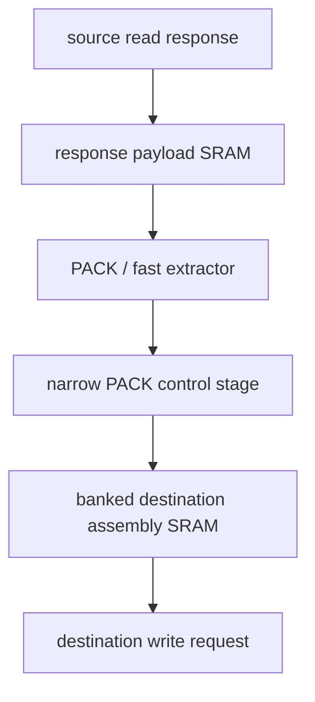
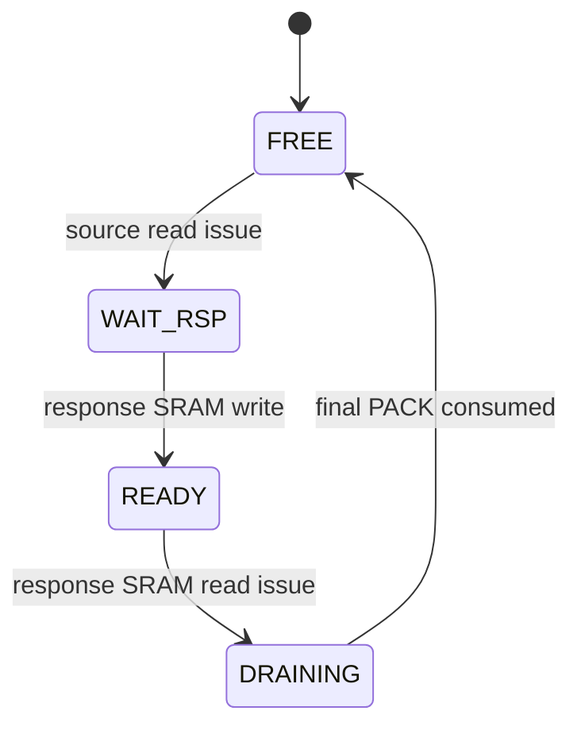
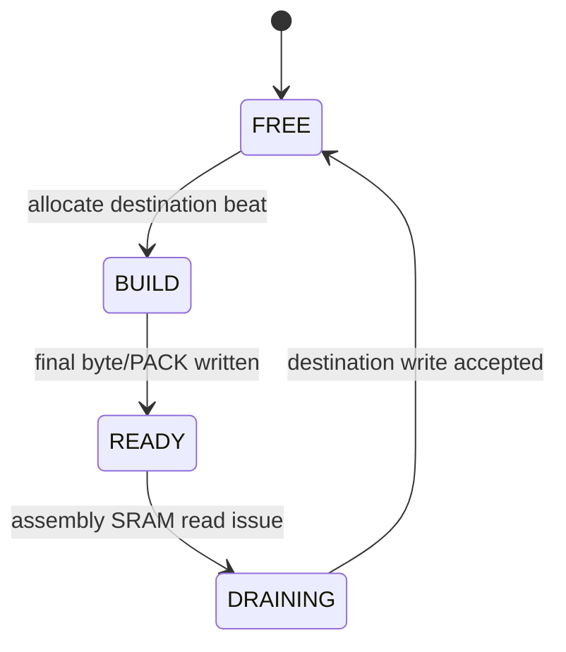

# Misaligned DMA response/assembly SRAM 기반 LUT/FF 최적화 계획

Created: 2026-07-17

- 상태: Phase 1 response SRAM 및 request payload 분리 구현/검증 완료
- 대상: `hw/rtl/core/VX_dma_unit_misal.sv`
- 기준 빌드: `xrt_hw_u55c_c1_f100_fpint_L2cache_8d9b4939d1`
- 기본 설정: `MISALIGN_PACK_BYTES=16`

## 구현 결과 (2026-07-18)

C4 동일 OOC 조건에서 최종적으로 다음 구조를 유지한다.

- source response payload는 `VX_dp_ram`에 저장한다.
- source read request queue는 address/flags/tag만 저장한다.
- destination write는 완성된 payload를 1-entry holding buffer에 저장한다.
- 기존 destination assembly register와 PACK datapath는 유지한다.

| Metric | Baseline | Final | Delta |
|---|---:|---:|---:|
| LUT | 158,803 | 155,937 | -1.80% |
| FF | 40,264 | 32,419 | -19.48% |
| RAMB36 | 128 | 56 | -56.25% |
| RAMB18 | 24 | 32 | +33.33% |
| WNS | +0.350 ns | +0.915 ns | +0.565 ns |

64/128, 64/64, 128/64 byte width의 misaligned DMA VCS test는 각각
2,125/2,125를 통과했다. `softmax opt`, `seqk=17` xrt-vcs-sim도 39,077
cycle로 통과했다. 자세한 비교는
`docs/future_optim/dma_experiments/20260718-013-misaligned-response-wrbuf1/comparison.md`에 있다.

Fully direct write는 RAMB36 수는 동일했지만 LUT가 증가했고, 강한 주기적
backpressure test에서 baseline보다 14.6% 느려져 폐기했다. 1-entry holding
buffer를 사용한 최종안은 동일 test에서 4.2% 느리며 xrt-vcs workload에서는
response-SRAM-only 대비 8 cycle(0.02%) 차이였다.

## 범위

이 문서는 misaligned DMA만 다룬다.

- source와 destination base address가 각 port beat 경계에 정렬되지 않은 경우를 지원한다.
- source와 destination port width가 같거나 서로 다른 경우를 모두 고려한다.
- 기존 PACK 경로, aligned fast path, padding/partial-byte 동작을 유지한다.
- source response payload와 destination assembly payload를 명시적인 SRAM으로 이동한다.
- wide payload를 저장하는 `VX_elastic_buffer`는 control-only 경로로 축소하거나 제거한다.
- DMA descriptor 형식, outstanding 수, transfer ordering은 1차 변경에서 유지한다.

Aligned DMA는 `docs/future_optim/dma_bram_optimization.md`에서 별도로 다룬다.

## 목표

- `slot_data_r`에 저장되는 outstanding source response payload를 FF에서 명시적인 1R1W SRAM으로 이동한다.
- PACK 결과를 destination beat로 조립하는 `wr_dcache_data_r`와 `wr_lmem_data_r`를 banked assembly SRAM으로 대체한다.
- SRAM 뒤에 별도의 wide output register를 추가하지 않는다.
- destination write data는 assembly SRAM read output에서 직접 구동한다.
- PACK 및 aligned fast path의 byte throughput을 유지한다.
- source/destination misalignment, port width mismatch, padding, partial final beat의 기존 동작을 보존한다.

## 현재 구조와 비용

기준 utilization report는 다음 build artifact의 `bin/hier_utilization.rpt`이다.

```text
xrt_hw_u55c_c1_f100_fpint_L2cache_8d9b4939d1
```

| 영역 | LUT | FF | RAMB36 | DSP |
|---|---:|---:|---:|---:|
| `u_VX_dma_node` | 25,721 | 13,563 | 16 | 16 |
| `u_dma_unit` / `VX_dma_unit_misal` | 21,621 | 5,763 | 0 | 16 |
| `VX_dma_unit_misal` 자체 조합/순차 로직 | 20,122 | 4,334 | 0 | 16 |
| `dcache_req_buf` | 1,294 | 1,217 | 0 | 0 |

현재 RTL의 주요 wide storage와 mux는 다음과 같다.

- `slot_data_r[RD_OUTSTANDING][MAX_BYTES*8]`: source response payload를 outstanding slot별 FF에 저장한다.
- `slot_data_r[wr_expect_slot_r]`: PACK engine 앞에 wide dynamic slot-selection mux를 만든다.
- `wr_dcache_data_r`, `wr_lmem_data_r`: 여러 PACK을 하나의 destination beat로 조립하는 wide FF다.
- `insert_dcache_pack()`와 `insert_lmem_pack()`: old wide word를 읽고 일부 byte를 교체하는 wide read-modify-write mux를 만든다.
- `dcache_req_buf`와 `lmem_req_buf`: read request에도 사용하지 않는 wide write payload 필드를 포함한다.

`slot_data_r`만 SRAM으로 옮기면 outstanding payload FF와 slot-selection mux는 줄지만 destination assembly FF와 wide insertion network는 남는다. 큰 LUT/FF 감소를 얻으려면 response storage와 destination assembly를 모두 SRAM 기반으로 바꾸는 것이 좋다.

## 설계 결정

### 두 개의 독립적인 SRAM storage 사용

Misaligned DMA에서는 response SRAM 하나만으로 전체 wide payload storage를 제거할 수 없다. Destination beat 하나가 여러 source response의 일부를 포함할 수 있고, source response 하나가 두 destination beat에 나뉠 수도 있기 때문이다.

권장 datapath는 다음과 같다.



SRAM은 두 개의 논리 storage로 분리한다.

1. Response payload SRAM은 source response capture와 PACK drain을 담당한다.
2. Destination assembly SRAM은 PACK/fast data 조립과 destination write drain을 담당한다.

두 storage를 하나의 1R1W SRAM으로 합치지 않는다. 같은 cycle에 새로운 source response capture와 기존 response에서 생성한 PACK write가 동시에 발생할 수 있어 두 write가 충돌하기 때문이다. 이를 합치려면 response backpressure 또는 2-write-port memory가 필요해진다.

### 명시적인 `dp_sram` 사용

SRAM은 pragma 기반 inference로 만들지 않는다.

- `(* ram_style = "block" *)`을 사용하지 않는다.
- inferred unpacked array 구현에 의존하지 않는다.
- Xilinx primitive 또는 XPM 선택은 명시적인 `dp_sram` 모듈 내부에 격리한다.
- payload memory 자체는 reset하지 않는다.

공통 SRAM 계약:

- 독립적인 1 write port와 1 read port
- synchronous read latency는 정확히 1 cycle
- `rd_en=0`일 때 `rd_data` 유지
- 서로 다른 address에 대한 read/write 동시 수행
- same-address read/write는 상위 slot state로 금지

Destination assembly SRAM에는 추가로 byte write-enable이 필요하다. Misaligned PACK이 bank 내부의 일부 byte만 갱신하거나 인접한 두 bank에 걸칠 수 있기 때문이다.

현재 저장소에는 이 계약을 제공하는 `dp_sram` 모듈이 없으므로 구현 단계에서 공통 memory wrapper를 추가해야 한다.

## Response payload SRAM

Response payload SRAM은 aligned DMA에서 제안한 slot lifecycle을 그대로 사용할 수 있다.



구조:

- width: `MAX_BYTES * 8`
- depth: `RD_OUTSTANDING`
- write address: response tag의 slot ID
- read address: `wr_expect_slot_r`
- write data: dcache 또는 lmem response data를 low bits에 배치하고 나머지는 사용하지 않음

작은 metadata는 FF에 유지한다.

- source lane
- slot remaining bytes
- slot state
- 실제 source port width
- slot ordering 정보

동작:

1. Source response가 도착하면 tag로 지정된 `WAIT_RSP` slot에 payload를 쓴다.
2. 현재 writer가 기다리는 slot이 `READY`이면 SRAM read를 시작하고 slot을 `DRAINING`으로 바꾼다.
3. SRAM output을 PACK 또는 fast extractor가 소비하는 동안 read를 다시 실행하지 않는다.
4. PACK downstream이 stall되면 `rd_en=0`으로 SRAM output과 관련 metadata를 유지한다.
5. 현재 source slot의 마지막 byte를 소비하는 cycle에는 다음 `READY` slot의 read를 동시에 시작할 수 있다.
6. Source slot을 완전히 소비한 뒤에만 `FREE`로 반환한다.

Response SRAM output 뒤에는 `MAX_BYTES*8` 폭 register를 추가하지 않는다. SRAM의 synchronous output register가 현재 source payload holding entry 역할을 수행한다.

## PACK과 aligned fast path

기존 `make_src_pack()`의 역할은 유지한다.

- source byte lane을 기준으로 `PACK_BYTES` 단위 데이터를 추출한다.
- source slot 끝에서는 `slot_remaining`까지만 소비한다.
- destination room과 segment remaining을 넘지 않도록 `pack_move_bytes`를 제한한다.
- source beat 경계를 넘는 PACK을 한 번에 만들지 않는다.
- source slot 끝의 partial PACK은 assembly slot에 먼저 쓰고 다음 response slot의 PACK이 같은 destination beat를 이어서 채운다.

PACK stage에는 narrow payload와 control만 저장한다.

```text
PACK_BITS data
+ valid byte count
+ destination assembly slot
+ destination bank index/byte offset
+ source-slot-last
+ destination-beat-last
```

현재의 `pack_fast_move`도 유지한다. Source와 destination lane이 `FAST_BYTES`에 정렬된 구간은 여러 PACK bank를 같은 cycle에 병렬로 write하여 misaligned engine을 통과하는 aligned 구간의 throughput이 `PACK_BYTES` 단위로 낮아지지 않도록 한다.

## Destination assembly SRAM

### PACK 단위 banking

Destination assembly SRAM은 `PACK_BYTES` 단위 bank로 구성한다.

예를 들어 `MAX_BYTES=64`, `PACK_BYTES=16`이면 네 bank를 사용한다.

| Bank | Destination byte range |
|---|---:|
| 0 | 0–15 |
| 1 | 16–31 |
| 2 | 32–47 |
| 3 | 48–63 |

각 bank는 동일 depth의 명시적인 1R1W `dp_sram` 인스턴스다.

- write address: 현재 BUILD assembly slot
- read address: 현재 DRAINING assembly slot
- write data: PACK 또는 fast-path data의 해당 bank 부분
- write byte-enable: 이번 move에서 실제로 갱신하는 byte mask
- read: 모든 active bank를 같은 slot address로 동시에 읽음
- output: bank read output을 concatenate하여 destination bus data를 만듦

Misaligned PACK은 destination byte offset에 따라 최대 두 bank에 걸친다.

```text
PACK_BYTES = 16, destination lane = 7

bank 0 bytes 7..15 <- PACK bytes 0..8
bank 1 bytes 0..6  <- PACK bytes 9..15
```

두 bank는 독립적인 SRAM 인스턴스이므로 같은 cycle에 각각 한 번씩 write할 수 있다. Wide old-data word를 읽어 merge하지 않고, byte write-enable로 필요한 byte만 갱신한다.

### Assembly slot lifecycle

두 개의 assembly slot을 ping-pong으로 사용하는 것을 기본으로 한다.



- 한 slot이 destination stall 때문에 `DRAINING` 상태로 유지되는 동안 다른 slot에서 다음 destination beat를 조립할 수 있다.
- 두 slot이 모두 점유되면 PACK stage를 backpressure한다.
- Final PACK write와 같은 address의 read를 같은 cycle에 수행하지 않는다.
- Assembly slot이 `READY`가 된 다음 cycle부터 read 대상으로 선택한다.
- Destination write가 stall되면 assembly SRAM의 `rd_en=0`과 output metadata hold로 write request를 안정적으로 유지한다.
- Destination write가 accept되는 cycle에는 다음 `READY` assembly slot의 read를 시작할 수 있다.

Assembly payload memory는 slot 할당 시 clear하지 않는다. Slot별 byte-enable metadata만 0으로 초기화하고, 실제로 write된 byte의 enable bit를 set한다. Final partial beat에서 enable되지 않은 SRAM byte는 stale일 수 있지만 destination byte-enable이 0이므로 관찰되지 않는다.

필요한 작은 metadata:

- assembly slot state
- destination address
- destination byte-enable
- active destination width/bank count
- segment-last/descriptor-last
- ready ordering 또는 2-entry ready queue

## Port width가 다른 경우

제안 구조는 source와 destination port width가 달라도 사용할 수 있다.

Response SRAM은 `MAX_BYTES` 폭으로 고정하고 실제 source width만큼의 low bits를 사용한다. Assembly SRAM도 `MAX_BYTES / PACK_BYTES` bank로 만들고 실제 destination width에 해당하는 low bank들만 활성화한다.

1차 구현은 다음 elaboration 조건을 요구한다.

```text
PACK_BYTES <= MIN_BYTES
DCACHE_BYTES % PACK_BYTES == 0
LMEM_BYTES % PACK_BYTES == 0
FAST_BYTES % PACK_BYTES == 0
```

### Same width

- 한 source response가 destination alignment에 따라 하나 또는 두 destination beat에 기여할 수 있다.
- PACK은 source slot의 유효 범위를 순서대로 assembly slot에 기록한다.
- 완성된 destination beat만 한 번의 write request로 전송한다.

### Wide source to narrow destination

- Response SRAM의 wide output을 여러 PACK/fast move로 소비한다.
- Narrow destination beat가 완성될 때마다 assembly slot을 `READY`로 전환한다.
- Source SRAM output은 해당 source slot의 마지막 byte가 소비될 때까지 유지한다.

### Narrow source to wide destination

- 여러 source response가 하나의 assembly slot에 순차적으로 기여한다.
- Source slot이 바뀌어도 destination beat가 완성되지 않았으면 같은 BUILD slot을 유지한다.
- Wide accumulator FF 없이 assembly SRAM과 byte-enable metadata가 destination word를 보존한다.

Port width 변환과 misalignment를 동시에 처리해도 source ordering은 기존 `wr_expect_slot_r` 순서를 유지한다. Response가 out-of-order로 도착할 수 있지만 SRAM에는 tag slot로 저장하고 PACK drain만 순서대로 진행한다.

## Padding과 partial beat

기존 `pack_src_bytes == 0` padding 동작을 유지한다.

- Padding byte는 zero data와 유효 byte-enable을 assembly SRAM에 write한다.
- Source payload를 소비하지 않으므로 response slot state와 lane은 변경하지 않는다.
- Segment 시작/끝의 destination partial beat는 실제 segment에 해당하는 byte-enable만 set한다.
- Disabled output byte는 stale SRAM data여도 무관하다.
- 동일 assembly byte를 두 번 write하지 않도록 기존 byte-enable과 신규 byte-enable의 overlap을 assertion으로 검사한다.

## Request control path

현재 `dcache_req_buf`와 `lmem_req_buf`는 read request에도 wide data와 byte-enable을 함께 저장한다. SRAM 전환 후에는 payload와 control을 분리한다.

Source read request control:

```text
rw + address + flags + tag
```

Destination write control:

```text
address + byte-enable + assembly slot ID + segment/descriptor flags
```

Destination write payload는 control queue에 복사하지 않고 assembly SRAM output에서 가져온다.

- Source port는 narrow control elastic buffer를 사용한다.
- Destination port는 assembly SRAM output holding stage에서 직접 구동한다.
- Timing isolation이 필요하면 metadata-only elastic buffer 또는 ready queue를 둔다.
- Destination stall 중에는 metadata와 assembly SRAM output을 함께 유지한다.
- Direction에 따라 dcache/lmem의 source-control path와 destination-drain path를 선택한다.

Wide data를 기존 request elastic buffer에 다시 넣으면 SRAM으로 옮긴 payload가 FF에 재복제되므로 최적화 효과가 크게 줄어든다.

## 동시 동작과 port 사용

정상 pipeline에서는 다음 동작이 서로 겹칠 수 있어야 한다.

| Storage | Write port | Read port |
|---|---|---|
| Response SRAM | 새 source response capture | 현재 source slot PACK drain |
| Assembly SRAM | 현재 PACK/fast move 조립 | 완성된 destination beat drain |

추가 규칙:

- Response SRAM에서 capture slot과 drain slot이 같지 않도록 slot state로 보장한다.
- Assembly SRAM에서 BUILD slot과 DRAINING slot이 같지 않도록 보장한다.
- Response SRAM read stall과 assembly SRAM read stall은 독립적이다.
- Assembly slot이 모두 찼을 때만 PACK을 멈추고, 그 결과 response SRAM output도 유지한다.
- Response slot이 모두 찼을 때 source read request 발행을 중단한다.

## 예상 BRAM 비용

BRAM 사용량은 `dp_sram`의 primitive packing에 따라 달라지지만, shallow memory이므로 depth보다 width가 지배한다.

대략적인 RAMB36 수:

```text
response SRAM  ~= ceil(MAX_BITS / 72)
assembly SRAM  ~= ceil(MAX_BITS / 72)
total          ~= 2 * ceil(MAX_BITS / 72)
```

`MAX_BITS=512`이면 약 16 RAMB36 수준이다. PACK banking과 byte-enable mapping에 따라 실제 수치는 달라질 수 있다. 현재 `VX_dma_unit_misal`이 RAMB36을 사용하지 않으므로 BRAM 증가를 의도적으로 허용하고 LUT/FF 및 routing congestion 감소를 목표로 한다.

## 구현 순서

### Phase 1: Response payload SRAM

- 공통 명시적 1R1W `dp_sram`을 추가한다.
- `slot_data_r`를 response SRAM으로 이동한다.
- `FREE/WAIT_RSP/READY/DRAINING` lifecycle을 적용한다.
- SRAM output에서 기존 PACK/fast extractor를 구동한다.
- 기존 wide destination accumulator는 이 단계에서 유지한다.
- 기능과 response-slot ordering을 먼저 검증하고 FF/LUT 변화를 측정한다.

### Phase 2: Banked destination assembly SRAM

- PACK 크기의 byte-write-enable bank들을 추가한다.
- 두 개의 ping-pong assembly slot과 lifecycle을 구현한다.
- `wr_dcache_data_r`, `wr_lmem_data_r`와 wide `insert_*` read-modify-write 경로를 제거한다.
- PACK boundary crossing, fast multi-bank write, padding을 bank write로 변환한다.
- Assembly SRAM output direct-write holding protocol을 적용한다.

### Phase 3: Request payload/control 분리

- Source read request buffer를 control-only로 축소한다.
- Destination request의 wide payload buffer를 제거한다.
- Metadata-only queue와 assembly slot lifetime을 연결한다.
- Request가 accept되기 전에 assembly slot이 free되지 않도록 한다.

세 phase를 한 patch에서 구현하지 않는다. 각 단계마다 기능, 자원, throughput, timing을 독립적으로 비교한다.

## 검증 계획

RTL unittest와 blackbox 실행 전에는 적절한 config를 source하고 configure된 build directory를 사용한다. RTL simulation blackbox는 `xrt-vcs-sim`으로 실행한다.

필수 테스트 축:

| 항목 | 값 |
|---|---|
| 방향 | L2G, G2L |
| source/destination offset | 0, 1, `PACK_BYTES-1`, `PACK_BYTES`, beat 마지막 byte |
| transfer size | 1 byte, PACK보다 작음, PACK 경계, beat 경계, multi-beat |
| width ratio | 1:1, 2:1, 4:1, 1:2, 1:4 |
| destination ready | 항상 ready, 주기적 stall, 장기 stall, random stall |
| response order | in-order, 가능한 경우 out-of-order |
| segment | 첫/마지막 partial beat, 연속 segment, stride 전환 |
| padding | 없음, PACK 내부 시작, source 종료 후 padding, padding-only tail |
| 동시 동작 | response write/read 및 assembly write/read 동시 수행 |

필수 assertion:

- Response SRAM write는 `WAIT_RSP` slot에만 수행한다.
- Response SRAM read는 `READY` slot에만 수행한다.
- `DRAINING` response slot에 response를 다시 쓰지 않는다.
- Response SRAM output stall 중 payload와 source metadata가 안정적이다.
- Assembly SRAM write는 `BUILD` slot에만 수행한다.
- Assembly SRAM read는 `READY` slot에만 수행한다.
- BUILD slot과 DRAINING slot의 address가 같지 않다.
- Assembly byte-enable이 이미 set된 byte를 다시 쓰지 않는다.
- Destination stall 중 assembly SRAM output과 request metadata가 안정적이다.
- Destination request fire 전 assembly slot을 free하지 않는다.
- Source slot의 마지막 byte를 소비하기 전에 response slot을 free하지 않는다.
- Done 시 response slot, assembly slot, PACK stage, request control queue가 모두 비어 있다.

기능 비교는 기존 misaligned DMA unittest의 byte-exact 결과를 기준으로 한다. 특히 source beat 경계와 destination beat 경계가 서로 다른 cycle에 나타나는 case를 포함해야 한다.

## 성공 기준

### 기능

- Misaligned DMA RTL unittest와 `xrt-vcs-sim` blackbox 통과
- 모든 offset, width ratio, padding, backpressure 조합에서 data loss, duplication, reorder 없음
- Partial destination write의 data와 byte-enable 정확성 유지
- Existing aligned-fast condition과 PACK fallback 결과가 기존 RTL과 bit-exact하게 일치

### 자원

- `slot_data_r` payload FF 제거
- `wr_dcache_data_r`, `wr_lmem_data_r` wide assembly FF 제거
- `insert_dcache_pack()`와 `insert_lmem_pack()`의 wide old-data merge network 제거
- Request elastic buffer의 wide payload storage 제거
- `VX_dma_unit_misal`의 현재 5,763 FF와 21,621 LUT를 기준으로 단계별 감소 확인
- BRAM 증가는 허용하되 DMA hierarchy와 상위 partition의 BRAM column congestion 확인

### 성능

- `pack_fast_move`가 가능한 구간은 기존 fast-path byte rate 유지
- PACK fallback은 기존과 동일한 최대 `PACK_BYTES/cycle` 유지
- Destination write request 수는 기존과 동일하게 destination beat당 한 번 유지
- Destination stall 해제 후 ready assembly slot 사이에 불필요한 bubble을 추가하지 않음
- WNS 및 route congestion이 기준보다 악화되지 않음

## 위험과 대응

| 위험 | 대응 |
|---|---|
| Assembly SRAM의 byte write-enable이 BRAM primitive로 mapping되지 않음 | `dp_sram` 내부에서 지원 가능한 native width와 byte-enable granularity로 bank를 분할하고 synthesis hierarchy를 확인 |
| PACK이 두 bank에 걸릴 때 두 write가 충돌함 | bank별 독립 1R1W 인스턴스를 사용하고 한 bank에 cycle당 최대 한 write만 허용 |
| Final PACK write와 assembly read가 same-address collision을 만듦 | READY 전환 다음 cycle부터 read를 허용하고 assertion 추가 |
| Destination stall 때문에 assembly slot이 고갈됨 | 2-entry ping-pong과 PACK backpressure 적용 |
| Backpressure가 source response까지 전파되어 deadlock 발생 | response slot과 assembly slot의 독립 lifecycle 및 occupancy invariant 검증 |
| Fast path 제거로 aligned subrange throughput이 감소함 | multi-bank parallel write로 기존 `pack_fast_move` 유지 |
| Disabled output byte의 stale data가 노출됨 | destination byte-enable 안정성 assertion과 partial-write test 추가 |
| Width/direction별 mux가 다시 큰 combinational cone을 만듦 | elaboration-time bank generate와 port별 active bank mask 사용 |
| SRAM output 뒤에 wide request buffer가 재도입됨 | payload는 assembly SRAM에만 저장하고 request queue는 metadata-only로 제한 |
| BRAM 사용량 또는 placement가 예상보다 큼 | Phase별 post-synthesis/post-physopt hierarchy report로 LUT/FF/BRAM/WNS 비교 |

## 대안과 비범위

### Response SRAM만 적용

가장 낮은 위험의 1차 단계다. Outstanding payload FF와 dynamic slot-selection mux는 제거하지만 destination wide accumulator와 insertion network는 남는다. Phase 1 검증 경로로는 적합하지만 최종 구조로 보지 않는다.

### PACK마다 destination partial write 발행

Assembly SRAM을 제거할 수 있지만 destination write transaction이 최대 `DST_BYTES / PACK_BYTES`배 증가한다. Byte-enable partial write가 기능적으로 가능하더라도 DMA 대역폭과 request arbitration 효율이 나빠질 수 있으므로 채택하지 않는다.

### 하나의 SRAM으로 response와 assembly 통합

동시 source response capture와 PACK assembly write가 한 write port에서 충돌한다. 1R1W SRAM 계약을 유지하기 위해 채택하지 않는다.

### 별도 후속 검토

- `VX_lmem_dma_misal`에 동일 storage 구조 적용
- `RD_OUTSTANDING` 또는 assembly slot 수 조정
- `MISALIGN_PACK_BYTES` 변경에 따른 LUT/BRAM/throughput sweep
- DMA channel 또는 multiplier 공유
- DMA arbiter의 `REQ_OUT_BUF/RSP_OUT_BUF` 축소
- Aligned DMA와 misaligned DMA의 공통 `dp_sram`/metadata-control 모듈화
