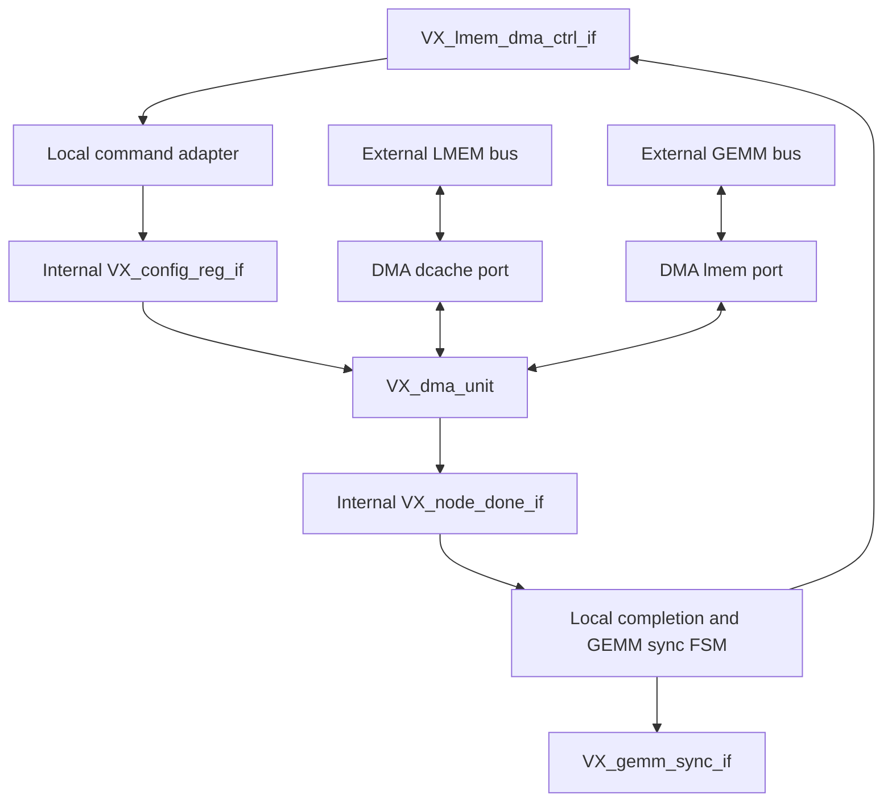

# Reuse the Common DMA Engine for LMEM-to-GEMM Transfers

Created: 2026-07-17

- Status: proposed
- Scope: `VX_dma_unit`, `VX_dma_unit_misal`, `VX_dma_unit_align`, and
  `VX_lmem_dma_misal`
- Change class: bounded internal architecture refactor

## Summary

Replace the duplicated transfer datapath in `VX_lmem_dma_misal` with an
instance of the common DMA engine. Keep the GEMM-facing control, completion,
and synchronization behavior in a thin local-DMA wrapper.

The data-bus mapping is compatible with the existing direction conventions:

```text
VX_lmem_dma_misal wrapper
  external lmem_bus_if -> internal dcache_bus_if
  external gemm_bus_if -> internal lmem_bus_if

  DIR=0 -> internal direction=0 -> LMEM -> GEMM
  DIR=1 -> internal direction=1 -> GEMM -> LMEM
```

This reuse is functionally feasible, but the common DMA needs compile-time
direction and outstanding-depth parameters before it can preserve the area and
performance characteristics of the current local DMA.

## Motivation

`VX_dma_unit_misal` and `VX_lmem_dma_misal` independently implement the same
fundamental transfer machinery:

- three-dimensional strided segment address generation;
- independent read and write state machines;
- tagged outstanding reads and response reorder slots;
- source alignment and destination byte-enable generation;
- backpressure-safe response capture and write issue;
- aligned fast paths and byte-misaligned assembly.

The local DMA should retain only GEMM-specific policy:

- `VX_lmem_dma_ctrl_if` command capture;
- compile-time transfer direction;
- exact-copy semantics with no padding;
- GEMM synchronization after the copy completes;
- local-DMA performance-counter semantics.

## Current Semantic Differences

| Property | Common DMA | Local GEMM DMA |
| --- | --- | --- |
| Endpoints | DCache/global memory and LMEM | LMEM and GEMM memory port |
| Direction | Descriptor bit, selected at runtime | `DIR` parameter, fixed per instance |
| Command interface | `VX_config_reg_if` | `VX_lmem_dma_ctrl_if` |
| Completion | `VX_node_done_if` ready/valid handshake | `idle`/`done` plus GEMM sync |
| Bus widths | Source and destination widths may differ | Both widths must match |
| Padding | Reads `seg_size - padding` and zero-fills the tail | Copies all `seg_size` bytes |
| Misalignment selection | Separate aligned/misaligned backends under `VX_dma_unit` | `ENABLE_MISALIGN` parameter in one module |
| Outstanding reads | `DMA_RD_OUTSTANDING_SLOT`, default 2 | Eight slots |
| Segment prefetch | Bounded by available slots | Explicit `RD_PREFETCH_DEPTH` policy |

The wrapper must deliberately adapt these differences instead of treating the
two existing modules as drop-in replacements.

## Proposed Architecture



Instantiate `VX_dma_unit`, not `VX_dma_unit_misal` directly. This preserves the
existing `ENABLE_MISALIGN=0` area optimization by selecting
`VX_dma_unit_align` for aligned-only local-DMA instances.

## Internal Command Mapping

Create internal `VX_config_reg_if` and `VX_node_done_if` instances inside
`VX_lmem_dma_misal`. Map a local command to the existing DMA register layout:

| DMA register | Wrapper value |
| --- | --- |
| `regs[0][0]` | Start bit |
| `regs[1]` | Destination base address, low 32 bits |
| `regs[2]` | Destination base address, high 32 bits |
| `regs[3]` | Source base address, low 32 bits |
| `regs[4]` | Source base address, high 32 bits |
| `regs[5 + 2*d]` | Source stride for dimension `d` |
| `regs[6 + 2*d]` | Destination stride for dimension `d` |
| `regs[11 + d]` | Bound for dimension `d` |
| `regs[14]` | Segment size |
| `regs[15]` | `0`, because local DMA has no padding |
| `regs[16][0]` | `DIR` |
| Other bits/registers | `0` |
| `entry_id` | `0` |

Drive internal `cfg_reg_if.valid` only when the local wrapper is idle and
`ctrl_if.start` is asserted. The common DMA's idle-state `ready` then accepts
the command in the same way as the current local-DMA start condition.

## Required Common-DMA Parameters

### Compile-Time Direction

Add a direction override to `VX_dma_unit` and both selected implementations:

```systemverilog
parameter int FIXED_DIR = -1; // -1: descriptor, 0 or 1: compile-time fixed

wire active_dir = (FIXED_DIR < 0)
                ? direction_bit_r
                : FIXED_DIR[0];
```

Use `active_dir` for every source/destination selection.

Writing a constant `DIR` into `regs[16]` is not sufficient for area pruning.
The current implementation stores it in `direction_bit_r`; a `DIR=1` instance
therefore has a reset value of zero and a running value of one, so synthesis
cannot reliably treat the register as constant. The explicit override lets the
unused direction logic be removed for each local-DMA instance.

### Outstanding Read Depth

Expose the outstanding slot count as a parameter instead of relying only on a
global macro:

```systemverilog
parameter int RD_OUTSTANDING = `DMA_RD_OUTSTANDING_SLOT;
```

The local wrapper should initially pass `8` to match the existing local DMA.
The implementation must assert that both source alternatives have enough
`tag.value` bits for the requested slot count. If a smaller effective depth is
allowed instead, it must be an explicit performance decision rather than an
implicit truncation.

Keep the existing global-DMA default unchanged so this refactor does not alter
unrelated DMA instances.

### Misalignment Selection

Forward the local `ENABLE_MISALIGN` parameter into `VX_dma_unit`:

```systemverilog
VX_dma_unit #(
    .ENABLE_MISALIGN (ENABLE_MISALIGN),
    .FIXED_DIR       (DIR),
    .RD_OUTSTANDING  (8),
    // Address and tag widths forwarded from the two external interfaces.
) dma_core (...);
```

Both aligned and misaligned common-DMA backends must support `FIXED_DIR` and
the explicit outstanding-depth parameter.

## Completion and Synchronization Wrapper

Use a small wrapper FSM:

```text
IDLE
  -> COPY     when the internal DMA command is accepted
  -> SYNC     when internal done_if.valid is asserted
  -> DONE     when gemm_sync_if.ready accepts the sync command
  -> IDLE     after one externally visible done cycle
```

State behavior:

- `IDLE`: assert `ctrl_if.idle` and accept `ctrl_if.start`.
- `COPY`: wait for the common DMA's `done_if.valid`.
- `SYNC`: assert `gemm_sync_if.valid` with the command's latched `reg_idx` and
  `reg_value`.
- When sync is accepted, assert the internal `done_if.ready` so the common DMA
  can return to idle.
- `DONE`: assert `ctrl_if.done` for one cycle and then return to `IDLE`.
- Under `GEMM_NAIVE`, bypass `SYNC` because the naive controller emits its own
  synchronization commands.

The internal DMA completion is a held ready/valid transaction, so the wrapper
can safely delay `done_if.ready` until GEMM synchronization completes.

## Tag Handling

The current local DMA constructs a slot tag from the complete bus tag, whereas
the common DMA reserves `tag.uuid` for the command entry ID and stores the slot
only in `tag.value`.

For the wrapper:

- use a constant internal `entry_id` of zero;
- use only `tag.value` for response slot identification;
- require at least three `tag.value` bits to preserve eight outstanding slots;
- keep separate address- and tag-width parameters for the LMEM and GEMM ports;
- add elaboration assertions for unsupported width combinations.

If an existing configuration cannot provide three value bits, either reduce
the local outstanding depth deliberately or generalize the common core to
place slot bits in `uuid` when necessary. Do not silently reduce the effective
slot count.

## Performance-Counter Adaptation

Connect the common DMA's performance output to an internal `dma_perf_t`, then
map it into the local DMA's public `perf` output.

Review each field rather than assigning the structure wholesale:

- preserve byte, transfer, active-cycle, fire, and stall counters where their
  event definitions match;
- retain the local convention that `wait_dcache` and `wait_lmem` are zero;
- do not expose the common engine's internal `dcache` name as if the external
  LMEM traffic were actual DCache traffic;
- verify that partial-beat byte counts match the current local-DMA definition.

## Behavioral Changes to Decide Explicitly

### Zero-Size Commands

The common DMA treats zero bounds or zero segment size as a completed no-op.
The current local DMA enters its run state without a zero-size guard and relies
on the caller to provide nonzero commands.

The preferred behavior after reuse is the common DMA's safe no-op completion,
but tests and documentation should record this as an intentional contract
change.

### Request Buffering

The common misaligned DMA contains four-entry registered request buffers. The
current local DMA drives requests directly. Reuse may therefore change:

- command-to-first-request latency;
- steady-state backpressure behavior;
- completion latency after the last assembled write;
- timing and register/LUT utilization.

Functionality should remain equivalent, but performance and synthesis results
must be compared before accepting the replacement.

### Segment Read-Ahead

The current local DMA exposes `RD_PREFETCH_DEPTH`; the common DMA advances
across segments while reorder slots are available. Initially preserve the
existing local behavior as closely as possible by matching outstanding depth.
If measured workloads show a regression, expose an optional segment-ahead
limit in the common core rather than reintroducing a separate local datapath.

## Compatibility Work

The dedicated local-DMA unittest references implementation signals such as
`top_state`, `rd_state`, `wr_state`, `slot_occupancy_r`, and
`wr_win_valid_r` hierarchically for timeout diagnostics. Replacing the
implementation will change those names.

Either:

1. update the testbench to observe wrapper and nested-core state, or
2. provide temporary wrapper debug aliases during migration.

Functional interfaces should remain unchanged so GEMM-node instantiations do
not require control-path rewrites.

## Implementation Sequence

### Phase 1: Parameterize the Common DMA

1. Add `FIXED_DIR` to `VX_dma_unit`, `VX_dma_unit_align`, and
   `VX_dma_unit_misal`.
2. Replace direction-dependent datapath selection with the derived
   `active_dir` signal.
3. Expose outstanding read depth as a parameter while preserving the existing
   global-DMA default.
4. Add elaboration checks for power-of-two depth and available tag bits.
5. Run existing aligned and misaligned global-DMA unittests before changing
   the local DMA.

### Phase 2: Convert the Local DMA to a Wrapper

1. Retain the existing `VX_lmem_dma_misal` module interface and parameters.
2. Add internal config and done interfaces.
3. Map `ctrl_if` into the DMA register layout with padding and entry ID fixed
   to zero.
4. Instantiate `VX_dma_unit` with fixed direction and local outstanding depth.
5. Add the local completion/sync FSM.
6. Remap performance counters.
7. Update debug-only hierarchical references in the dedicated unittest.

### Phase 3: Verify and Measure

1. Run the dedicated local-DMA unittest in both directions.
2. Cover aligned, source-misaligned, destination-misaligned, and independently
   misaligned source/destination addresses.
3. Cover one-beat, multi-beat, partial-final-beat, and multi-segment transfers.
4. Exercise response reordering and request/response backpressure.
5. Verify normal GEMM sync and `GEMM_NAIVE` sync bypass.
6. Run GEMM-node tests that instantiate all local DMA channels.
7. Compare cycle counts for representative transfers.
8. Synthesize before and after with the same configuration and compare LUT,
   FF, BRAM, critical path, and per-instance hierarchy.

## Verification Targets

At minimum, use the configured build-directory flow for:

- `hw/unittest/lmem_dma_misal`;
- the global DMA aligned and misaligned unittests affected by the new common
  parameters;
- GEMM node variants that instantiate input, quantization-parameter, and
  output local DMAs;
- a GEMM integration or blackbox workload after RTL unittests pass.

Simulation should include assertions for:

- response arrival only into a waiting slot;
- no slot reuse before writer retirement;
- fixed direction matching the connected source and destination buses;
- tag-value width sufficient for the configured outstanding count;
- sync issued exactly once per completed local command;
- external `done` asserted only after required sync completion;
- no pending buffered requests when completion is acknowledged.

## Acceptance Criteria

The refactor is acceptable when all of the following hold:

- Existing local-DMA transfer results are bit-exact for both directions.
- `ENABLE_MISALIGN=0` and `ENABLE_MISALIGN=1` configurations both work.
- Padding remains disabled for local transfers.
- Normal and naive GEMM synchronization behavior is preserved.
- Eight outstanding reads are retained unless a measured alternative is
  explicitly approved.
- No global-DMA functional regression is introduced by the new parameters.
- Synthesis confirms that fixed direction removes unused direction logic.
- Area and timing are no worse than the dedicated local DMA by an amount that
  outweighs the maintenance benefit.
- Performance changes are measured and documented, not inferred only from RTL
  structure.

## Recommended Decision

Proceed with the wrapper-based reuse, but do not replace
`VX_lmem_dma_misal` with an unmodified `VX_dma_unit_misal` instance.

First add compile-time direction and explicit outstanding-depth parameters to
the common DMA. Then retain `VX_lmem_dma_misal` as a thin adapter responsible
for command translation, exact-copy policy, GEMM synchronization, and local
performance semantics.
