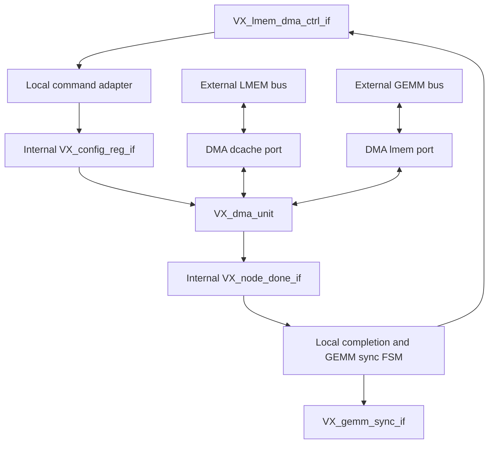

# Reuse the Common DMA Engine for LMEM-to-GEMM Transfers

Created: 2026-07-17
Updated: 2026-07-18

- Status: implemented and verified
- Scope: `VX_gpu_pkg`, `VX_dma_unit`, `VX_dma_unit_misal`,
  `VX_dma_unit_align`, `VX_lmem_dma_misal`, their local-DMA instantiations,
  and the dedicated local-DMA unittest/build manifest
- Change class: bounded internal architecture refactor

## Summary

Replace the duplicated transfer datapath in `VX_lmem_dma_misal` with an
instance of the common DMA engine. Keep the GEMM-facing control, completion,
and synchronization behavior in a thin local-DMA wrapper.

The data-bus mapping is compatible with the existing direction conventions:

```text
VX_lmem_dma_misal wrapper
  external lmem_bus_if -> internal dcache_bus_if
  external gemm_bus_if -> internal lmem_bus_if

  DIR=0 -> internal direction=0 -> LMEM -> GEMM
  DIR=1 -> internal direction=1 -> GEMM -> LMEM
```

This reuse is functionally feasible. The common DMA already exposes an
outstanding-depth parameter; the remaining common-core prerequisites are a
compile-time direction override and strict validation that the requested depth
fits in both response-tag value fields. The wrapper must also preserve the
local completion and performance-counter contracts explicitly.

Exact preservation of the local `RD_PREFETCH_DEPTH` segment-distance policy is
not required. The first implementation will use eight outstanding source reads
as the common DMA's implicit read-ahead window and will add a separate segment
limit only if measurement shows a material regression.

## Motivation

`VX_dma_unit_misal` and `VX_lmem_dma_misal` independently implement the same
fundamental transfer machinery:

- three-dimensional strided segment address generation;
- independent read and write state machines;
- tagged outstanding reads and response reorder slots;
- source alignment and destination byte-enable generation;
- backpressure-safe response capture and write issue;
- aligned fast paths and byte-misaligned assembly.

The local DMA should retain only GEMM-specific policy:

- `VX_lmem_dma_ctrl_if` command capture;
- compile-time transfer direction;
- exact-copy semantics with no padding;
- GEMM synchronization after the copy completes;
- local-DMA performance-counter semantics.

## Current Semantic Differences

| Property | Common DMA | Local GEMM DMA |
| --- | --- | --- |
| Endpoints | DCache/global memory and LMEM | LMEM and GEMM memory port |
| Direction | Descriptor bit, selected at runtime | `DIR` parameter, fixed per instance |
| Command interface | `VX_config_reg_if` | `VX_lmem_dma_ctrl_if` |
| Completion | `VX_node_done_if` ready/valid handshake | `idle`/`done` plus GEMM sync |
| Bus widths | Source and destination widths may differ | Both widths must match |
| Padding | Reads `seg_size - padding` and zero-fills the tail | Copies all `seg_size` bytes |
| Misalignment selection | Separate aligned/misaligned backends under `VX_dma_unit` | `ENABLE_MISALIGN` parameter in one module |
| Outstanding reads | `RD_OUTSTANDING` parameter, backend default 2 | Eight slots |
| Segment prefetch | Bounded by available slots | Explicit `RD_PREFETCH_DEPTH` policy |

The wrapper must deliberately adapt these differences instead of treating the
two existing modules as drop-in replacements.

## Proposed Architecture



Instantiate `VX_dma_unit`, not `VX_dma_unit_misal` directly. This preserves the
existing `ENABLE_MISALIGN=0` area optimization by selecting
`VX_dma_unit_align` for aligned-only local-DMA instances.

## Internal Command Mapping

Create internal `VX_config_reg_if` and `VX_node_done_if` instances inside
`VX_lmem_dma_misal`. Map a local command to the existing DMA register layout:

| DMA register | Wrapper value |
| --- | --- |
| `regs[0][0]` | Start bit |
| `regs[1]` | Destination base address, low 32 bits |
| `regs[2]` | Destination base address, high 32 bits |
| `regs[3]` | Source base address, low 32 bits |
| `regs[4]` | Source base address, high 32 bits |
| `regs[5 + 2*d]` | Source stride for dimension `d` |
| `regs[6 + 2*d]` | Destination stride for dimension `d` |
| `regs[11 + d]` | Bound for dimension `d` |
| `regs[14]` | Segment size |
| `regs[15]` | `0`, because local DMA has no padding |
| `regs[16][0]` | `DIR` |
| Other bits/registers | `0` |
| `entry_id` | `0` |

The config interface dimensions are part of the contract and must be explicit:

```systemverilog
VX_config_reg_if #(
    .NUM (`DMA_CFG_REG_NUM),
    .DW  (32)
) dma_cfg_if ();

VX_node_done_if dma_done_if ();
```

Drive internal `cfg_reg_if.valid` only when the local wrapper is idle and
`ctrl_if.start` is asserted. The common DMA's idle-state `ready` then accepts
the command in the same way as the current local-DMA start condition.

## Required Common-DMA Parameters

### Compile-Time Direction

Add a direction override to `VX_dma_unit` and both selected implementations:

```systemverilog
parameter int FIXED_DIR = -1; // -1: descriptor, 0 or 1: compile-time fixed

wire active_dir = (FIXED_DIR < 0)
                ? direction_bit_r
                : FIXED_DIR[0];
```

Use `active_dir` for every source/destination selection.

Writing a constant `DIR` into `regs[16]` is not sufficient for area pruning.
The current implementation stores it in `direction_bit_r`; a `DIR=1` instance
therefore has a reset value of zero and a running value of one, so synthesis
cannot reliably treat the register as constant. The explicit override lets the
unused direction logic be removed for each local-DMA instance.

A `DIR=0` wrapper may happen to receive some constant propagation because the
direction register resets to and runs at zero, but that result depends on
cross-hierarchy optimization and is not an architectural guarantee. A `DIR=1`
wrapper cannot use the same optimization because the register changes from
zero after reset to one when the command is accepted. `FIXED_DIR` is therefore
required for reliable pruning in both directions.

Do not introduce separate generate branches for the two directions in the
initial implementation. Keep one shared datapath and use the constant-select
`active_dir` expression above. Normal parameter propagation should fold the
unused mux inputs and direction-dependent state/control paths. Resource
utilization for `VX_dma_unit` was evaluated separately, so this refactor does
not repeat that comparison. Add explicit generate specialization only as a
separate follow-up if later integration evidence requires it.

### Outstanding Read Depth

The common DMA wrapper and both backends already expose:

```systemverilog
parameter int RD_OUTSTANDING = 2;
```

Do not change this default. Existing global-DMA parents already forward their
configured depth explicitly, and changing the backend default would alter
unrelated instances.

The local wrapper must pass the shared
`LMEM_DMA_RD_OUTSTANDING_SLOTS=8` package constant to match the existing local
DMA. Both backends
must assert that the depth is a positive power of two and that both source
alternatives provide at least `$clog2(RD_OUTSTANDING)` `tag.value` bits. In
particular, the misaligned backend must not silently derive a smaller
direction-specific effective depth from a narrow tag.

The initial implementation found that the legacy GEMM path exposed only one
`tag.value` bit. Preserve eight slots by making `LMEM_TAG_WIDTH` at least
`UUID_WIDTH + 3`, keeping `GEMM_MEM_TAG_WIDTH` consistent with it, and making
`GEMM_BASE_TAG_WIDTH` include `UUID_WIDTH` before its adapter payload fields.
Do not reduce the depth or place slot bits in `uuid`.

### Misalignment Selection

Forward the local `ENABLE_MISALIGN` parameter into `VX_dma_unit`:

```systemverilog
VX_dma_unit #(
    .ENABLE_MISALIGN (ENABLE_MISALIGN),
    .FIXED_DIR       (DIR),
    .RD_OUTSTANDING  (8),
    // External LMEM is the common core's dcache-side endpoint.
    .DCACHE_ADDR_WIDTH (LMEM_ADDR_WIDTH_P),
    .DCACHE_TAG_WIDTH  (LMEM_TAG_WIDTH_P),
    // External GEMM is the common core's lmem-side endpoint.
    .LMEM_ADDR_WIDTH   (GEMM_ADDR_WIDTH_P),
    .LMEM_TAG_WIDTH    (GEMM_TAG_WIDTH_P)
) dma_core (...);
```

Both aligned and misaligned common-DMA backends must support `FIXED_DIR` and
the existing outstanding-depth parameter.

Synopsys DC does not reliably support deriving these numeric parameters from
interface-instance parameters in a child parameter binding. Add explicit
LMEM/GEMM address- and tag-width parameters to `VX_lmem_dma_misal`, retain the
existing `TAG_WIDTH` as the compatibility default for the two tag-width
parameters, and update every production and unittest instantiation to pass
concrete address widths. Add elaboration checks that the explicit values match
the connected interfaces.

## Completion and Synchronization Wrapper

Use a small wrapper FSM:

```text
IDLE
  -> COPY     when the internal DMA command is accepted
  -> SYNC     when internal done_if.valid is asserted
  -> DONE     when gemm_sync_if.ready accepts the sync command
  -> IDLE     after one externally visible done cycle
```

State behavior:

- `IDLE`: assert `ctrl_if.idle` and accept `ctrl_if.start`.
- `COPY`: wait for the common DMA's `done_if.valid`.
- `SYNC`: assert `gemm_sync_if.valid` with the command's latched `reg_idx` and
  `reg_value`.
- When sync is accepted, assert the internal `done_if.ready` so the common DMA
  can return to idle.
- `DONE`: assert `ctrl_if.done` for one cycle and then return to `IDLE`.
- Under `GEMM_NAIVE`, when `done_if.valid` is observed in `COPY`, assert
  `done_if.ready` and transition directly to `DONE`. Do not assert
  `gemm_sync_if.valid`, because the naive controller emits its own
  synchronization commands.

The internal DMA completion is a held ready/valid transaction, so the wrapper
can safely delay `done_if.ready` until GEMM synchronization completes.

## Tag Handling

The current local DMA constructs a slot tag from the complete bus tag, whereas
the common DMA reserves `tag.uuid` for the command entry ID and stores the slot
only in `tag.value`.

For the wrapper:

- use a constant internal `entry_id` of zero;
- use only `tag.value` for response slot identification;
- require at least three `tag.value` bits to preserve eight outstanding slots;
- keep separate address- and tag-width parameters for the LMEM and GEMM ports;
- add elaboration assertions for unsupported width combinations.

If an existing configuration cannot provide three value bits, either reduce
the local outstanding depth deliberately or generalize the common core to
place slot bits in `uuid` when necessary. Do not silently reduce the effective
slot count.

## Performance-Counter Adaptation

Do not map the common DMA's `perf` structure field-for-field. Its byte counters
describe DCache/global-facing events and its active interval ends when the core
enters `S_DONE`; those meanings do not match the local DMA in both directions
or while GEMM synchronization is pending.

Keep a wrapper-owned local performance block driven by the external LMEM/GEMM
handshakes and wrapper states:

- count `rd_bytes` on every accepted source response, using the current local
  full-beat counting convention;
- count `wr_bytes` on every accepted destination write request;
- preserve source-read and destination-write fire/stall event definitions for
  both directions;
- count the wrapper `COPY` and `SYNC` intervals as active and busy, excluding
  `IDLE` and the externally visible one-cycle `DONE` state;
- increment `xfer_count` when the wrapper enters `DONE` after any required
  synchronization;
- keep `wait_dcache` and `wait_lmem` at zero.

The common core's performance output may remain connected to an internal signal
for debug, but it is not the public local-DMA performance source.

## Intentional Behavioral Differences

### Zero-Size Commands

The common DMA treats zero bounds or zero segment size as a completed no-op.
The current local DMA enters its run state without a zero-size guard and relies
on the caller to provide nonzero commands.

Adopt the common DMA's safe no-op completion as the local contract: a zero
bound or zero segment size performs no memory requests, follows the normal
required synchronization policy, and produces the normal one-cycle external
`done`. Add explicit tests for both normal and `GEMM_NAIVE` configurations.

### Request Buffering

The common misaligned DMA contains four-entry registered request buffers. The
current local DMA drives requests directly. Reuse may therefore change:

- command-to-first-request latency;
- steady-state backpressure behavior;
- completion latency after the last assembled write;
- cycle behavior under buffering and backpressure.

Functionality should remain equivalent, and cycle performance must be compared
before accepting the replacement. Resource utilization is outside this task.

### Segment Read-Ahead

The current local DMA exposes `RD_PREFETCH_DEPTH`; the common DMA advances
across segments while reorder slots are available. These controls are related
but use different units: `RD_OUTSTANDING` limits resident source-read beats,
whereas `RD_PREFETCH_DEPTH` limits the reader/writer distance in segments.

Exact segment-distance preservation is not required. Initially pass
`RD_OUTSTANDING=8` and rely on those beat credits as the implicit read-ahead
window. Retain the existing `RD_PREFETCH_DEPTH` module parameter for source
compatibility, but mark and document it as not controlling the reused core.

Measure one-beat segments, non-beat-multiple segments, long destination
backpressure, and simultaneous local-DMA traffic. The common core may read more
aggressively for short or misaligned segments; this is acceptable unless it
causes a material cycle-count or shared-memory-contention regression. Only
then add an optional segment-ahead limit to the common core.

## Compatibility Work

The dedicated local-DMA unittest references implementation signals such as
`top_state`, `rd_state`, `wr_state`, `slot_occupancy_r`, and
`wr_win_valid_r` hierarchically for timeout diagnostics. Replacing the
implementation will change those names.

Update the testbench to observe wrapper and nested-core state. Do not add
temporary RTL aliases solely for hierarchical unittest diagnostics.

The unittest Makefile has an explicit RTL source list. Add `VX_dma_unit.sv`,
both common backends, `VX_config_reg_if.sv`, `VX_node_done_if.sv`, `VX_dp_ram.sv`,
and the required common buffer/RAM dependencies before compiling the converted
wrapper.

Functional interfaces should remain unchanged so GEMM-node instantiations do
not require control-path rewrites.

## Implementation Sequence

### Phase 1: Parameterize the Common DMA

1. Add `FIXED_DIR` to `VX_dma_unit`, `VX_dma_unit_align`, and
   `VX_dma_unit_misal`.
2. Replace direction-dependent datapath selection with the derived
   `active_dir` signal, including datapath, state selection, performance gates,
   assertions, and trace/debug direction reporting. Keep a single shared
   datapath; do not add direction-specific generate branches initially.
3. Retain the existing `RD_OUTSTANDING=2` backend default and existing parent
   forwarding behavior.
4. Add elaboration checks for `FIXED_DIR` range, power-of-two outstanding depth,
   and full requested tag capacity. Remove silent effective-depth reduction.
5. Run existing aligned and misaligned global-DMA unittests before changing
   the local DMA.

### Phase 2: Convert the Local DMA to a Wrapper

1. Retain the existing `VX_lmem_dma_misal` ports and compatibility parameters;
   add explicit numeric LMEM/GEMM address- and tag-width parameters.
2. Update every local-DMA production and unittest instantiation to pass the
   connected bus widths explicitly.
3. Add the correctly dimensioned internal config and done interfaces.
4. Map `ctrl_if` into the DMA register layout with padding and entry ID fixed
   to zero.
5. Instantiate `VX_dma_unit` with fixed direction and
   `RD_OUTSTANDING=8`.
6. Add the local completion/sync FSM, including the direct `GEMM_NAIVE`
   completion handshake.
7. Implement wrapper-owned local performance counters.
8. Retain `RD_PREFETCH_DEPTH` as a compatibility-only parameter; do not add a
   common-core segment limit in the initial implementation.
9. Update the dedicated unittest source manifest and hierarchical diagnostics.

### Phase 3: Verify and Measure

1. Run the dedicated local-DMA unittest in both directions.
2. Cover aligned, source-misaligned, destination-misaligned, and independently
   misaligned source/destination addresses.
3. Cover one-beat, multi-beat, partial-final-beat, and multi-segment transfers.
4. Exercise response reordering and request/response backpressure.
5. Verify normal GEMM sync and `GEMM_NAIVE` sync bypass.
6. Verify zero-bound and zero-segment-size no-op completion.
7. Stress one-beat segments, non-beat-multiple segments, sustained destination
   backpressure, and concurrent local-DMA traffic to characterize the
   outstanding-only read-ahead policy.
8. Run GEMM-node tests that instantiate all local DMA channels.
9. Compare cycle counts for representative transfers.
10. Record timing only if it is naturally produced by the selected integration
    flow; do not run a separate resource-utilization comparison for this task.

## Verification Targets

At minimum, use the configured build-directory flow for:

- `hw/unittest/lmem_dma_misal`;
- the global DMA aligned and misaligned unittests affected by the new common
  parameters;
- GEMM node variants that instantiate input, quantization-parameter, and
  output local DMAs;
- a GEMM integration or blackbox workload after RTL unittests pass.

Simulation should include assertions for:

- response arrival only into a waiting slot;
- no slot reuse before writer retirement;
- fixed direction matching the connected source and destination buses;
- tag-value width sufficient for the configured outstanding count;
- sync issued exactly once per completed local command;
- external `done` asserted only after required sync completion;
- no pending buffered requests when completion is acknowledged.

## Verification Results

Implemented on 2026-07-18 without direction-specific generate branches and
without restoring exact `RD_PREFETCH_DEPTH` behavior.

Functional verification passed for:

- dynamic-direction common aligned DMA;
- dynamic-direction common misaligned DMA, 2125/2125 cases;
- local `DIR=0` and `DIR=1` with both aligned and misaligned backends;
- aligned, independently misaligned, partial-beat, multi-beat, and
  multi-segment transfers;
- tagged out-of-order responses, including observed slot-return order
  `3,4,5,6,7,2,1,0`;
- alternating source and destination backpressure;
- zero segment size and zero bounds with no accepted memory request;
- normal sync backpressure and exactly one post-copy sync;
- `GEMM_NAIVE` completion with no wrapper-generated sync;
- naive GEMM-node functional integration.

The improve GEMM/TMEM hierarchy compiles and elaborates with all local-DMA
channels. Its existing M32/N32/K32 unittest still produces the previously
documented all-zero accumulator result before output DMA, so that known
baseline failure is not attributed to this refactor.

The fresh same-source-tree xrt-vcs-sim measurements are:

| Workload | Dedicated local DMA baseline | Reused common core | Change | Budget |
|---|---:|---:|---:|---:|
| Generation, M1/K256/N256 | 14,201 cycles | 14,434 cycles | +233, +1.64% | 5% |
| Prefill, M1024/K256/N256 | 194,214 cycles | 211,671 cycles | +17,457, +8.99% | 10% contention-sensitive |

Both workloads produced bit-exact `PASSED` results. The earlier
14,194/199,796-to-14,434/211,923 comparison mixed measurements from different
source-tree points and is retained only as historical evidence; it must not be
used for causal attribution.

### Performance-cause analysis

A controlled legacy-versus-wrapper VCS comparison found an exact four-cycle
increase in externally observed command spacing. This result was independent
of direction and remained exact from one beat through 512 one-beat segments:

| GEMM_NAIVE aligned transfer | Legacy | Wrapper | Delta |
|---|---:|---:|---:|
| One 16-byte beat, DIR=1 / DIR=0 | 14 / 13 | 18 / 17 | +4 / +4 |
| One 128-byte segment | 27 / 20 | 31 / 24 | +4 / +4 |
| 512 16-byte segments | 1,036 / 524 | 1,040 / 528 | +4 / +4 |
| 512 segments, alternating GEMM request-ready | 1,035 / 1,035 | 1,039 / 1,039 | +4 / +4 |

The one-beat event trace decomposes the four cycles into:

- one cycle in the common request enqueue path;
- two cycles from source response acceptance through response SRAM/packing and
  write buffering to the external destination request;
- one cycle in wrapper rearm before the next command can start.

The six-cycle descriptor/precalculation prologue is identical in the two
implementations and is not a reuse regression. Alternating destination
backpressure also preserves the fixed four-cycle delta, so the common core does
not show a transfer-length-dependent ready/valid throughput loss.

Explicit legacy prefetch depth four materially improves an isolated DIR=0
512-segment test over depth one (654 to 525 cycles), but the outstanding-eight
wrapper completes the same test in 529 cycles. The four-cycle difference is the
fixed command cost above. Exact `RD_PREFETCH_DEPTH` behavior is therefore not
the measured cause of the current regression.

Full-workload command counting and focused FSDB profiling show why prefill is
more sensitive than the isolated test:

| Metric | Generation | Prefill |
|---|---:|---:|
| Input / quant-param / output commands | 64 / 128 / 2 | 512 / 1,024 / 16 |
| Total local-DMA commands | 194 | 1,552 |
| End-to-end wrapper delta | +233 cycles | +17,457 cycles |
| Sum of four cycles per command | 776 cycles | 6,208 cycles |

The command sums are not end-to-end predictions because DMA, weight loading,
and compute overlap. Generation hides most of the fixed cost. Prefill instead
amplifies it through shared-LMEM scheduling.

The focused prefill comparison localizes that amplification:

| Metric | Legacy | Wrapper | Delta |
|---|---:|---:|---:|
| GEMM FSM window | 182,349 | 199,492 | +17,143 |
| `S_MXU_PRE_NEXT_W_NTF` | 113,246 | 124,137 | +10,891 |
| `S_MXU_PRE_CUR_W_NTF` | 35,538 | 40,148 | +4,610 |
| GEMM busy | 127,585 | 139,881 | +12,296 |
| Input DMA latency, 512-command sum | 121,505 | 133,801 | +12,296 |
| Input DMA average per command | 237.31 | 261.33 | +24.02 |
| Quant-param DMA average per command | 20.28 | 23.14 | +2.87 |
| Output DMA average per command | 521.00 | 524.00 | +3.00 |

The two weight-notification states contribute 15,501 cycles: 90.42% of the FSM
increase and 88.80% of the full-workload increase. The input-DMA latency
increase exactly matches the 12,296-cycle GEMM-busy increase. Quant-param and
output commands expose the expected approximately three active cycles; the
fourth isolated cycle is the between-command wrapper rearm.

This is not a request-bandwidth deficit. Accepted beat counts are unchanged,
and the input DMA's logical request-stall count decreases slightly from 976 to
964 cycles. In contrast, physical LMEM lanes 0 through 7 rise from 6,045 to
7,309 stalled cycles per lane. The data-supported causal chain is:

```text
common-core fixed pipeline latency
  -> input/weight request phase changes on shared LMEM
  -> longer input-response and GEMM-busy windows
  -> weight-notification waits increase
  -> prefill end-to-end regression is amplified
```

Optimization should therefore target the fixed-latency paths in this order:

1. bypass or shorten the response-SRAM/pack/write-buffer path (two isolated
   cycles and the largest opportunity to restore the prior request phase);
2. bypass the common request enqueue when the downstream path can accept it
   (one cycle);
3. remove the wrapper rearm bubble between commands (one cycle).

Adding an explicit segment-distance PREFETCH controller is not the first
optimization: outstanding eight already matches depth-four isolated throughput,
and the full trace points to shared-LMEM phase/response latency instead.

Resource utilization is intentionally not evaluated here because it was
already evaluated for the common `VX_dma_unit` work.

## Acceptance Criteria

The refactor is acceptable when all of the following hold:

- Existing local-DMA transfer results are bit-exact for both directions.
- `ENABLE_MISALIGN=0` and `ENABLE_MISALIGN=1` configurations both work.
- Padding remains disabled for local transfers.
- Normal and naive GEMM synchronization behavior is preserved.
- Eight outstanding reads are retained unless a measured alternative is
  explicitly approved.
- Exact `RD_PREFETCH_DEPTH` segment-distance behavior is not required; the
  outstanding-only policy must remain close to the existing cycle counts on
  representative and contention-sensitive workloads.
- No global-DMA functional regression is introduced by the new parameters.
- Numeric budgets for the initial implementation are: at most 5% cycle-count
  regression on representative isolated transfers, at most 10% under sustained
  backpressure or concurrent local-DMA traffic. Resource utilization is not an
  evaluation item because it was already evaluated for `VX_dma_unit`; timing
  produced incidentally by integration is informational rather than a gate.
  The user is the cycle-budget exception owner; the refactor is rejected or
  explicitly approved if either cycle budget is exceeded.
- Performance changes are measured and documented, not inferred only from RTL
  structure.

## Final Decision

Accept the wrapper-based reuse. `VX_lmem_dma_misal` remains the thin adapter
responsible for command translation, exact-copy policy, GEMM synchronization,
explicit width plumbing, and wrapper-owned local performance semantics; it does
not expose an unadapted `VX_dma_unit_misal` interface.

The implementation uses compile-time direction, strict outstanding/tag
validation, and eight outstanding reads as the implicit read-ahead window. The
measured generation and prefill regressions remain within their declared
budgets, so no segment-ahead control or direction-specific generate branch is
required at this time.
