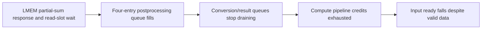

# Why improve has a larger speedup at M256 than M4

> Historical analysis of the implementation before mandatory PSUM prefetch. For the current slot32 RTL, see [post-prefetch bandwidth attribution](fpint_gemm_post_prefetch_bandwidth.md).

The current gap is dominated by naive's variable-latency LMEM partial-sum path and the bounded queues that absorb it. Improve keeps partial sums in a dedicated internal accumulator and reaches almost one accepted input per cycle at M256. M4 gives improve shorter four-row commands and more exposed gaps, so its advantage is smaller there. The observed result is not explained by external-DMA bandwidth alone.

## Current measurements

TH16 / MXU16x16, K=N=512, QCOL, non-transposed weights, corrected vectors. GEMM cycles run from accepted configuration to first completion-valid. Input means one accepted 16-element activation vector, not an entire microtile.

| M | Input transfers per backend | Improve GEMM cycles | Naive GEMM cycles | Naive / improve | Improve cycles/input | Naive cycles/input |
|---:|---:|---:|---:|---:|---:|---:|
| 4 | 4,096 | 6,449 | 25,547 | 3.961x | 1.574 | 6.237 |
| 256 | 262,144 | 272,870 | 1,315,844 | 4.822x | 1.041 | 5.020 |

When M increases 64x, improve becomes more efficient per input (1.574 to 1.041 cycles), while naive improves less (6.237 to 5.020). This directly explains the ratio increasing from 3.961x to 4.822x. It does not mean naive becomes slower per input at M256.

## 1. Most naive M256 stalls occur while external DMA is idle

| Backend / M | External DMA active cycles | Input valid but not ready | Of those, external DMA idle |
|---|---:|---:|---:|
| improve4 | 1,599 | 31 | 27 |
| naive4 | 10,236 | 19,094 | 11,621 |
| improve256 | 17,548 | 0 | 0 |
| naive256 | 59,559 | 1,032,476 | 1,000,917 |

For naive M256, **1,000,917 of 1,032,476 input-stall cycles (96.94%) occur with external DMA idle**. External DMA is active for only 59,559 / 1,315,844 cycles (4.53%). This rules out continuing external transfers as the immediate cause of most input stalls. External-DMA active time includes concurrent useful work and is not an additive latency component or a pure bandwidth measurement.

Busy is sampled from `core/accel_perf.cpu_dma.busy` for naive and `core/accel_perf.hbm_dma.aggregate.busy` for improve. The old printed DMA-union overlap includes local engines and cannot substitute for this comparison.

## 2. Follow the stall back to the partial-sum path

| Observed condition | Naive M4 | Naive M256 | Improve M256 |
|---|---:|---:|---:|
| Oldest postprocessing operation waits for partial sum | 19,685 | 1,032,840 | 0 |
| Accumulator read request valid but not ready | 10,973 | 697,220 | 0 |
| Compute operands present but no pipeline credit | 18,758 | 1,034,295 | 0 |
| Accumulator write request valid but not ready | 292 | 8,541 | 0 |

These conditions overlap; do not add their cycle counts. The important chain is visible in the RTL and waveforms:

- [Naive accumulator](../../../hw/rtl/core/gemm/VX_gemm_acc_lmem.sv:165) accepts a read only if its transaction exists and either a matching prefetched slot or a free slot exists. Completed speculative reads retain their slots until the corresponding demand is accepted and the response is consumed. There are eight adapter read slots.
- [Common postprocessing](../../../hw/rtl/core/gemm/VX_gemm_compute_core.sv:2261) cannot launch the oldest operation until its partial sum is ready. It has four postprocessing entries. A held read request also blocks new postprocessing launches at the conversion output.
- [Compute admission](../../../hw/rtl/core/gemm/VX_gemm_compute_core.sv:1769) requires available pipeline credit. The blocked pipeline eventually lowers input ready through the input buffers.
- [Improve accumulator](../../../hw/rtl/core/gemm/VX_gemm_acc_internal.sv:95) has a dedicated internal memory path with read-request ready tied high. In the M256 trace it accepts and returns all 253,952 partial-sum reads without read-request stalls; the oldest postprocessing operation never waits for its partial sum.

The architectural difference therefore includes **where partial sums are accumulated**, in addition to TMEM operand placement and tile-major layout. Every additional output row still needs these internal partial-sum reads/writes. Their counts grow 64x from M4 to M256 (3,968 to 253,952 reads per backend), even though external weight-load overhead is amortized.

## 3. The naive limit is latency/queue handling, not saturated aggregate bank bandwidth

A fixed 4,096-cycle window at configuration +50,000 through +54,095 in naive M256 has no external DMA activity. Its measured details are:

| Window observation | Result |
|---|---:|
| Input transfers | 801 |
| Completed postprocessing launches | 799 |
| Cycles waiting for partial sum at postprocessing head | 3,297 |
| Four-entry postprocessing queue full | 3,125 |
| Eight adapter read slots full | 2,337 |
| Core read request blocked | 2,216 |
| Blocked reads with all adapter slots occupied and no matching slot | 2,216 |
| Speculative / late-demand read allocations | 286 / 514 |
| Physical response-slot join full (four slots) | 535 |
| Physical read request blocked by that full join | 461 |
| Physical response FIFO full | 0 |
| Same-address read-before-write guard blocking | 0 |
| PSUM write-request stall | 0 |
| Accepted physical bank words, all 16 banks combined | 16,148 |
| Aggregate bank request utilization | 24.64% |

Of 798 fully observed physical wide-read request/response pairs, 665 return after 11 cycles; the rest take 12–20 cycles. This is measured from the join's wide request handshake to the response handshake into the accumulator adapter, including the transport/join path. The core demand-to-response latency is a separate interval: prefetched hits are often one cycle, while late-demand reads take 13–30 cycles in this window.

On average 2.94 of the eight adapter slots contain completed reads whose normal core demand has not yet been accepted. The four-slot physical join is thus only one part of the bound: the eight adapter slots and four postprocessing entries also limit useful requests in flight. The trace does not support describing the whole slowdown as a fully utilized LMEM bank array. The busiest individual bank accepts requests on 1,366 / 4,096 cycles (33.35%).

For example, at configuration +50,103 the adapter has eight occupied slots and holds a new read with ready=0. At +50,105 Input has valid=1 and ready=0; that persists through at least +50,117. External DMA is idle throughout this window.

These observations identify the present bottleneck. They do not establish the exact speedup obtainable by enlarging any one queue; that would require a separate controlled RTL experiment, which was not performed.

## 4. Why improve benefits more from increasing M

| Improve input behavior | M4 | M256 |
|---|---:|---:|
| Input commands | 1,024 | 2,048 |
| Rows per command | 4 | 128 |
| Successive input transfers one cycle apart | 2,994 / 4,095 | 262,135 / 262,143 |
| Empty cycles inside commands | 777 | 2 |
| Empty cycles between commands | 1,202 | 8,197 |
| Input-acceptance cycles / GEMM cycles | 63.51% | 96.07% |

At M256, 2,040 of 2,047 command boundaries introduce no input gap. The other seven have a 1,172-cycle transfer-to-transfer interval, and there is one two-cycle internal bubble. Most of the invocation is consequently a one-input-per-cycle stream.

At M4, four-row commands expose operand delivery and command-boundary gaps much more frequently. The 1,202 between-command and 777 within-command empty cycles total 1,979 of its 6,075-cycle input span. These are directly counted gaps; they are not all attributed to a single DMA state or to weight wait, since stages overlap. Compute-side weight-not-ready occurs on 335 cycles at M4 versus one at M256.

Increasing M therefore removes a larger fraction of improve's exposed overhead. Naive still spends about five cycles per input because the partial-sum path throttles the same common compute pipeline. An external-memory arithmetic-intensity argument alone misses that internal-memory bottleneck.

## Evidence and reproducibility

Analysis uses `fsdb_cli.report` on the four existing passing captures listed below. Samples are taken strictly before the 10 ns rising clock edge; configuration and first completion-valid match the logged normalized endpoints. Input, compute, read-response and writeback counts match the expected work. No RTL or simulation configuration was changed, and no new simulation was run.

- `improve4`: `agent-tasks/gemm-naive-improve-baseline/p4-candidate/improve-m4-iteration1/wave.fsdb`.
- `improve256`: `agent-tasks/gemm-naive-improve-baseline/p4-candidate/improve-m256-iteration1/wave.fsdb`.
- `naive4`: `agent-tasks/gemm-naive-improve-baseline/p4-regression/naive-m4-final1/wave.fsdb`.
- `naive256`: `agent-tasks/gemm-naive-improve-baseline/p4-regression/naive-m256-final1/wave.fsdb`.

Scripts are in `agent-tasks/fpint-gemm-shape-gap/`: `analyze.py`, `physical.py`, `improve_commands.py`, and `write_report.py`. Local `captures/` contains cached transitions, strict-preedge arrays and result JSON; `provenance.json` records wave hashes and capture configs. The physical queue/bank findings are scoped to the stated window; whole-invocation counters above are full-trace measurements.

The initial extraction used nonexistent accumulator-write and external-busy aliases; these were corrected to `wr_req_*` and `accel_perf.*` without changing the waveforms. The completed extraction has no missing signals.

The cycle-only `fpint_gemm_latency.md` is intentionally unchanged.

## Follow-up: why the prefetched read buffer does not prevent the stall

The current naive prefetch allocator only runs on the exact GEMM input-accept
cycle (`prefetch_alloc = txn_accept_valid && txn_accept_rd_en && ...`). If no
slot is available then, that transaction is not queued for a later prefetch
retry. It waits until its normal read demand reaches postprocessing. A later
transaction can consequently obtain prefetch storage before an earlier skipped
transaction. See VX_gemm_acc_lmem.sv:190.

The eight read slots hold both pending reads and returned data. A returned
prefetch remains in its slot until the matching normal demand is accepted and
the core consumes the response. Data for a later work tag cannot satisfy the
current request. A speculative reservation leaves capacity for late demands
to ensure progress, but does not guarantee continuous throughput.

A tagged FSDB example makes the gap explicit. Cycles below are relative to the
accepted configuration of naive M256; the requested transaction tag is 9993.

| Cycle | Event |
|---:|---|
| 50,053 | Input9993 accepted. Eight read slots occupied; prefetch_alloc=0. |
| 50,103 | Core requests partial sum9993. No matching slot and no free slot; ready=0. |
| 50,103–50,122 | Request9993 waits20 cycles. Later tags9999–10003 already occupy five slots; some data has returned. |
| 50,123 | A slot becomes available; late_read_alloc=1 accepts request9993. |
| 50,142 | Core accepts the response for9993,19 cycles after demand acceptance. |

Thus the core waits39 cycles after first requesting9993, although its input was
accepted50 cycles before the request. The implementation failed to use that
advance notice for this transaction. At50,123, completed data for9999,10000 and
10001 is waiting for their later demands; none can substitute for9993.

This identifies a limitation of the current one-shot speculative allocation
and slot-retention policy, not an inherent requirement of LMEM. Scheduling
missed prefetches in work order when capacity becomes available is a concrete
follow-up design direction; no RTL change or performance claim for such a
change is made here. Increasing a FIFO alone has not been evaluated.

Evidence: `agent-tasks/fpint-gemm-shape-gap/prefetch_detail.py` and local
`captures/naive256/prefetch/result.json` (per-slot work tags and completion/demand
bits, input admission, read admission and response handshakes).
