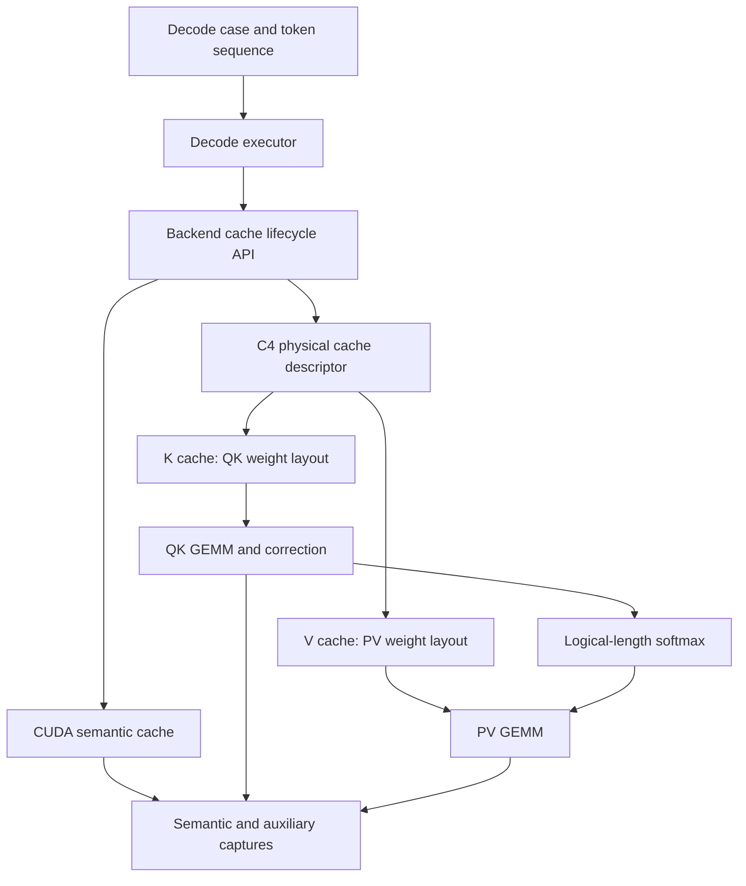
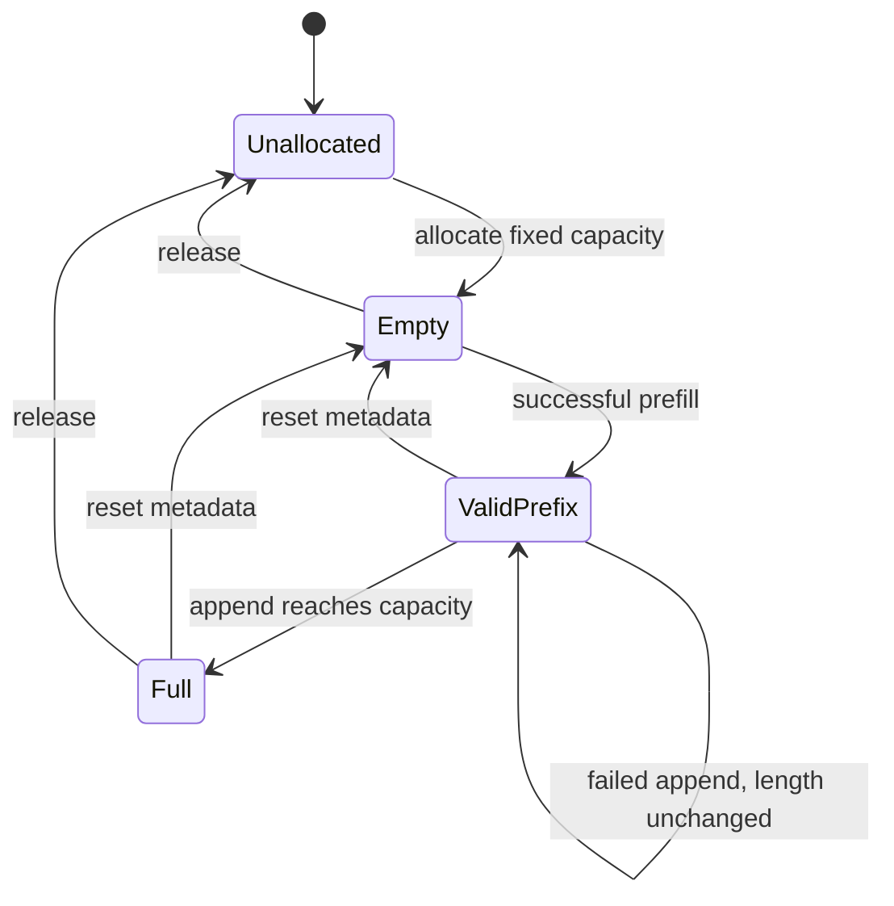
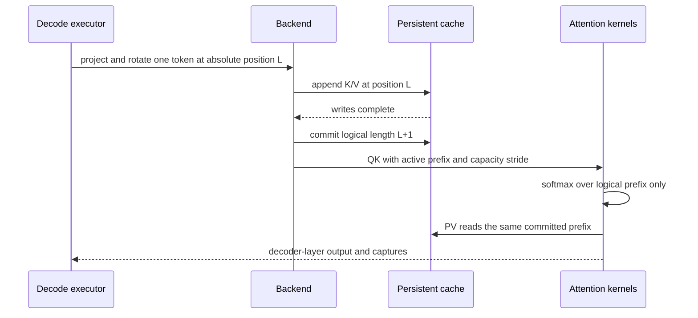

# Tile-Major Persistent KV Cache Decode - Plan

## Goal Capsule

- **Objective:** Validate incremental decode for one SpinQuant Llama2-7B decoder layer on CUDA and a real C4 FPGA while retaining K/V cache data in consumer-native tile-major layouts across decode steps.
- **Authority:** User-set cache lifetime and storage decisions take precedence; current SpinQuant quantization semantics and C4 GEMM layout ABIs define physical compatibility; `tools/workload/gen_kernel_cfgs.py` remains advisory.
- **Execution profile:** Correctness-first, single layer, fixed batch and maximum sequence length per cache allocation, random or checkpoint weights, multiple one-token decode steps, strict-native C4 execution with no fallback.
- **Stop conditions:** Stop and revisit the design if a fixed-capacity tile-major prefix cannot be consumed without relocating prior entries, if logical length cannot exclude padded capacity from softmax/PV semantics, or if K append packing cannot preserve neighboring values.
- **Tail ownership:** The implementation owns CPU/CUDA tests, kernel-level real-C4 tests, full single-layer decode comparison, documentation, and cleanup of abandoned experimental paths.

---

## Product Contract

### Summary

Add a backend-independent incremental-decode accuracy path that preallocates persistent KV-cache DRAM to a configured maximum sequence length, fills it during prompt prefill, and appends one token in place per decode step. CUDA supplies the semantic reference; C4 stores K and V in distinct GEMM-consumer tile layouts and exposes semantic plus physical captures after every mutation.

### Problem Frame

The current layer-accuracy graph validates one prefill pass and materializes a fresh quantized K/V result for that pass. It does not preserve cache state, model `seq_q=1` with `seq_kv=past+1`, or test cache append addressing. The modeling cache has incremental behavior but grows row-major tensors using `torch.cat`, while the fused C4 quantizer allocates outputs from the current logical shape. Neither path proves that fixed FPGA DRAM can retain tile-major data across changing logical lengths.

Repeatedly storing persistent cache data as row-major would simplify append addressing but would require K/V layout conversion on every attention step. The target design instead keeps physical cache data in the layouts consumed by QK and PV. This moves complexity into capacity-stable base/stride calculation, partial-tile updates, and logical-length masking, all of which must be tested directly.

### Requirements

**Cache lifecycle and storage**

- R1. Allocate all K payload, K scale/zero/correction data, V payload, and V scale data once from immutable batch, KV-head count, head dimension, quantization mode, and `max_sequence_length` geometry.
- R2. Store K in the packed tile-major layout consumed by QK and V in the packed tile-major layout consumed by PV; row-major cache storage is limited to the CUDA oracle, semantic capture, and diagnostics.
- R3. Track logical sequence length independently from aligned physical capacity, and derive every persistent buffer base and per-head stride from capacity rather than the current logical length.
- R4. Support lifecycle transitions allocate, reset, prompt prefill, append, attention read, and full-capacity rejection without reallocating or relocating a valid prefix.
- R5. Commit a prefill or append by advancing logical length only after both K and V updates complete; a failed update must leave the previously visible prefix valid and retryable.

**Decode semantics**

- R6. Execute prompt prefill followed by multiple `seq_q=1` decode steps where each step uses `seq_kv=past_length+1`, the correct absolute RoPE position, and no causal mask over the already bounded cache prefix.
- R7. Quantize K as SpinQuant signed asymmetric INT4 with FP16 scale and fractional zero-point correction data, and quantize V as SpinQuant signed symmetric INT4 with FP16 scale.
- R8. Exclude unused physical capacity and padded lanes from QK, softmax, PV, semantic captures, and final residual results for arbitrary positive logical lengths supported by the configured capacity.
- R9. Preserve backend-neutral semantic stage names and stop-after behavior while adding per-step cache captures and a decode graph version distinct from the prefill-only graph.

**Validation and diagnostics**

- R10. Compare CUDA and C4 after prefill and after every decode step for semantic K/V cache prefixes, packed payloads, scale/zero data, QK, softmax, PV, and final residual.
- R11. Record physical cache descriptors containing immutable capacity geometry, padded extents, layouts, buffer sizes, per-head strides, and buffer identity, plus mutable logical length, lifecycle state, and cache generation.
- R12. Require strict-native C4 placement with zero ATen fallback and expose kernel launch topology for allocation-independent prefill and append operations.
- R13. Reject invalid geometry, mismatched source tensors, append-before-prefill, and capacity overflow before publishing a new logical length.

### Key Flows

- F1. Prompt initialization
  - **Trigger:** A decode case starts with an allocated empty cache and a prompt of length `P`.
  - **Steps:** Validate `0 < P <= max_sequence_length`, write all prompt K/V data directly into their final physical layouts, synchronize, then publish logical length `P`.
  - **Outcome:** Attention consumers can read the prompt prefix without a row-major-to-tile transform.

- F2. Incremental decode
  - **Trigger:** A valid cache of length `L` receives one new hidden-state token.
  - **Steps:** Project and rotate the new Q/K/V, append K/V and qparams at position `L`, commit length `L+1`, then run QK, unmasked softmax, PV, and the remainder of the decoder layer.
  - **Outcome:** The step observes exactly `L+1` cache entries and leaves a valid cache for the next step.

- F3. Reset and reuse
  - **Trigger:** A test sequence finishes before cache storage is released.
  - **Steps:** Invalidate the visible prefix by resetting logical length and incrementing the cache generation; reuse the immutable allocation only with matching geometry.
  - **Outcome:** Stale handles cannot expose data from the previous logical cache, and a new prefill can reuse the DRAM allocation.

### Acceptance Examples

- AE1. With capacity 64 and prompt length 30, append three tokens and compare state at logical lengths 30, 31, 32, and 33; every step matches full-prefix CUDA recomputation through the final residual.
- AE2. The same logical prompt and decode tokens run with capacities 64 and 160 and produce identical semantic captures even though physical strides and unused storage differ.
- AE3. An append at an even/odd K packing boundary changes only the destination value and required qparams; its paired nibble, previous tokens, other heads, and unused padding remain unchanged.
- AE4. With batch 2 and head-specific input patterns, prefill and append update only the matching batch/head region and produce no cross-head aliasing.
- AE5. Appending when logical length equals capacity fails before commit, leaves logical length unchanged, and preserves every visible cache byte.
- AE6. Reset followed by a different prompt reuses the allocation but produces captures containing only the new logical prefix and cache generation.

### Scope Boundaries

**Included**

- One SpinQuant Llama2-7B decoder layer with random or checkpoint weights.
- CUDA semantic cache and strict-native C4 physical cache backends.
- Prompt prefill plus at least two consecutive decode steps.
- Fixed-capacity allocation, reset, in-place append, physical capture, and capacity overflow behavior.
- Standalone and fused layout plans where both are meaningful; the persistent cache itself remains tile-major in the C4 path.

#### Deferred to Follow-Up Work

- Full 32-layer autoregressive generation, embedding, final normalization, LM head, sampling, and token feedback.
- vLLM-style paged KV cache, block allocators, eviction, prefix sharing, and dynamic growth.
- Multi-request cache scheduling, concurrent mutation, stream overlap, and cache compaction.
- Append-kernel launch-count optimization after correctness is established; the first implementation may launch per batch/head if that keeps the address contract clear.
- Decode performance targets and long-context throughput optimization.

---

## Planning Contract

### Key Technical Decisions

- KTD1. **Use consumer-native tile-major persistent storage.** `(session-settled: user-approved — chosen over row-major persistent storage: avoiding a full cache layout transform on every decode step is worth making append addressing explicit.)` K is stored as the QK GEMM's transposed packed weight with transposed GEMM qparams; V is stored as the PV GEMM's non-transposed packed weight with row-oriented qparams.
- KTD2. **Preallocate fixed cache capacity.** `(session-settled: user-directed — chosen over dynamic growth and paged allocation: the first correctness implementation should have stable DRAM addresses and simple lifetime management.)` Allocation uses `max_sequence_length` plus required tile padding; decode changes only metadata and the target tile.
- KTD3. **Treat capacity geometry as immutable address metadata.** Per-head bases, tile strides, qparam slot geometry, and raw buffer extents are computed once from padded capacity. Logical length controls bounds, active GEMM extents, masking, and semantic capture shape but never relocates stored entries.
- KTD4. **Add an explicit in-place cache update contract instead of changing prefill's allocation-returning API in place.** Preserve the existing full fused quantizer for current prefill tests, share its quantization and layout helpers, and add destination/capacity/position metadata for persistent prefill and append. This isolates ABI risk and keeps standalone comparison available.
- KTD5. **Use logical length as the commit marker.** Validate before launch, synchronize K and V writes, and advance length only after both succeed. If a later write fails, unused destination bytes may be overwritten but remain outside the visible prefix and must be safely retryable.
- KTD6. **Use padded active extents rather than computing across full capacity.** QK and PV consume enough physical tiles to cover logical length, while softmax receives the true logical key length so padded probabilities are zero and excluded. Consumer APIs carry both active extent and capacity-derived stride where the existing GEMM ABI cannot infer both.
- KTD7. **Keep the accuracy harness independent from model monkey patches.** Add a decode case, executor, and backend cache interface alongside the existing one-layer prefill graph. The existing row-major `KVQuantizedCache` and decode consistency experiment inform the CUDA oracle but do not own C4 physical state.
- KTD8. **Initialize allocated physical buffers deterministically for correctness tests.** Zero-filled padded lanes guarantee safe DMA reads; targeted mutation tests may poison unused regions and use canaries to prove consumers and append kernels do not observe or overwrite them.

### High-Level Technical Design

#### Component topology

#### Cache lifecycle state machine

#### Per-step decode sequence

### Physical Cache Contract

**K cache**

- Semantic source shape is `[batch, kv_heads, position, head_dim]`.
- Physical consumer view is a transposed packed GEMM weight representing `[head_dim, capacity]` with `WTRANS=1`.
- Each appended token updates one logical position, signed-asymmetric scale, fractional zero point, tiled GEMM qparams, and logical correction side buffers.
- The implementation must verify which logical axis each INT4 byte pairs before introducing nibble read-modify-write; the shared layout offset helper is authoritative.

**V cache**

- Semantic source shape is `[batch, kv_heads, position, head_dim]`.
- Physical consumer view is a non-transposed packed GEMM weight representing `[capacity, head_dim]` with `WTRANS=0`.
- Each appended token writes one complete packed row and its signed-symmetric scale data.

**Shared descriptor**

- Immutable fields include device, batch, KV heads, head dimension, quantization modes, logical capacity, padded capacity, per-head payload/qparam strides, physical layouts, buffer extents, and buffer addresses/identity.
- Mutable fields are logical length, lifecycle state, and cache generation. Allocation initializes the cache generation; reset increments it without changing allocation geometry or buffer identity.
- Captures decode only `[0, logical_length)` and retain the descriptor needed to interpret raw buffers; raw reshape or transpose is not a valid decoder for tile-major storage.

### Implementation Sequencing

1. Establish cache geometry and semantic lifecycle contracts without hardware mutation.
2. Implement and test the allocation-returning CUDA oracle and fixed-capacity reference behavior.
3. Add C4 address helpers and cache-only in-place write kernels with exact physical mutation tests.
4. Connect active-prefix QK, softmax, and PV to the persistent cache.
5. Run multi-step full-layer differential validation on real C4.

### Risks and Mitigations

- **Capacity-dependent qparam offsets:** Variable partial-tile slots can move later data if offsets are recomputed from logical length. Compute persistent slot bases from capacity and test identical prefixes under different capacities.
- **K packing-axis ambiguity:** An incorrect nibble assumption can corrupt the neighboring token or head-dimension value. Reuse one host/device offset contract and test both members of every packed pair.
- **Padded-tail leakage:** GEMM DMA may read aligned lanes beyond logical length. Zero initialized storage, active padded extents, and logical-length softmax bounds prevent tail data from affecting results; poison tests prove the exclusion.
- **Partial append failure:** K and V launches cannot be atomically rolled back. Logical length remains the visibility boundary, failed positions are retryable, and valid-prefix bytes are protected by canary comparisons.
- **Stale packaged kernels:** Changes to included kernel sources or C++ ABI may not rebuild installed artifacts automatically. Verification must force the relevant kernel and PyTorch extension rebuild before hardware acceptance.
- **Hardware runtime:** Large prefill cases can be slow on C4. Begin with cache-only and short-context decode gates, use bounded per-kernel timeout diagnostics, and reserve large-context runs for final acceptance.

---

## Implementation Units

### U1. Decode case, lifecycle, and artifact contracts

- **Goal:** Represent prompt-plus-token decode inputs, cache capacity, lifecycle metadata, per-step captures, and graph identity independently of any backend.
- **Requirements:** R3, R4, R6, R9, R11, R13; KTD3, KTD5, KTD7.
- **Dependencies:** None.
- **Files:**
  - `pytorch/spinquant/spinquant_inference/layer_accuracy/specs.py`
  - `pytorch/spinquant/spinquant_inference/layer_accuracy/artifacts.py`
  - `pytorch/spinquant/spinquant_inference/layer_accuracy/graph.py`
  - `pytorch/spinquant/spinquant_inference/layer_accuracy/stages.py`
  - `pytorch/spinquant/spinquant_inference/layer_accuracy/run_artifacts.py`
  - `pytorch/spinquant/spinquant_inference/layer_accuracy/cli.py`
  - `pytorch/test/test_spinquant_layer_accuracy.py`
- **Approach:** Introduce a decode-specific case/graph version and cache lifecycle interface while preserving the current prefill case schema. A decode run owns one prompt, an ordered list of one-token inputs, absolute positions, maximum cache length, and a stop point that can target a semantic stage within a selected step.
- **Execution note:** Add characterization tests for current prefill artifacts before changing shared serialization or stage handling.
- **Patterns to follow:** Portable checksummed cases in `artifacts.py`, backend-neutral scheduling in `graph.py`, and physical descriptor persistence in `run_artifacts.py`.
- **Test scenarios:**
  - Create, save, and load a random decode case with prompt length 3, two decode tokens, and capacity 8 without changing its hash.
  - Reject prompt length greater than capacity, empty prompt, non-unit decode-token length, and non-monotonic position IDs.
  - Stop after a named stage in decode step 0 and prove later steps do not mutate cache state.
  - Preserve all existing prefill case/run artifact tests unchanged.
- **Verification:** The schema distinguishes prompt length, decode-step count, logical length, and physical capacity; old prefill artifacts still load and compare.

### U2. CUDA semantic persistent-cache reference

- **Goal:** Produce a clear reference for fixed-capacity prefill, in-place append semantics, and multi-step decoder outputs on CPU/CUDA.
- **Requirements:** R1, R4-R10, R13; F1-F3; KTD5, KTD7.
- **Dependencies:** U1.
- **Files:**
  - `pytorch/spinquant/spinquant_inference/layer_accuracy/backends.py`
  - `pytorch/spinquant/spinquant_inference/layer_accuracy/graph.py`
  - `pytorch/spinquant/spinquant_inference/modeling/quantized_kv_cache.py`
  - `pytorch/spinquant/experiment/test_decode_consistency.py`
  - `pytorch/test/test_spinquant_decode_accuracy.py`
- **Approach:** Add a semantic fixed-capacity cache implementation to the accuracy backend. Store row-major packed data and qparams in preallocated tensors, update slices rather than concatenate, and compare each incremental step with full-prefix recomputation. Keep model integration changes limited to reusable reference behavior needed by the harness.
- **Patterns to follow:** Per-token quantization in `quantized_kv_cache.py`, no-cache versus cached comparison in `test_decode_consistency.py`, and stage capture ordering in the current layer executor.
- **Test scenarios:**
  - Covers AE1. Prefill length 30 and append through logical lengths 31, 32, and 33; compare cache and every attention checkpoint with full-prefix recomputation.
  - Covers AE2. Run identical semantic inputs under two capacities and require identical logical outputs.
  - Covers AE5. Reject append at capacity without changing cache tensors or logical length.
  - Inject distinct batch/head patterns and verify independent slice updates.
  - Reset and reuse a cache with opposite-value inputs to detect stale-prefix reads.
- **Verification:** CPU tests pass without Vortex installed; CUDA and full-prefix recomputation agree at every decode step under the existing numerical comparison profile or a documented decode-specific extension.

### U3. C4 fixed-capacity tile-major allocation and append kernel

- **Goal:** Allocate persistent physical buffers once and update one prompt or decode position in the K/V consumer layouts without reallocating prior cache data.
- **Requirements:** R1-R5, R7, R11-R13; KTD1-KTD5, KTD8.
- **Dependencies:** U1.
- **Files:**
  - `pytorch/csrc/aten/VortexExtra.cpp`
  - `tests/regression/kv_cache_quant_layout_fused_w4a16/common.h`
  - `tests/regression/kv_cache_quant_layout_fused_w4a16/kernel.cpp`
  - `tests/regression/kv_cache_quant_layout_fused_w4a16/main.cpp`
  - `tests/regression/kv_cache_quant_layout_fused_w4a16/bench_main.cpp`
  - `tests/regression/kv_cache_quant_layout_fused_w4a16/Makefile`
  - `pytorch/test/test_spinquant_layer_accuracy_vortex_ops.py`
- **Approach:** Preserve the existing allocation-returning fused quantizer and add a persistent destination mode/operator that receives capacity-derived descriptors and an append position. Centralize weight and qparam offset calculations so host allocation, device writes, physical decoding, and GEMM consumption use the same geometry. Start with one batch/head update per launch if necessary for clarity.
- **Execution note:** Prove cache-only physical mutation on real C4 before connecting the buffers to QK/PV.
- **Patterns to follow:** Existing fused K/V quantization ABI checks in `VortexExtra.cpp`, signed SpinQuant modes in the regression kernel, and exact packed/qparam checks in `test_spinquant_layer_accuracy_vortex_ops.py`.
- **Test scenarios:**
  - Covers AE3. Append both members of every relevant packed pair and verify neighbor preservation byte-for-byte.
  - Write K at positions around 31/32/33 and 127/128/129 and verify transposed payload, tiled qparams, logical scale, and fractional zero buffers.
  - Write V at the same boundaries and verify exactly one packed row plus its scale changes.
  - Poison unused capacity and guard adjacent batch/head regions with canaries; verify only the target region changes.
  - Inject invalid capacity, position, dtype, layout, and source geometry and require rejection before a device launch.
  - Simulate/reproduce a failed second write and verify the valid prefix remains byte-identical and the position is retryable.
- **Verification:** Native regression and PyTorch op tests pass on C4 for cache-only prefill and append, ABI size/offset assertions pass, and fallback count remains zero.

### U4. Persistent-cache attention consumers and Vortex backend

- **Goal:** Run decode QK, correction, softmax, and PV directly from the fixed-capacity cache while using only the committed logical prefix.
- **Requirements:** R2, R3, R6-R12; KTD3, KTD5, KTD6.
- **Dependencies:** U2, U3.
- **Files:**
  - `pytorch/spinquant/spinquant_inference/layer_accuracy/backends.py`
  - `pytorch/spinquant/spinquant_inference/layer_accuracy/specs.py`
  - `pytorch/csrc/aten/VortexExtra.cpp`
  - `tests/regression/softmax_layout_fused/common.h`
  - `tests/regression/softmax_layout_fused/kernel.opt.cpp`
  - `pytorch/test/test_spinquant_layer_accuracy_vortex_ops.py`
  - `pytorch/test/test_spinquant_decode_accuracy_vortex_ops.py`
- **Approach:** Extend physical handles/descriptors to carry active logical extents separately from capacity strides. Update grouped QK/PV paths as needed so `seq_q=1` and non-tile-aligned `seq_kv` consume a prefix of the persistent allocation. Keep padded score/probability lanes zero and outside softmax's logical extent.
- **Patterns to follow:** `TensorHandle` physical metadata, `decode_physical_tensor`, grouped QK/PV launch reporting, fused softmax's independent input/output padded strides, and QK asymmetric correction side buffers.
- **Test scenarios:**
  - Run QK/correction at logical lengths 1, 31, 32, 33, 127, 128, and 129 from the same capacity allocation.
  - Run softmax/PV with poisoned capacity tail and prove the tail cannot affect probabilities or output.
  - Compare identical logical prefixes stored at two capacities and require identical QK, softmax, and PV captures.
  - Covers AE4. Use batch 2 and distinct head patterns through QK/PV to detect capacity-stride aliasing.
  - Require placement metadata to show persistent cache reuse and no row-major cache transform between append and attention.
- **Verification:** Cache-only, QK-through-correction, and softmax-through-PV staged tests match CUDA and report strict-native execution with no fallback.

### U5. Multi-step decoder execution, CLI, and generator conformance

- **Goal:** Expose reproducible decode case generation, CUDA/C4 execution, comparison, and advisory workload checks through the existing layer-accuracy workflow.
- **Requirements:** R6, R9-R13; F1-F3; KTD7.
- **Dependencies:** U1-U4.
- **Files:**
  - `pytorch/spinquant/spinquant_inference/layer_accuracy/cli.py`
  - `pytorch/spinquant/spinquant_inference/layer_accuracy/generator_conformance.py`
  - `pytorch/spinquant/spinquant_inference/layer_accuracy/compare.py`
  - `pytorch/spinquant/spinquant_inference/layer_accuracy/run_artifacts.py`
  - `tools/workload/gen_kernel_cfgs.py`
  - `tools/workload/test_kernel_variants.py`
  - `pytorch/spinquant/run_layer_accuracy_hw.sh`
  - `pytorch/test/test_spinquant_layer_accuracy_vortex_integration.py`
  - `pytorch/test/test_spinquant_decode_accuracy_vortex_integration.py`
- **Approach:** Add decode-oriented CLI inputs for prompt length, decode steps, and maximum sequence length without changing existing prefill commands. Save per-step semantic, auxiliary, and physical cache captures under stable names. Extend generator conformance to compare generation geometry and append metadata while retaining its advisory status.
- **Patterns to follow:** Shared-path CUDA-to-Slurm artifact handoff in `run_layer_accuracy_hw.sh`, strict-native opt-in integration tests, and existing stagewise compare reports.
- **Test scenarios:**
  - Generate one random case, run CUDA once, run C4 through cache append, QK, PV, and final residual stop points, then compare saved artifacts.
  - Run prompt length 32 with at least two decode steps and capacity 64 on real C4.
  - Run a tile-crossing case such as prompt length 31 plus two decode steps.
  - Verify physical captures retain a stable cache generation between resets and stable buffer addresses across all steps and resets.
  - Verify generator conformance models `seq_q=1`, growing logical `seq_kv`, fixed capacity metadata, no causal mask, and correct K/V layout roles.
- **Verification:** A real-C4 multi-step decoder-layer run reaches final residual for every step, matches CUDA under the chosen profile, reports zero fallback, and writes a readable stage/cache comparison report.

### U6. Documentation and acceptance hardening

- **Goal:** Make the persistent-cache contract, limitations, and reproducible validation flow clear for future full-generation work.
- **Requirements:** R1-R13.
- **Dependencies:** U5.
- **Files:**
  - `pytorch/spinquant/README.md`
  - `docs/layout_transform/layout.md`
  - `tools/workload/gen_kernel_cfgs.py`
  - `agent-tasks/spinquant-fused-layout-harness/STATUS.yaml`
- **Approach:** Document the K/V physical layouts, capacity-versus-length invariants, lifecycle, reset semantics, padding policy, failure visibility, actual C4 commands, and deferred paging/full-model work. Correct any generator comments that imply append metadata already provides functional persistence.
- **Test scenarios:**
  - Test expectation: none — this unit documents contracts already proven by U1-U5; referenced commands and paths must be checked against the final implementation.
- **Verification:** A reader can identify buffer ownership, append address inputs, logical masking, supported boundaries, and the exact GPU/C4 acceptance sequence without reading kernel code.

---

## Verification Contract

| Gate | Applies to | Command or procedure | Required outcome |
|---|---|---|---|
| Python contract tests | U1, U2, U5 | `conda run -n vortex python -m unittest pytorch.test.test_spinquant_layer_accuracy pytorch.test.test_spinquant_decode_accuracy` | All case, lifecycle, stop-point, overflow, reset, and CUDA-reference tests pass. |
| Generator tests | U5 | `conda run -n vortex python -m unittest tools.workload.test_kernel_variants` | Generation metadata agrees with fixed capacity, logical append length, and K/V layout roles. |
| C4 cache-op tests | U3 | Run the focused PyTorch Vortex op suite in `vortex` on a real C4/U55C with `RUN_VORTEX_TESTS=1`. | Exact payload/qparam/canary checks pass at tile boundaries with zero fallback. |
| C4 kernel regression | U3, U4 | From a configured build directory, use `ci/run_black.sh hw --fpga-bin <C4 alias> --app kv_cache_quant_layout_fused_w4a16 --args "..."` for prefill and append cases. | Device status is successful and physical mutation matches the host reference. |
| Staged attention comparison | U4 | Run strict-native C4 decode cases through cache append, QK/correction, softmax, and PV stop points and compare to CUDA. | Every stage meets its numerical profile; unused capacity does not affect output. |
| Full single-layer decode | U5 | Use the hardware wrapper to run one prompt plus multiple decode steps on C4, then run the saved-artifact compare. | Every step reaches `final_residual`, fallback count is zero, and cache generation/address metadata stays stable. |
| Regression gate | All | Re-run existing prefill standalone/fused unit and real-C4 integration coverage after rebuilding the PyTorch extension and affected `.vxbin` files. | Existing prefill numerical results and launch topology do not regress. |

Hardware verification must source the matching C4 configuration, use the `vortex` environment, and run actual U55C hardware rather than simx. Kernel diagnostics use a bounded timeout and identify the exact launch when a run stalls; timeout increases do not substitute for cache mutation and numerical checks.

---

## Definition of Done

- U1 is done when decode cases and run artifacts represent prompt, token steps, logical length, capacity, and cache generation without changing existing prefill behavior.
- U2 is done when fixed-capacity incremental CUDA results match full-prefix recomputation after every decode step.
- U3 is done when real C4 cache-only writes update the exact K/V payload and qparam regions across packing and tile boundaries while protecting all visible prefix and canary data.
- U4 is done when QK, correction, softmax, and PV consume the committed prefix directly from persistent cache layouts for non-aligned logical lengths.
- U5 is done when one random or checkpoint-backed Llama2-7B layer completes prompt prefill plus multiple strict-native C4 decode steps and matches CUDA through final residual with zero fallback.
- U6 is done when the layout and operational documentation reflects the implemented ABI and clearly defers paging and full-model generation.
- All new and existing relevant CPU, CUDA, C4 op, kernel regression, prefill, and decode tests pass after a clean rebuild of affected binaries.
- No per-step row-major cache conversion, cache reallocation, dead experimental operator, stale ABI branch, or abandoned test scaffold remains in the final diff.

---

## Appendix

### Repository Research

- `pytorch/spinquant/spinquant_inference/modeling/quantized_kv_cache.py` provides the semantic prefill/update behavior but currently grows row-major cache tensors with `torch.cat`.
- `pytorch/spinquant/spinquant_inference/layer_accuracy/graph.py` is the backend-independent single-layer schedule to extend; it currently has no persistent cache state.
- `pytorch/csrc/aten/VortexExtra.cpp` and `tests/regression/kv_cache_quant_layout_fused_w4a16/kernel.cpp` allocate and fill K/V quantized layouts from the current source shape; they do not accept persistent destinations or append positions.
- `docs/layout_transform/layout.md` defines K as the QK transposed GEMM weight and V as the PV non-transposed GEMM weight, including qparam slot geometry that must remain capacity-stable.
- `tools/workload/gen_kernel_cfgs.py` already distinguishes generation `seq_q=1`, `seq_kv=past+1`, append metadata, position offset, and no causal mask, but does not implement cache persistence.
- `pytorch/spinquant/experiment/test_decode_consistency.py` establishes full-sequence versus token-by-token comparison as the semantic reference pattern.
- `pytorch/test/test_llama_decode_sweep.py` is a performance experiment with a prebuilt cache and a separate FP16 new-token tail; it is not a correctness contract for persistent cache update.

### Design Feasibility Conclusion

Fixed-capacity tile-major persistence is feasible for Llama2-7B head dimension 128 because K grows along the QK weight's sequence/output axis and V grows along the PV weight's sequence/input axis while their other dimension remains fixed. Prefix stability depends on deriving per-head and qparam bases from capacity, retaining zeroed padding, and passing logical length separately to the attention consumers. The plan deliberately proves these invariants before attempting paging, dynamic allocation, or full-model orchestration.
