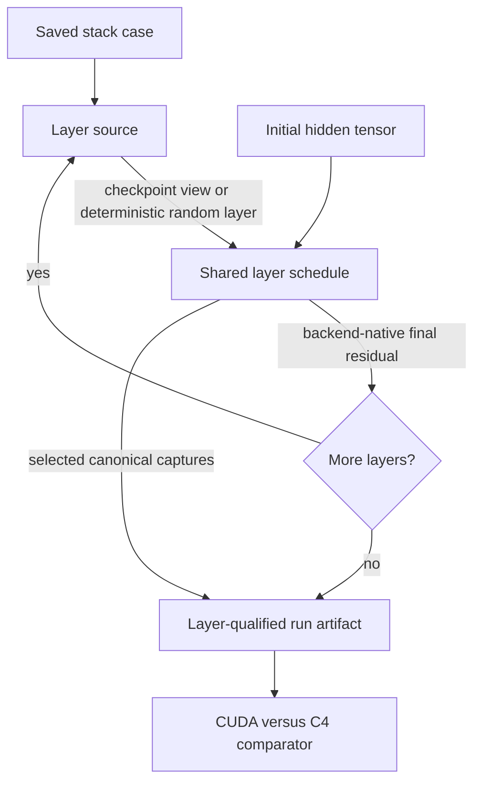

# Full Decoder Stack Accuracy - Plan

## Goal Capsule

- **Objective:** Compare a complete 32-layer Llama2-7B or Llama3-8B decoder stack between the existing CUDA semantic backend and strict-native C4 execution using identical inputs and SpinQuant W4A16 weights.
- **Authority:** Preserve the existing explicit layer graph, tensor contracts, stage thresholds, physical plans, and real-C4 execution rules.
- **Execution profile:** Implement checkpoint-backed stack execution plus deterministic random smoke cases, validate chaining on CPU/CUDA, then run bounded strict-native C4 acceptance.
- **Stop condition:** Every requested layer executes in order, layer-qualified captures compare correctly, and the first divergent layer is visible in the report.

---

## Product Contract

### Summary

Extend the single-layer accuracy harness into a decoder-stack harness that feeds each layer's backend-native final residual directly into the next layer and records canonical comparison points at layer boundaries.

### Problem Frame

The current harness proves one Llama decoder layer and persistent KV behavior, but it cannot expose numerical error accumulation across all 32 layers. Running the older model inference path would also reintroduce a separate graph and obscure whether a mismatch comes from orchestration or a kernel. The next acceptance surface is therefore the existing explicit graph repeated with per-layer weights and layer-qualified artifacts.

### Requirements

**Case and weight sources**

- R1. Represent model preset, zero-based model-global layer range, initial hidden state, shared positional tensors, weight source, and deterministic identity in a saved stack case.
- R2. Support strict SpinQuant checkpoint weights for every selected layer without duplicating the full checkpoint into the case artifact.
- R3. Support deterministic random weights, including a shared-weight mode that makes full-stack hardware smoke tests inexpensive to prepare.

**Execution and observability**

- R4. Execute layers in ascending order and pass the backend-native final residual directly to the next layer without a CPU round trip.
- R5. Capture canonical tensors under stable `layerN.stage` names, where `N` is the zero-based model-global layer index even for partial ranges, and use the same convention for stop targets.
- R6. Preserve the current single-layer and decode APIs and their artifact formats.
- R7. Record per-layer placement and launch metadata so strict-native execution and fallback absence remain auditable.

**Comparison and hardware**

- R8. Compare CUDA and C4 stack artifacts with the existing stage-aware numerical profile while identifying the first failing layer.
- R9. Provide a reproducible real-C4 wrapper flow in the `vortex` environment.
- R10. Cover both Llama2 MHA and Llama3 GQA geometry in portable tests; begin real-hardware acceptance with Llama2 short prefill.

### Acceptance Examples

- AE1. Given a three-layer tiny random case, CPU stack execution produces three ordered `layerN.final_residual` captures and matches explicit sequential single-layer execution.
- AE2. Given a checkpoint fixture with distinct weights per layer, each layer consumes its own tensors and changing layer 1 changes layer 1 and later outputs but not layer 0.
- AE3. Given a stop target inside layer 2, layers 0 and 1 complete, layer 2 captures through the requested stage, and no later layer runs.
- AE4. Given CUDA and C4 artifacts for the same 32-layer case, comparison reports per-layer metrics and the first failing layer or an all-pass result.

### Scope Boundaries

- This plan validates the decoder stack from an initial hidden tensor through the final decoder layer.
- Embedding lookup, final model RMSNorm, LM head logits, tokenizer behavior, and generated token agreement are deferred until decoder-stack accumulation is characterized.
- Multi-layer persistent generation and one KV cache per layer are deferred; the existing single-layer generation harness remains the reference for that follow-up.
- Tensor/pipeline parallelism, paging, vLLM-style allocation, and performance optimization are outside this correctness step.

---

## Planning Contract

### Key Technical Decisions

- KTD1. Repeat the existing backend-independent layer schedule instead of using the older model module. (session-settled: user-approved — chosen over the monkey-patched inference path: the explicit graph keeps backend and layout behavior observable.)
- KTD2. Keep the terminal residual in backend-native storage between layers and canonicalize only requested captures. This avoids repeated CPU-to-device traffic while preserving portable artifacts.
- KTD3. Store checkpoint location and an immutable file signature in the stack case, then memory-map the checkpoint once per run and materialize one layer view at a time. This avoids a second multi-gigabyte weight artifact.
- KTD4. Use `layerN.stage` capture qualification and extend the existing comparator's semantic-stage parsing. Existing thresholds therefore remain authoritative.
- KTD5. Treat a 32-layer shared-random-weight C4 run as orchestration acceptance, not a substitute for real-checkpoint numerical acceptance.

### High-Level Technical Design

The stack owns iteration, stop targeting, capture qualification, and per-layer placement aggregation. Each layer continues to own semantic stage order and each backend continues to own physical layout transitions.

### Assumptions

- The checkpoint follows the existing `spinquant-w4a16-r3r4` tensor names, shapes, and dtypes for every selected layer.
- The checkpoint path is visible from both the CUDA run and the Slurm C4 job; the saved case rejects a changed file signature.
- Full C4 prefill initially uses the fused physical plan and a sequence length accepted by its current micro-tile constraints.

### Risks and Mitigations

- **Error amplification:** Layer-boundary captures and first-failure reporting localize the first unacceptable divergence instead of relying only on the final tensor.
- **Artifact size:** Checkpoint weights remain external and random shared-weight mode stores only one layer's tensors.
- **Hardware runtime:** Run a two-layer strict-native smoke before the 32-layer gate and retain kernel debug opt-in for launch attribution.
- **Device memory lifetime:** Stream one layer's weights at a time and release backend references on rebind rather than materializing all layers on the device.

---

## Implementation Units

### U1. Stack case and layer source contracts

- **Goal:** Add saved stack configuration, checkpoint validation, deterministic random sources, and one-layer-at-a-time materialization.
- **Requirements:** R1-R3, R6; AE2; KTD3, KTD5.
- **Dependencies:** None.
- **Files:**
  - `pytorch/spinquant/spinquant_inference/layer_accuracy/specs.py`
  - `pytorch/spinquant/spinquant_inference/layer_accuracy/artifacts.py`
  - `pytorch/test/test_spinquant_stack_accuracy.py`
- **Approach:** Add a stack-specific case kind without modifying existing case schemas. Share positional and mask tensors across layers, derive random layer seeds deterministically, and extract checkpoint tensors from one memory-mapped state mapping.
- **Execution note:** Add failing fixture tests for round-trip identity and distinct per-layer checkpoint selection before implementing the source.
- **Patterns to follow:** Existing `LayerCase`, strict checkpoint tensor validation, checksum-protected manifests, and `DecodeCase` case-kind dispatch.
- **Test scenarios:**
  - Save and load a three-layer shared-random case without changing its hash.
  - Covers AE2. Load three distinct tiny checkpoint layers and prove the materialized layer tensors differ as expected.
  - Reject zero layers, out-of-range layer spans, changed checkpoint signature, missing tensors, wrong dtype, and wrong shape.
  - Generate independent random layers reproducibly from the same seed while shared mode returns identical weight tensors.
- **Verification:** Stack cases round-trip, validate before execution, and do not change existing layer/decode artifact tests.

### U2. Backend-native stack execution

- **Goal:** Chain the explicit layer schedule while avoiding intermediate host round trips and recording only requested captures.
- **Requirements:** R4-R7; AE1, AE3; KTD1, KTD2.
- **Dependencies:** U1.
- **Files:**
  - `pytorch/spinquant/spinquant_inference/layer_accuracy/graph.py`
  - `pytorch/spinquant/spinquant_inference/layer_accuracy/backends.py`
  - `pytorch/test/test_spinquant_stack_accuracy.py`
- **Approach:** Expose the terminal backend value and capture filtering from `LayerExecutor` with backward-compatible defaults, then add a stack executor that rebinds weights per layer, runs preflight once, and qualifies captures and placement reports.
- **Execution note:** Prove the new stack executor against explicit sequential `LayerExecutor` calls on CPU before hardware integration.
- **Patterns to follow:** Current semantic stage-order checks, stop exceptions, canonicalization, and placement reports.
- **Test scenarios:**
  - Covers AE1. Compare three-layer stack output with manual single-layer chaining.
  - Covers AE2. Change layer 1 weights and verify layer 0 output is unchanged while layer 1 and every later output changes.
  - Covers AE3. Stop at an intermediate stage of a selected layer and verify no later execution.
  - Chain a small deterministic Llama3 GQA stack and verify each model-global layer boundary has the expected shape.
  - Request only final residual captures and verify earlier stages remain absent while stage order stays complete.
  - Preserve the current all-stage default and single-layer serialized output.
- **Verification:** CPU stack tests prove ordered chaining and backward compatibility; CUDA runs retain tensors on CUDA between layer binds.

### U3. Stack run artifacts, comparison, and CLI

- **Goal:** Make stack cases runnable and comparable through the existing command-line workflow.
- **Requirements:** R5, R7-R9; AE4; KTD4.
- **Dependencies:** U1, U2.
- **Files:**
  - `pytorch/spinquant/spinquant_inference/layer_accuracy/cli.py`
  - `pytorch/spinquant/spinquant_inference/layer_accuracy/run_artifacts.py`
  - `pytorch/spinquant/spinquant_inference/layer_accuracy/compare.py`
  - `pytorch/spinquant/spinquant_inference/layer_accuracy/__init__.py`
  - `pytorch/test/test_spinquant_stack_accuracy.py`
- **Approach:** Add stack-case creation, automatic stack run dispatch, layer stop targeting, stack serialization, and layer qualifier parsing. Include first failing layer in comparison reports without changing existing pass criteria.
- **Test scenarios:**
  - Create and run a stack case through the CLI, then load all qualified captures and metadata.
  - Covers AE4. Compare passing artifacts and a synthetic layer-1 failure; report layer 1 as the first failure.
  - Reject stack-only flags on layer/decode cases and invalid stop-layer indexes.
- **Verification:** CLI round trips produce stable artifacts and all existing comparison profiles remain compatible.

### U4. Real-C4 stack acceptance flow

- **Goal:** Run a bounded Llama2 decoder stack on CUDA and actual C4, then compare saved layer boundaries.
- **Requirements:** R7-R10; AE4; KTD5.
- **Dependencies:** U1-U3.
- **Files:**
  - `pytorch/spinquant/run_layer_accuracy_hw.sh`
  - `pytorch/spinquant/TESTING.md`
  - `pytorch/spinquant/README.md`
  - `pytorch/test/test_spinquant_stack_accuracy_vortex_integration.py`
  - `pytorch/run_hw_test.sh`
- **Approach:** Reuse the current Slurm U55C wrapper and strict-native fused backend. Add a focused opt-in integration case, run two layers first, then run all 32 layers with shared random weights; use a real checkpoint when one is available.
- **Execution note:** Characterize two-layer runtime and placement before launching the long 32-layer job.
- **Patterns to follow:** Existing `run_layer_accuracy_hw.sh`, `RUN_SPINQUANT_FUSED_FULL`, and manual CUDA/C4 artifact comparison flow.
- **Test scenarios:**
  - Run a canonical Llama2 two-layer fused stack on C4 and verify both boundary captures plus zero fallback.
  - Run the same saved case on CUDA and C4 and compare it with the existing numerical profile.
  - Run 32 shared-random layers on C4 within the bounded Slurm allocation and report cumulative final-residual metrics.
  - Run a checkpoint-backed 32-layer comparison when a valid checkpoint path is available.
- **Verification:** The actual U55C identifies itself, every requested layer reports strict-native placement, and the CUDA/C4 comparison either passes or names the first numerical divergence with its metrics.

---

## Verification Contract

| Gate | Applies to | Command or procedure | Required outcome |
|---|---|---|---|
| Portable stack tests | U1-U3 | Run `pytorch/test/test_spinquant_stack_accuracy.py` in the `vortex` environment. | Case, source, Llama2/Llama3 chaining, stop, artifact, CLI, and comparison scenarios pass on CPU; CUDA-specific assertions run when available. |
| Existing accuracy regressions | U1-U3 | Run the current layer and decode accuracy Python suites. | Existing single-layer, Llama3 GQA, decode, and artifact behavior remains unchanged. |
| Focused C4 smoke | U4 | Run the opt-in two-layer stack integration test on real C4 with the fused physical plan. | Both layers complete with strict-native placement and no fallback. |
| CUDA/C4 artifact comparison | U4 | Create one stack case, run CUDA, run the same case through the Slurm C4 wrapper, and compare. | All captured layer boundaries satisfy the profile or the report identifies the first failing layer. |
| Full-stack C4 gate | U4 | Repeat the fused strict-native run for 32 Llama2 layers with a one-hour-class timeout. | All 32 layers execute in order without hangs, fallback, or malformed captures. |
| Checkpoint acceptance | U4 | Repeat the 32-layer CUDA/C4 flow with a strict SpinQuant checkpoint when supplied. | Actual per-layer weights load and all layer boundaries are compared. |

---

## Definition of Done

- U1 is done when stack cases support checkpoint, independent-random, and shared-random weight sources without duplicating an external checkpoint.
- U2 is done when backend-native outputs chain across arbitrary layer counts and capture filtering avoids unwanted host transfers.
- U3 is done when stack runs serialize, compare, and stop at a requested layer/stage through the public CLI.
- U4 is done when a real-C4 two-layer CUDA comparison, a strict-native 32-layer orchestration run, and a checkpoint-backed 32-layer CUDA/C4 comparison complete. If no checkpoint is available, implementation and orchestration readiness may be reported but the plan is not fully complete.
- Existing single-layer prefill, persistent decode, Llama2, and Llama3 tests remain green.
- The final diff contains no abandoned stack API, duplicated model graph, device fallback path, or temporary test artifact.

---

## Appendix

### Repository Research

- `pytorch/spinquant/spinquant_inference/layer_accuracy/graph.py` already owns the explicit backend-independent layer schedule and is the only graph that should be repeated.
- `pytorch/spinquant/spinquant_inference/layer_accuracy/backends.py` rebinds one case at a time and clears per-layer weight/layout caches, which supports streamed layer weights.
- `pytorch/spinquant/spinquant_inference/layer_accuracy/artifacts.py` validates one strict checkpoint layer and can be refactored to validate views from one memory-mapped state mapping.
- `pytorch/spinquant/spinquant_inference/layer_accuracy/run_artifacts.py` already flattens decode captures with prefixes, providing the serialization pattern for layer qualification.
- `pytorch/spinquant/run_layer_accuracy_hw.sh` already allocates a U55C, activates `vortex`, loads the C4 configuration, and enforces strict-native execution.
