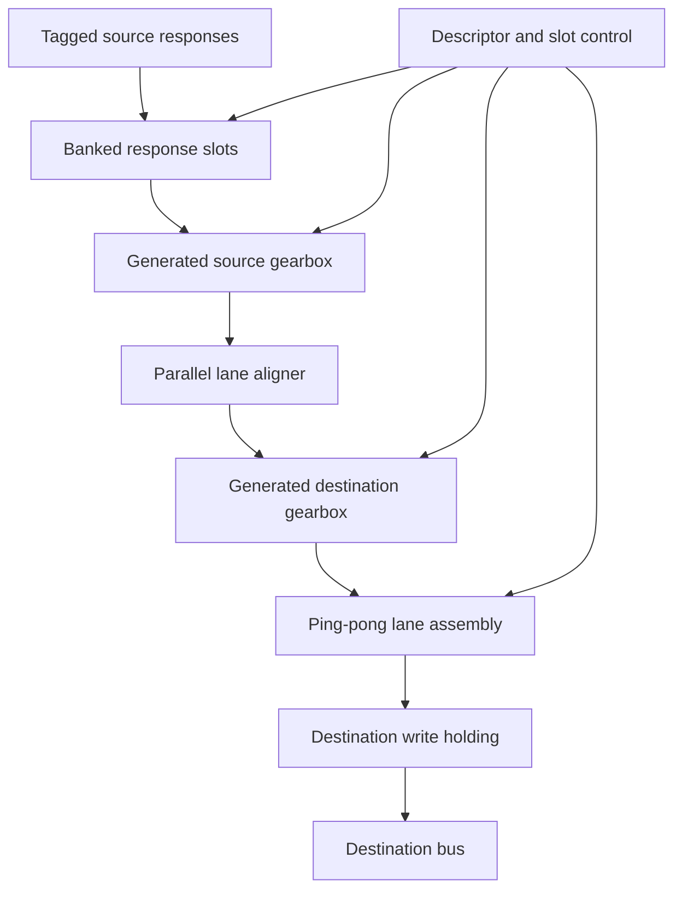
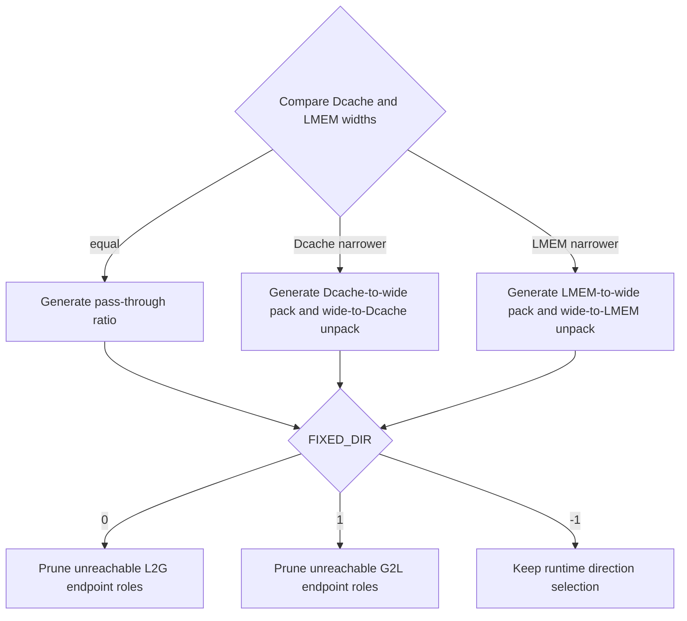
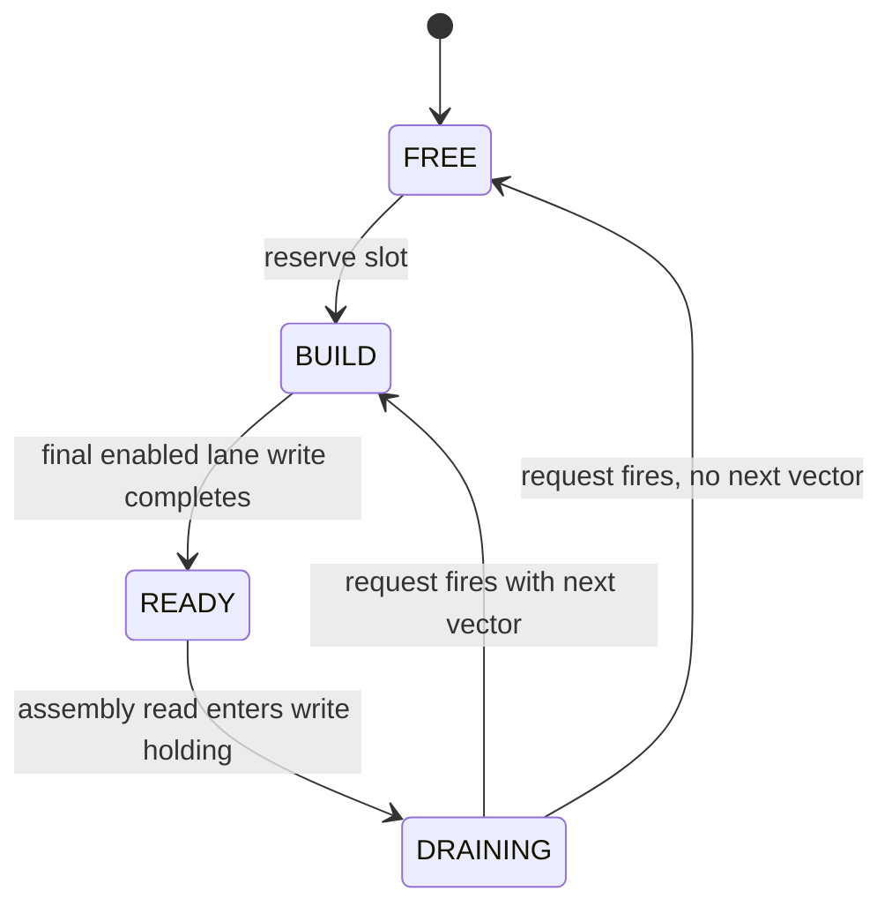
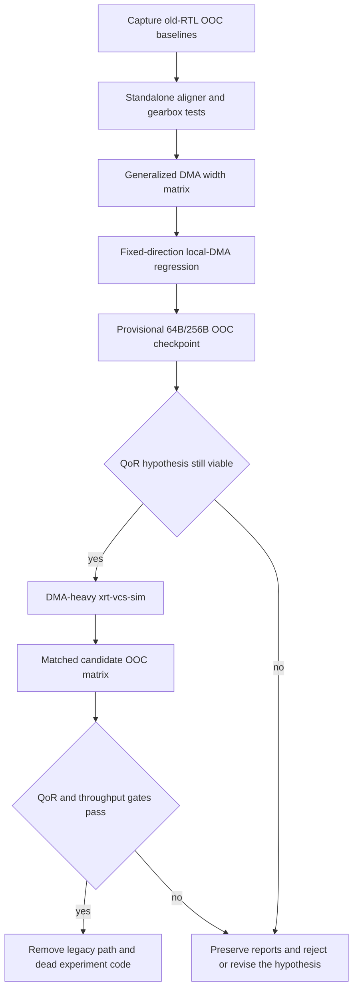

# Generalize Misaligned DMA Datapath - Plan

## Goal Capsule

- **Objective:** Replace the wide byte-level read-modify-write path in `VX_dma_unit_misal` with generated lane aligners and fixed-ratio gearboxes that support compile-time Dcache and LMEM widths without reducing steady-state payload bandwidth.
- **Authority:** Preserve the user-approved architecture and the experiment discipline in `docs/future_optim/dma_optimization_experiment_rules.md`; repository behavior and current regression results override speculative simplifications.
- **Execution profile:** Characterization-first, staged RTL refactor with standalone component tests, common-core regression, DMA-heavy `xrt-vcs-sim`, and matched Vivado out-of-context comparisons.
- **Stop conditions:** Do not advance an experiment after a functional gate fails, do not accept a design that serializes below `min(DCACHE_BYTES, LMEM_BYTES)` in steady state, and do not compare OOC results produced with different synthesis inputs.
- **Tail ownership:** This plan produces an OOC-qualified DMA candidate. Full XRT placement and routing remains a required follow-up before claiming the original PnR failure is resolved.

---

## Product Contract

### Summary

Generalize the misaligned DMA payload path around a canonical generated lane array. Width-specific gearboxes normalize source beats and assemble destination beats, while lane-local aligners handle byte offsets without dynamically modifying an entire 256B or 512B word.

### Problem Frame

The current misaligned DMA already stores tagged source responses in `VX_dp_ram`, but it still selects narrow data from a `MAX_BYTES` response and repeatedly updates `wr_dcache_data_r` or `wr_lmem_data_r` through the `insert_*` functions. As bus width grows, those dynamic selectors, byte comparisons, and old-word read-modify-write networks grow into a large LUT and routing structure.

Reducing `MISALIGN_PACK_BYTES` lowers area but loses throughput, while increasing it sharply raises LUT and synthesis cost. The required design must scale structurally with bus width and instantiate enough parallel lanes to preserve the narrower interface's bandwidth.

### Requirements

**Width and direction behavior**

- R1. The qualified misaligned-DMA envelope covers power-of-two aggregate Dcache and LMEM widths from 64B through 512B, with each interface divisible by the selected canonical lane width and a maximum physical width ratio of 8:1 in either direction.
- R2. The same implementation must support equal-width, Dcache-narrower, and LMEM-narrower elaborations.
- R3. Runtime descriptor direction and both `FIXED_DIR` elaborations must retain their current external behavior and descriptor contract.
- R4. Width relationship and fixed-ratio structures must be selected with elaboration-time generate blocks; runtime direction and address alignment remain runtime control.

**Functional preservation**

- R5. Arbitrary source and destination byte offsets, three-dimensional strides, padding, partial first and final beats, zero-length payloads, and consecutive descriptors must preserve existing semantics.
- R6. Tagged responses may arrive out of order, but payload bytes must drain in descriptor order without lowering the direction-specific outstanding capacity.
- R7. Request and output payloads must remain stable under backpressure, and completion must wait for response slots, aligner state, gearbox state, assembly slots, and write holding state to drain.
- R8. Read byte-enable and active-lane metadata must remain intact so wide splitters do not wait on or issue traffic for inactive lanes.

**Performance and QoR**

- R9. The generated payload path must sustain `min(DCACHE_BYTES, LMEM_BYTES)` bytes per cycle after pipeline fill when both endpoints are ready.
- R10. The 64B/256B target must sustain 64B/cycle, and the 512B/512B HBW target must sustain 512B/cycle through eight 64B lanes or an OOC- and simulation-equivalent structure.
- R11. The primary 64B/256B OOC candidate must reduce `u_dma_unit` LUT usage by at least 20% from its matched pre-change baseline and meet the 100 MHz constraint with no unconstrained paths.
- R12. The 512B/512B OOC candidate must complete synthesis, meet the 100 MHz constraint, and use fewer LUTs than a matched old-RTL run when that baseline completes within the same timeout. If the old baseline times out, the candidate must instead fit a predeclared `HBW_DMA_LUT_BUDGET` derived in U1 from the failed full-design PnR report's DMA allocation and required device headroom.
- R13. DMA-heavy integration workloads must show no cycle regression beyond measurement noise; any regression above 1% blocks adoption even when OOC utilization improves.

**Change boundaries**

- R14. Preserve descriptor/precalculation, stride traversal, tagged slot ordering, `RD_OUTSTANDING=8`, perf counters, request buffering, response SRAM, and the destination write holding boundary unless a failing characterization test proves a required adjustment.
- R15. Do not modify MXU RTL or change cache/LMEM topology and configuration to make the DMA fit.
- R16. Introduce the new datapath behind a temporary compile-time comparison path, then remove the legacy datapath only after equivalence, throughput, integration, and OOC gates pass.
- R17. Compare old and new RTL with Vivado OOC synthesis using an identical top, explicit aggregate widths, config, part, Vivado version, XDC, defines, parameters, source closure, and synthesis options.

### Acceptance Examples

- AE1. With Dcache 64B, LMEM 256B, source offset 63, destination offset 255, and periodic destination stalls, both directions reproduce the reference byte stream and sustain 64B/cycle between the head and tail phases.
- AE2. With Dcache and LMEM both 512B and a nonzero byte offset, all eight 64B lanes operate in parallel after warm-up, inactive lanes remain masked, and the transfer sustains 512B/cycle.
- AE3. When tagged source responses return in reverse slot order, the response storage accepts them without deadlock and the aligner receives bytes in descriptor order.
- AE4. When a segment ends with a partial payload followed by padding, source bytes are consumed only for the payload, enabled padding bytes are zero, and disabled destination bytes may remain stale without affecting memory.
- AE5. Back-to-back descriptors with different offsets, directions, and segment sizes cannot observe stale lane data or stale gearbox phase.
- AE6. `FIXED_DIR=0` and `FIXED_DIR=1` elaborate only the reachable endpoint roles, while `FIXED_DIR=-1` supports back-to-back descriptors in opposite directions through the shared runtime-direction path.

### Success Criteria

- The complete width, direction, alignment, padding, stall, and response-reordering regression passes with no protocol assertion.
- Standalone aligner and gearbox tests prove stall stability and byte conservation independently of the DMA controller.
- Steady-state throughput counters meet R9 and R10.
- Fresh matched old/new OOC reports meet R11, R12, and R17.
- The final production diff contains no active wide dynamic byte insert or variable full-beat shift in the misaligned payload path.

### Scope Boundaries

In scope:

- Misaligned DMA payload extraction, alignment, width conversion, destination assembly, generated width structure, and their verification and OOC measurement infrastructure.
- Common-core users, including runtime-direction DMA and the fixed-direction local DMA wrapper.

Not in scope:

- MXU changes, cache policy changes, LMEM/Dcache bank-count changes, descriptor format changes, burst protocol changes, or lowering outstanding depth.
- Refactoring the user-modified `hw/rtl/core/VX_dma_unit_align.sv`.

#### Deferred to Follow-Up Work

- Full U55C XRT placement and routing, congestion analysis, and final bitstream adoption after the OOC candidate passes this plan.
- Removal of compatibility-facing `MISALIGN_PACK_BYTES` configuration after downstream users no longer require it.

---

## Planning Contract

### Key Technical Decisions

- KTD1. Use generated lane aligners and fixed-ratio gearboxes instead of extending `insert_dcache_pack`, `insert_lmem_pack`, or a monolithic wide byte shifter. (session-settled: user-approved — chosen over widening the existing PACK/RMW path: prior PACK sweeps show rapidly increasing LUT and synthesis cost.)
- KTD2. Preserve full narrower-bus throughput by enforcing `PARALLEL_LANES * LANE_BYTES == min(DCACHE_BYTES, LMEM_BYTES)`. (session-settled: user-directed — chosen over a single serialized low-area lane: the user requires no performance sacrifice.)
- KTD3. Keep MXU and memory-topology changes outside the solution. (session-settled: user-directed — chosen over recovering PnR margin elsewhere in the design: the bottleneck must be removed from DMA.)
- KTD4. Use matched Vivado OOC synthesis as the primary old/new QoR comparison. (session-settled: user-directed — chosen over comparing unrelated full-design reports: the user requested OOC comparison and direct comparability requires identical synthesis inputs.)
- KTD5. Stage the migration and remove the legacy path only after all gates pass. (session-settled: user-approved — chosen over a one-shot replacement: the user confirmed the staged comparison scope.)
- KTD6. Preserve the existing tagged response SRAM and write holding boundary, then replace the path from response output through destination assembly. Response capture and assembly require independent storage because they can write in the same cycle.
- KTD7. Generate primarily on width relationship. `FIXED_DIR` may prune unreachable endpoint roles, but runtime direction must not become a generate-time assumption.
- KTD8. Use 64B as the maximum canonical realignment lane and reduce it to `MIN_BYTES` for narrower interfaces. Wider throughput is obtained by generating parallel lanes, not by increasing a single arbitrary-shift datapath.
- KTD9. Retain `MISALIGN_PACK_BYTES` as a compatibility parameter during migration, but do not let it limit the new path's steady-state bandwidth.

### High-Level Technical Design

#### Payload topology

The source gearbox turns each in-order response slot into a canonical lane-vector stream with byte-valid metadata. The aligner uses adjacent-lane windows to remove the source byte offset. The destination gearbox applies the destination starting offset and accumulates lane vectors into one destination beat.

#### Elaboration structure

`LANE_BYTES` is an elaboration-time constant no larger than 64B. `PARALLEL_LANES` is derived from `MIN_BYTES`, so 64B/256B generates one 64B payload lane and 512B/512B generates eight 64B payload lanes.

#### Destination assembly lifecycle

At least two assembly slots permit one beat to build while another drains. To sustain a full-width beat every cycle, a DRAINING slot whose destination request fires may be reserved and written as the next BUILD slot on that same edge while the other slot is read; the final bank write and read must still address different slots. Destination stall keeps the holding payload and metadata stable.

#### Verification gates

### Implementation Constraints

- Use static lane slices, phase counters, lane-valid masks, and generate loops; do not dynamically write a byte range into an entire bus-width register.
- Preserve resetless payload storage where slot or assembly state already provides validity. Clear metadata, not wide payload arrays.
- Do not replace tagged response slots with an ordered FIFO because source responses may reorder.
- Preserve read byte enables through request buffering and response-context masks through any aggregate bus split.
- Use an elastic boundary when a ready path must be cut; `VX_pipe_buffer` alone is not a registered ready-path cut.
- Keep the OOC source manifest explicit and add each new RTL unit intentionally.
- Keep the byte-identical backup `hw/rtl/core/VX_dma_unit_misal.sv.pre_generalize_20260720.bak` unchanged.
- Do not overwrite the existing dirty config files or `hw/rtl/core/VX_dma_unit_align.sv`.

### OOC Comparison Matrix

| Priority | Dcache | LMEM | Direction mode | Purpose |
| --- | ---: | ---: | --- | --- |
| Required | 64B | 256B | runtime | Primary failed-build shape and 64B/cycle acceptance |
| Required | 512B | 512B | runtime | HBW eight-lane elaboration and 512B/cycle acceptance |
| Regression | 64B | 64B | runtime | Equal-width generate branch |
| Regression | 64B | 128B | runtime | Existing measured narrow-to-wide baseline |
| Regression | 128B | 64B | runtime | Reverse physical width relationship |
| Structural | 64B | 256B | fixed 0 and fixed 1 | Confirm unreachable endpoint pruning and both fixed directions |

Each comparable row receives a pre-change and post-change node-backend OOC run. The result directory must preserve manifest, source list, config, git state, raw utilization and timing reports, hierarchy CSVs, elapsed synthesis time, and a comparison against both the row's parent and fixed baseline.

### Sequencing

U1 must complete before production RTL changes so the old baselines and cycle measurements describe the exact backed-up datapath. U2 and U3 can proceed independently. U4 consumes both standalone contracts. U5 completes integration while retaining the legacy comparison path, then runs a provisional matched 64B/256B OOC checkpoint after directed equivalence passes; a clearly noncompetitive candidate stops before the full U6 regression. U6 is the behavioral adoption gate. U7 is the final QoR adoption gate. U8 removes the legacy path only after U6 and U7 pass, then re-runs the final active-path checks.

### Risks and Mitigations

- **Boundary-byte loss or duplication:** Prove byte conservation in standalone randomized tests and assert stable valid/ready payloads.
- **Cross-segment carry leakage:** Carry an explicit segment boundary through the canonical stream and reset or hold aligner/gearbox phase before consuming the next discontinuous segment.
- **HBW serialization:** Assert transferred payload bytes per accepted cycle and require eight active 64B lanes at 512B/512B.
- **Response deadlock:** Keep tag-indexed capture independent of ordered draining and test reverse-order responses with downstream stalls.
- **Partial-beat amplification:** Preserve active-lane byte enables and test head/tail transfers through aggregate splitters.
- **Assembly port conflict:** Use ping-pong slots and prohibit same-edge final-write/read on one slot.
- **BRAM column pressure:** Record LUT-as-memory and BRAM hierarchy in OOC; defer final physical congestion judgment to the full PnR follow-up.
- **Misleading QoR comparison:** Reject any comparison whose top, widths, config, part, tool version, constraints, defines, source closure, or synthesis options differ.
- **Shared-core regression:** Test both runtime direction and `VX_lmem_dma_misal` fixed-direction use before OOC adoption.

---

## Implementation Units

### U1. Parameterize the node-backend OOC harness and capture baselines

- **Goal:** Make aggregate bus widths and direction mode explicit OOC inputs, then capture the old RTL before production datapath changes.
- **Requirements:** R11-R13, R17; KTD4, KTD5.
- **Dependencies:** None.
- **Files:**
  - Modify `ci/run_dma_ooc.sh`.
  - Modify `hw/syn/xilinx/dut/VX_dma_unit_ooc.sv`.
  - Modify `hw/syn/xilinx/dut/ooc_synth.tcl` only if wrapper generic propagation cannot be expressed by the current flow.
  - Test `tools/test_vivado_util.py` when report parsing changes.
  - Create immutable experiment artifacts under `docs/future_optim/dma_experiments/`.
- **Approach:** Add direct config-file and aggregate-width selection while retaining alias compatibility. Record wrapper generics and direction mode in every manifest. Keep `VX_dma_unit_ooc` as the top selected by `--target node-backend`, preserve manual source management, and attempt every OOC matrix baseline before editing `VX_dma_unit_misal.sv`, preserving complete reports for successful runs and timeout/failure artifacts otherwise. From the failed full-design PnR evidence, record a fixed `HBW_DMA_LUT_BUDGET` and its device-headroom rationale before candidate synthesis. Also lock the pre-change C4 and HBW `xrt-vcs-sim` workloads, arguments, configs, cycle metric, and observed cycle counts used by R13.
- **Execution note:** This is measurement scaffolding; establish the fresh 64B/256B and 512B/512B baselines, HBW fallback budget, and integration cycle baselines before any production datapath edit.
- **Patterns to follow:** `ci/run_dma_ooc.sh`, `hw/syn/xilinx/dut/ooc_synth.tcl`, and `docs/future_optim/dma_optimization_experiment_rules.md`.
- **Test scenarios:**
  1. A 64B/256B invocation records the requested widths and elaborates `VX_dma_unit_ooc`, not the equal-width engine top.
  2. A 512B/512B invocation records the HBW widths rather than silently falling back to config defaults.
  3. Invalid widths, direction values, reused output directories, and missing config files fail before synthesis.
  4. Report parsing returns exactly one `u_dma_unit` row and preserves LUT, FF, BRAM, URAM, DSP, and timing fields.
  5. The C4 and HBW baseline manifests uniquely identify application, arguments, config, git state, simulator build, cycle counter, and the 1% comparison rule.
- **Verification:** Shell syntax and parser tests pass; every required baseline attempt has a complete reproducibility manifest plus either raw OOC reports or preserved timeout/failure artifacts, and the fixed HBW LUT budget plus cycle baselines are recorded before production RTL changes.

### U2. Implement and verify the fixed-ratio DMA gearbox

- **Goal:** Convert between compile-time input and output widths with static lane slices and no full-word variable shift or RMW.
- **Requirements:** R1, R2, R4, R7, R9.
- **Dependencies:** None.
- **Files:**
  - Create `hw/rtl/core/VX_dma_gearbox.sv`.
  - Create `hw/unittest/dma_gearbox/tb_VX_dma_gearbox.sv`.
  - Create `hw/unittest/dma_gearbox/Makefile` and simulator include files following neighboring unittest structure.
- **Approach:** Generate same-width pass-through, narrow-to-wide packing, and wide-to-narrow draining. Carry byte-valid and transaction-boundary metadata, keep phase state stable under backpressure, and treat lanes outside the valid mask as don't-care.
- **Patterns to follow:** Fixed width-ratio handling in `hw/rtl/core/VX_dma_unit_align.sv`; generate and mask handling in `hw/rtl/mem/VX_mem_bus_split.sv` and `hw/rtl/libs/VX_mem_coalescer.sv`. Do not reuse arbitration-oriented `VX_stream_pack` or `VX_stream_unpack`.
- **Test scenarios:**
  1. Same-width traffic passes without bubbles after pipeline fill.
  2. Ratios 1:2, 1:4, 1:8, 2:1, 4:1, and 8:1 preserve byte order for full beats.
  3. Partial first and final vectors propagate exact byte-valid masks without stale-byte leakage.
  4. Consecutive transactions with different lengths reset phase at the correct boundary.
  5. Random input and output stalls preserve payload stability and produce each valid byte exactly once.
  6. Unsupported non-power-of-two or non-divisible parameter combinations fail elaboration.
- **Verification:** The standalone scoreboard observes byte-for-byte conservation and the expected steady-state input/output rate for every supported ratio.

### U3. Implement and verify the parallel lane aligner

- **Goal:** Realign a canonical lane-vector stream at arbitrary byte offsets using adjacent-lane windows and generated parallel lanes.
- **Requirements:** R1, R4, R5, R7, R9, R10; KTD1, KTD2, KTD8.
- **Dependencies:** None.
- **Files:**
  - Create `hw/rtl/core/VX_dma_lane_aligner.sv`.
  - Create `hw/unittest/dma_lane_aligner/tb_VX_dma_lane_aligner.sv`.
  - Create `hw/unittest/dma_lane_aligner/Makefile` and simulator include files following neighboring unittest structure.
- **Approach:** Split alignment into a coarse lane index and a fine byte offset. Each generated output lane selects two adjacent canonical lanes for fine alignment; coarse rotation uses lane indices rather than a bus-wide byte barrel shifter. Carry valid masks and end-of-payload state through the same registered handshake.
- **Patterns to follow:** Generated lane arrays and stable skid boundaries in `hw/rtl/mem/VX_mem_bus_split.sv`; coding and assertion rules in `docs/coding_guidelines_verilog.md`.
- **Test scenarios:**
  1. Every byte offset from zero through `LANE_BYTES-1` produces the expected aligned stream.
  2. Coarse offsets cross every lane boundary for one-, two-, four-, and eight-lane elaborations.
  3. First and final partial lanes, a payload shorter than one lane, and exact-lane payloads produce correct masks.
  4. An aligned offset takes the fixed-slice path and sustains all generated lanes each cycle.
  5. Random stalls at both interfaces hold state and data stable without duplication or loss.
  6. Back-to-back payloads with different offsets cannot reuse the prior adjacent-lane window.
- **Verification:** The standalone scoreboard passes exhaustive fine offsets and randomized coarse-offset/stall tests, including 8x64B throughput.

### U4. Connect banked response slots to the canonical source stream

- **Goal:** Replace dynamic source chunk selection with a lane-banked, in-order source stream while retaining tag-indexed response capture.
- **Requirements:** R3, R5, R6, R7, R8, R14; KTD6, KTD7.
- **Dependencies:** U2, U3.
- **Files:**
  - Modify `hw/rtl/core/VX_dma_unit_misal.sv`.
  - Modify `hw/rtl/core/VX_dma_unit.sv` only for public parameter forwarding.
  - Modify `hw/unittest/dma_mem_unit_misal/tb_VX_dma_mem_unit_misal.sv`.
  - Modify `hw/unittest/dma_mem_unit_misal/Makefile` to include new RTL sources.
- **Approach:** Preserve slot state, tags, issue order, response acceptance, and response SRAM semantics. Present the expected slot as static canonical lane slices with source-lane and remaining-byte metadata, then feed the generated source gearbox and aligner. Do not reintroduce a `MAX_BYTES` payload register after the SRAM output.
- **Execution note:** Add characterization assertions before replacing source selection, then keep the old and new stream results comparable until this unit passes.
- **Patterns to follow:** Existing `response_payload_ram` lifecycle in `VX_dma_unit_misal.sv` and the retained response-storage design in `docs/future_optim/dma_misalign_bram_optimization.md`.
- **Test scenarios:**
  1. Responses arriving in reverse slot order are captured and drained in descriptor order.
  2. Source offsets at 0, 1, lane-1, lane, and bus-1 produce the exact canonical byte stream.
  3. Source response stall and aligner stall preserve slot state and SRAM output metadata.
  4. Crossing a source beat and a segment boundary neither consumes padding nor skips the next segment's head.
  5. A discontinuous next-segment stride cannot consume the prior segment's aligner carry.
  6. Both runtime directions and both fixed directions retain their direction-specific outstanding capacity.
- **Verification:** The integration scoreboard matches the old path's source-byte stream and no response slot retires before all its valid bytes are accepted.

### U5. Replace wide destination insertion with generated banked assembly

- **Goal:** Assemble destination beats with fixed lane banks and complete the generated misaligned datapath without wide `insert_*` RMW logic.
- **Requirements:** R2-R10, R14, R16; KTD1, KTD5-KTD9.
- **Dependencies:** U4.
- **Files:**
  - Modify `hw/rtl/core/VX_dma_unit_misal.sv`.
  - Modify `hw/rtl/core/VX_dma_unit.sv` if the canonical lane parameter remains public.
  - Modify `hw/rtl/core/gemm/VX_lmem_dma_misal.sv` only if parameter forwarding is required.
  - Modify explicit RTL lists in affected unittest Makefiles and `ci/run_dma_ooc.sh`.
  - Test with `hw/unittest/dma_mem_unit_misal/tb_VX_dma_mem_unit_misal.sv` and `hw/unittest/lmem_dma_misal/tb_VX_lmem_dma_misal.sv`.
- **Approach:** Feed aligned vectors into a generated destination gearbox and at least two banked assembly slots. Use per-bank byte write enables, make destination byte-enable the validity source, preserve the one-entry write holding boundary, and include all new pipeline state in completion. Retain the temporary selector and old `select_src_*`, `make_src_pack`, `insert_*`, and wide assembly-register logic through the U6 and U7 adoption gates.
- **Patterns to follow:** Ping-pong assembly contract in `docs/future_optim/dma_misalign_bram_optimization.md`; request holding behavior retained by `docs/future_optim/dma_experiments/20260718-013-misaligned-response-wrbuf1/comparison.md`.
- **Test scenarios:**
  1. Destination offsets at 0, 1, lane-1, lane, and bus-1 assemble correct data and byte enables.
  2. A partial destination beat stalls while the next source response arrives without overwriting either assembly slot.
  3. A final lane write transitions to READY without a same-edge read conflict.
  4. Payload-to-padding, `padding == seg_size`, and `padding > seg_size` write zero only on enabled bytes and issue no source read for zero-only payloads.
  5. Consecutive descriptors with different directions and sizes cannot observe stale assembly bytes or phase state.
  6. `done_if` remains low until all slots, stages, assembly state, and write holding have drained.
  7. Canary bytes immediately before and after every partial destination beat remain unchanged.
  8. At 512B/512B, an accepted DRAINING slot is recycled as the next BUILD slot while the other slot is read, sustaining one destination beat per cycle without a same-slot read/write edge.
- **Verification:** The legacy and new datapaths produce identical requests across the directed matrix. After that gate passes, a provisional matched 64B/256B OOC run must show that the generated path is trending toward the R11 LUT/timing targets before the full U6 regression begins; it is a kill checkpoint, not the final adoption result.

### U6. Complete common-core functional and throughput regression

- **Goal:** Prove generalized behavior, fixed-direction reuse, and performance before candidate synthesis.
- **Requirements:** R1-R10, R13-R16; AE1-AE6.
- **Dependencies:** U5.
- **Files:**
  - Modify `hw/unittest/dma_mem_unit_misal/tb_VX_dma_mem_unit_misal.sv` and its `Makefile`.
  - Modify `hw/unittest/lmem_dma_misal/tb_VX_lmem_dma_misal.sv` and its `Makefile` only where coverage or source lists require it.
  - Modify `hw/unittest/dma_node/tb_VX_dma_node.sv` and its `Makefile` for aggregate splitter and active-lane coverage.
  - Preserve logs under the active experiment directories in `docs/future_optim/dma_experiments/`.
- **Approach:** Extend the existing 2,125-case regression with the primary and HBW width points, explicit response reordering, consecutive stale-lane cases, and accepted-byte cycle counters. Run fixed-direction local-DMA coverage and rerun the exact U1-locked DMA-heavy C4 and HBW `xrt-vcs-sim` workloads before final OOC.
- **Execution note:** Functional tests are gates. Do not use an OOC improvement to justify a failing or slower RTL candidate.
- **Patterns to follow:** Existing parameterized `dma_mem_unit_misal` scoreboard and backpressure monitors; `ci/run_black.sh xrt-vcs-sim` workflow from project instructions.
- **Test scenarios:**
  1. The Cartesian product of Dcache and LMEM widths `{64B, 128B, 256B, 512B}` passes both descriptor directions for every pair allowed by R1.
  2. Every primary lane boundary, bus-boundary-adjacent offset, short payload, odd tail, and padding class passes.
  3. Random source response delays, reverse tag order, destination stalls, and valid/ready stability checks pass.
  4. The 64/256 and 512/512 no-stall windows measure 64B/cycle and 512B/cycle after warm-up.
  5. Both `FIXED_DIR` local-DMA instances pass sync, no-op, reordering, padding, and backpressure cases.
  6. The HBW node-level test drives the real aggregate splitter, suppresses inactive lanes with read byte enables, independently stalls active lanes, and never waits for an inactive response.
  7. Zero bounds, zero segment size, discontinuous strides, and consecutive short segments complete without issuing unintended source reads.
  8. C4 and HBW blackbox workloads match output and do not regress cycles by more than 1%.
- **Verification:** All configured-build VCS and `xrt-vcs-sim` logs pass and are copied into immutable experiment records with commands, configs, cycle counts, and result summaries.

### U7. Run matched candidate OOC synthesis and select the architecture

- **Goal:** Quantify LUT, storage, and timing changes under identical conditions and decide whether the generated datapath is eligible for full PnR.
- **Requirements:** R11-R13, R17; KTD4.
- **Dependencies:** U1, U6.
- **Files:**
  - Modify `ci/run_dma_ooc.sh` only for final source-list or hierarchy-report adjustments.
  - Test report parsing with `tools/test_vivado_util.py`.
  - Create new immutable experiment directories under `docs/future_optim/dma_experiments/`.
- **Approach:** Run every required old/new matrix row with `--target node-backend`. Report `u_dma_unit` and generated aligner, gearbox, response, assembly, and holding children. Compare total LUT, LUT-as-logic, LUT-as-memory, FF, RAMB36/RAMB18 equivalent, URAM, DSP, WNS/TNS, unconstrained paths, warnings, and synthesis time. Preserve failed and rejected experiments.
- **Execution note:** Test and blackbox gates must already be green. Use a new experiment ID for each structural hypothesis rather than combining several QoR changes.
- **Patterns to follow:** `docs/future_optim/dma_optimization_experiment_rules.md` and the matched comparison shape in `docs/future_optim/dma_experiments/20260718-013-misaligned-response-wrbuf1/`.
- **Test scenarios:**
  1. Pre-change and candidate manifests match on every comparability field for each matrix row.
  2. The primary 64B/256B row meets the 20% LUT reduction and 100 MHz timing gates.
  3. The 512B/512B row completes, meets timing, and improves LUT when a comparable baseline exists; otherwise it stays within the U1-locked `HBW_DMA_LUT_BUDGET`.
  4. Fixed-direction rows show that unreachable endpoint roles are pruned without changing functional results.
  5. Any BRAM increase is localized to intended lane banks and recorded for later physical-congestion review.
- **Verification:** `comparison.md` states keep, reject, or investigate for every row. Only a candidate satisfying all functional, throughput, and required OOC gates advances to U8 cleanup and then full XRT PnR.

### U8. Remove the legacy comparison path after adoption

- **Goal:** Produce the final production RTL only after the generalized datapath has passed behavioral and OOC adoption gates.
- **Requirements:** R14, R16; KTD5.
- **Dependencies:** U6, U7, both passing with an adopt decision.
- **Files:**
  - Modify `hw/rtl/core/VX_dma_unit_misal.sv`.
  - Modify explicit RTL lists or parameters that existed only for the temporary comparison path.
  - Preserve the U1 and U7 experiment artifacts under `docs/future_optim/dma_experiments/`.
- **Approach:** Remove the temporary selector and the old `select_src_*`, `make_src_pack`, `insert_*`, and wide assembly-register logic. Do not alter the already-qualified active generated datapath. Re-run the primary functional regressions and required candidate OOC rows so the reports describe the final production source rather than the comparison scaffold.
- **Test scenarios:**
  1. Runtime-direction and both fixed-direction regressions remain bit-for-bit identical to the adopted U7 candidate.
  2. The final source contains no temporary selector or reachable legacy insertion logic.
  3. Required 64B/256B and 512B/512B OOC metrics still satisfy their adoption thresholds after cleanup.
- **Verification:** Final regression logs and OOC manifests identify the cleanup commit/state, and the final production RTL preserves every U6/U7 pass signal.

---

## Verification Contract

All simulation and synthesis runs use a configured build directory and source the matching config first. Host compilation uses `/usr/bin/gcc` and `/usr/bin/g++` where the unittest flow requires them.

| Gate | Scope | Command or artifact | Pass signal |
| --- | --- | --- | --- |
| Static RTL components | U2, U3 | Configured VCS compile for `hw/unittest/dma_gearbox` and `hw/unittest/dma_lane_aligner` | No compile, lint-style, or assertion warnings left unexplained |
| Gearbox behavior | U2 | `make -C build/hw/unittest/dma_gearbox sim SIM_EXEC=vcs` | All ratios, masks, and randomized stalls pass |
| Aligner behavior | U3 | `make -C build/hw/unittest/dma_lane_aligner sim SIM_EXEC=vcs` | Exhaustive fine offsets and 8-lane randomized tests pass |
| General DMA regression | U4-U6 | `make -C build/hw/unittest/dma_mem_unit_misal sim SIM_EXEC=vcs` with width parameters per matrix row | Existing 2,125 cases and all added cases pass |
| Fixed-direction reuse | U5, U6 | `make -C build/hw/unittest/lmem_dma_misal sim SIM_EXEC=vcs` | Both fixed directions, stalls, no-op, and ordering pass |
| Integration | U6 | `ci/run_black.sh xrt-vcs-sim` with the recorded C4 and HBW DMA-heavy workloads | Output passes and cycles regress by at most 1% |
| OOC baseline/candidate | U1, U7 | `ci/run_dma_ooc.sh --target node-backend` with explicit config and width options | Post-synthesis utilization, timing, methodology, hierarchy CSVs, and manifests exist |
| QoR adoption | U7 | Per-row `comparison.md` | R11-R13 and R17 are satisfied |
| Post-adoption cleanup | U8 | Re-run primary DMA regressions and required candidate OOC rows after removing the legacy selector | Final-source results retain every adopted functional, throughput, LUT, and timing pass signal |

OOC reports are comparable only when `VX_dma_unit_ooc`, aggregate widths, direction mode, config file, U55C part, Vivado 2025.1, 100 MHz XDC, defines, parameters, source list, and synthesis options match exactly. Full-design post-route reports may be quoted for context but never used in the direct delta table.

---

## Definition of Done

- R1-R17 are satisfied and AE1-AE6 are represented by passing automated scenarios.
- Standalone aligner and gearbox tests pass for the required lane counts, ratios, masks, boundaries, and stalls.
- Runtime-direction and fixed-direction DMA regressions pass without reducing outstanding depth or changing interfaces.
- The 64B/256B and 512B/512B paths meet their steady-state throughput contracts.
- DMA-heavy C4 and HBW integration workloads pass output validation and stay within the cycle-regression limit.
- Matched old/new node-backend OOC reports exist for each required row whose old baseline completes, and the candidate meets the LUT and timing adoption thresholds. If the old 512B/512B baseline does not complete within the shared timeout, its manifest, timeout, logs, and failure artifacts are preserved instead of a utilization report.
- The production misaligned datapath no longer contains active wide dynamic `insert_*` RMW or full-beat variable-shift logic.
- U8 removes the temporary legacy selector, abandoned variants, unused parameters introduced only for experiments, and dead RTL only after the U6 and U7 adoption gates pass.
- Raw reports, manifests, test logs, comparisons, failed attempts, and the byte-identical pre-change backup remain preserved according to the DMA experiment rules.
- Existing user changes in configs and `hw/rtl/core/VX_dma_unit_align.sv` remain untouched.

---

## Appendix

### Sources and Research

- `hw/rtl/core/VX_dma_unit_misal.sv` — current controller, response SRAM, pack/extract, and wide destination assembly boundary.
- `docs/future_optim/dma_misalign_bram_optimization.md` — retained response SRAM/write-holding result and banked assembly contract.
- `docs/future_optim/dma_experiments/20260718-014-misalign-pack-sweep/comparison.md` — measured PACK width area, timing, and cycle trade-offs.
- `docs/future_optim/dma_experiments/20260718-013-misaligned-response-wrbuf1/comparison.md` — matched OOC precedent and write-holding backpressure result.
- `agent-tasks/dma-misal-aligned-fastpath/results.md` — measured value of `MIN_BYTES` aligned throughput and existing regression coverage.
- `agent-tasks/dma-misal-pipeline/STATUS.yaml` — outstanding-depth performance evidence and ordering constraints.
- `agent-tasks/c3-hbw/c3-hbw-spec.md` — 512B/512B aggregate width and active-lane requirements.
- `docs/superpowers/plans/2026-06-12-aligned-dma-width-converter.md` — fixed-ratio phase/slice precedent for both width relationships.
- `ci/run_dma_ooc.sh`, `hw/syn/xilinx/dut/VX_dma_unit_ooc.sv`, and `hw/syn/xilinx/dut/ooc_synth.tcl` — existing node-backend OOC mechanism and current width-selection limitations.
