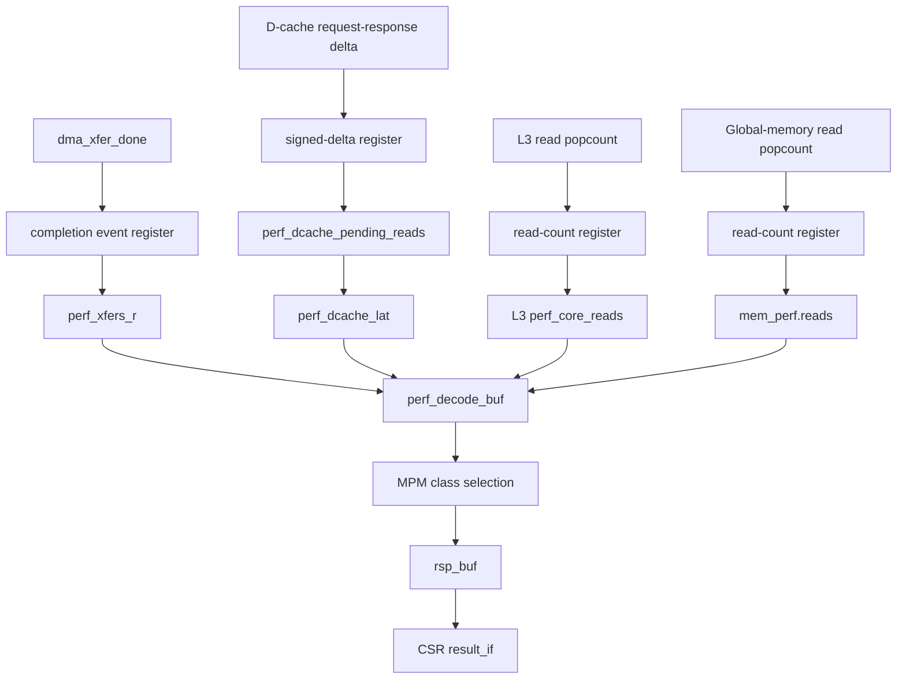

# Performance Monitor Timing Recovery - Plan

## Goal Capsule

- **Objective:** Apply one batch optimization to the four highest-risk performance-monitor paths—CPU-DMA transfer completion, D-cache pending reads, L3 reads, and global-memory reads—while preserving their CSR contracts and final drained values.
- **Authority:** The current source tree is authoritative for implementation. The placed checkpoint under `build/hw/syn/xilinx/xrt/improve_th32_tcol32_hwexp_dcache_pack16_xilinx_u55c_gen3x16_xdma_3_202210_1_hw/` is candidate-selection evidence; the single post-batch synthesis is the structural acceptance baseline.
- **Execution profile:** Implement all four RTL changes together, complete fast functional checks, then run at most one fresh U55C synthesis. Do not run placement or routing.
- **Stop conditions:** Stop before synthesis if the batch alters the CSR ABI, loses or duplicates an event after the pipeline drains, or changes non-PERF behavior. Do not expand the batch to other performance counters in response to intermediate simulation findings.
- **Tail ownership:** Completion includes functional compatibility, a successful post-batch synthesis, and confirmation that all four register boundaries survive in the synthesized netlist. Physical timing closure is explicitly unverified.

---

## Product Contract

### Summary

Pipeline the four selected update inputs in one RTL batch and run at most one fresh synthesis after functional verification. Keep the existing two-stage CSR response path, leave every lower-ranked performance-monitor path unchanged, and do not launch PnR.

### Problem Frame

The existing placed checkpoint has a `-2.674 ns` path from the misaligned CPU-DMA state logic through `dma_xfer_done` to the 44-bit `perf_xfers_r` clock-enable pins. The path is 12.236 ns long, has 40 logic levels, and spends 8.888 ns in routing. This identifies the counter-enable source, rather than the counter adder or CSR read mux, as the immediate failure.

The next three update paths have little placed margin: `perf_dcache_pending_reads` at `+1.736 ns`, L3 passthrough reads at `+1.742 ns`, and global-memory reads at `+1.744 ns`. Because each full implementation is expensive, these three are applied together with the failing CPU-DMA path instead of using a new synthesis as a gate between edits. Lower-ranked paths, beginning with `perf_overlap_r` at `+2.881 ns`, are excluded. The counter-to-`perf_decode_buf` path has `+6.428 ns` slack, so another CSR pipeline stage is also excluded.

The build checkpoint predates or differs from current work on the generalized misaligned DMA. It is used only to select the top four paths; no pre-edit synthesis is required. Final acceptance checks the four inserted boundaries in one current-tree post-batch synthesized netlist. Because placement and routing are excluded, this plan does not claim 100 MHz timing closure. `hw/rtl/core/VX_dma_unit_align.sv` remains a read-only pattern reference because it already contains user changes.

### Requirements

**Timing recovery**

- R1. Break only the `state_n -> dma_xfer_done -> perf_xfers_r/CE` CPU-DMA path with a PERF-only event register; leave the other CPU-DMA event counters unchanged.
- R2. Confirm in the single post-batch synthesized netlist that each selected raw event or popcount terminates at its new staging register and no longer directly drives the original 44-bit counter update path.
- R3. Complete U55C synthesis and record post-synthesis timing estimates and hierarchical utilization for the four changed hierarchies; treat these estimates as diagnostic only, not proof of physical closure.
- R4. Keep the existing counter-to-CSR response path at two register stages for direct counters; HBM channel counters retain their registered aggregate stage.

**Counter correctness and compatibility**

- R5. Preserve `PERF_CTR_BITS=44`, all MPM classes, CSR addresses, `dma_perf_t`, `hbm_dma_perf_t`, `pipeline_perf_t`, and `sysmem_perf_t` interfaces.
- R6. Preserve exact cumulative counter values after the added event pipelines drain; an active-work snapshot may be one cycle stale.
- R7. Preserve reset behavior so no pending event increments a counter after reset and no event from a prior descriptor or kernel leaks into the next one.
- R8. Preserve PERF-disabled elaboration and behavior, and add state only under `PERF_ENABLE`.

**Scope control**

- R9. Implement the CPU-DMA transfer, D-cache pending-read, L3-read, and global-memory-read changes in one batch before the sole permitted synthesis run.
- R10. Ignore `perf_overlap_r`, the remaining CPU-DMA handshake/byte/active/stall counters, GEMM counters, local-DMA counters, HBM counters, and CSR read-path optimization in this plan.
- R11. Do not change counter widths, remove software-visible counters, alias semantically distinct L3 and memory counters, reduce `DMXU_COL_TILE`, modify MXU datapaths, or add another optimization after the batch result.

### Acceptance Examples

- AE1. When a misaligned DMA descriptor enters `S_DONE`, `CPU_DMA_XFER_CNT` increments exactly once on the following counter-update edge and remains exact after the event pipeline drains.
- AE2. Back-to-back DMA descriptors in opposite directions produce the same final transfer count as the unpipelined reference model while all non-transfer CPU-DMA counters retain their original update latency.
- AE3. Simultaneous L3 read requests on multiple ports increment `L3CACHE_READS` by the corresponding popcount after one drain cycle, including bypass mode; L3 write-counter timing is unchanged.
- AE4. A global-memory read request and response occurring in the same cycle preserve the unchanged pending-read balance and `MEM_LT` recurrence, while `MEM_READS` reaches the exact final value after its new read-count stage drains.
- AE5. The single post-batch timing run reports all four selected endpoint groups and does not trigger follow-on edits to lower-ranked performance counters.
- AE6. Back-to-back CSR requests spanning the modified MPM classes 1, 2, and 4 remain ordered and return the expected counter value under response backpressure; the CSR address map itself is unchanged.

### Success Criteria

- PERF-enabled CPU-DMA, DMA-engine, cache, and CSR tests pass with exact drained values.
- Representative `fpint_gemm_ffn_hw` `xrt-vcs-sim` runs pass without profiling and with MPM classes 1, 2, and 4, which expose the four modified counters.
- A fresh synthesized netlist contains all four intended staging boundaries and no direct raw-event path to the original wide counters.
- Post-synthesis timing estimates and hierarchical LUT/FF/control-set counts are recorded without claiming placed or routed timing closure.
- The final diff contains no modification to CSR numbers, performance struct layouts, `hw/rtl/core/VX_dma_unit_align.sv`, or MXU RTL.

### Scope Boundaries

In scope:

- PERF-only event staging in misaligned CPU DMA.
- Staging of the L3 passthrough read popcount and global-memory read popcount before their 44-bit read counters.
- Staging of the D-cache signed pending-read delta before `perf_dcache_pending_reads`.
- Focused counter-correctness tests, CSR ordering regression, synthesized-netlist query automation, and one current-tree U55C synthesis report set.

Out of scope:

- Additional CSR decode/response stages, counter-width reduction, CSR ABI changes, runtime formatting changes, MXU optimization, `DMXU_COL_TILE` changes, or memory-topology changes.
- `perf_overlap_r`, all CPU-DMA counters except `perf_xfers_r`, HBM aggregate/max/min logic, local-DMA counters, GEMM counters, L3 writes, and global-memory writes.
- Placement, routing, bitstream generation, and any PnR-based timing-closure claim.
- Intermediate synthesis runs between the four RTL changes.
- Editing `hw/rtl/core/VX_dma_unit_align.sv`; it is a pattern reference only.

#### Deferred to Follow-Up Work

- Area reduction by disabling rarely used counters or making counters selectively configurable.
- Cross-counter sharing between L3 passthrough and global-memory statistics; this requires a separate semantic-equivalence decision.
- Optimization of any lower-ranked PERF or non-PERF path exposed by post-synthesis diagnostics.

---

## Planning Contract

### Key Technical Decisions

- KTD1. Preserve the existing CSR pipeline and optimize counter-update inputs instead. The measured CSR path has `+6.428 ns` slack, while the failing path ends at `perf_xfers_r/CE`.
- KTD2. Register only `dma_xfer_done` before `perf_xfers_r`. Leave active, byte, wait, fire, and stall counters on their existing update paths because they are outside the selected top four.
- KTD3. Keep each counter at its semantic owner and stage only the L3 read popcount and global-memory read popcount. Do not alias L3 and global-memory counters even when the current bypass configuration makes their values appear equivalent; leave both write paths unchanged.
- KTD4. Preserve the D-cache pending/latency recurrence by registering the signed request-minus-response delta as a unit before `perf_dcache_pending_reads`. Do not route the staged global-memory read popcount into `perf_mem_pending_reads`; its pending and latency logic remains unchanged.
- KTD5. Apply all four selected changes before synthesis. Run compile, unit, assertion, and `xrt-vcs-sim` checks first; do not insert synthesis checkpoints between RTL edits and do not run PnR.
- KTD6. Accept the batch structurally when each new boundary survives synthesis and separates its raw source from the original wide-counter update. Record post-synthesis timing estimates for reference only; physical slack, WNS/TNS, congestion, and route completion are not acceptance criteria. (session-settled: user-directed — chosen over a final PnR closure check: PnR is excluded from this work.)
- KTD7. Use `hw/rtl/core/VX_dma_unit_align.sv` and `hw/rtl/core/gemm/VX_lmem_dma_misal.sv` as the trigger-stage patterns. The aligned-DMA file remains unmodified because it contains user-owned changes.
- KTD8. Restrict the batch to the four ranked paths and ignore all remaining candidates. (session-settled: user-directed — chosen over synthesis-gated sequential optimization because each synthesis/implementation run is expensive.)

### High-Level Technical Design

Direct counters reach CSR response in two stages after the counter: `perf_decode_buf` and `rsp_buf`. The new trigger stage changes CPU-DMA transfer, L3-read, and global-memory-read event-to-CSR latency from three to four stages without changing counter-to-CSR latency. The D-cache request/response event reaches `perf_dcache_lat` through the new delta register and the existing pending register, so its event-to-CSR latency changes from four to five stages. No other counter path changes.

### Sequencing

1. Archive the existing placed-checkpoint evidence and create repeatable queries for exactly the four selected endpoint groups; do not run a fresh pre-edit synthesis.
2. Implement CPU-DMA completion, D-cache signed-delta, L3-read-popcount, and global-memory-read-popcount staging as one RTL batch.
3. Run PERF-disabled compilation, focused PERF-enabled unit tests, shadow-model assertions, CSR ordering checks, and the selected `xrt-vcs-sim` classes. Stop before synthesis on any semantic regression.
4. If all functional gates pass, run one clean matched U55C synthesis, then inspect the four new boundaries, post-synthesis timing estimates, and hierarchical utilization.
5. Record the structural result and stop. Do not run placement, route, bitstream generation, a second synthesis, or a lower-ranked optimization under this plan.

### Risks and Mitigations

- **Stale in-flight snapshots:** Event staging delays visible counts by one cycle. Tests read counters only after a defined drain interval and separately verify that no extra event appears afterward.
- **Latency-counter off-by-one:** Staging only a request or response side would alter the pending integral. Stage the signed delta as a unit and compare exact final latency values against a cycle-accurate scoreboard.
- **Current-tree/build mismatch:** The old DCP may not reflect generalized DMA work. Treat its values as selection evidence only; record the exact current revision, config, defines, and report paths for the final build, and judge acceptance by absolute final timing rather than claiming a source-matched delta.
- **Added FF and control-set pressure:** Trigger registers are narrow but can create new control sets. Keep reset/enable style consistent with neighboring PERF logic and compare hierarchical LUT, FF, and control-set counts.
- **Synthesis-only evidence cannot prove PnR:** Netlist structure and estimated timing cannot predict placement, congestion, routing delay, WNS, or TNS reliably. Report this limitation prominently and make no 100 MHz closure claim.
- **Batch synthesis obscures per-edit QoR:** One synthesized result cannot isolate the area or estimated-timing effect of each edit. Accept this tradeoff to avoid repeated synthesis; use named cells and source-to-stage endpoint queries to confirm that every inserted boundary exists.

---

## Implementation Units

### U1. Archive the selection baseline and prepare four endpoint queries

- **Goal:** Preserve the evidence that selected the top four and make their final endpoint queries repeatable without running a pre-edit synthesis.
- **Requirements:** R2, R3, R9.
- **Dependencies:** None.
- **Files:**
  - Create `agent-tasks/perf-monitor-timing/query_perf_paths.tcl`.
  - Create `agent-tasks/perf-monitor-timing/baseline.md`.
  - Reference `configs/improve_th32_tcol32_hwexp_dcache.sh`.
  - Reference `build/hw/syn/xilinx/xrt/improve_th32_tcol32_hwexp_dcache_pack16_xilinx_u55c_gen3x16_xdma_3_202210_1_hw/_x/link/vivado/vpl/prj/prj.runs/impl_1/hw_bb_locked_timing_summary_placed.rpt`.
- **Approach:** Record the existing checkpoint path, its known build identity, and the current source revision. Query only CPU DMA `perf_xfers_r`, D-cache pending/latency, L3 reads, and global-memory reads. Capture cell count, worst slack, data-path delay, route share, logic levels, startpoint, and endpoint. Mark the checkpoint explicitly as source-unmatched selection evidence. A missing endpoint must be reported as optimized, renamed, or absent rather than silently treated as passing.
- **Execution note:** Do not synthesize the unmodified current tree. Prepare and validate the query script against the existing checkpoint, then reserve at most one synthesis run for the complete batch; never launch downstream implementation steps.
- **Patterns to follow:** `agent-tasks/perf-timing-pipeline/perf-timing-pipeline-spec.md` and the existing checkpoint inspection workflow.
- **Test scenarios:**
  1. A checkpoint containing the known CPU-DMA endpoint reports `perf_xfers_r/CE` and its worst path rather than returning an empty success.
  2. A renamed or optimized-away pattern is emitted as `NO_PATH` with the queried pattern so the result remains auditable.
  3. Repeating the query on the same checkpoint produces the same endpoint count and worst slack.
- **Verification:** `baseline.md` identifies the checkpoint provenance, states that it is not a source-matched baseline, and contains one result row for each of the four selected endpoint groups; the CPU-DMA row is reconciled with the old `-2.674 ns` evidence.

### U2. Pipeline misaligned CPU-DMA transfer completion

- **Goal:** Eliminate the proven CPU-DMA `perf_xfers_r` counter-enable violation without changing any lower-ranked DMA counter path.
- **Requirements:** R1, R5, R6, R7, R8, R10; KTD1, KTD2, KTD7, KTD8.
- **Dependencies:** U1.
- **Files:**
  - Modify `hw/rtl/core/VX_dma_unit_misal.sv`.
  - Modify `hw/unittest/dma_node/tb_VX_dma_node.sv`.
  - Reference without modifying `hw/rtl/core/VX_dma_unit_align.sv`.
  - Reference `hw/rtl/core/gemm/VX_lmem_dma_misal.sv`.
- **Approach:** Add one PERF-only `dma_xfer_done` trigger register and drive only `perf_xfers_r` from it. Keep completion pulse capture lossless for back-to-back descriptors. Leave active, byte-count, wait, request/data fire/stall, destination fire/stall, `perf.busy`, and every public assignment unchanged.
- **Execution note:** Extend the existing PERF scoreboard before the RTL edit so delayed visibility and exact drained totals are characterized.
- **Patterns to follow:** The reset, capture, and counter-update split in aligned DMA and local DMA.
- **Test scenarios:**
  1. A single misaligned transfer increments `xfer_count` exactly once after the trigger stage drains.
  2. Back-to-back descriptors in opposite directions do not merge or lose completion events.
  3. Source and destination backpressure counters retain their original update latency and exact totals.
  4. Reset with a captured trigger clears it and prevents a post-reset increment.
  5. PERF-disabled compilation introduces no trigger registers or interface changes.
- **Verification:** The DMA-node PERF scoreboard passes, `xfer_count` settles to its reference total after one added drain cycle, all other CPU-DMA counters retain their prior timing and totals, and the single final query shows the `perf_xfers_r` endpoint satisfies R2.

### U3. Pipeline L3 and global-memory read popcounts

- **Goal:** Cut the two roughly `+1.74 ns` read-counter paths without merging counters or changing their final values.
- **Requirements:** R2, R5, R6, R7, R8, R9, R11; KTD3, KTD4, KTD6.
- **Dependencies:** U1. Implement in the same batch as U2 and U4.
- **Files:**
  - Modify `hw/rtl/cache/VX_cache_wrap.sv`.
  - Modify `hw/rtl/Vortex.sv`.
  - Modify `hw/unittest/cache_top/Makefile`.
  - Modify `hw/unittest/cache_top/tb_VX_cache_top.sv`.
  - Modify `hw/unittest/csr_unit/tb_VX_csr_unit.sv` to cover the staged L3 and global-memory class-2 values.
- **Approach:** In `VX_cache_wrap.sv`, register only the L3 read popcount before the 44-bit read counter; leave the write popcount and write counter unchanged. In `Vortex.sv`, register only the global-memory read popcount before `mem_perf.reads`; do not reuse that register in `perf_mem_pending_reads` or latency logic, and leave global-memory writes unchanged. Retain separate L3 statistics in bypass mode rather than sourcing them from `mem_perf`.
- **Execution note:** Apply both read stages unconditionally as part of the four-change batch. Keep separate signal names and netlist queries even though they are checked in the same synthesis.
- **Patterns to follow:** Registered reduction outputs in `hw/rtl/mem/VX_dma_engine.sv` and PERF-only trigger stages in DMA modules.
- **Test scenarios:**
  1. One and multiple simultaneous bypass-cache read requests produce the exact L3 read popcount after drain.
  2. Mixed simultaneous reads and writes preserve separate L3 totals, and the write counter retains its original update latency.
  3. Global-memory request and response events in the same cycle leave the existing pending/latency recurrence unchanged while the read total becomes exact after one drain cycle.
  4. A burst followed by idle cycles produces no late increments after the expected pipeline drain.
  5. Class-2 CSR reads return the staged L3 and memory totals in order under response backpressure.
- **Verification:** Cache and CSR tests pass with exact drained read values and unchanged write/pending/latency behavior, and the single final endpoint query shows both selected read paths satisfy R2 without creating a new failing PERF path.

### U4. Pipeline the D-cache pending-read delta

- **Goal:** Cut the selected D-cache pending-read path while preserving pending balance and the exact final load-latency integral.
- **Requirements:** R2, R5, R6, R7, R8, R9, R10; KTD4, KTD5, KTD6, KTD8.
- **Dependencies:** U1. Implement in the same batch as U2 and U3.
- **Files:**
  - Modify `hw/rtl/core/VX_core.sv`.
  - Modify `hw/unittest/csr_unit/tb_VX_csr_unit.sv` for class-1 drained-value readback.
  - Use `tests/regression/fpint_gemm_ffn_hw/kernel.cpp` and `tests/regression/fpint_gemm_ffn_hw/main.cpp` as integration verification inputs without changing workload semantics.
- **Approach:** Register the signed D-cache request-minus-response delta before updating `perf_dcache_pending_reads`; keep request and response in the same delta so simultaneous events cancel before the boundary. Leave `perf_dcache_lat` consuming the pending register, which shifts the pending waveform by one cycle while preserving its drained integral. Add a PERF-enabled, simulation-only shadow recurrence and assertions to compare the staged pending and latency counters with the original equation after the defined drain delay; exclude all checkers from synthesis. Do not modify `perf_overlap_r`.
- **Execution note:** Apply this stage unconditionally in the batch and verify semantics before the optional single synthesis.
- **Patterns to follow:** Existing one-cycle PERF event staging and the current pending-read/latency recurrence in `VX_core.sv`.
- **Test scenarios:**
  1. Simultaneous D-cache request and response events preserve pending balance.
  2. Multiple outstanding reads with variable response latency preserve the final `LOAD_LT` integral after one additional drain cycle.
  3. Back-to-back nonzero signed deltas are neither merged nor lost.
  4. Reset clears captured signed-delta state without a late pending or latency increment.
  5. `perf_overlap_r` retains its original recurrence and update latency.
- **Verification:** PERF class-1 integration results match the reference model after drain, overlap behavior remains unchanged, and the single final query shows the D-cache selected endpoint satisfies R2.

### U5. Prove functional compatibility and synthesized-netlist structure

- **Goal:** Establish that the batch preserves the performance-monitor contract and that all four timing boundaries survive synthesis, without running PnR.
- **Requirements:** R2, R3, R4, R5, R6, R8, R10, R11.
- **Dependencies:** U2, U3, and U4 are all complete and have passed pre-synthesis functional gates.
- **Files:**
  - Update `agent-tasks/perf-monitor-timing/baseline.md` with the four structural results, synthesis diagnostics, and source-unmatched historical evidence.
  - Reference `hw/unittest/dma_engine/tb_VX_dma_engine.sv`.
  - Reference `hw/unittest/csr_unit/tb_VX_csr_unit.sv`.
  - Reference `tests/regression/fpint_gemm_ffn_hw/`.
  - Reference `docs/impl_verify_checklist.md`.
- **Approach:** Run focused PERF-disabled and PERF-enabled tests first, then `xrt-vcs-sim` without profiling and with classes 1, 2, and 4. After those gates pass, run one clean matched U55C synthesis. Record stage latency, hierarchical LUT/FF/control-set counts, the four inserted cells and source-to-stage paths, and post-synthesis timing estimates. Do not launch implementation, placement, route, or bitstream targets. Compare against the old checkpoint only as contextual selection evidence; do not claim an exact QoR delta or physical timing closure across source-mismatched flows.
- **Test scenarios:**
  1. PERF-disabled and PERF-enabled unit builds both pass from a properly configured build directory.
  2. Back-to-back MPM classes 1, 2, and 4 remain ordered under CSR response backpressure; the unchanged class decode mapping is checked structurally for all classes.
  3. `fpint_gemm_ffn_hw` passes without profiling and with the modified counter classes enabled.
  4. The synthesized netlist contains each intended staging register and no direct raw-source path to its original counter update.
  5. The run stops after synthesis and produces no placed checkpoint, routed checkpoint, or bitstream.
- **Verification:** All gates in the Verification Contract pass and the Definition of Done is satisfied. If a boundary is optimized away or a functional gate fails, document the result and stop without adding another candidate, launching another synthesis, or running PnR.

---

## Verification Contract

| Gate | Scope | Invocation or artifact | Passing signal |
|---|---|---|---|
| DMA counter unit without PERF | U2 | From the configured build tree, `make -C hw/unittest/dma_node SIM_EXEC=vcs run` | PERF-disabled elaboration and the functional DMA regression pass |
| DMA counter unit | U2 | From the configured build tree, `make -C hw/unittest/dma_node PERF=1 SIM_EXEC=vcs run` | Exact scoreboard match after drain; no reset leakage |
| DMA aggregate regression | U2, U5 | `make -C hw/unittest/dma_engine PERF=1 SIM_EXEC=vcs run` | Existing DMA-engine counters remain exact; only CPU-DMA transfer visibility gains one cycle |
| L3/cache counter unit | U3 | `make -C hw/unittest/cache_top PERF=1 SIM_EXEC=vcs run` after adding the PERF switch | Read/write popcounts and drain behavior match the model |
| CSR ordering | U3, U4, U5 | `make -C hw/unittest/csr_unit SIM_EXEC=vcs run` | Classes 1, 2, and 4 return the selected counters in order under backpressure; unchanged decode addresses for all classes remain intact |
| Integration without PERF | U5 | `ci/run_black.sh xrt-vcs-sim --app fpint_gemm_ffn_hw` with the target config sourced | Workload passes and cycles remain within measurement noise |
| Integration with PERF | U5 | The same wrapper with each of `--perf 1`, `--perf 2`, and `--perf 4` | Each modified class completes, produces its expected counter set, and remains stable after the defined drain interval |
| Synthesized boundaries | U5 | The sole post-batch synthesized checkpoint plus `agent-tasks/perf-monitor-timing/query_perf_paths.tcl` | All four new staging cells survive and each raw source terminates at its intended stage rather than the original wide counter |
| Post-synthesis diagnostics | U5 | Synthesis timing and hierarchical utilization reports, with the old placed report labeled source-unmatched | Estimated timing and LUT/FF/control-set cost are recorded as non-closure diagnostics |
| No-PnR guard | U5 | Build artifacts and logs | No placement, routing, implementation, or bitstream target runs; no placed/routed checkpoint or bitstream is produced |

All unit and blackbox invocations must run from a configured build directory after sourcing `configs/improve_th32_tcol32_hwexp_dcache.sh`. Host-side unittest compilation uses `/usr/bin/gcc` and `/usr/bin/g++` where required by repository instructions.

---

## Definition of Done

- U1 archives the source-unmatched selection baseline and provides repeatable queries for exactly four endpoint groups without a pre-edit synthesis.
- U2 stages only CPU-DMA transfer completion, preserves its exact drained count, and leaves all other CPU-DMA counter update latencies unchanged.
- U3 stages only L3 reads and global-memory reads; their write paths and global pending/latency recurrence remain unchanged.
- U4 stages only the D-cache signed pending-read delta, preserves pending balance and exact drained `LOAD_LT`, and leaves `perf_overlap_r` unchanged.
- CSR class values, addresses, response ordering, and the direct counter-to-CSR two-stage path remain unchanged.
- Existing aligned DMA, HBM, local DMA, and GEMM trigger stages remain intact.
- PERF-enabled and PERF-disabled unit tests pass, and required `xrt-vcs-sim` profiling runs pass.
- If the pre-synthesis gates pass, exactly one post-batch U55C synthesis is run and all four intended staging boundaries survive in its netlist; a failed pre-synthesis gate ends the work without synthesis.
- Hierarchical LUT, FF, control-set, and estimated timing results are recorded as synthesis-only diagnostics.
- Placement, routing, implementation, and bitstream generation are not run; the result makes no PnR or 100 MHz timing-closure claim.
- No lower-ranked candidate, abandoned experiment, unused trigger signal, stale report claim, or unrelated RTL cleanup remains in the production diff; durable simulation-only assertions required by U4 may remain and must be excluded from synthesis.

---

## Appendix

### Timing Baseline from the Existing Placed Checkpoint

| Selected register or group | CSR path | Existing placed slack | Event-to-CSR stages before | Event-to-CSR stages after |
|---|---|---:|---:|---:|
| CPU DMA `perf_xfers_r` | class 4, `B07/B87` | `-2.674 ns` | 3 | 4 |
| `perf_dcache_pending_reads` feeding `perf_dcache_lat` | class 1, `B12/B92` | `+1.736 ns` to pending register | 4 | 5 |
| L3 bypass `perf_core_reads` | class 2, `B12/B92` | `+1.742 ns` | 3 | 4 |
| `mem_perf.reads` | class 2, `B18/B98` | `+1.744 ns` | 3 | 4 |

Explicitly ignored in this plan: `perf_overlap_r`; every other CPU-DMA counter; GEMM, local-DMA, and HBM counters; L3 and global-memory writes; CSR response-path pipelining; `DMXU_COL_TILE`; and any newly exposed non-PERF optimization.

### Source Breadcrumbs

- `agent-tasks/perf-timing-pipeline/perf-timing-pipeline-spec.md` records the previously confirmed event-pipeline and CSR compatibility decisions.
- `hw/rtl/core/VX_dma_unit_misal.sv` contains the direct CPU-DMA event-to-counter updates that require restoration of the trigger boundary.
- `hw/rtl/core/VX_dma_unit_align.sv` and `hw/rtl/core/gemm/VX_lmem_dma_misal.sv` contain the existing trigger-stage pattern.
- `hw/rtl/cache/VX_cache_wrap.sv`, `hw/rtl/Vortex.sv`, and `hw/rtl/core/VX_core.sv` own the other three selected counters.
- `hw/rtl/core/VX_csr_data.sv` and `hw/rtl/core/VX_csr_unit.sv` define the unchanged MPM mapping and two-stage CSR response path.
