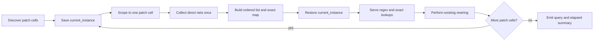
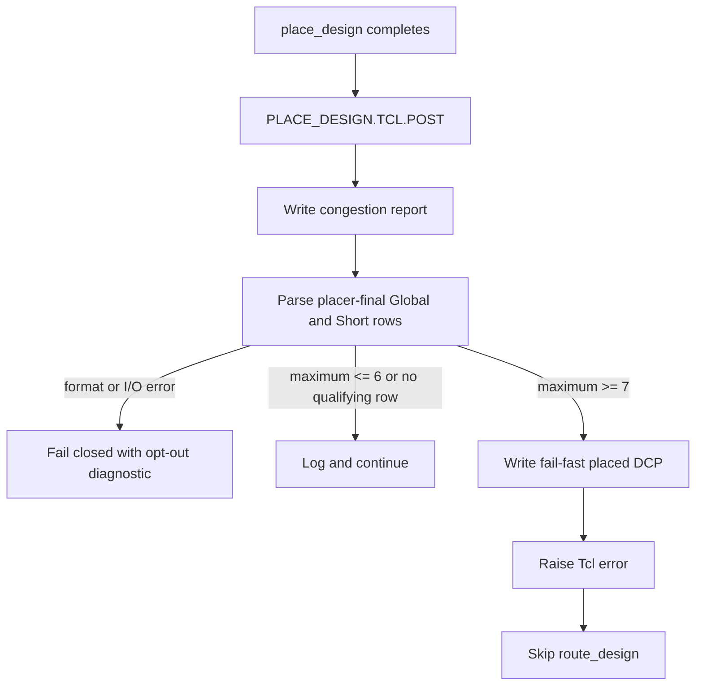

# Xilinx PnR Turnaround - Plan

## Goal Capsule

- **Objective:** Remove the repeated whole-design net scans in the asynchronous BRAM patch and stop hardware implementation immediately after placement when routability is already at Global/Short congestion Level 7 or worse.
- **Authority:** Preserve the user-approved Level 7 boundary and opt-out behavior. Existing Vivado transformation semantics, repository build rules, and AMD Tcl behavior constrain the implementation.
- **Execution profile:** Characterization-first Tcl refactor, fixture-driven parser and generator tests, placed-checkpoint replay, then one representative U55C hardware build.
- **Stop conditions:** Do not accept a cache that changes selected nets or transformed connectivity. Do not enter `route_design` after a Level 7+ Global/Short post-place result when the gate is enabled.
- **Tail ownership:** This plan owns implementation and local verification through one representative U55C build attempt. It does not own floorplanning or RTL changes that reduce congestion.

---

## Product Contract

### Summary

Speed up Xilinx hardware builds at two independent delay points. The async-BRAM patch will inventory each patch instance's direct nets once and reuse that immutable index. A new post-place hook will retain diagnostics and abort before routing when Global/Short congestion reaches Level 7 or 8.

### Problem Frame

The target build `naive_gemm_th32_tcol32_hwexp_dcache_pack16_xilinx_u55c_gen3x16_xdma_3_202210_1_hw` spent about 15 hours 40 minutes in the async-BRAM patch because 110 patch instances triggered 771 hierarchical `get_nets` scans. It later spent 2 hours 26 minutes placing and 5 hours 5 minutes routing before `route_design` failed at Global/Short congestion Level 7. The flow therefore consumes most of a day after it has already exposed two actionable failure signals.

### Requirements

**Async-BRAM lookup performance and compatibility**

- R1. Each `VX_async_ram_patch` instance must collect its direct nets at most once and serve all regex and exact-name lookups from an immutable instance-local index.
- R2. The indexed lookup must preserve Vivado collection order, optional-match behavior, duplicate detection, address-bit pairing, and the existing netlist mutation order.
- R3. The cache must exclude connectivity-derived driver and sink queries because those relationships change while the patch rewires the design.
- R4. The patch must report patch-instance count, net-inventory query count, and elapsed time so the optimization remains measurable in implementation logs.

**Post-place congestion gate**

- R5. Hardware builds must register the post-place congestion hook by default, while `CONGESTION_FAIL_FAST=0` must remove only that hook; `hw_emu` must never register it.
- R6. The hook must generate `post_place_congestion.rpt`, recognize the `Placer Final Level Congestion Reporting` table, and compute the maximum level from Global and Short rows only.
- R7. A parsed Global/Short maximum of 7 or 8 must overwrite the deterministic `post_place_fail_fast.dcp` with `write_checkpoint -force`, print normalized report and checkpoint paths, and then return a nonzero Tcl error before routing begins.
- R8. A parsed Global/Short maximum of 6 or lower, a recognized table with no qualifying Global/Short row, or Long/timing Level 7 alone must retain the report and continue normally.
- R9. Report generation failure, an unreadable report, or an unrecognized table format must fail closed with a diagnostic that names `CONGESTION_FAIL_FAST=0` as the explicit recovery path.
- R10. Changing `CONGESTION_FAIL_FAST` in an existing build directory must refresh the configuration fingerprint, XRT backup, and generated `vitis.gen.ini` without requiring manual cleanup.

**Verification and scope**

- R11. Fast tests must cover async lookup equivalence and query cardinality, congestion levels 6 through 8, ignored Long/timing rows, malformed reports, default/disabled hardware generation, and hardware-emulation generation.
- R12. Existing placed checkpoints must prove both Level 7 termination and Level 6 continuation before the single fresh U55C build is started.
- R13. The representative U55C attempt must use `configs/naive_gemm_th32_tcol32_hwexp_dcache.sh`, show that repeated whole-design net scans are gone, and stop after placement with retained diagnostics instead of entering the known five-hour route failure.
- R14. The change must not modify RTL, floorplanning, placement directives, routing directives, clocks, or the fixed Level 7 policy.

### Acceptance Examples

- AE1. A patch instance with vector address nets performs one local inventory, returns the same ordered `raddr_w` and `raddr_s` pairs as the old helpers, and removes the same placeholder cells.
- AE2. Registered and unregistered address variants, with and without reset and `is_raddr_reg`, finish with the same source rewiring and valid design checks.
- AE3. A report whose Global maximum is 6 and timing congestion is 7 logs `continue`, writes no extra checkpoint, and lets the implementation proceed.
- AE4. A report whose Short maximum is 7 writes both deterministic artifacts and raises an error; Level 8 behaves the same way.
- AE5. A report containing only Long Level 7 does not trip the gate, while a report whose expected placer table cannot be recognized fails closed.
- AE6. Regenerating the same hardware build with `CONGESTION_FAIL_FAST=0` removes the `PLACE_DESIGN.TCL.POST` property while retaining all pre-existing hooks.
- AE7. The known Level 7 U55C configuration exits after `place_design`; its log contains the parsed Global/Short maximum and paths to the saved report and checkpoint, with no subsequent `route_design` command.

### Success Criteria

- The async patch executes no whole-design `get_nets -hierarchical -filter "PARENT_CELL ..."` query in its per-instance lookup path and performs no more than one direct-net inventory per patch instance.
- The known 110-instance workload reduces the measured async-patch elapsed time by at least 90% from the approximately 15-hour-40-minute baseline, while fixture and design checks remain equivalent.
- Fixture tests distinguish Global/Short congestion from Long and timing congestion and cover continue, fail-fast, and parser-failure outcomes.
- The Level 7 checkpoint replay and the representative U55C attempt create both failure artifacts and terminate before routing.
- Toggling the opt-out in a reused build directory predictably regenerates the hook configuration.

### Scope Boundaries

In scope:

- Net lookup and instrumentation inside `hw/scripts/xilinx_async_bram_patch.tcl`.
- A production XRT post-place hook, its parser, configuration wiring, and tests.
- Checkpoint replay and one representative U55C hardware attempt.

Not in scope:

- RTL, floorplan, pblock, placer, router, or clock changes.
- Congestion reduction, automatic retry, watchdogs, threshold tuning, or multi-seed builds.
- Porting the production hook to `sandbox/vitis_minimal/`.
- Optimizing `find_cell_descendants` unless characterization proves it blocks the 90% async-patch elapsed-time success criterion after the net-query fix.

---

## Planning Contract

### Key Technical Decisions

- KTD1. Implement both the async lookup optimization and the post-place fail-fast gate. (session-settled: user-approved — chosen over implementing only one improvement: the changes remove independent async-patch and routing delays.)
- KTD2. Build a lazy immutable net index once per patch parent under a temporarily scoped `current_instance`, using a non-hierarchical direct-net query. Restore the prior scope on every success and error path; do not retain the index across patch instances.
- KTD3. Keep an ordered net list for regex matching and an exact-name map for exact lookups. This preserves ordering and duplicate behavior without caching mutable connectivity.
- KTD4. Abort only for Global/Short congestion Level 7 or higher. (session-settled: user-approved — chosen over aborting at Level 6 or on any Level 7 text: Level 6 routes can succeed and Long/timing Level 7 is not the approved failure signal.)
- KTD5. Enable the gate by default for `TARGET=hw` and expose `CONGESTION_FAIL_FAST=0` as the explicit opt-out. (session-settled: user-approved — chosen over opt-in gating: the default should prevent the known multi-hour wasted route.)
- KTD6. Generate and parse one post-place report with the minimum report level low enough to distinguish a recognized low-congestion table from a format failure. Bound parsing to the placer-final section and fail closed on format drift.
- KTD7. Overwrite the deterministic report and explicit placed checkpoint before raising the congestion error, using `write_checkpoint -force` for repeatable replays. If checkpoint writing itself fails, preserve the original gate failure, report both errors, and still return nonzero.
- KTD8. Verify with fixture tests, existing checkpoints, and one fresh reproduction of the known Level 7 U55C build. (session-settled: user-approved — chosen over a multi-run sweep: one representative full-flow attempt is sufficient for this tooling change.)

### High-Level Technical Design

#### Async-BRAM lookup lifecycle

The inventory is a read-only snapshot of the target nets used by `resolve_async_bram`. Driver and sink discovery remains live because `replace_net_source` and placeholder removal mutate connectivity.

#### Post-place decision path

### Implementation Constraints

- Use `current_instance` as a scoped optimization only after proving its direct-net result matches the old `PARENT_CELL` filter for the fixture variants.
- Restore Vivado hierarchy scope through a `catch`-safe cleanup path so one failed inventory cannot contaminate later Tcl hooks.
- Preserve all current async-patch error messages or test their intentional replacements; do not convert hard errors into warnings.
- Keep the congestion parser in a sourceable Tcl helper and the post-place hook thin enough for fixture and checkpoint replay.
- Validate `CONGESTION_FAIL_FAST` as exactly `0` or `1`; Make's non-empty treatment of `0` must not control the branch.
- Ensure the config stamp recipe is reevaluated on each relevant Make invocation while retaining its compare-before-update behavior, so unchanged configuration does not trigger unnecessary rebuilds.
- Place test-only scripts and fixtures below test directories so the XRT top-level wildcard copies only production Tcl and Python files.

### System-Wide Impact

- `hw/scripts/xilinx_async_bram_patch.tcl` is shared by XRT, DUT, and sandbox synthesis hooks. Lookup behavior must remain compatible in all three consumers even though the measured performance gate is the XRT U55C flow.
- The new fail-fast hook affects only generated `hw` XRT implementation. It changes a Level 7 build from a late route failure to an intentional post-place failure with preserved artifacts.
- `CONFIG_FINGERPRINT`, `XRT_BACKUP_STAMP`, and `vitis.gen.ini` form one invalidation chain. A stale link anywhere in that chain can leave the user's selected gate state unapplied.
- Failure artifacts live in the Vivado `impl_1` working directory because the Makefile's final report target is not reached after the hook errors.

### Sequencing

U1 establishes transformation behavior before U2 changes the hot lookup path. U3 is independent of U1 and may proceed in parallel, but U4 depends on U3's production hook names and gate semantics. U5 starts only after U2 through U4 pass their fast gates.

### Risks and Mitigations

- **Vivado scope semantic mismatch:** `current_instance` may expose names differently from the old hierarchical filter. U1 compares ordered objects and transformed connectivity before U2 is accepted.
- **Stale cached objects:** netlist mutation can invalidate connectivity assumptions. The cache is limited to lookup targets and is discarded after each parent; all driver and sink queries remain live.
- **Report format drift:** loose numeric matching could trip on table-of-contents or router data. The parser is section-bounded and fails closed when the expected table shape is absent.
- **False fail-fast:** Long or timing Level 7 can coexist with a successful route. Only Global and Short rows participate in the decision.
- **Lost diagnostics:** a hook error prevents the normal report tail. The hook writes deterministic artifacts first and prints normalized paths before returning nonzero.
- **Stale opt-out state:** Make may otherwise consider the stamp current. U4 adds always-evaluated fingerprint comparison and tests a same-directory toggle.

---

## Implementation Units

### U1. Characterize the asynchronous BRAM transformation

- **Goal:** Lock down current lookup results and netlist postconditions before changing query behavior.
- **Requirements:** R2, R3, R11; AE1, AE2.
- **Files:** `hw/scripts/xilinx_async_bram_patch.tcl`, `hw/scripts/tests/xilinx_async_bram_patch_fixture.sv`, `hw/scripts/tests/test_xilinx_async_bram_patch.tcl`.
- **Approach:** Build a small Vivado synthesis fixture that elaborates multiple `VX_async_ram_patch` variants. Capture ordered regex and exact lookup results, then assert placeholder removal, source rewiring, design checks, and checkpoint validity after the existing resolver runs. Add test instrumentation that can count inventory calls without changing production selection semantics.
- **Test scenarios:** Cover scalar and vector addresses, fully registered and unregistered read addresses, reset enabled and disabled, optional `is_raddr_reg`, exact-name misses, optional regex misses, and duplicate-match failure.
- **Verification:** The pre-refactor fixture passes and records stable expected objects and postconditions for U2.
- **Dependencies:** None.

### U2. Replace repeated hierarchical net scans with a scoped index

- **Goal:** Reduce the async patch from repeated whole-design scans to one direct-net inventory per patch instance.
- **Requirements:** R1-R4, R11; AE1, AE2.
- **Files:** `hw/scripts/xilinx_async_bram_patch.tcl`, `hw/scripts/tests/test_xilinx_async_bram_patch.tcl`.
- **Approach:** Add instance-index lifecycle helpers, route `find_cell_nets` and `get_cell_net` through the ordered/indexed snapshot during `resolve_async_bram`, and restore `current_instance` through all errors. Keep mutable driver and sink helpers unchanged. Emit a single end-of-pass timing and query summary.
- **Test scenarios:** Re-run every U1 variant, inject an inventory failure to prove scope restoration, assert one inventory per patch parent, and reject any call to the old per-lookup hierarchical query pattern.
- **Verification:** U1 postconditions remain identical, design checks pass, and instrumentation reports inventory count equal to patch-instance count.
- **Dependencies:** U1.

### U3. Implement and test the congestion decision engine

- **Goal:** Produce deterministic post-place diagnostics and a precise Global/Short Level 7 gate.
- **Requirements:** R6-R9, R11, R12; AE3-AE5.
- **Files:** `hw/syn/xilinx/xrt/congestion_fail_fast.tcl`, `hw/syn/xilinx/xrt/post_place_hook.tcl`, `hw/syn/xilinx/xrt/tests/test_congestion_fail_fast.tcl`, `hw/syn/xilinx/xrt/tests/test_post_place_hook.tcl`, `hw/syn/xilinx/xrt/tests/fixtures/congestion_level6.rpt`, `hw/syn/xilinx/xrt/tests/fixtures/congestion_global7.rpt`, `hw/syn/xilinx/xrt/tests/fixtures/congestion_short8.rpt`, `hw/syn/xilinx/xrt/tests/fixtures/congestion_long7.rpt`, `hw/syn/xilinx/xrt/tests/fixtures/congestion_malformed.rpt`.
- **Approach:** Keep report parsing in a pure sourceable helper. Make the hook overwrite the deterministic report in the implementation working directory, parse only the placer-final table, write the failure checkpoint with `write_checkpoint -force` before raising an error, and preserve the gate error if checkpoint writing also fails.
- **Test scenarios:** Global/Short 6 continues; Global 7 and Short 8 fail; Long/timing 7 alone continues; a recognized table with no Global/Short rows continues; missing, unreadable, truncated, or structurally changed reports fail closed; simulated checkpoint failure still returns nonzero.
- **Verification:** Pure Tcl fixtures pass, and replay against known Level 6 and Level 7 placed checkpoints proves the real report shape and artifact behavior.
- **Dependencies:** None.

### U4. Wire default-on and opt-out behavior into XRT generation

- **Goal:** Make the post-place gate reliable for hardware builds and removable through one explicit build variable.
- **Requirements:** R5, R10, R11; AE6.
- **Files:** `hw/syn/xilinx/xrt/gen_vitis_ini.py`, `hw/syn/xilinx/xrt/Makefile`, `hw/syn/xilinx/xrt/tests/test_gen_vitis_ini.py`.
- **Approach:** Add validated `CONGESTION_FAIL_FAST ?= 1` handling, include it in the fingerprint, ensure the stamp comparison is reevaluated, and pass the setting to the generator. Register `STEPS.PLACE_DESIGN.TCL.POST` only for enabled hardware generation. Reuse the existing top-level wildcard backup behavior for the production Tcl files.
- **Test scenarios:** Default `hw` includes the hook; `hw` with `0` omits only that hook; `hw_emu` omits it for both values; invalid values fail clearly; toggling one existing build directory regenerates `vitis.gen.ini` and then stabilizes when unchanged.
- **Verification:** Python unit tests and a Make dry/invalidation fixture show correct INI content and no stale configuration reuse.
- **Dependencies:** U3.

### U5. Prove the time saving in the representative U55C flow

- **Goal:** Validate both improvements together on the configuration that produced the observed delay.
- **Requirements:** R4, R7, R12-R14; AE7.
- **Files:** `configs/naive_gemm_th32_tcol32_hwexp_dcache.sh`, `build/hw/syn/xilinx/xrt/naive_gemm_th32_tcol32_hwexp_dcache_pack16_xilinx_u55c_gen3x16_xdma_3_202210_1_hw/.config.stamp`, `build/hw/syn/xilinx/xrt/naive_gemm_th32_tcol32_hwexp_dcache_pack16_xilinx_u55c_gen3x16_xdma_3_202210_1_hw/_x/link/vivado/vpl/prj/prj.runs/impl_1/runme.log`.
- **Approach:** From the configured build tree, source the named configuration and launch one normal `hw` U55C build with the default gate. Compare the async-patch query/timing summary with the existing log, then inspect the implementation log and deterministic failure artifacts. Generated build artifacts remain uncommitted.
- **Test scenarios:** The 110-instance patch performs no repeated whole-design scans and meets the elapsed-time target; placement reaches Global/Short Level 7; the hook writes report and checkpoint; v++ exits nonzero before any route command. Use the Level 6 checkpoint replay, not a second full build, to prove continuation.
- **Verification:** The single build attempt satisfies the measurable cache gate, produces both failure artifacts, and avoids the previous five-hour routing phase.
- **Dependencies:** U2, U3, U4.

---

## Verification Contract

### Fast gates

- Run `python3 hw/syn/xilinx/xrt/tests/test_gen_vitis_ini.py`; all default, opt-out, `hw_emu`, invalid-value, and hook-preservation cases must pass.
- Run the pure Tcl congestion fixture suite at `hw/syn/xilinx/xrt/tests/test_congestion_fail_fast.tcl`; all decision and malformed-input cases must pass without Vivado.
- Run the Vivado batch fixture at `hw/scripts/tests/test_xilinx_async_bram_patch.tcl`; all transformation variants must pass design checks and the inventory count must equal the patch-instance count.

### Checkpoint gates

- Replay `hw/syn/xilinx/xrt/tests/test_post_place_hook.tcl` against an existing Level 7 `level0_wrapper_placed.dcp`; expect a nonzero gate result plus `post_place_congestion.rpt` and `post_place_fail_fast.dcp`.
- Replay the same harness against the known Level 6 placed checkpoint; expect a normal return, a retained report, and no fail-fast checkpoint.
- Treat existing files below `build/hw/syn/xilinx/xrt/` as local verification inputs, never committed fixtures.

### Representative hardware gate

- Configure the repository build tree as required by `AGENTS.md`, source `configs/naive_gemm_th32_tcol32_hwexp_dcache.sh`, and run exactly one default `hw` U55C build attempt.
- Accept the async optimization only when the log shows no repeated whole-design parent-net query, no more than one direct inventory per patch instance, and at least a 90% elapsed-time reduction from the recorded baseline.
- Accept fail-fast only when the log shows the parsed Global/Short Level 7+ result, both artifact paths resolve to readable files, v++ returns nonzero, and `route_design` never starts.
- Do not run a second full build or a seed sweep. The Level 6 checkpoint replay covers the continue branch.

---

## Definition of Done

- R1-R14 and AE1-AE7 trace to passing verification evidence.
- U1 and U2 prove identical async-BRAM transformation behavior with one direct-net inventory per patch instance and no leaked Vivado hierarchy scope.
- U3 proves correct Level 6, Level 7, Level 8, ignored Long/timing, no-qualifying-row, report-error, and checkpoint-error behavior.
- U4 proves default-on hardware behavior, explicit opt-out, `hw_emu` exclusion, input validation, and same-directory invalidation.
- U5 records the async-patch before/after metrics and demonstrates that the known Level 7 build stops before routing with readable diagnostics.
- No RTL, floorplanning, routing-strategy, sandbox-copy, multi-run, or unrelated dirty-worktree changes are included.
- Temporary experiments and abandoned cache/parser variants are absent from the final diff; generated reports and checkpoints remain outside version control.

---

## Appendix

### Sources and Research

- `hw/scripts/xilinx_async_bram_patch.tcl:121` and `hw/scripts/xilinx_async_bram_patch.tcl:146` contain the measured repeated hierarchical net queries; `resolve_async_bram` begins at `hw/scripts/xilinx_async_bram_patch.tcl:531`.
- `hw/syn/xilinx/xrt/gen_vitis_ini.py:44` defines the production Vivado hook list; `hw/syn/xilinx/xrt/Makefile:76` backs up top-level Tcl/Python files and `hw/syn/xilinx/xrt/Makefile:79` defines the build fingerprint.
- The target `impl_1/runme.log` records 771 `get_nets` timings, 110 patch instances, a 5-hour-5-minute route, and the final Level 7 route failure.
- AMD documents that `get_nets` searches only the current instance without `-hierarchical`: [Vivado Tcl `get_nets`](https://docs.amd.com/r/en-US/ug835-vivado-tcl-commands/get_nets).
- AMD documents scoped hierarchy control through `current_instance`: [Vivado Tcl `current_instance`](https://docs.amd.com/r/2023.1-English/ug835-vivado-tcl-commands/current_instance).
- AMD documents post-place congestion reporting and the supported congestion-level range: [Vivado Tcl `report_design_analysis`](https://docs.amd.com/r/en-US/ug835-vivado-tcl-commands/report_design_analysis).
- AMD documents step-hook properties including post-step Tcl hooks: [Defining Tcl Hook Scripts](https://docs.amd.com/r/en-US/ug894-vivado-tcl-scripting/Defining-Tcl-Hook-Scripts).
- AMD documents the Vitis `prop=run.impl_1.STEPS.<STEP>.TCL.POST=...` configuration form: [Specifying Constraints for the Vitis Environment](https://docs.amd.com/r/2024.2-English/ug1387-acap-hardware-ip-platform-dev-methodology/Specifying-Constraints-for-the-Vitis-Environment).
- No repository `docs/solutions/` corpus or root `CONCEPTS.md` exists, so there is no prior institutional pattern to inherit for either change.
