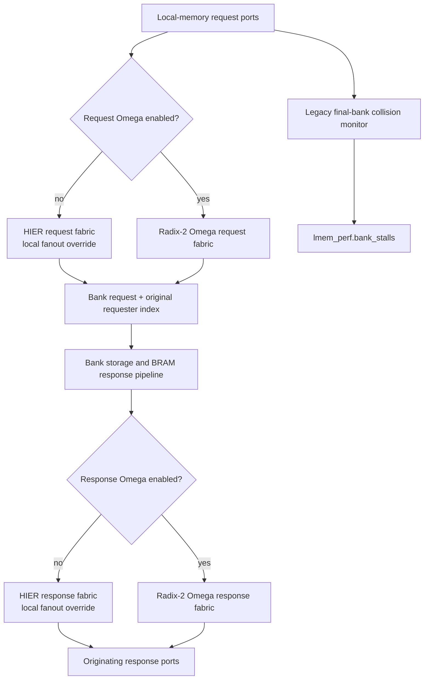
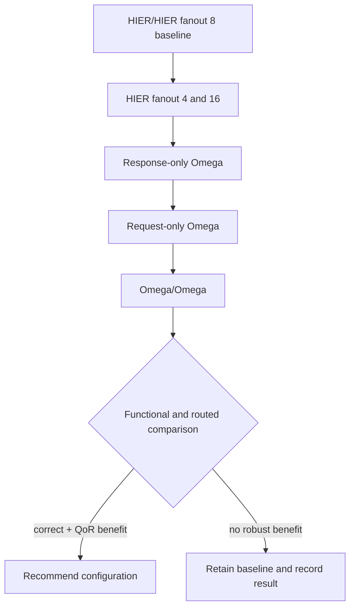

# Local Memory Selectable Interconnect - Plan

## Goal Capsule

- **Objective:** Make the local-memory request and response fabrics independently selectable between the incumbent hierarchical crossbar and radix-2 Omega, while exposing a local hierarchical `MAX_FANOUT` override and preserving default behavior.
- **Authority:** User-settled topology, fanout, counter-semantics, and scope decisions take precedence over this plan; this plan then follows existing Vortex RTL and verification conventions.
- **Execution profile:** Implement the compile-time controls, prove functional equivalence with latency-insensitive tests, run the target XRT/VCS workload, and compare routed QoR for the defined experiment matrix.
- **Stop conditions:** Stop for a functional mismatch, unsupported macro value, request-source identity loss, deadlock, or evidence that a settled topology choice cannot elaborate correctly.
- **Tail ownership:** The implementation is complete only after functional verification and a target PnR comparison identify the best configuration; reaching 100 MHz is an experiment outcome, not a prerequisite for landing the selector itself.

---

## Product Contract

### Summary

Add local-memory-only compile-time controls that select HIER or Omega independently on the request and response paths. Keep the current HIER implementation and global fanout as the no-override baseline, preserve the meaning of `lmem_perf.bank_stalls`, and defer Omega pipeline-mask tuning.

### Problem Frame

The target `naive_gemm_th32_tcol32_hwexp_dcache` implementation misses 100 MHz after routing with WNS `-0.694 ns`; the next non-SIMT paths are in the local-memory response crossbar at `-0.675/-0.673 ns`. The local-memory request and response crossbars together use about 14,985 LUTs and 54,283 flops and contribute to level-6 congestion in the same routing region as the worst path.

The incumbent `VX_stream_xbar` is not flat at the target size. With global `MAX_FANOUT=8`, each 32-input output arbiter is already split into four 8-input arbiters and a join. This work therefore compares two controlled levers: changing that hierarchy's local fanout and replacing either direction with the existing radix-2 `VX_stream_omega`.

### Requirements

**Topology selection**

- R1. `LMEM_REQ_OMEGA_ENABLE` independently selects radix-2 Omega for the local-memory request path; absence selects the incumbent hierarchical crossbar.
- R2. `LMEM_RSP_OMEGA_ENABLE` independently selects radix-2 Omega for the local-memory response path; absence selects the incumbent hierarchical crossbar.
- R3. With neither boolean macro present, elaborated behavior and configuration defaults remain equivalent to the current design.
- R4. The selector affects only `VX_local_mem`; shared cache, adapter, and library crossbars remain unchanged.

**Hierarchical fanout**

- R5. `LMEM_XBAR_MAX_FANOUT` overrides `MAX_FANOUT` for each local-memory direction that remains HIER and defaults to the platform-wide `MAX_FANOUT` value.
- R6. Supported override values are `0` for a flat arbiter or powers of two greater than or equal to `2`; invalid values fail elaboration clearly.
- R7. The initial routed sweep compares fanout `4`, baseline `8`, and `16`; flat mode is functionally compile-tested but is not required in the expensive PnR matrix.

**Behavior and observability**

- R8. Both fabrics preserve ready/valid backpressure, request payloads, tags, write behavior, read-during-write hazard handling, and response delivery without loss or duplication.
- R9. The request fabric preserves the original requester index through `sel_out`; the stored index continues to route each bank response to the correct request port.
- R10. `lmem_perf.bank_stalls` retains the legacy final-bank collision definition, including its readiness qualification, for HIER and Omega configurations.
- R11. Omega-native internal-stage collisions do not replace `bank_stalls`; they may remain unused in this phase.

**Verification and evaluation**

- R12. Focused tests cover all four request/response topology combinations and representative HIER fanout overrides.
- R13. Integrated simulation uses the sourced `configs/naive_gemm_th32_tcol32_hwexp_dcache.sh` configuration and `ci/run_black.sh xrt-vcs-sim` from a configured build directory.
- R14. PnR comparison uses identical target, clock, seed, and implementation directives and reports WNS, TNS, congestion, local-memory hierarchy utilization, application cycles, and local-memory stalls.

### Acceptance Examples

- AE1. Given no local-memory topology or fanout override macros, elaboration selects HIER/HIER with fanout `8` on the U55C target and the existing naive GEMM smoke test passes.
- AE2. Given request Omega and response HIER, concurrent reads to distinct banks return every data/tag pair on its originating request port despite randomized response backpressure.
- AE3. Given request HIER and response Omega, bank responses targeting different request ports are neither lost nor duplicated under sustained traffic.
- AE4. Given Omega/Omega, same-bank contention and an Omega internal blocking pattern both make forward progress; `bank_stalls` counts only the legacy final-bank collision condition.
- AE5. Given HIER with fanout `4`, `8`, or `16`, the focused test produces identical architectural results; fanout `0` also compiles and passes the bounded functional test.
- AE6. Given `LMEM_XBAR_MAX_FANOUT=1` or a non-power-of-two positive value, elaboration stops with a clear invalid-configuration assertion rather than generating an incorrect or recursive hierarchy.

### Success Criteria

- Every valid topology combination passes the focused local-memory scoreboard and the target naive GEMM XRT/VCS smoke test.
- The default macro state preserves the current behavior and HIER fanout.
- The experiment report identifies whether any variant improves routed WNS and congestion without hiding its application-cycle and stall impact.
- The final recommendation distinguishes a useful topology improvement from seed noise or a gain caused only by disabling observability.

### Scope Boundaries

**In scope**

- Local-memory request and response fabric selection.
- A local numeric HIER fanout override.
- Legacy `bank_stalls` semantic preservation.
- Focused RTL, XRT/VCS, and full PnR comparisons.

#### Deferred to Follow-Up Work

- Per-stage Omega `OUT_BUF` masks or selective pipeline placement.
- A separate performance counter for Omega internal-stage collisions.
- Alternative Omega radix, Beneš, Clos, or adaptive-routing networks.
- Broader collision-counter area optimization if the preserved pairwise monitor materially offsets Omega savings.

**Out of scope**

- Reducing local-memory bank or request-port counts.
- Modifying PE/SIMT, dcache, or shared `VX_stream_xbar` behavior.
- Changing local-memory address mapping, word size, or storage macros.

---

## Planning Contract

### Key Technical Decisions

- KTD1. Use independent presence macros `LMEM_REQ_OMEGA_ENABLE` and `LMEM_RSP_OMEGA_ENABLE`; macro absence means HIER. (session-settled: user-directed — chosen over a single coupled selector: request-only and response-only experiments must remain possible.)
- KTD2. Add `LMEM_XBAR_MAX_FANOUT`, defaulting to the platform `MAX_FANOUT`, and pass it only to HIER instances. (session-settled: user-directed — chosen over changing global `MAX_FANOUT`: other crossbars must not move during the local-memory experiment.)
- KTD3. Treat `-D...=0` as enabled for boolean presence macros because selection uses `ifdef`; disabling a boolean means omitting the define.
- KTD4. Compute the legacy final-destination collision definition at the `VX_local_mem` request boundary and ignore topology-native collision outputs for `bank_stalls`. (session-settled: user-approved — chosen over using Omega internal collisions: the public performance counter must remain comparable.)
- KTD5. Keep the current per-fabric `OUT_BUF` arguments unchanged. (session-settled: user-directed — chosen over stage-mask tuning: Omega pipeline placement is a separate follow-up.)
- KTD6. Evaluate HIER fanout first, then response-only Omega, request-only Omega, and Omega/Omega. Response-only is the lowest-risk Omega trial because the current runner-up timing paths are in `rsp_xbar` and request-side blocking directly affects bank issue bandwidth.

### High-Level Technical Design

The request fabric selects a bank and emits the originating request index. The bank pipelines that index beside the request tag, and the response fabric uses it as its destination. Both topology branches must implement this same contract.

The boolean topology matrix is authoritative:

| Request macro | Response macro | Request fabric | Response fabric | HIER fanout use |
|---|---|---|---|---|
| absent | absent | HIER | HIER | both directions |
| present | absent | Omega | HIER | response only |
| absent | present | HIER | Omega | request only |
| present | present | Omega | Omega | unused |

### Implementation Constraints

- Radix remains `2`; at 32 ports the network has five stages and preserves the five-bit original input identity in `sel_out`.
- `OUT_BUF=3` is applied at every Omega switch stage by the current library implementation, so tests must be latency-insensitive and bounded by progress rather than fixed-cycle response expectations.
- The shared collision monitor retains the legacy `(ready_i | ready_j)` qualification. Readiness can still differ by topology, but the formula and final-destination meaning remain constant.
- The preserved collision monitor is quadratic in request count and is synthesized when `PERF_ENABLE` is enabled; PnR reports must separate its cost from the selected fabric's cost.
- `PERF_CTR_BITS` is passed explicitly to the request Omega instance to avoid width dependence on the library default.
- Production XRT sources are discovered through `hw/scripts/gen_sources.sh`; explicit unittest Makefiles that list `VX_local_mem.sv` must also list `VX_stream_omega.sv` before an enabled branch can compile.

### Experiment Sequence

Use separate build directories for variants so generated RTL, VCS objects, and PnR reports cannot be reused across macro combinations.

### Risks and Mitigations

- **Omega blocking:** Distinct final destinations can conflict internally. Measure accepted requests per cycle, application cycles, and stalls; do not adopt based on LUT reduction alone.
- **Latency expansion:** A 32-port Omega has five switch stages, each receiving the current `OUT_BUF` value. Use scoreboards and progress timeouts rather than fixed response latency.
- **Counter area retention:** Preserving legacy collision semantics retains pairwise compare logic. Report the monitor separately in hierarchy utilization and defer semantic or structural optimization.
- **Fanout misuse:** Non-power-of-two fanout can corrupt reconstructed source indices, while fanout `1` can recurse without reducing the join. Enforce `0` or power-of-two values at least `2`.
- **Dirty worktree:** Relevant config and core RTL already contain user changes. Restrict implementation edits to planned files and do not overwrite unrelated modifications.
- **PnR noise:** A single routed result can move with seed and placement. Hold target and directives constant and interpret small changes alongside congestion windows and hierarchy utilization.

### Sources and Research

- `hw/rtl/mem/VX_local_mem.sv` owns both local-memory fabrics, source-index storage, and `bank_stalls` connection.
- `hw/rtl/libs/VX_stream_xbar.sv` and `hw/rtl/libs/VX_stream_arb.sv` define the incumbent hierarchy and legacy collision formula.
- `hw/rtl/libs/VX_stream_omega.sv` defines the compatible source-ID path, per-stage buffering, and topology-specific collision counter.
- `hw/rtl/cache/VX_cache.sv` is the production precedent for radix-2 Omega on a memory-response path.
- `agent-tasks/diagnose-naive-th32-100m-timing/STATUS.yaml` records the target WNS, route-dominated response paths, and recommended comparison order.
- `agent-tasks/diagnose-improve-th32-pnr/STATUS.yaml` records SLR1 saturation and local-memory request-crossbar contribution.
- `analysis_workspace/mem_subsystem_overhead/RESULTS.md` records square-crossbar scaling and why out-of-context timing is not the final closure gate.

---

## Implementation Units

### U1. Define local-memory topology and fanout configuration

- **Goal:** Establish compile-time controls with backward-compatible defaults and explicit validity constraints.
- **Requirements:** R1-R7; KTD1-KTD3.
- **Dependencies:** None.
- **Files:** `hw/rtl/VX_config.vh`, `hw/rtl/mem/VX_local_mem.sv`.
- **Approach:** Define the local HIER fanout default under the existing LMEM configuration group. Add static configuration checks at the local-memory boundary so `0` and power-of-two values at least `2` are accepted and other values fail before hierarchy generation.
- **Patterns to follow:** Existing `ifndef`-guarded numeric overrides in `hw/rtl/VX_config.vh`; existing `VX_STATIC_ASSERT` parameter checks in `hw/rtl/mem/VX_local_mem.sv`.
- **Test scenarios:** Compile the default, fanout `0`, `4`, `8`, and `16` settings; compile invalid `1` and `6` settings and verify a clear elaboration failure; verify that defining a boolean as `0` is documented and treated as present.
- **Verification:** Default preprocessing resolves the local fanout to platform `MAX_FANOUT`; supported overrides elaborate; unsupported overrides fail deterministically.

### U2. Select request and response fabrics while preserving the contract

- **Goal:** Add independent HIER/Omega branches without changing local-memory interfaces or default behavior.
- **Requirements:** R1-R4, R8-R11; KTD1, KTD4, KTD5.
- **Dependencies:** U1.
- **Files:** `hw/rtl/mem/VX_local_mem.sv`.
- **Approach:** Wrap each existing xbar instantiation in its boolean preprocessor branch. Pass the local fanout only to HIER, use radix-2 Omega in the enabled branch, preserve request `sel_out` wiring to `per_bank_req_idx`, and keep response destination selection unchanged. Move the legacy final-bank collision formula to topology-neutral local-memory logic under `PERF_ENABLE`, and leave each fabric-native collision output unused.
- **Execution note:** Characterize the existing request-index and collision behavior before changing the fabric branches.
- **Patterns to follow:** `hw/rtl/cache/VX_cache.sv` for an Omega memory-response instantiation; `hw/rtl/libs/VX_stream_xbar.sv` for the exact legacy collision formula.
- **Test scenarios:** Exercise each of the four topology combinations with all-distinct bank destinations, all requests to one bank, an Omega internal-conflict pattern with distinct final banks, write/read sequences, and randomized valid/ready backpressure; verify payload, tag, source port, no duplication, no loss, and bounded progress.
- **Verification:** All topology branches elaborate with identical external widths; request source identity reaches the response selector correctly; default HIER behavior and collision counts match the characterization.

### U3. Build a focused local-memory regression matrix

- **Goal:** Replace the compile-only local-memory unittest with behavioral coverage and make explicit source lists compatible with Omega-enabled configurations.
- **Requirements:** R8-R12; AE1-AE6.
- **Dependencies:** U2.
- **Files:** `hw/unittest/local_mem_top/main.cpp`, `hw/unittest/local_mem_top/Makefile`, `hw/unittest/dma_mem_unit/Makefile`, `hw/unittest/dma_mem_unit_misal/Makefile`, `hw/unittest/gemm_ctrl_with_ldma/Makefile`, `hw/unittest/gemm_dma_ctrl_with_dma/Makefile`, `hw/unittest/lmem_dma_misal/Makefile`.
- **Approach:** Add a scoreboard-driven local-memory harness that generates reads and writes across request ports, records accepted operations, models storage and read-during-write behavior, randomizes response readiness, and checks source/tag/data identity. Add the Omega library source to every explicit unittest source list that can elaborate `VX_local_mem`; source-discovery-based builds need no list change.
- **Execution note:** Establish the HIER/HIER characterization first, then run the same stimulus unchanged against the other three topology combinations.
- **Patterns to follow:** The transaction-loop and scoreboard conventions in neighboring memory and cache unittests; `hw/unittest/common.mk` for `CONFIGS` propagation.
- **Test scenarios:** Cover one request, 32 concurrent distinct-bank requests, 32 same-bank requests, cyclic bank permutations, repeated writes followed by reads, read-during-write hazards, randomized bubbles, prolonged output backpressure, reset with empty traffic, and sustained contention to the progress timeout for every topology combination; repeat HIER/HIER at fanout `0`, `4`, `8`, and `16`.
- **Verification:** The focused matrix passes with no fixed-latency assumptions, and every explicit unittest that includes `VX_local_mem.sv` compiles when either Omega macro is enabled.

### U4. Run target-config integrated simulation

- **Goal:** Prove that each topology combination functions in the complete naive GEMM system with the 16-slot DMA configuration.
- **Requirements:** R12-R13; AE1-AE4.
- **Dependencies:** U3.
- **Files:** `agent-tasks/implement-local-mem-xbar-selection/STATUS.yaml`.
- **Approach:** From isolated configured build directories, source `configs/naive_gemm_th32_tcol32_hwexp_dcache.sh`, apply only the variant macros as extra configuration, and run `fpint_gemm_ffn_hw_naive` through `ci/run_black.sh xrt-vcs-sim`. Start with the established `M=2, K=32, N=32, QBLK=32` smoke case, then use a larger contention-sensitive case for the configurations that pass.
- **Patterns to follow:** The XRT/VCS workflow and result logging in `agent-tasks/diagnose-naive-dma-16-slot-tag/STATUS.yaml`.
- **Test scenarios:** Run HIER/HIER fanout `8`, HIER/HIER fanout `4` and `16`, request Omega only, response Omega only, and Omega/Omega; require correct numerical output, no timeout, no X propagation, and record cycles and local-memory counters.
- **Verification:** Every enabled topology passes the established naive GEMM functional comparison; cycle and counter deltas are recorded against the unchanged baseline.

### U5. Compare synthesis and routed QoR

- **Goal:** Determine whether local fanout tuning or Omega reduces congestion enough to improve the 100 MHz result.
- **Requirements:** R14 and all Success Criteria; KTD6.
- **Dependencies:** U4.
- **Files:** `agent-tasks/implement-local-mem-xbar-selection/STATUS.yaml`.
- **Approach:** Build isolated full-chip variants in this order: baseline HIER/HIER fanout `8`; HIER/HIER fanout `4`; HIER/HIER fanout `16`; response-only Omega; request-only Omega; Omega/Omega. Keep all non-LMEM settings, clock target, seed, and implementation directives identical. Extract local-memory and collision-monitor LUT/FF/CLB use, post-place congestion levels and contributors, post-route WNS/TNS, failing endpoint count, and application cycles/stalls.
- **Execution note:** Treat out-of-context synthesis as an early screen only; the acceptance decision comes from full-chip routed reports.
- **Patterns to follow:** Report extraction and immutable-build evidence practices in `agent-tasks/diagnose-naive-th32-100m-timing/STATUS.yaml` and `agent-tasks/diagnose-improve-th32-pnr/STATUS.yaml`.
- **Test scenarios:** Verify each artifact's stamped macro configuration before comparison; confirm the baseline reproduces the expected topology; inspect whether the original response-xbar path disappears or moves; check whether the OPC route improves indirectly; compare accepted request rate and application cycles to expose Omega blocking.
- **Verification:** A single comparison table supports a recommendation. A winning configuration must be functionally correct and show a routed timing or congestion benefit; any throughput cost is reported rather than hidden. If no variant is robustly better, retain baseline and record the negative result.

---

## Verification Contract

| Gate | Configuration | Proof |
|---|---|---|
| Focused RTL behavior | Four topology combinations; HIER fanout `0/4/8/16` | Scoreboard passes data/tag/source identity, hazard, backpressure, and progress scenarios |
| Invalid configuration | HIER fanout `1` and `6` | Elaboration fails with the intended static assertion |
| Integrated RTL simulation | Sourced `configs/naive_gemm_th32_tcol32_hwexp_dcache.sh`; `ci/run_black.sh xrt-vcs-sim --app fpint_gemm_ffn_hw_naive` | Established small GEMM smoke passes for every topology and selected fanout variants |
| Functional stress | Larger naive GEMM case on all configurations that pass smoke | Correct output, bounded completion, cycles and LMEM counters captured |
| Netlist identity | No override macros versus explicit HIER/HIER fanout `8` | Same topology and materially equivalent hierarchy utilization |
| Full-chip QoR | Fixed U55C target, 100 MHz constraint, seed, and directives | Post-route WNS/TNS/endpoints plus post-place congestion and hierarchy utilization captured |
| Performance tradeoff | Same application arguments across routed candidates | Cycles, accepted request rate, `bank_stalls`, and any Omega blocking regression reported |

Before any RTL unittest or blackbox run, use a configured build directory created with the repository's required `../configure --xlen=64 --tooldir=/opt/vortex --prefix=$HOME/tools/vortex` prerequisite. Blackbox verification must use `xrt-vcs-sim`, not `simx` or Verilator `rtlsim`.

---

## Definition of Done

- U1-U3 land compile-time selectors, validity checks, topology-neutral collision semantics, and behavioral focused tests.
- Default macro absence selects HIER/HIER with platform fanout and passes the baseline characterization.
- Every valid request/response topology combination passes focused and target-config XRT/VCS verification.
- Fanout `0`, `4`, `8`, and `16` pass focused HIER verification; invalid values fail clearly.
- Full-chip reports compare the fixed experiment matrix using stamped configurations and identical implementation settings.
- The recommendation reports timing, congestion, utilization, cycles, and stalls together and states whether 100 MHz was reached.
- Omega stage-mask tuning, alternative counters, and unrelated PE/dcache/bank changes remain outside the diff.
- Generated build artifacts and abandoned experimental RTL are not left in the source diff.
- `agent-tasks/implement-local-mem-xbar-selection/STATUS.yaml` records implementation iterations, verification outcomes, PnR evidence, and the final recommendation.
