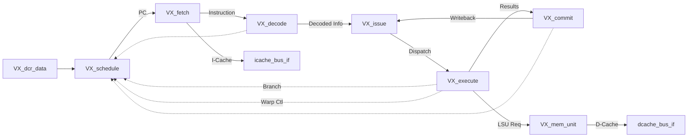

# `core/VX_core.sv` — Vortex Core 상세 분석

## 1. 개요

**VX_core**는 Vortex GPGPU의 개별 코어를 구현하는 핵심 모듈입니다. 하나의 코어는 여러 개의 Warp를 동시에 실행할 수 있으며, 전통적인 5-stage 파이프라인(Fetch→Decode→Issue→Execute→Commit)을 기반으로 구성됩니다.

### 계층 구조

```
VX_core_top (Wrapper)
  └─ VX_core (Core Implementation)
      ├─ VX_dcr_data (Device Configuration Registers)
      ├─ VX_schedule (Warp Scheduling)
      ├─ VX_fetch (Instruction Fetch)
      ├─ VX_decode (Instruction Decode)
      ├─ VX_issue (Instruction Issue)
      ├─ VX_execute (Execution Units)
      ├─ VX_commit (Instruction Commit)
      └─ VX_mem_unit (Memory Subsystem)
```

## 2. VX_core_top — 외부 인터페이스 래퍼

**파일**: `hw/rtl/core/VX_core_top.sv`

### 역할

- VX_core의 인터페이스 기반 포트를 외부 신호선(wire/bus)으로 변환
- 소켓 레벨에서 접근하기 쉽도록 신호 래핑
- 인터페이스를 사용하지 않는 상위 계층과의 호환성 제공

### 주요 포트

| 포트 | 방향 | 설명 |
|------|------|------|
| `clk`, `reset` | Input | 클록 및 리셋 |
| `dcr_write_*` | Input | Device Configuration Register 쓰기 인터페이스 |
| `dcache_req_*` / `dcache_rsp_*` | Output/Input | Data Cache 요청/응답 (DCACHE_NUM_REQS 개) |
| `icache_req_*` / `icache_rsp_*` | Output/Input | Instruction Cache 요청/응답 |
| `gbar_req_*` / `gbar_rsp_*` | Output/Input | Global Barrier 요청/응답 (선택적) |
| `busy` | Output | 코어가 작업 중인지 여부 |

### 신호 변환 예시

```systemverilog
// 인터페이스 생성
VX_mem_bus_if #(
    .DATA_SIZE (DCACHE_WORD_SIZE),
    .TAG_WIDTH (DCACHE_TAG_WIDTH)
) dcache_bus_if[DCACHE_NUM_REQS]();

// 외부 신호를 인터페이스로 매핑
for (genvar i = 0; i < DCACHE_NUM_REQS; ++i) begin
    assign dcache_req_valid[i] = dcache_bus_if[i].req_valid;
    assign dcache_req_addr[i] = dcache_bus_if[i].req_data.addr;
    // ... (다른 신호들)
    assign dcache_bus_if[i].rsp_valid = dcache_rsp_valid[i];
end
```

## 3. VX_core — 코어 내부 구조

**파일**: `hw/rtl/core/VX_core.sv`

### 3.1 파이프라인 스테이지 모듈

#### 3.1.1 VX_dcr_data — Device Configuration Registers

```systemverilog
VX_dcr_data dcr_data (
    .clk        (clk),
    .reset      (reset),
    .dcr_bus_if (dcr_bus_if),
    .base_dcrs  (base_dcrs)  // 출력: 설정 레지스터 값들
);
```

**역할**: 
- 외부에서 설정하는 Device Configuration Registers 관리
- 실행 시작 주소, Warp 수, Thread 수 등 하드웨어 설정 저장
- 파이프라인 전체에서 참조하는 `base_dcrs` 구조체 제공

**주요 레지스터**:
- `VX_DCR_STARTUP_ADDR0/1`: 커널 시작 주소
- `VX_DCR_NUM_CORES/WARPS/THREADS`: 하드웨어 구성 정보

---

#### 3.1.2 VX_schedule — Warp 스케줄러

```systemverilog
VX_schedule #(
    .INSTANCE_ID (`SFORMATF(("%s-schedule", INSTANCE_ID))),
    .CORE_ID (CORE_ID)
) schedule (
    .clk            (clk),
    .reset          (reset),
    .base_dcrs      (base_dcrs),
    
    // 제어 인터페이스
    .warp_ctl_if    (warp_ctl_if),      // Warp 생성/종료
    .branch_ctl_if  (branch_ctl_if),    // 분기 처리
    
    // 파이프라인 인터페이스
    .decode_sched_if(decode_sched_if),  // Decode에서 스케줄링 정보
    .issue_sched_if (issue_sched_if),   // Issue로 GPR 읽기 주소 전달
    .commit_sched_if(commit_sched_if),  // Commit에서 완료 신호
    
    // 출력
    .schedule_if    (schedule_if),      // Fetch로 PC 전달
    .gbar_bus_if    (gbar_bus_if),      // Global Barrier
    .sched_csr_if   (sched_csr_if),     // CSR 읽기 인터페이스
    
    .busy           (busy)
);
```

**역할**:
- **Warp 스케줄링**: 여러 Warp 중 실행 가능한 Warp 선택
- **PC 관리**: 각 Warp의 Program Counter 추적
- **Warp 상태 관리**: Active, Stalled, Barrier 대기 등
- **Barrier 동기화**: `vx_barrier` 명령어 처리
- **Warp 생성/종료**: `vx_wspawn` 명령어로 Warp 활성화/비활성화

**핵심 동작**:
1. 모든 Warp의 상태 확인 (stall, barrier, active)
2. 실행 가능한 Warp 중 하나 선택 (Round-robin 또는 우선순위)
3. 선택된 Warp의 PC를 Fetch 스테이지로 전달
4. Commit 스테이지에서 분기/barrier/wspawn 신호 수신하여 상태 업데이트

---

#### 3.1.3 VX_fetch — Instruction Fetch

```systemverilog
VX_fetch #(
    .INSTANCE_ID (`SFORMATF(("%s-fetch", INSTANCE_ID)))
) fetch (
    .clk            (clk),
    .reset          (reset),
    .icache_bus_if  (icache_bus_if),  // I-Cache 요청/응답
    .schedule_if    (schedule_if),    // 스케줄러에서 PC 수신
    .fetch_if       (fetch_if)        // Decode로 인스트럭션 전달
);
```

**역할**:
- 스케줄러가 제공한 PC로 I-Cache에 인스트럭션 요청
- Cache miss 시 대기
- Fetch된 인스트럭션을 Decode 스테이지로 전달

**인터페이스**:
- 입력: `schedule_if` (warp_id, PC)
- 출력: `fetch_if` (warp_id, PC, instruction)

---

#### 3.1.4 VX_decode — Instruction Decode

```systemverilog
VX_decode #(
    .INSTANCE_ID (`SFORMATF(("%s-decode", INSTANCE_ID)))
) decode (
    .clk            (clk),
    .reset          (reset),
    .fetch_if       (fetch_if),        // Fetch에서 인스트럭션 수신
    .decode_if      (decode_if),       // Issue로 디코딩 정보 전달
    .decode_sched_if(decode_sched_if)  // 스케줄러로 정보 전달
);
```

**역할**:
- 인스트럭션을 디코딩하여 opcode, operand, 타겟 레지스터 추출
- 실행 유닛 타입 결정 (ALU, FPU, LSU, CSR 등)
- 스케줄러에게 GPR/CSR 읽기 정보 제공

**출력 정보**:
- `ex_type`: 실행 유닛 타입 (ALU/FPU/LSU/SFU/CSR)
- `op_type`: 구체적인 연산 (ADD/MUL/LOAD 등)
- `rd`, `rs1`, `rs2`, `rs3`: 레지스터 주소
- `imm`: Immediate 값

---

#### 3.1.5 VX_issue — Instruction Issue

```systemverilog
VX_issue #(
    .INSTANCE_ID (`SFORMATF(("%s-issue", INSTANCE_ID)))
) issue (
    .clk            (clk),
    .reset          (reset),
    
    .decode_if      (decode_if),       // Decode에서 정보 수신
    .writeback_if   (writeback_if),    // Writeback에서 결과 수신 (forwarding)
    .dispatch_if    (dispatch_if),     // Execute로 dispatch
    .issue_sched_if (issue_sched_if)   // 스케줄러로부터 GPR 데이터
);
```

**역할**:
- **GPR 읽기**: 스케줄러를 통해 레지스터 파일에서 operand 읽기
- **Data Forwarding**: Writeback 스테이지에서 아직 쓰이지 않은 결과 사용
- **Scoreboard**: WAR/WAW hazard 방지
- **Dispatch**: 올바른 실행 유닛으로 인스트럭션 전달

**인터페이스**:
- `dispatch_if[NUM_EX_UNITS * ISSUE_WIDTH]`: 여러 실행 유닛으로 동시 dispatch 가능

---

#### 3.1.6 VX_execute — Execution Units

```systemverilog
VX_execute #(
    .INSTANCE_ID (`SFORMATF(("%s-execute", INSTANCE_ID))),
    .CORE_ID (CORE_ID)
) execute (
    .clk            (clk),
    .reset          (reset),
    
    .base_dcrs      (base_dcrs),
    .lsu_mem_if     (lsu_mem_if),      // LSU 메모리 인터페이스
    
    .dispatch_if    (dispatch_if),     // Issue에서 명령 수신
    .commit_if      (commit_if),       // Commit으로 결과 전달
    
    .commit_csr_if  (commit_csr_if),   // CSR 쓰기
    .sched_csr_if   (sched_csr_if),    // CSR 읽기
    
    .warp_ctl_if    (warp_ctl_if),     // Warp 제어 (wspawn, tmc)
    .branch_ctl_if  (branch_ctl_if)    // 분기 제어
);
```

**역할**:
- **ALU**: 정수 연산 (ADD, SUB, AND, OR, XOR, SLL, SRL 등)
- **FPU**: 부동소수점 연산 (FADD, FMUL, FDIV, FSQRT 등)
- **LSU (Load/Store Unit)**: 메모리 접근
- **SFU (Special Function Unit)**: 특수 연산 (CSRRW, TMC, WSPAWN, BARRIER 등)

**내부 모듈**:
- `VX_alu_unit`: 여러 ALU 블록 (`NUM_ALU_BLOCKS`)
- `VX_fpu_unit`: FPU 블록 (선택적)
- `VX_lsu_unit`: LSU 블록
- `VX_sfu_unit`: 특수 함수 유닛

**제어 신호**:
- `warp_ctl_if`: WSPAWN, TMC 명령어로 Warp 활성화/비활성화
- `branch_ctl_if`: 분기 명령어로 PC 업데이트

---

#### 3.1.7 VX_commit — Instruction Commit

```systemverilog
VX_commit #(
    .INSTANCE_ID (`SFORMATF(("%s-commit", INSTANCE_ID)))
) commit (
    .clk            (clk),
    .reset          (reset),
    
    .commit_if      (commit_if),       // Execute에서 결과 수신
    .writeback_if   (writeback_if),    // Issue로 writeback 전달
    
    .commit_csr_if  (commit_csr_if),   // CSR 쓰기
    .commit_sched_if(commit_sched_if)  // 스케줄러로 완료 통보
);
```

**역할**:
- **GPR Writeback**: 실행 결과를 레지스터 파일에 쓰기
- **CSR 업데이트**: CSR 쓰기 명령 처리
- **완료 통보**: 스케줄러에게 인스트럭션 완료 알림
- **예외 처리**: (구현된 경우) 예외 발생 시 처리

**Writeback 경로**:
```
Execute → Commit → Writeback_if → Issue (Forwarding)
                 ↓
            Scheduler (GPR 업데이트)
```

---

### 3.2 VX_mem_unit — Memory Subsystem

```systemverilog
VX_mem_unit #(
    .INSTANCE_ID (INSTANCE_ID)
) mem_unit (
    .clk           (clk),
    .reset         (reset),
    
    .lmem_perf     (lmem_perf),        // 성능 카운터
    .coalescer_perf(coalescer_perf),   // Coalescing 통계
    
    .lsu_mem_if    (lsu_mem_if),       // LSU에서 메모리 요청
    .dcache_bus_if (dcache_bus_if)     // D-Cache로 요청 전달
);
```

**역할**:
- **Local Memory 관리**: Core 내부 Shared Memory (선택적)
- **Memory Coalescing**: 여러 Lane의 메모리 접근을 병합
- **주소 라우팅**: Local Memory vs D-Cache 결정

**내부 구조** (`VX_mem_unit.sv` 참조):
- `VX_lmem_switch`: Local Memory와 Global Memory 라우팅
- `VX_local_mem`: Local Memory 구현 (16KB default)
- `VX_mem_coalescer`: 메모리 요청 병합

**주소 분기**:
```
lsu_mem_if (LSU 요청)
    ↓
VX_lmem_switch
    ├─ Local Memory (0x8000_0000 ~ 0x8000_3FFF)
    └─ D-Cache (나머지 주소)
```

---

## 4. 파이프라인 흐름도



### 4.1 정상 실행 흐름

1. **Schedule**: Warp 선택 및 PC 제공
2. **Fetch**: I-Cache에서 인스트럭션 로드
3. **Decode**: 인스트럭션 디코딩 및 레지스터 주소 추출
4. **Issue**: GPR 읽기 및 Scoreboard 체크
5. **Execute**: 실행 유닛에서 연산 수행
6. **Commit**: 결과를 GPR에 writeback, 스케줄러에 완료 통보

### 4.2 특수 명령어 흐름

#### WSPAWN (Warp 생성)
```
Execute (SFU) → warp_ctl_if → Schedule
  - active_warps 비트맵 업데이트
  - 새 Warp의 PC 설정
```

#### TMC (Thread Mask Control)
```
Execute (SFU) → warp_ctl_if → Schedule
  - thread_masks[warp_id] 업데이트
  - mask=0이면 Warp 비활성화
```

#### BARRIER
```
Execute (SFU) → Schedule
  - barrier_masks 업데이트
  - 모든 참여 Warp 도달 시까지 stall
```

#### Branch
```
Execute (ALU) → branch_ctl_if → Schedule
  - warp_pcs[warp_id] 업데이트
  - Fetch 파이프라인 flush
```

---

## 5. 인터페이스 상세

### 5.1 파이프라인 인터페이스

| 인터페이스 | 방향 | 주요 신호 | 설명 |
|-----------|------|----------|------|
| `VX_schedule_if` | Schedule → Fetch | `valid`, `warp_id`, `pc` | 선택된 Warp와 PC |
| `VX_fetch_if` | Fetch → Decode | `valid`, `warp_id`, `pc`, `instr` | Fetch된 인스트럭션 |
| `VX_decode_if` | Decode → Issue | `valid`, `warp_id`, `ex_type`, `op_type`, `rs1/2/3`, `rd`, `imm` | 디코딩 정보 |
| `VX_dispatch_if` | Issue → Execute | `valid`, `warp_id`, `tmask`, `op_type`, `operands` | Dispatch 정보 |
| `VX_commit_if` | Execute → Commit | `valid`, `warp_id`, `tmask`, `rd`, `data` | 실행 결과 |
| `VX_writeback_if` | Commit → Issue | `valid`, `warp_id`, `rd`, `data` | Writeback 데이터 |

### 5.2 제어 인터페이스

| 인터페이스 | 방향 | 용도 |
|-----------|------|------|
| `VX_warp_ctl_if` | Execute → Schedule | WSPAWN, TMC 제어 |
| `VX_branch_ctl_if` | Execute → Schedule | 분기 제어 (여러 ALU 블록) |
| `VX_sched_csr_if` | Schedule → Execute | CSR 읽기 (WARP_ID, NUM_THREADS 등) |
| `VX_commit_csr_if` | Execute → Commit | CSR 쓰기 |
| `VX_decode_sched_if` | Decode → Schedule | GPR 읽기 주소 전달 |
| `VX_issue_sched_if` | Schedule → Issue | GPR 읽기 데이터 전달 |
| `VX_commit_sched_if` | Commit → Schedule | 인스트럭션 완료 통보 |

---

## 6. 주요 파라미터

| 파라미터 | 기본값 | 설명 |
|---------|-------|------|
| `NUM_WARPS` | 4 | Core당 Warp 수 |
| `NUM_THREADS` | 4 | Warp당 Thread 수 |
| `NUM_ALU_BLOCKS` | - | ALU 블록 수 |
| `NUM_FPU_BLOCKS` | - | FPU 블록 수 (선택적) |
| `NUM_LSU_BLOCKS` | - | LSU 블록 수 |
| `NUM_LSU_LANES` | - | LSU Lane 수 |
| `ISSUE_WIDTH` | - | Issue 폭 (동시 issue 가능 수) |
| `DCACHE_NUM_REQS` | - | D-Cache 요청 포트 수 |
| `LMEM_LOG_SIZE` | 14 | Local Memory 크기 (2^14 = 16KB) |

---

## 7. 성능 카운터 (PERF_ENABLE)

VX_core는 다양한 성능 측정 카운터를 제공합니다:

### 7.1 I-Cache 카운터
- `perf_ifetches`: 총 instruction fetch 수
- `perf_icache_lat`: I-Cache latency 누적
- `perf_icache_pending_reads`: 현재 대기 중인 I-Cache 요청

### 7.2 D-Cache 카운터
- `perf_loads`: 총 load 명령 수
- `perf_stores`: 총 store 명령 수
- `perf_dcache_lat`: D-Cache latency 누적
- `perf_dcache_pending_reads`: 현재 대기 중인 D-Cache 요청

### 7.3 파이프라인 카운터
- `pipeline_perf.sched`: 스케줄링 통계
- `pipeline_perf.issue`: Issue 스테이지 통계

### 7.4 메모리 카운터
- `lmem_perf`: Local Memory 접근 통계
- `coalescer_perf`: Memory coalescing 효율

---

## 8. 핵심 동작 시나리오

### 8.1 벡터 덧셈 (VADD) 실행

```assembly
vadd.vv v3, v1, v2  # v3[i] = v1[i] + v2[i], i=0~NUM_THREADS-1
```

**파이프라인 흐름**:
1. **Schedule**: Warp 0 선택, PC=0x100
2. **Fetch**: I-Cache에서 `vadd.vv` 로드
3. **Decode**: `ex_type=ALU`, `op_type=ADD`, `rs1=v1`, `rs2=v2`, `rd=v3`
4. **Issue**: 
   - Schedule로부터 `v1[0~3]`, `v2[0~3]` 읽기 (4개 lanes)
   - Scoreboard 체크 (v3가 pending이면 stall)
5. **Execute**: 
   - ALU Unit에서 4개 lane 병렬 덧셈
   - `result[0~3] = v1[0~3] + v2[0~3]`
6. **Commit**: 
   - `v3[0~3] = result[0~3]` writeback
   - Schedule에 완료 통보

### 8.2 Warp 생성 (WSPAWN)

```assembly
wspawn x1, func_addr  # x1개 warps를 func_addr로 생성
```

**동작**:
1. **Execute (SFU)**: 
   - `warp_ctl_if.wspawn` = 1
   - `warp_ctl_if.num_warps` = x1 값
   - `warp_ctl_if.func_addr` = func_addr
2. **Schedule**: 
   - `active_warps[0:num_warps-1]` = 1로 설정
   - `warp_pcs[0:num_warps-1]` = func_addr
   - 다음 사이클부터 새 Warp들 스케줄링 시작

### 8.3 Barrier 동기화

```assembly
barrier x1, x2  # x1번 barrier, x2개 warps 대기
```

**동작**:
1. **Execute (SFU)**: 
   - `barrier_id` = x1
   - `count` = x2
   - 현재 Warp를 `barrier_masks[barrier_id]`에 등록
2. **Schedule**: 
   - `barrier_masks[barrier_id]`의 비트 수 확인
   - `count`와 같아질 때까지 모든 참여 Warp stall
   - 조건 만족 시 모든 Warp 해제

---

## 9. 읽기 가이드

### 초급 학습자
1. **파이프라인 기본**: Schedule → Fetch → Decode → Issue → Execute → Commit 흐름 이해
2. **인터페이스 구조**: `VX_*_if.sv` 파일들 확인
3. **간단한 명령어**: ADD, LOAD 같은 기본 명령어 추적

### 중급 학습자
1. **Warp 스케줄링**: `VX_schedule.sv` 내부 로직
2. **Data Forwarding**: Issue와 Commit 간 데이터 경로
3. **Scoreboard**: RAW hazard 방지 메커니즘

### 고급 학습자
1. **Warp 생성/제어**: WSPAWN, TMC, BARRIER 구현
2. **메모리 시스템**: Local Memory, Coalescing, Cache 통합
3. **성능 최적화**: Pipeline stall 분석, Cache miss 최소화

---

## 10. 관련 문서

- [VX_schedule.md](VX_schedule.md) - Warp 스케줄링 상세
- [VX_execute.md](VX_execute.md) - 실행 유닛 상세
- [VX_mem_unit.md](../mem/VX_mem_unit.md) - 메모리 시스템
- [../../software/vx_spawn_analysis.md](../../software/vx_spawn_analysis.md) - 소프트웨어 런타임과의 연계
