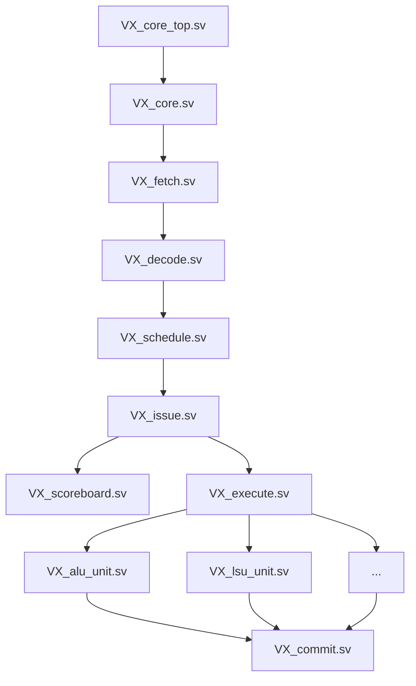

# Vortex Core RTL 공부 가이드

Vortex GPGPU의 핵심인 `hw/rtl/core` 폴더를 깊이 있게 이해하기 위한 추천 공부 순서입니다. 데이터의 흐름(파이프라인)을 따라가며 분석하는 것이 가장 효율적입니다.

## 1. 전체 구조 파악 (Top-Level)
숲을 먼저 보고 나무를 봅니다. 코어의 입출력 인터페이스와 내부 모듈들의 연결 관계를 파악합니다.

*   **`VX_core_top.sv`**
    *   **역할**: 코어의 최상위 모듈.
    *   **포인트**: Memory(Cache), GBAR(Barrier) 등 외부 모듈과의 인터페이스 연결 확인.
*   **`VX_core.sv`**
    *   **역할**: 실제 파이프라인 스테이지들이 인스턴스화되는 곳.
    *   **포인트**: Fetch -> Decode -> Issue -> Execute -> Commit 단계가 어떻게 연결되는지 전체적인 데이터 흐름 파악.
*   **참고 파일**: `hw/VX_config.h`, `hw/VX_types.h` (주요 파라미터 및 구조체 정의)

## 2. 파이프라인 프론트엔드 (Front-End)
명령어를 가져와 실행을 준비하는 단계입니다. GPU 아키텍처의 핵심인 **Warp Scheduling**이 이곳에서 이루어집니다.

1.  **`VX_fetch.sv`**
    *   I-Cache에서 명령어를 인출(Fetch)하는 로직.
2.  **`VX_decode.sv`**
    *   인출한 명령어를 해석하여 제어 신호를 생성.
3.  **`VX_schedule.sv`** (**중요**)
    *   실행 가능한 워프(Warp)를 선택하는 스케줄러.
    *   Round-Robin, Priority 등 스케줄링 정책 이해 필요.
4.  **`VX_issue.sv` & `VX_issue_slice.sv`**
    *   선택된 워프의 명령어를 실행 유닛으로 보내기 위한 준비 단계.
5.  **`VX_scoreboard.sv`** (**중요**)
    *   데이터 의존성(Dependency)을 체크하여 파이프라인 스톨(Stall)을 제어.
    *   In-flight 명령어 추적 방식 이해.
6.  **`VX_operands.sv`**
    *   GPR(General Purpose Register)에서 소스 오퍼랜드 값을 읽어옴.

## 3. 실행 유닛 (Execution Units)
실질적인 연산이 수행되는 단계입니다.

*   **`VX_execute.sv`**
    *   **역할**: 각 실행 유닛(ALU, LSU, FPU, SFU)으로 명령어를 분배(Dispatch).
*   **`VX_alu_unit.sv`**
    *   정수 연산 담당 (`VX_alu_int.sv`, `VX_alu_muldiv.sv` 등 포함).
*   **`VX_lsu_unit.sv`**
    *   메모리 로드/스토어 담당. D-Cache와의 인터페이스 및 주소 계산 로직 확인.
*   **`VX_csr_unit.sv`**
    *   CSR(Control Status Register) 읽기/쓰기 관리.
*   **`VX_sfu_unit.sv`**
    *   특수 함수(Special Function) 처리.

## 4. 파이프라인 백엔드 (Back-End)
명령어 실행을 완료하고 결과를 저장하는 단계입니다.

*   **`VX_commit.sv`**
    *   **역할**: 연산 결과를 레지스터 파일에 쓰고(Writeback), 명령어를 은퇴(Retire) 처리.
    *   **포인트**: GPR 쓰기 포트 제어 및 명령어 완료 신호 생성.

## 요약: 추천 공부 경로

