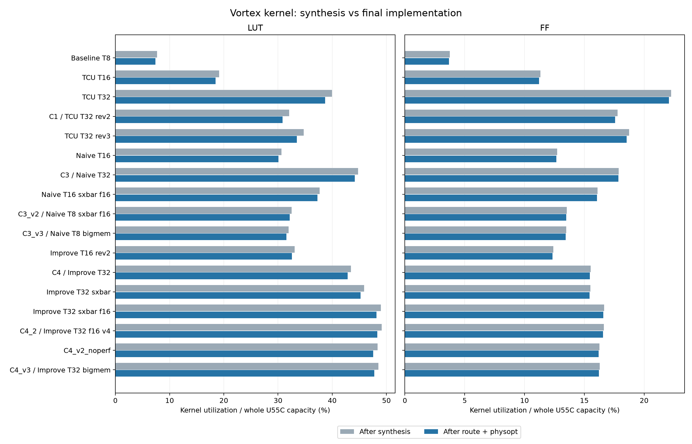
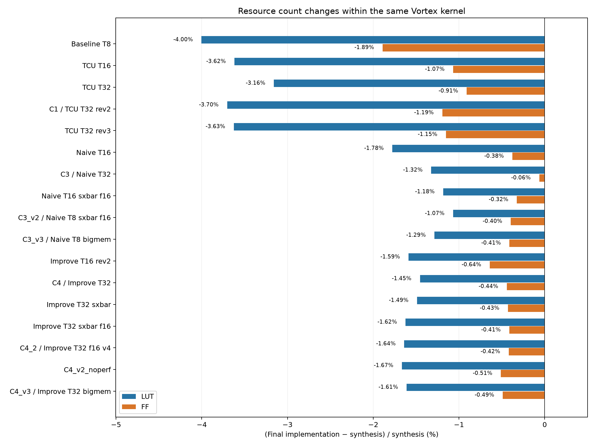

# 합성 대비 PnR utilization 비교 (2026-09-30)

## 결과 요약

분석 가능한 17개 design에서는 합성 이후와 최종 PnR 이후의 자원 개수 차이가 전반적으로 작았다.

- 커널 LUT: 평균 2.107% 감소, design별 감소율 1.069~4.003%. U55C 전체 LUT 용량 기준으로는 평균 0.711%p 감소했다.
- 커널 FF: 평균 0.655% 감소, design별 감소율 0.063~1.891%.
- BRAM: 0~2 tile 감소. URAM과 DSP는 모든 design에서 동일했다.
- TCU 계열의 LUT 감소율 평균은 3.527%로, naive GEMM 1.328% 및 improve GEMM 1.581%보다 컸다.
- Shell 포함 전체 design은 LUT 평균 4.791%, FF 평균 1.657% 감소했다.
- Placement 이후 최종 route+physopt까지는 16개 design의 주요 자원 개수가 동일했다. `C1`만 LUT 1개와 FF 10개가 증가했다.

이 결과는 등록된 빌드에서 관측한 경향이다. 서로 다른 RTL·설정·PnR directive의 영향을 개별적으로 분리한 실험은 아니다.

`ci/fpga_bin_alias_map.yaml`의 33개 alias를 22개 고유 binary 경로로 묶었다. 최종 checkpoint를 통해 직접 비교 가능한 design은 17개다. 중복 alias를 통계 표본으로 중복 계산하지 않았다.

## 비교 기준

- 합성: 각 binary의 `ulp_vortex_afu_1_0_synth_1_ulp_vortex_afu_1_0_utilization_synth.rpt`.
- PnR: 저장된 `level0_wrapper_postroute_physopt.dcp`를 열어 `report_utilization -cells [get_cells level0_i/ulp/vortex_afu_1]`로 새로 추출. 타이밍 제약 재로딩은 생략하되 배치·배선 데이터는 그대로 사용했다.
- 자원 범위: 합성과 PnR 모두 동일한 Vortex 커널. shell 및 Vitis 연결 로직은 제외.
- 변화량 = PnR − 합성. 상대 변화율 = 변화량 / 합성 × 100. utilization 변화(pp) = 변화량 / U55C 전체 자원 수 × 100.
- BRAM은 36 Kb tile 단위: RAMB36 + RAMB18/2. URAM/DSP는 개수. 합성이 0인 자원의 상대 변화율은 정의하지 않는다.
- 기존 `hier_utilization.rpt`는 `pre_opt_hook.tcl`에서 생성된다. 헤더의 `Physopt postRoute`는 이미 구현된 shell 때문에 표시되는 상태이며, 커널의 route 완료 여부를 뜻하지 않는다. 최종 PnR 비교에 사용하지 않았다.
- 별도 `full` 비교는 shell 포함 linked pre-opt 보고서와 최종 DCP 전체 utilization을 비교한다. 커널 합성과 shell 포함 전체 utilization을 직접 빼지 않았다.

## 자원별 경향

| 자원 | design 수 | 상대 변화율 평균 | 중앙값 | 최소 ~ 최대 | utilization 변화(pp) 평균 |
|---|---:|---:|---:|---:|---:|
| LUT | 17 | -2.107% | -1.622% | -4.003% ~ -1.069% | -0.711 |
| FF | 17 | -0.655% | -0.442% | -1.891% ~ -0.063% | -0.092 |
| BRAM tile | 17 | -0.247% | -0.233% | -0.477% ~ +0.000% | -0.070 |
| URAM | 17 | +0.000% | +0.000% | +0.000% ~ +0.000% | +0.000 |
| DSP | 17 | +0.000% | +0.000% | +0.000% ~ +0.000% | +0.000 |

커널 LUT는 1.07~4.00% 감소하고, FF는 0.06~1.89% 감소했다. LUT의 최대 감소도 5% 이내여서 이 표본에서는 자원 개수가 크게 바뀐다고 보기는 어렵다. 다만 증가·감소율이 수 %인 차이는 area 비교에 반영하는 것이 맞다.

평균과 중앙값은 design별 상대 변화율에 동일한 가중치를 적용했다. URAM 합성이 0인 design은 URAM 상대 변화율 평균에서 제외한다.

## design별 커널 비교

| Design | LUT 합성 → PnR | LUT Δ (상대율) | FF 합성 → PnR | FF Δ (상대율) | BRAM Δ | URAM Δ | DSP Δ |
|---|---:|---:|---:|---:|---:|---:|---:|
| Baseline T8 | 100,366 → 96,348 | -4,018 (-4.00%) | 97,882 → 96,031 | -1,851 (-1.89%) | +0 | +0 | +0 |
| TCU T16 | 249,750 → 240,710 | -9,040 (-3.62%) | 295,599 → 292,442 | -3,157 (-1.07%) | -1 | +0 | +0 |
| TCU T32 | 520,643 → 504,198 | -16,445 (-3.16%) | 580,654 → 575,371 | -5,283 (-0.91%) | -2 | +0 | +0 |
| C1 / TCU T32 rev2 | 417,732 → 402,259 | -15,473 (-3.70%) | 463,510 → 457,972 | -5,538 (-1.19%) | -2 | +0 | +0 |
| TCU T32 rev3 | 452,758 → 436,337 | -16,421 (-3.63%) | 488,860 → 483,227 | -5,633 (-1.15%) | -2 | +0 | +0 |
| Naive T16 | 399,482 → 392,382 | -7,100 (-1.78%) | 331,698 → 330,449 | -1,249 (-0.38%) | -1 | +0 | +0 |
| C3 / Naive T32 | 583,441 → 575,717 | -7,724 (-1.32%) | 465,767 → 465,472 | -295 (-0.06%) | -2 | +0 | +0 |
| Naive T16 sxbar f16 | 491,473 → 485,654 | -5,819 (-1.18%) | 419,933 → 418,571 | -1,362 (-0.32%) | -1 | +0 | +0 |
| C3_v2 / Naive T8 sxbar f16 | 424,092 → 419,559 | -4,533 (-1.07%) | 353,193 → 351,797 | -1,396 (-0.40%) | +0 | +0 | +0 |
| C3_v3 / Naive T8 bigmem | 416,744 → 411,380 | -5,364 (-1.29%) | 351,919 → 350,470 | -1,449 (-0.41%) | +0 | +0 | +0 |
| Improve T16 rev2 | 431,446 → 424,594 | -6,852 (-1.59%) | 323,590 → 321,517 | -2,073 (-0.64%) | -1 | +0 | +0 |
| C4 / Improve T32 | 566,829 → 558,582 | -8,247 (-1.45%) | 405,010 → 403,218 | -1,792 (-0.44%) | -2 | +0 | +0 |
| Improve T32 sxbar | 598,225 → 589,317 | -8,908 (-1.49%) | 404,557 → 402,822 | -1,735 (-0.43%) | -2 | +0 | +0 |
| Improve T32 sxbar f16 | 638,320 → 627,964 | -10,356 (-1.62%) | 434,080 → 432,286 | -1,794 (-0.41%) | -2 | +0 | +0 |
| C4_2 / Improve T32 f16 v4 | 640,586 → 630,091 | -10,495 (-1.64%) | 433,683 → 431,864 | -1,819 (-0.42%) | -2 | +0 | +0 |
| C4_v2_noperf | 630,664 → 620,161 | -10,503 (-1.67%) | 424,293 → 422,126 | -2,167 (-0.51%) | -2 | +0 | +0 |
| C4_v3 / Improve T32 bigmem | 632,650 → 622,462 | -10,188 (-1.61%) | 424,927 → 422,850 | -2,077 (-0.49%) | -2 | +0 | +0 |

### U55C 전체 용량 기준 utilization

합성과 PnR 모두 U55C 전체 자원 수를 분모로 사용했다. 아래 Δ는 상대 변화율(%)이 아닌 utilization 차이(%p)다.

| Design | LUT 합성 → PnR (%) | LUT Δ (%p) | FF 합성 → PnR (%) | FF Δ (%p) |
|---|---:|---:|---:|---:|
| Baseline T8 | 7.70 → 7.39 | -0.308 | 3.75 → 3.68 | -0.071 |
| TCU T16 | 19.16 → 18.46 | -0.693 | 11.34 → 11.22 | -0.121 |
| TCU T32 | 39.94 → 38.67 | -1.261 | 22.27 → 22.07 | -0.203 |
| C1 / TCU T32 rev2 | 32.04 → 30.86 | -1.187 | 17.78 → 17.56 | -0.212 |
| TCU T32 rev3 | 34.73 → 33.47 | -1.260 | 18.75 → 18.53 | -0.216 |
| Naive T16 | 30.64 → 30.10 | -0.545 | 12.72 → 12.67 | -0.048 |
| C3 / Naive T32 | 44.75 → 44.16 | -0.592 | 17.86 → 17.85 | -0.011 |
| Naive T16 sxbar f16 | 37.70 → 37.25 | -0.446 | 16.11 → 16.05 | -0.052 |
| C3_v2 / Naive T8 sxbar f16 | 32.53 → 32.18 | -0.348 | 13.55 → 13.49 | -0.054 |
| C3_v3 / Naive T8 bigmem | 31.97 → 31.56 | -0.411 | 13.50 → 13.44 | -0.056 |
| Improve T16 rev2 | 33.09 → 32.57 | -0.526 | 12.41 → 12.33 | -0.080 |
| C4 / Improve T32 | 43.48 → 42.85 | -0.633 | 15.53 → 15.46 | -0.069 |
| Improve T32 sxbar | 45.89 → 45.20 | -0.683 | 15.52 → 15.45 | -0.067 |
| Improve T32 sxbar f16 | 48.96 → 48.17 | -0.794 | 16.65 → 16.58 | -0.069 |
| C4_2 / Improve T32 f16 v4 | 49.14 → 48.33 | -0.805 | 16.63 → 16.56 | -0.070 |
| C4_v2_noperf | 48.38 → 47.57 | -0.806 | 16.27 → 16.19 | -0.083 |
| C4_v3 / Improve T32 bigmem | 48.53 → 47.75 | -0.781 | 16.30 → 16.22 | -0.080 |



## 계열별 평균

| 계열 | design 수 | LUT 상대 변화율 평균 | FF 상대 변화율 평균 |
|---|---:|---:|---:|
| baseline | 1 | -4.003% | -1.891% |
| TCU | 4 | -3.527% | -1.081% |
| naive GEMM | 5 | -1.328% | -0.314% |
| improve GEMM | 7 | -1.581% | -0.478% |



서로 다른 빌드의 관측값이므로 thread 수·메모리 구성·RTL 변경·PnR directive 중 어떤 요소가 차이를 유발했는지는 이 비교만으로 분리할 수 없다.

## shell 포함 전체 design 및 placement 이후 변화

| 자원 | 전체 linked → 최종 PnR 상대 변화율 평균 | 범위 |
|---|---:|---:|
| LUT | -4.791% | -7.772% ~ -3.736% |
| FF | -1.657% | -2.260% ~ -1.276% |
| BRAM tile | -0.181% | -0.323% ~ +0.000% |
| URAM | +0.000% | +0.000% ~ +0.000% |
| DSP | +0.000% | +0.000% ~ +0.000% |

전체 placed 보고서와 최종 route+physopt 보고서를 대조한 17개 design 중 주요 자원 개수가 달라진 design은 1개다. 합성 이후 감소분의 대부분은 placement까지 이미 반영되었다.

- `C1`의 placed → 최종 변화: LUT +1, FF +10.

범위 혼용 예: C4의 커널 합성 LUT 566,829개와 shell 포함 최종 LUT 715,432개를 직접 비교하면 +26.22%로 보인다. 동일 커널의 최종 LUT는 558,582개이므로 실제 변화는 −1.45%다.

## 비교 불가 design

- `base_t32`: `missing_final_checkpoint`. `/opt/vortex_fpga_bins/baseline/xrt_hw_u55c_c1_f100_tcu_noDcache_L2cache_75849ebace/bin`
- `tcu_th16_c2`: `missing_alias_path`. `/opt/vortex_fpga_bins/fpint/xrt_hw_u55c_c_f100_fpint_tcu_L2cache_3cbe56781b/bin`
- `naive_gemm_simd_th16_tcol32_hwexp_dcache; naive_gemm_simd_th16_tcol32_hwexp_dcache_pack16; naive_gemm_simd_th16_tcol32_hwexp_dcache_pack16_perf; C2`: `missing_alias_path`. `/opt/vortex_fpga_bins/fpint/xrt_hw_u55c_c1_f100_fpint_tcu_L2cache_d953b60098/bin`
- `naive_gemm_th16_tcol32_hwexp_dcache_pack16_rev1`: `missing_alias_path`. `/opt/vortex_fpga_bins/fpint/xrt_hw_u55c_c1_f100_fpint_L2cache_5d4264c38f/bin`
- `improve_th16_tcol32_hwexp_dcache_rev1`: `missing_alias_path`. `/opt/vortex_fpga_bins/fpint/xrt_hw_u55c_c1_f100_fpint_L2cache_8d9b4939d1/bin`

`base_t32`에는 합성 및 placed 보고서는 남아 있으나 최종 checkpoint가 없다. 이를 최종 PnR 표본에 포함하지 않았다.

## alias와 결과 파일

| 표시 이름 | 등록 alias |
|---|---|
| base_t32 | `base_t32` |
| Baseline T8 | `base_t8` |
| TCU T16 | `tcu_th16_c1` |
| tcu_th16_c2 | `tcu_th16_c2` |
| TCU T32 | `tcu_th32_c1` |
| C1 / TCU T32 rev2 | `tcu_th32_c1_rev2`; `C1` |
| TCU T32 rev3 | `tcu_th32_c1_rev3` |
| C2 | `naive_gemm_simd_th16_tcol32_hwexp_dcache`; `naive_gemm_simd_th16_tcol32_hwexp_dcache_pack16`; `naive_gemm_simd_th16_tcol32_hwexp_dcache_pack16_perf`; `C2` |
| naive_gemm_th16_tcol32_hwexp_dcache_pack16_rev1 | `naive_gemm_th16_tcol32_hwexp_dcache_pack16_rev1` |
| Naive T16 | `naive_gemm_th16_tcol32_hwexp_dcache_pack16` |
| C3 / Naive T32 | `naive_gemm_th32_tcol32_hwexp_dcache`; `C3` |
| Naive T16 sxbar f16 | `naive_gemm_th16_b32_tcol32_hwexp_dcache_sxbar_f16` |
| C3_v2 / Naive T8 sxbar f16 | `naive_gemm_th8_b32_tcol32_hwexp_dcache_sxbar_f16`; `C3_v2` |
| C3_v3 / Naive T8 bigmem | `naive_gemm_th8_b32_tcol32_hwexp_dcache_sxbar_f16_bigmem`; `C3_v3` |
| improve_th16_tcol32_hwexp_dcache_rev1 | `improve_th16_tcol32_hwexp_dcache_rev1` |
| Improve T16 rev2 | `improve_th16_tcol32_hwexp_dcache_rev2` |
| C4 / Improve T32 | `improve_th32_tcol32_hwexp_dcache`; `C4` |
| Improve T32 sxbar | `improve_th32_tcol32_hwexp_dcache_sxbar` |
| Improve T32 sxbar f16 | `improve_th32_tcol32_hwexp_dcache_sxbar_f16` |
| C4_2 / Improve T32 f16 v4 | `improve_th32_tcol32_hwexp_dcache_sxbar_f16_v4`; `C4_2` |
| C4_v2_noperf | `improve_th32_tcol32_hwexp_dcache_sxbar_f16_v4_noperf`; `C4_v2_noperf` |
| C4_v3 / Improve T32 bigmem | `improve_th32_tcol32_hwexp_dcache_sxbar_f16_bigmem`; `C4_v3` |

## 데이터와 원본 보고서

| 파일 | 내용 |
|---|---|
| [comparison.csv](data/comparison.csv) | 개수, 상대 변화율, utilization(%), 변화(%p), 원본 보고서 경로. `kernel`은 동일 커널 합성 → 최종, `full`은 전체 linked pre-opt → 최종, `full_to_placed`는 전체 linked pre-opt → placed 비교다. |
| [stages.csv](data/stages.csv) | 커널 합성·최종 및 전체 linked·placed·최종의 원시 값. |
| [alias_coverage.csv](data/alias_coverage.csv) | 33개 등록 alias의 분석 가능 여부. |
| [inventory.json](data/inventory.json) | Binary 경로, build ID/params, checkpoint 및 보고서 provenance. |
| [summary.json](data/summary.json) | 자원별 요약 통계. |

[원본 분석 디렉터리](../../analysis_workspace/synth_vs_pnr_utilization_20260930/)의 `reports/`에는 재추출한 utilization 보고서, Vivado 실행 로그 및 보관한 합성 보고서가 있다.

최종 DCP에서 재추출한 전체 design의 주요 자원 수치는 17개 모두 기존 routed 보고서와 일치했다. CSV의 변화량·상대 변화율·utilization 차이와 LUT 및 BRAM 구성요소 합계를 검산했다.

## 재현 방법

저장된 checkpoint에서 보고서를 읽는 작업이며 합성이나 PnR을 다시 실행하지 않는다. 기존 보고서가 있으면 재사용한다. 원본 archive 및 Vivado 2025.1이 필요하다.

저장소 루트에서 다음과 같이 실행한다.

```bash
python3 analysis_workspace/synth_vs_pnr_utilization_20260930/analyze.py --extract --jobs 2
python3 analysis_workspace/synth_vs_pnr_utilization_20260930/summarize.py
```

`analyze.py`는 PyYAML, `summarize.py`는 matplotlib 및 NumPy가 필요하다. 재실행 결과는 원본 분석 디렉터리에 생성되며, 이 문서와 `data/`, `assets/`는 2026-09-30 분석 결과의 사본이다.
